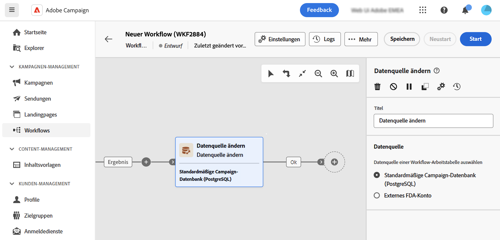

# Ändern der Datenquelle {#change-data-source}

>[!CONTEXTUALHELP]
>id="acw_orchestration_change_data_source"
>title="Ändern der Datenquelle"
>abstract="Die **Datenquelle ändern** ermöglicht die Auswahl einer anderen Datenquelle für die Arbeitstabelle Ihres Workflows."

Die **Datenquelle ändern** -Aktivität **Targeting** -Aktivität. Mit dieser Aktivität können Sie die Datenquelle ändern, die von der Arbeitstabelle Ihres Workflows verwendet wird. Dies bietet mehr Flexibilität, da Sie Daten in Ihren verschiedenen Datenbanken verwalten und die Leistung verbessern können.

In Workflows werden Daten, die von einer Aktivität zur anderen über Transitionen übertragen werden, in einer temporären **Arbeitstabelle**. Arbeitstabellen werden standardmäßig in derselben Datenbank erstellt wie die Quelle der verarbeiteten Daten. Bei der Abfrage der in der Cloud-Datenbank gespeicherten Tabelle &quot;Profile&quot;wird beispielsweise eine Arbeitstabelle für dieselbe Cloud-Datenbank erstellt.

In einigen Fällen sind entweder keine Daten in der aktuellen Datenbank verfügbar oder sie sind nicht effizient genug, um einzelne Vorgänge durchzuführen. Möglicherweise müssen Sie den Workflow zwingen, eine andere Datenbank zu verwenden, um solche Vorgänge durchzuführen, indem Sie eine **[!UICONTROL Datenquelle ändern]** -Aktivität.

Detaillierte Informationen zur Campaign-Architektur finden Sie unter [Dokumentation zu Campaign v8 (Clientkonsole)](https://experienceleague.adobe.com/docs/campaign/campaign-v8/config/architecture/architecture.html)

<!--

Let's say you want to send to your  VIP customers a unique offer code that they can redeem on your online store. To do this, you need to:

1. Query VIP customers on the "Profiles" table located on the Cloud database,
1. Retrieve an offer code for each targeted profile through API calls,
1. Update each profile with the assigned offer code,
1. Send an email to the profiles with their offer code.

In this situation, it is recommended to execute the offer code assignment operation on the local database, which is better suited for unitary operations. To do this, you need to add a **[!UICONTROL Change data source]** activity before the operation in order to execute it on the Campaign local database.

Before executing the operation, the working table is copied to the local database so that the operation can run there. Once done, the system detects that the profiles that we want to update are on another location. The data is therefore automatically copied back to the Cloud database where the "Profiles" table is located.
-->

## Konfigurieren der Aktivität Datenquelle ändern {#configure}

Gehen Sie folgendermaßen vor, um die Aktivität **Dimensionsänderung** zu konfigurieren:

1. Hinzufügen einer **Datenquelle ändern** -Aktivität zu Ihrem Workflow hinzu.

1. Definieren Sie die Datenquelle, an die Sie die Arbeitstabelle verschieben möchten:

   * **[!UICONTROL Standard-Campaign-Datenbank (PostgreSQL)]**: Verwenden Sie die standardmäßige lokale Campaign-Datenbank.
   * **[!UICONTROL Externes FDA-Konto]**: Verwenden Sie externe Cloud-Datenbanken, die über die Federated Data Access-Funktion mit Adobe Campaign verbunden sind.

     >[!AVAILABILITY]
     >
     >Die Konfiguration und Verbindung von Campaign mit externen Systemen ist erfahrenen Benutzenden vorbehalten und nur über die Client-Konsole verfügbar. [Weitere Informationen](https://experienceleague.adobe.com/docs/campaign/campaign-v8/connect/fda.html?lang=de){target="_blank"}

1. Konfigurieren Sie Ihren Workflow so, dass die gewünschten Vorgänge mit der neuen Datenquelle ausgeführt werden.

<!--
## Example {#example}

The workflow belows illustrates the use case detailed earlier, i.e. sending VIP customers offer codes that they can redeem on our online store.

-->
