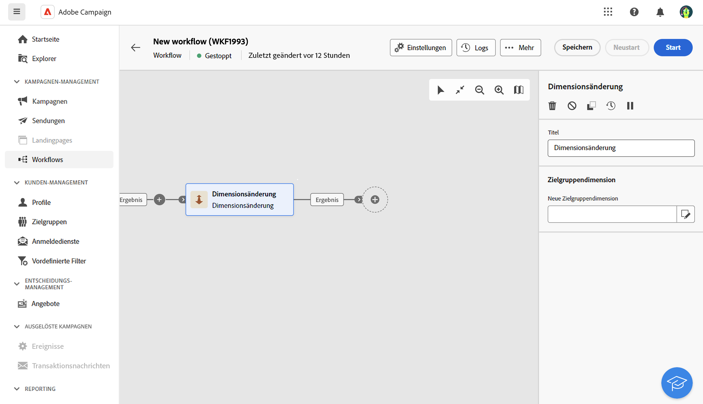
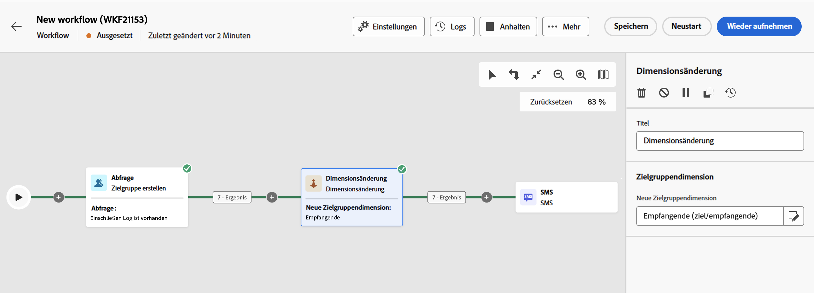

# Ändern der Dimension {#change-dimension}

>[!CONTEXTUALHELP]
>id="acw_orchestration_dimension_complement"
>title="Erzeugen eines Komplements"
>abstract="Sie können eine zusätzliche ausgehende Transition mit der verbleibenden Population generieren, die als Duplikat ausgeschlossen wurde. Schalten Sie dazu die Option **Komplement erzeugen** ein"

>[!CONTEXTUALHELP]
>id="acw_orchestration_change_dimension"
>title="Aktivität „Dimensionsänderung“"
>abstract="Mithilfe dieser Aktivität können Sie die Zielgruppendimension beim Erstellen einer Zielgruppe ändern. Diese Aktivität verschiebt die Achse je nach Datenvorlage und der Eingabedimension. Beispielsweise können Sie von der Dimension „Verträge“ zur Dimension „Kundinnen und Kunden“ wechseln."

Die Aktivität **Dimensionsänderung** ist eine Aktivität zur **Zielgruppenbestimmung**. Mithilfe dieser Aktivität können Sie die Zielgruppendimension beim Erstellen des Workflows ändern. Diese Aktivität verschiebt die Achse je nach Datenvorlage und der Eingabedimension. [Weitere Informationen zu Zielgruppendimensionen](../../audience/about-recipients.md#targeting-dimensions)

Sie können beispielsweise die Zielgruppendimension eines Workflows von „Empfängerinnen und Empfänger“ in „Abonnentenanwendung“ ändern, um Push-Benachrichtigungen an die angesprochenen Empfängerinnen und Empfänger zu senden.

## Konfigurieren der Aktivität „Dimensionsänderung“ {#configure}

Gehen Sie folgendermaßen vor, um die Aktivität **Dimensionsänderung** zu konfigurieren:

1. Fügen Sie die Aktivität **Dimensionsänderung** zu Ihrem Workflow hinzu.

   

1. Definieren Sie die **neue Zielgruppendimension**. Bei einer Dimensionsänderung werden alle Einträge beibehalten. Andere Optionen sind noch nicht verfügbar.

1. Starten Sie den Workflow, um das Ergebnis zu prüfen. Die folgenden Abbildungen zeigen die Tabellen vor und nach der Dimensionsänderung sowie die Struktur der Workflow-Tabellen.

## Beispiel {#example}

In diesem Beispiel möchten wir einen SMS-Versand an alle Profile senden, die einen Kauf getätigt haben. Dazu verwenden wir zunächst die Aktivität **[!UICONTROL Zielgruppe erstellen]**, die mit einer benutzerdefinierten Zielgruppendimension „Kauf“ verknüpft ist, um alle erfolgten Käufe auszuwählen.

Wir verwenden dann die Aktivität **[!UICONTROL Dimensionsänderung]**, um die Zielgruppendimension des Workflows in „Empfängerinnen und Empfänger“ zu ändern. Auf diese Weise können wir die Empfängerinnen und Empfänger ansprechen, die der Abfrage entsprechen.

