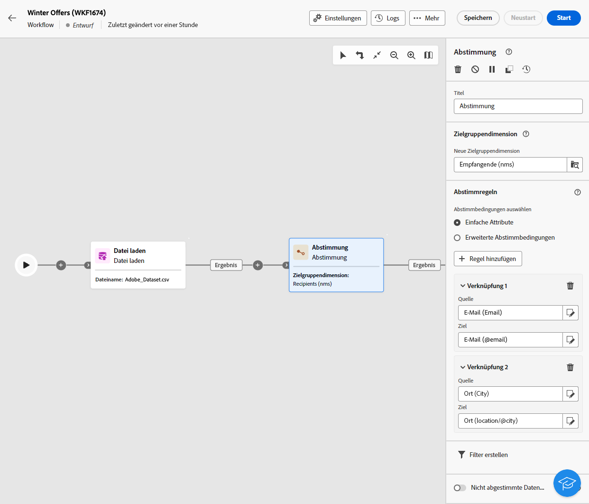
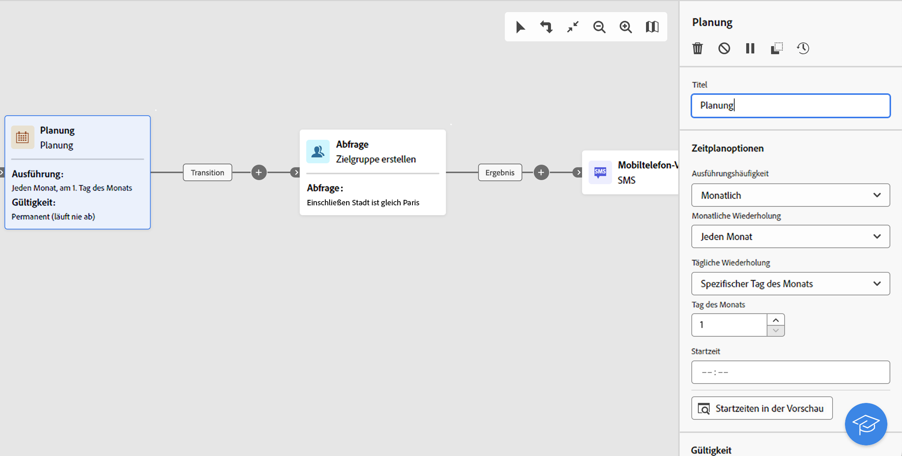

# E-Mail-, SMS- und Push-Aktivitäten {#channel}

Mit Adobe Campaign Web können Sie Marketing-Kampagnen über E-Mail-, SMS- oder Push-Kanäle automatisieren und durchführen. Sie können Kanalaktivitäten in die Workflow-Arbeitsfläche kombinieren, um kanalübergreifende Workflows zu erstellen, mit denen basierend auf Kundenverhalten und Daten Aktionen ausgelöst werden können.

Sie können beispielsweise eine Begrüßungs-E-Mail-Kampagne erstellen, die eine Reihe von Nachrichten über verschiedene Kanäle wie E-Mail, SMS und Push-Benachrichtigungen enthält. Sie können auch eine Folge-E-Mail senden, nachdem eine Kundin oder ein Kunde einen Kauf getätigt hat, oder eine personalisierte Geburtstagsnachricht per SMS an eine Kundin bzw. einen Kunden senden.

Mithilfe von Kanalaktivitäten können Sie umfassende und personalisierte Kampagnen erstellen, die Kundinnen und Kunden über mehrere Touchpoints hinweg ansprechen, und Konversionen fördern.

>[!NOTE]
>
>Sie können auch einen eigenständigen Versand außerhalb des Kampagnen-Workflows erstellen. Weitere Informationen finden Sie in den folgenden Abschnitten:
>* [Erstellen eines eigenständigen E-Mail-Versands](../../email/create-email.md)
>* [Erstellen eines eigenständigen SMS-Versands](../../sms/create-sms.md)
>* [Erstellen eines eigenständigen Push-Versands](../../push/create-push.md)

## Voraussetzungen {#channel-activity-prereq}

Beginnen Sie, Ihren Workflow mit den entsprechenden Aktivitäten aufzubauen:

* Bevor Sie eine Kanalaktivität einfügen, müssen Sie die Zielgruppe definieren. Die Zielgruppe ist das hauptsächliche Ziel Ihres Versands: die Profile, die die Nachrichten erhalten. Beim Senden von Nachrichten im Rahmen eines Kampagnen-Workflows wird die Zielgruppe der Nachricht nicht in der Kanalaktivität, sondern in einer speziellen Aktivität definiert.

   * Eine Aktivität **Zielgruppe erstellen**. [Weitere Informationen](build-audience.md).

     

   * Eine Aktivität **Datei laden** gefolgt von einer Aktivität **Abstimmung**. [Weitere Informationen](load-file.md).

     

* Um einen wiederkehrenden Versand durchzuführen, starten Sie Ihren Workflow mit der Aktivität **Planung**. Sie können die Aktivität **Planung** auch für einmalige Einzelsendungen verwenden, um für diese Sendungen das Kontaktdatum festzulegen. Dieses Kontaktdatum kann auch in den Versandeinstellungen festgelegt werden. Weitere Informationen finden Sie in diesem [Abschnitt](scheduler.md).

## Konfigurieren der Kanalaktivität {#create-a-delivery-in-a-workflow}

>[!CONTEXTUALHELP]
>id="acw_orchestration_email"
>title="E-Mail-Aktivität"
>abstract="Die E-Mail-Aktivität erleichtert den E-Mail-Versand innerhalb Ihres Workflows und ermöglicht sowohl einmalige als auch wiederkehrende Nachrichten. Damit wird der Versand von E-Mails an eine innerhalb desselben Workflows berechnete Zielgruppe automatisiert. Sie können Kanalaktivitäten in die Workflow-Arbeitsfläche kombinieren, um kanalübergreifende Workflows zu erstellen, mit denen basierend auf Kundenverhalten und Daten Aktionen ausgelöst werden können."

>[!CONTEXTUALHELP]
>id="acw_orchestration_sms"
>title="SMS-Aktivität"
>abstract="Die SMS-Aktivität erleichtert den SMS-Versand innerhalb Ihres Workflows und ermöglicht sowohl einmalige als auch wiederkehrende Nachrichten. Damit wird der SMS-Versand an eine innerhalb desselben Workflows berechnete Zielgruppe automatisiert. Sie können Kanalaktivitäten in die Workflow-Arbeitsfläche kombinieren, um kanalübergreifende Workflows zu erstellen, mit denen basierend auf Kundenverhalten und Daten Aktionen ausgelöst werden können."

>[!CONTEXTUALHELP]
>id="acw_orchestration_push_ios"
>title="Push-iOS-Aktivität"
>abstract="Die Push-iOS-Aktivität optimiert den Versand von iOS-Push-Benachrichtigungen im Rahmen Ihres Workflows. Dies ermöglicht den Versand einmaliger und wiederkehrender Nachrichten und automatisiert den Versand von iOS-Push-Benachrichtigungen an eine vordefinierte Zielgruppe innerhalb desselben Workflows. Sie können Kanalaktivitäten in die Workflow-Arbeitsfläche kombinieren, um kanalübergreifende Workflows zu erstellen, mit denen basierend auf Kundenverhalten und Daten Aktionen ausgelöst werden können."

>[!CONTEXTUALHELP]
>id="acw_orchestration_push_android"
>title="Push-Android-Aktivität"
>abstract="Die Push-Android-Aktivität vereinheitlicht den Versandprozess für Android-Push-Benachrichtigungen im Rahmen Ihres Workflows. Dadurch wird der Versand einmaliger und wiederkehrender Nachrichten ermöglicht, wodurch der Versand von Android-Push-Benachrichtigungen an eine vordefinierte Zielgruppe innerhalb desselben Workflows automatisiert wird. Sie können Kanalaktivitäten in die Workflow-Arbeitsfläche kombinieren, um kanalübergreifende Workflows zu erstellen, mit denen basierend auf Kundenverhalten und Daten Aktionen ausgelöst werden können."

Gehen Sie wie folgt vor, um einen Versand im Kontext eines Workflows einzurichten:

1. Fügen Sie eine Kanalaktivität hinzu: **[!UICONTROL E-Mail]**, **[!UICONTROL SMS]**, **[!UICONTROL Push-Benachrichtigung (Android)]** oder **[!UICONTROL Push-Benachrichtigung (iOS)]**.

1. Wählen Sie den **Versandtyp** aus: einmalig oder wiederkehrend.

   * Ein **Einzelversand** ist ein einmaliger Versand, der nur einmal verschickt wird, z. B. eine E-Mail zum „Black Friday“.
   * Ein **Wiederkehrender Versand** wird entsprechend der Ausführungshäufigkeit, die in der Aktivität [Planung](scheduler.md) definiert ist, mehrfach verschickt. Bei jeder Ausführung des Workflows wird die Zielgruppe neu berechnet, und der Versand erfolgt mit dem aktualisierten Inhalt an die aktualisierte Zielgruppe. Dabei kann es sich um einen wöchentlichen Newsletter oder eine wiederkehrende Geburtstags-E-Mail handeln.

1. Wählen Sie eine **Versandvorlage** aus. Vorlagen sind vorkonfigurierte, kanalspezifische Versandeinstellungen. Für jeden Kanal ist eine integrierte Vorlage verfügbar, die standardmäßig vorausgefüllt ist. [Weitere Informationen](../../msg/delivery-template.md)

   

   Sie können die Vorlage im linken Bereich zur Konfiguration der Kanalaktivität auswählen. Wenn die zuvor ausgewählte Zielgruppe nicht mit dem Kanal kompatibel ist, können Sie keine Vorlage auswählen. Um dies zu beheben, aktualisieren Sie die Aktivität **Zielgruppe erstellen**, um eine Zielgruppe mit dem richtigen Zielgruppen-Mapping auszuwählen. Erfahren Sie mehr über Zielgruppen-Mapping in [diesem Abschnitt](../../audience/targeting-dimensions.md).

1. Klicken Sie auf **Versand erstellen**. Sie können dann Ihre Nachrichteneinstellungen und den Inhalt so wie einen eigenständigen Versand definieren. Sie können den Inhalt auch testen und simulieren. [Weitere Informationen](../../msg/gs-messages.md)

1. Navigieren Sie zurück zu Ihrem Workflow. Entscheiden Sie, ob Sie den Workflow **Ausgehende Transition erzeugen** fortsetzen möchten, um eine Transition nach der Kanalaktivität hinzuzufügen.

1. Klicken Sie auf **Starten**, um Ihren Workflow zu starten.

   Standardmäßig wird durch Starten eines Workflows die Vorbereitungsphase der Nachricht ausgelöst, ohne dass die Nachricht sofort versendet wird.

1. Öffnen Sie die Kanalaktivität, um den Versand über die Schaltfläche **Überprüfen und senden** zu bestätigen.

1. Klicken Sie im Versand-Dashboard auf **Senden**.

## Beispiele {#cross-channel-workflow-sample}

Im Folgenden finden Sie ein Beispiel eines Cross-Channel-Workflows mit einer Segmentierung und zwei Sendungen. Der Workflow richtet sich an alle Kundinnen und Kunden, die in Paris leben und an Kaffeemaschinen interessiert sind. Innerhalb dieser Population wird eine E-Mail an die regulären Kundinnen und Kunden und eine SMS an diejenigen mit VIP-Status gesendet.

<!--
description, which use case you can perform (common other activities that you can link before of after the activity)

how to add and configure the activity

example of a configured activity within a workflow
The Email delivery activity allows you to configure the sending an email in a workflow. 

-->

Sie können auch einen wiederkehrenden Workflow erstellen, um jeden ersten Tag des Monats um 20 Uhr eine personalisierte SMS an alle in Paris lebenden Kundinnen und Kunden zu senden.

<!-- Scheduled emails available?

This can be a single send email and sent just once, or it can be a recurring email.
* Single send emails are standard emails, sent once.
* Recurring emails allow you to send the same email multiple times to different targets over a defined period. You can aggregate the deliveries per period in order to get reports that correspond to your needs.

When linked to a scheduler, you can define recurring emails.
Email recipients are defined upstream of the activity in the same workflow, via an Audience targeting activity.

-->

<!--The message preparation is triggered according to the workflow execution parameters. From the message dashboard, you can select whether to request or not a manual confirmation to send the message (required by default). You can start the workflow manually or place a scheduler activity in the workflow to automate execution.-->
