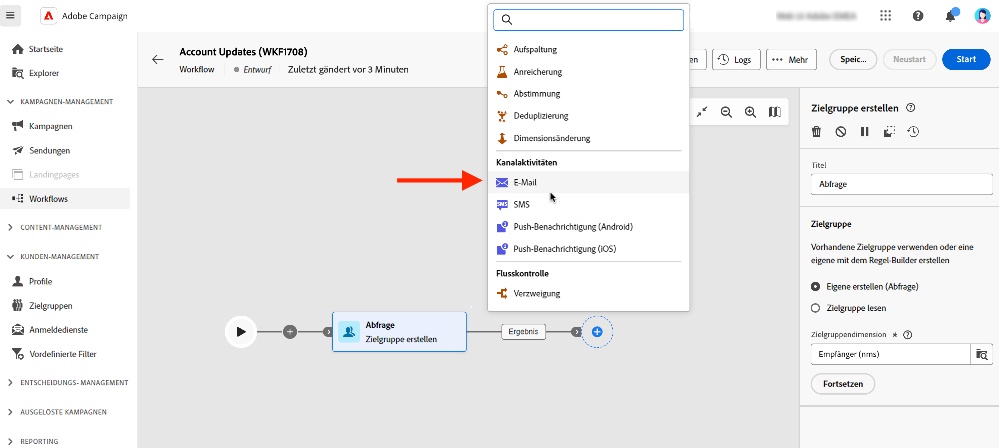
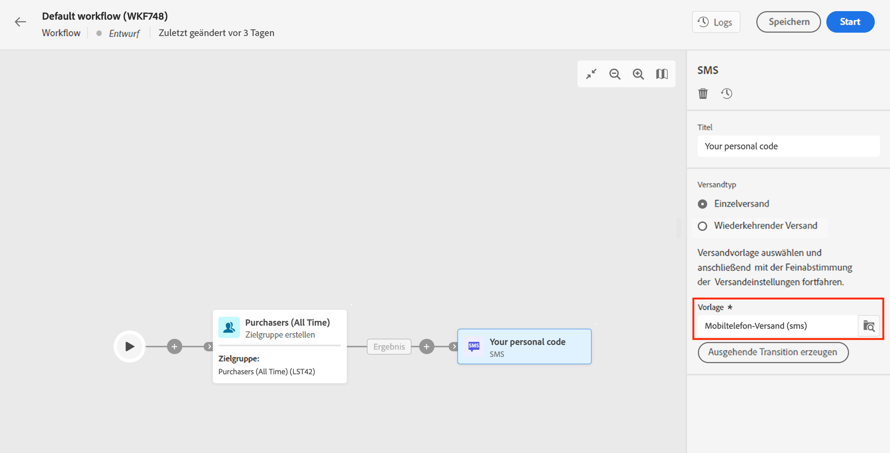
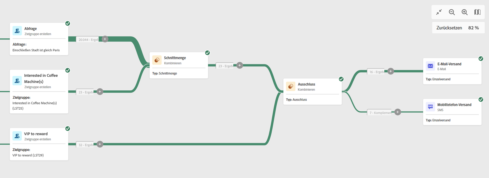

# E-Mail, SMS, Push-Aktivitäten {#channel}

Mit Adobe Campaign Web können Sie Marketing-Kampagnen über E-Mail-, SMS- oder Push-Kanäle automatisieren und durchführen. Sie können Kanalaktivitäten in die Workflow-Arbeitsfläche kombinieren, um Cross-Channel-Workflows zu erstellen, mit denen basierend auf Kundenverhalten und Daten Aktionen ausgelöst werden können.

Sie können beispielsweise eine Begrüßungs-E-Mail-Kampagne erstellen, die eine Reihe von Nachrichten über verschiedene Kanäle wie E-Mail, SMS und Push-Benachrichtigungen enthält. Sie können auch eine Folge-E-Mail senden, nachdem eine Kundin oder ein Kunde einen Kauf getätigt hat, oder eine personalisierte Geburtstagsnachricht per SMS an eine Kundin bzw. einen Kunden senden.

Mithilfe von Kanalaktivitäten können Sie umfassende und personalisierte Kampagnen erstellen, die Kundinnen und Kunden über mehrere Touchpoints hinweg ansprechen und Konversionen fördern.

>[!NOTE]
>
>Sie können auch einen einmaligen Versand außerhalb des Kampagnen-Workflows erstellen. Weitere Informationen finden Sie in den folgenden Abschnitten:
>* [Erstellen eines eigenständigen E-Mail-Versands](../../email/create-email.md)
>* [Erstellen eines eigenständigen SMS-Versands](../../sms/create-sms.md)
>* [Erstellen eines eigenständigen Push-Versands](../../push/create-push.md)
>

## Versand in einem Workflow erstellen{#create-a-delivery-in-a-workflow}

Gehen Sie wie folgt vor, um im Rahmen eines Workflows eine E-Mail, eine SMS oder einen Push-Versand zu erstellen:

1. Stellen Sie sicher, dass Sie eine Aktivität vom Typ **Zielgruppe erstellen** hinzugefügt haben. Die Zielgruppe ist das wichtigste Ziel Ihres Versands: die Empfängerinnen und Empfänger, die die Nachrichten erhalten. Beim Senden von Nachrichten im Rahmen eines Kampagnen-Workflows wird die Nachrichtenzielgruppe nicht in der Kanalaktivität, sondern in der Aktivität **Zielgruppe erstellen** definiert. Weitere Informationen finden Sie in [diesem Abschnitt](build-audience.md).

   

1. Wählen Sie eine Versandaktivität aus: **[!UICONTROL E-Mail]**, **[!UICONTROL SMS]**, **[!UICONTROL Push-Benachrichtigung (Android)]** oder **[!UICONTROL Push-Benachrichtigung (iOS)]**.

1. Wählen Sie eine **Versandvorlage** aus. Vorlagen sind vorkonfigurierte, kanalspezifische Versandeinstellungen. Für jeden Kanal ist eine integrierte Vorlage verfügbar, die standardmäßig vorausgefüllt ist. [Weitere Informationen](../../msg/delivery-template.md)

   

   Sie können im linken Bereich zur Konfiguration der Kanalaktivität eine andere Vorlage auswählen. Wenn die zuvor ausgewählte Zielgruppe nicht mit dem Kanal kompatibel ist, können Sie keine Vorlage auswählen. Um dies zu beheben, aktualisieren Sie die Aktivität **Zielgruppe erstellen**, um eine Zielgruppe mit dem richtigen Zielgruppen-Mapping auszuwählen. Weitere Informationen zu Zielgruppen-Mappings finden Sie in der [Dokumentation zu Adobe Campaign v8 (Client-Konsole)](https://experienceleague.adobe.com/docs/campaign/campaign-v8/audience/add-profiles/target-mappings.html?lang=de){target="_blank"}.

1. Klicken Sie auf **Versand erstellen**. Definieren Sie Ihre Nachrichteneinstellungen und den Inhalt so wie einen eigenständigen Versand. Sie können den Inhalt auch planen und simulieren. [Weitere Informationen](../../msg/gs-messages.md).

1. Navigieren Sie zurück zu Ihrem Workflow. Entscheiden Sie, ob Sie den Workflow fortsetzen möchten **Ausgehende Transition erzeugen** , wenn Sie eine Transition nach der Kanalaktivität hinzufügen möchten.

1. Klicken Sie auf **Starten**, um Ihren Workflow zu starten.

   Standardmäßig wird durch Starten eines Workflows die Vorbereitungsphase der Nachricht ausgelöst, ohne dass die Nachricht sofort versendet wird.

1. Öffnen Sie die Versandaktivität, um den Versand über die Schaltfläche **Überprüfen und senden** zu bestätigen.

1. Klicken Sie im Versand-Dashboard auf **Senden**.

## Beispiel {#cross-channel-workflow-sample}

Im Folgenden finden Sie ein Beispiel eines Cross-Channel-Workflows mit einer Segmentierung und zwei Sendungen. Der Workflow richtet sich an alle Kundinnen und Kunden, die in Paris leben und an Kaffeemaschinen interessiert sind. Innerhalb dieser Population wird eine E-Mail an die regulären Kundinnen und Kunden und eine SMS an diejenigen mit VIP-Status gesendet.

<!--
description, which use case you can perform (common other activities that you can link before of after the activity)

how to add and configure the activity

example of a configured activity within a workflow
The Email delivery activity allows you to configure the sending an email in a workflow. 

-->

<!-- Scheduled emails available?

This can be a single send email and sent just once, or it can be a recurring email.
* Single send emails are standard emails, sent once.
* Recurring emails allow you to send the same email multiple times to different targets over a defined period. You can aggregate the deliveries per period in order to get reports that correspond to your needs.

When linked to a scheduler, you can define recurring emails.
Email recipients are defined upstream of the activity in the same workflow, via an Audience targeting activity.

-->

<!--The message preparation is triggered according to the workflow execution parameters. From the message dashboard, you can select whether to request or not a manual confirmation to send the message (required by default). You can start the workflow manually or place a scheduler activity in the workflow to automate execution.-->
