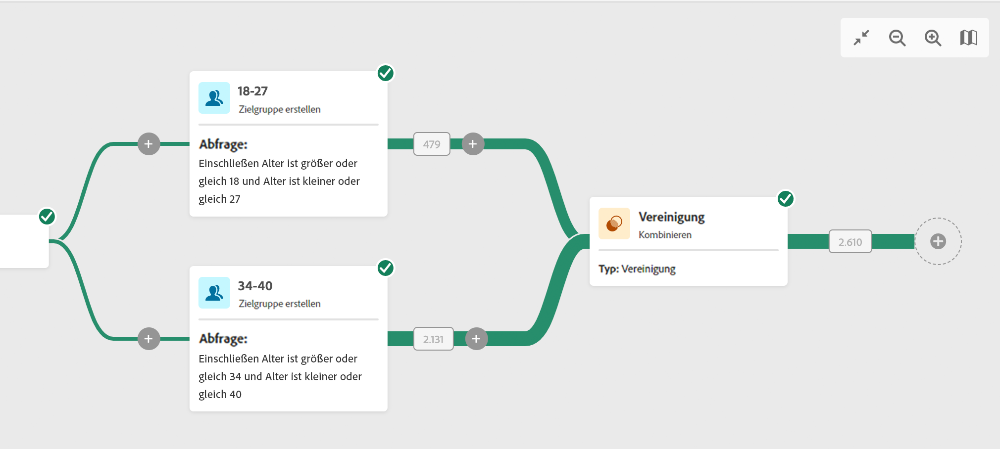

# Kombinieren {#combine}

>[!CONTEXTUALHELP]
>id="acw_orchestration_combine"
>title="Aktivität kombinieren"
>abstract="Die **Kombinieren** -Aktivität ermöglicht die Segmentierung Ihrer eingehenden Population. Sie können also mehrere Populationen kombinieren, einen Teil davon ausschließen oder nur Daten gemeinsam mit mehreren Zielgruppen speichern."

Die **Kombinieren** -Aktivität **Targeting** -Aktivität. Diese Aktivität ermöglicht die Segmentierung Ihrer eingehenden Population. Sie können also verschiedene Populationen vereinen, einen Teil daraus ausschließen oder nur die in mehreren Zielgruppen enthaltenen Datensätze verwenden. Im Folgenden finden Sie die verfügbaren Segmentierungstypen:

<!--
The **Combine** activity can be placed after any other activity, but not at the beginning of the workflow. Any activity can be placed after the **Combine**.
-->

* Eine **Vereinigung** dient dazu, das Ergebnis mehrerer Aktivitäten zu einer einzigen Zielgruppe zusammenzufassen.
* Eine **Schnittmenge** dient dazu, nur die Elemente zu behalten, die den verschiedenen eingehenden Populationen in der Aktivität gemeinsam sind.
* Ein **Ausschluss** dient dazu, gemäß bestimmten Kriterien entsprechende Elemente aus einer Population auszuschließen.

## Konfigurieren der Aktivität Kombinieren {#combine-configuration}

>[!CONTEXTUALHELP]
>id="acw_orchestration_intersection_merging_options"
>title="Optionen für die Zusammenführung von Schnittmengen"
>abstract="Die Schnittmenge dient dazu, nur die Elemente zu behalten, die den verschiedenen eingehenden Populationen in der Aktivität gemeinsam sind. Aktivieren Sie im Abschnitt „Zusammenzuführende Mengen“ alle vorherigen Aktivitäten, die Sie zusammenfügen möchten."

>[!CONTEXTUALHELP]
>id="acw_orchestration_exclusion_merging_options"
>title="Optionen für die Zusammenführung von Ausschlüssen"
>abstract="Der Ausschluss dient dazu, gemäß bestimmten Kriterien entsprechende Elemente aus einer Population auszuschließen. Aktivieren Sie im Abschnitt „Zusammenzuführende Mengen“ alle vorherigen Aktivitäten, die Sie zusammenfügen möchten."

>[!CONTEXTUALHELP]
>id="acw_orchestration_combine_options"
>title="Segmentierungstyp auswählen"
>abstract="Wählen Sie aus, wie Audiences kombiniert werden sollen: Vereinigung, Schnittmenge oder Ausschluss."

Führen Sie die folgenden Schritte aus, um mit der Konfiguration der Aktivität **Kombinieren** zu beginnen:

1. Fügen Sie mehrerer Aktivitäten wie **Zielgruppe erstellen** hinzu, um mindestens zwei verschiedene Ausführungsverzweigungen zu bilden.
1. Fügen Sie die Aktivität **Kombinieren** zu einer der vorherigen Verzweigungen hinzu.
1. Wählen Sie einen der Segmentierungstypen aus: [Vereinigung](#union), [Schnittmenge](#intersection) oder [Ausschluss](#exclusion).
1. Klicken Sie auf **Fortfahren**.
1. Aktivieren Sie im Abschnitt **Zusammenzuführende Mengen** alle vorherigen Aktivitäten, die Sie zusammenfügen möchten.

## Vereinigung {#combine-union}

>[!CONTEXTUALHELP]
>id="acw_orchestration_intersection_reconciliation_options"
>title="Abstimmoptionen für Schnittmengen"
>abstract="Wählen Sie den Abstimmtyp aus, um den Umgang mit Duplikaten zu definieren."

>[!CONTEXTUALHELP]
>id="acw_orchestration_combine_reconciliation"
>title="Abstimmoptionen"
>abstract="Wählen Sie die **Abstimmtyp** , um festzulegen, wie Duplikate verarbeitet werden."

Im **Kombinieren** -Aktivität, können Sie eine **Vereinigung**. Dazu müssen Sie die **Abstimmtyp** zur Definition des Umgangs mit Duplikaten:

* **Nur die Schlüssel** – Standardmodus; die Aktivität behält nur eines der Elemente bei, wenn mehrere aus verschiedenen eingehenden Transitionen stammende Elemente denselben Schlüssel aufweisen. Diese Option kann nur verwendet werden, wenn die eingehenden Populationen homogen sind.
* **Auswahl an Spalten**: Wählen Sie diese Option, um die Liste der Spalten zu definieren, auf die die Abstimmung der Daten angewendet wird. Wählen Sie zunächst die die Quelldaten enthaltende Hauptmenge aus und dann die für die Herstellung der Verknüpfung zu verwendenden Spalten.

## Schnittmenge {#combine-intersection}

Im **Kombinieren** -Aktivität, können Sie eine **Schnittmenge**. Gehen Sie dazu wie folgt vor:

1. Wählen Sie den **Abstimmtyp**, um festzulegen, wie Duplikate behandelt werden. Siehe den Abschnitt [Vereinigung](#union).
1. Sie können die Option **Komplement erzeugen** aktivieren, wenn Sie die verbleibende Population verarbeiten möchten. Das Komplement enthält die Vereinigung der Ergebnisse aller eingehenden Aktivitäten abzüglich der Schnittmenge. Der Aktivität wird daraufhin eine zusätzliche ausgehende Transition hinzugefügt.

## Ausschluss {#combine-exclusion}

>[!CONTEXTUALHELP]
>id="acw_orchestration_exclusion_options"
>title="Ausschluss  Regeln"
>abstract="Bei Bedarf können die eingehenden Tabellen angepasst werden. Um eine Zielgruppe aus einer anderen Dimension auszuschließen, muss diese Zielgruppe tatsächlich auf dieselbe Zielgruppendimension wie die Hauptzielgruppe zurückgesetzt werden. Klicken Sie dazu im Abschnitt „Ausschlussregeln“ auf „Regel hinzufügen“ und geben Sie die Bedingungen für die Dimensionsänderung an. Die Datenabstimmung wird entweder über ein Attribut oder einen Join durchgeführt."

>[!CONTEXTUALHELP]
>id="acw_orchestration_combine_sets"
>title="Sets auswählen, die kombiniert werden sollen"
>abstract="Wählen Sie im Abschnitt **Zusammenzuführende Mengen** die **Hauptmenge** aus den eingehenden Transitionen. Dies ist die Menge, aus der Elemente ausgeschlossen werden. Die anderen Mengen stimmen mit Elementen überein, bevor sie aus der Primärmenge ausgeschlossen werden."

>[!CONTEXTUALHELP]
>id="acw_orchestration_combine_exclusion"
>title="Ausschluss  Regeln"
>abstract="Bei Bedarf können die eingehenden Tabellen angepasst werden. Um eine Zielgruppe aus einer anderen Dimension auszuschließen, muss diese Zielgruppe tatsächlich auf dieselbe Zielgruppendimension wie die Hauptzielgruppe zurückgesetzt werden. Klicken Sie dazu im Abschnitt „Ausschlussregeln“ auf „Regel hinzufügen“ und geben Sie die Bedingungen für die Dimensionsänderung an. Die Datenabstimmung wird entweder über ein Attribut oder einen Join durchgeführt."

Im **Kombinieren** -Aktivität, können Sie eine **Ausschluss**. Gehen Sie dazu wie folgt vor:

1. Wählen Sie im Abschnitt **Zusammenzuführende Mengen** die **Hauptmenge** aus den eingehenden Transitionen. Dies ist die Menge, aus der Elemente ausgeschlossen werden. Die anderen Mengen stimmen mit Elementen überein, bevor sie aus der Primärmenge ausgeschlossen werden.
1. Bei Bedarf können die eingehenden Tabellen angepasst werden. Um eine Zielgruppe aus einer anderen Dimension auszuschließen, muss diese Zielgruppe tatsächlich auf dieselbe Zielgruppendimension wie die Hauptzielgruppe zurückgesetzt werden. Klicken Sie dazu im Abschnitt **Ausschlussregeln** auf **Regel hinzufügen** und geben Sie die Bedingungen für die Dimensionsänderung an. Die Datenabstimmung wird entweder über ein Attribut oder einen Join durchgeführt.
1. Sie können die Option **Komplement erzeugen** aktivieren, wenn Sie die verbleibende Population verarbeiten möchten. Siehe den Abschnitt [Schnittmenge](#intersection).

## Beispiele{#combine-examples}

Im folgenden Beispiel verwenden wir eine **Kombinieren** und wir fügen eine **Vereinigung** alle Profile der beiden Abfragen abzurufen: Personen zwischen 18 und 27 Jahren und Personen zwischen 34 und 40 Jahren.

Das folgende Beispiel zeigt die **Schnittmenge** zwischen zwei Abfrageaktivitäten. Sie wird hier zum Abrufen von Profilen verwendet, die zwischen 18 und 27 Jahre alt sind und deren E-Mail-Adresse angegeben wurde.

Folgendes **Ausschluss**-Beispiel zeigt zwei Abfragen, die zum Filtern von Profilen konfiguriert wurden, die zwischen 18 und 27 Jahre alt sind und die eine Adobe-E-Mail-Domain haben. Die Profile mit einer Adobe-E-Mail-Domain werden dann aus der ersten Menge ausgeschlossen.

