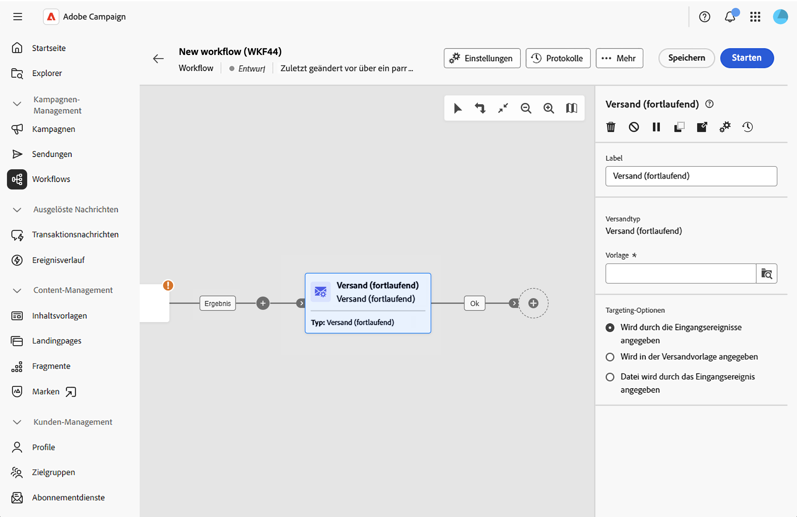

# Versand (fortlaufend) {#continuous-delivery}

Die Aktivität **Versand (fortlaufend)** ermöglicht das Hinzufügen neuer Empfänger bzw. Empfängerinnen zu einem bestehenden Versand. Bei diesem Versandtyp muss nicht jedes Mal ein neuer Versand erstellt werden, was ihn effizienter für Warnhinweise für geringes Volumen oder Benachrichtigungen macht, die bei Bedarf gesendet werden.

Bei einem fortlaufenden Versand wird eine einzige Versandinstanz erstellt. Alle Versandlogs (broadLog) und Trackinglogs verweisen auf diesen Versand und vereinfachen das Monitoring und das Reporting.

## Konfigurieren der Aktivität „Versand (fortlaufend)“ {#configure}

1. Fügen Sie Ihrer Workflow-Arbeitsfläche eine Aktivität **Versand (fortlaufend)** hinzu.

   {zoomable="yes"}

1. Geben Sie der Aktivität ein benutzerdefiniertes **[!UICONTROL Label]** (optional). Standardmäßig wird sie mit „Versand (fortlaufend)“ gekennzeichnet.

1. Klicken Sie neben dem Feld **[!UICONTROL Vorlage]** auf das Suchsymbol, um eine Versandvorlage auszuwählen. Nur Vorlagen (keine Standardsendungen) stehen zur Auswahl. Die Vorlage definiert den Versandkanal, den Inhalt und die Konfiguration.

1. Wählen Sie unter **[!UICONTROL Targeting-Optionen]** aus, wie die Zielpopulation definiert werden soll:

   * **[!UICONTROL Wird durch die Eingangsereignisse angegeben]**: Die Zielgruppe stammt aus der eingehenden Transition (aus Upstream-Aktivitäten wie „Zielgruppe erstellen“ oder „Inkrementelle Abfrage“). Dies ist die gängigste Option.

   * **[!UICONTROL Wird in der Versandvorlage angegeben]**: Das Ziel wird in der Vorlage selbst definiert.

   * **[!UICONTROL Datei wird durch das Eingangsereignis angegeben]**: Das Ziel wird über eine Datei bereitgestellt, die durch den Workflow übergeben wird.

Die Aktivität „Versand (fortlaufend)“ generiert automatisch eine ausgehende Transition, um den Workflow fortzusetzen.

## Verwandte Themen {#related}

* [Über Workflow-Aktivitäten](about-activities.md)
* [Automatischer Versand](automated-delivery.md)
* [E-Mail-, SMS-, Push- und Briefpost-Aktivitäten](channels.md)
* [Versandvorlagen](../../msg/delivery-template.md)
