# Laden (RDBMS) {#data-loading-rdbms}

>[!CONTEXTUALHELP]
>id="acw_orchestration_data_loading_rdbms"
>title="Aktivität „Laden (RDBMS)“"
>abstract="Die Aktivität **Laden (RDBMS)** ist eine Aktivität des **Data Management**. Verwenden Sie diese Aktivität, um Daten direkt aus einer externen relationalen Datenbank in Ihren Workflow zu laden. Die extrahierten Daten stehen während des gesamten Workflows zur Verfügung und können für die Zielgruppenbestimmung, die Anreicherung oder die weitere Datenverarbeitung verwendet werden."

Die Aktivität **Laden (RDBMS)** ist eine Aktivität des **Data Management**. Verwenden Sie diese Aktivität, um Daten direkt aus einer externen relationalen Datenbank in Ihren Workflow zu laden. Die extrahierten Daten stehen während des gesamten Workflows zur Verfügung und können für die Zielgruppenbestimmung, die Anreicherung oder die weitere Datenverarbeitung verwendet werden.

<!--
This activity relies on the [Federated Data Access (FDA)](https://experienceleague.adobe.com/docs/campaign/campaign-v8/connect/fda.html){target="_blank"} option, which lets Adobe Campaign process information stored in one or more external databases without changing the structure of the Adobe Campaign data.
-->

>[!NOTE]
>
>Zur Leistungsverbesserung sollten Sie stattdessen eine Aktivität **[!UICONTROL Zielgruppe erstellen]** (Abfragetyp) mit externen Daten verwenden, wenn die Menge der aus der externen Datenbank zu erfassenden Daten dies zulässt.
>
>Die Aktivität **[!UICONTROL Laden (RDBMS)]** muss die erste Aktivität einer Workflow-Verzweigung sein. Sie kann nicht nach einer anderen Aktivität in der Arbeitsfläche hinzugefügt werden.

Fügen Sie zunächst eine Aktivität des Typs **Laden (RDBMS)** als erste Aktivität einer Workflow-Verzweigung hinzu.

Die Aktivität ist in vier Abschnitte unterteilt:

* **[!UICONTROL Zieleinstellungen]**: Wählen Sie aus, wo die geladenen Daten gespeichert werden sollen. [Weitere Informationen](#target-settings)
* **[!UICONTROL Quelleneinstellungen]**: Wählen Sie aus, wie auf die externe Datenbank zugegriffen werden soll, die die zu ladenden Daten enthält. [Weitere Informationen](#source-settings)
* **[!UICONTROL Gesammelte Informationen]**: Definiert, welche Spalten aus der externen Tabelle erfasst werden. [Weitere Informationen](#information-collected)
* **[!UICONTROL Quellenfilterung]**: Definieren Sie einen Filter, um nur einen Teil der Daten aus der externen Tabelle zu erfassen. [Weitere Informationen](#filter)

Beachten Sie, dass die letzten beiden Abschnitte nur angezeigt werden, wenn die **[!UICONTROL Quelleneinstellungen]** definiert sind.

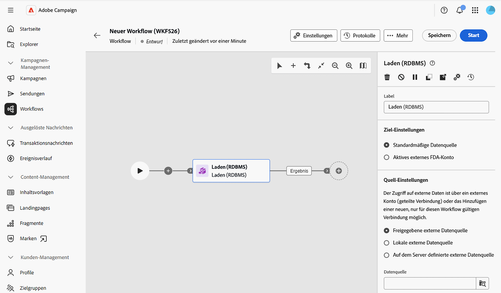

## Zieleinstellungen {#target-settings}

Wählen Sie im Abschnitt **[!UICONTROL Zieleinstellungen]** aus, wo die geladenen Daten gespeichert werden sollen. Zwei Optionen sind verfügbar: **[!UICONTROL Standardmäßige Datenquelle]** und **[!UICONTROL Aktives externes FDA-Konto]**.

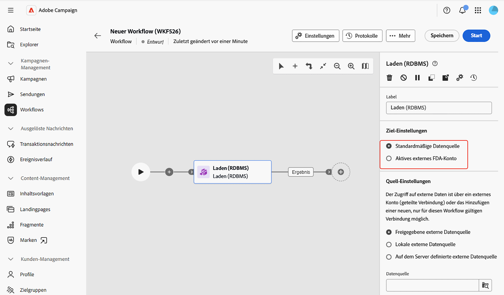

### Standardmäßige Datenquelle {#default-data-source}

Diese Option ist standardmäßig aktiviert. Damit können Sie die geladenen Daten in der Campaign-Standarddatenbank speichern. Sie müssen lediglich die Option auswählen.

### Aktives externes FDA-Konto {#active-fda-external-account}

Mit dieser Option können Sie die geladenen Daten in einem externen Konto speichern.

1. Klicken Sie auf die Schaltfläche auf der rechten Seite des Felds **[!UICONTROL Datenquelle]**.
1. Wählen Sie das zu verwendende Konto aus.

   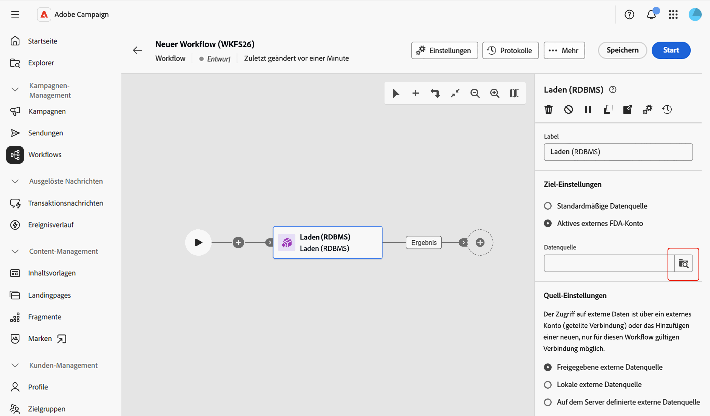

## Quelleneinstellungen {#source-settings}

Wählen Sie im Abschnitt **[!UICONTROL Quellleneinstellungen]** aus, wie auf die externe Datenbank mit den zu ladenden Daten zugegriffen werden soll. Es stehen drei Optionen zur Verfügung: **[!UICONTROL Freigegebene externe Datenquelle]**, **[!UICONTROL Lokale externe Datenquelle]** und **[!UICONTROL Auf dem Server definierte externe Datenquelle]**.

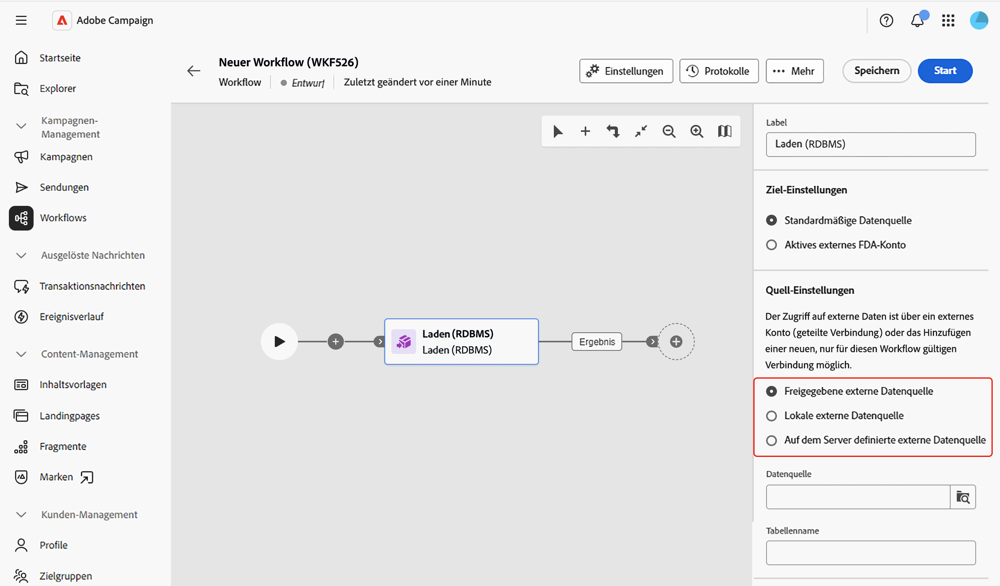

### Freigegebene externe Datenquelle {#shared-data-source}

Diese Option ist standardmäßig aktiviert. Damit können Sie ein bereits von einer bzw. einem Campaign-Admin konfiguriertes externes Konto verwenden. [Erfahren Sie, wie Sie ein externes Konto konfigurieren](../../administration/create-external-account.md).

1. Klicken Sie auf die Schaltfläche rechts neben dem Feld **[!UICONTROL Datenquelle]** und wählen Sie das zu verwendende Konto aus.

   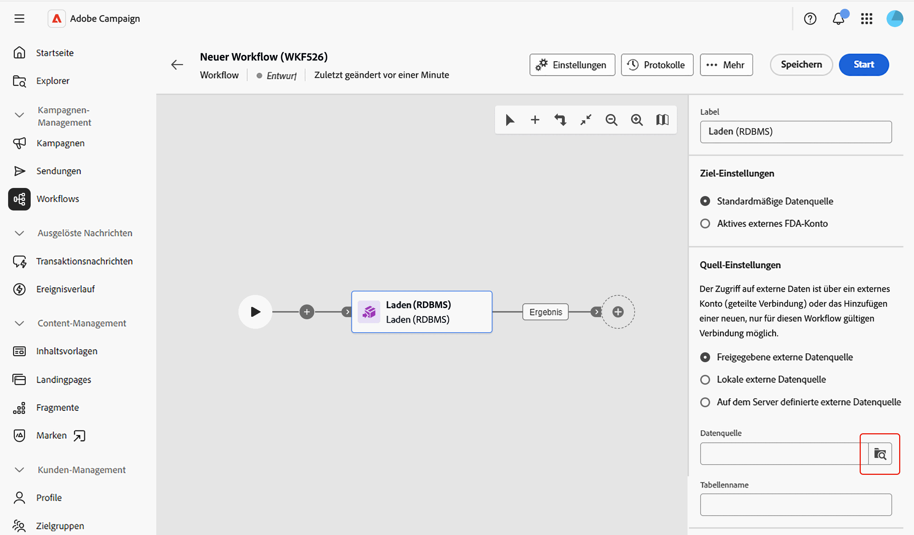

1. Klicken Sie auf **[!UICONTROL Durchsuchen]** neben dem Feld **[!UICONTROL Tabellenname]** und wählen Sie die Tabelle aus, die die zu ladenden Daten enthält.

   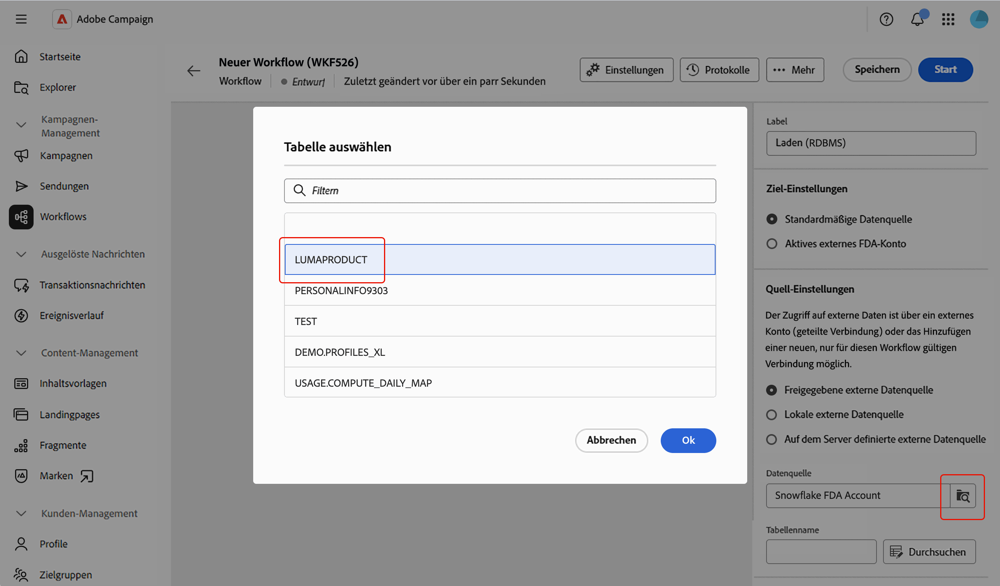

### Lokale externe Datenquelle {#local-external-data-source}

Mit dieser Option können Sie eine Verbindung zu einer externen Datenbank direkt in der Aktivität definieren, um sie temporär nur innerhalb dieses Workflows zu verwenden. Diese Verbindung wird nicht als externes Konto gespeichert.

1. Klicken Sie auf die Schaltfläche **[!UICONTROL Datenquelle definieren]** und wählen Sie die Datenbank-Engine aus, zu der eine Verbindung hergestellt werden soll.

   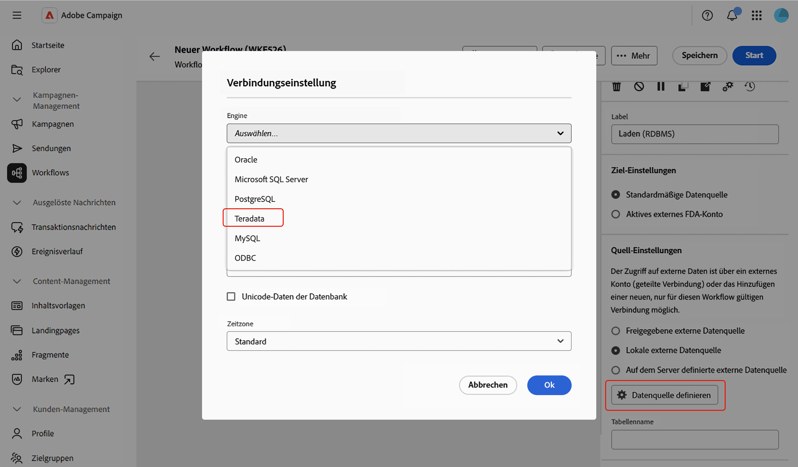

1. Füllen Sie die für die ausgewählte Engine angezeigten Verbindungsfelder aus.

   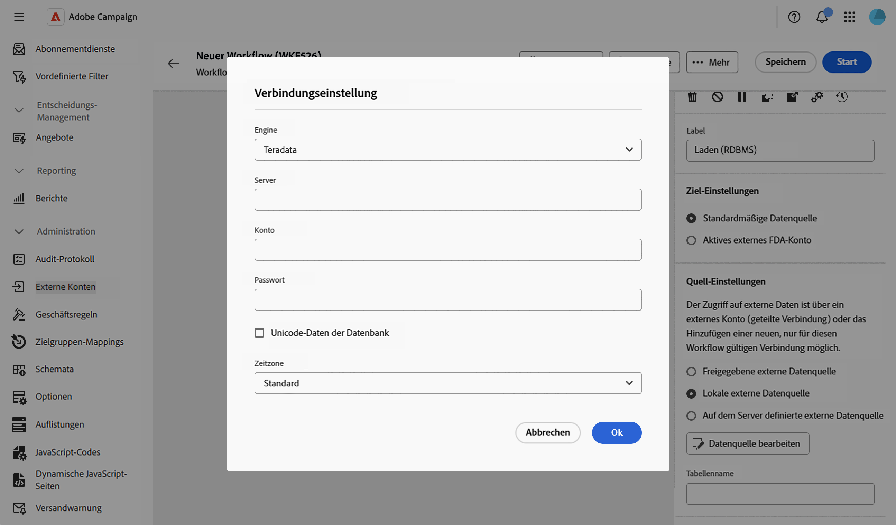

<!--
1. Click **[!UICONTROL Ok]** to confirm. The button is then relabeled **[!UICONTROL Edit data source]**, allowing you to open the dialog again to change the connection settings.
-->

1. Geben Sie den Namen der zu ladenden Tabelle in das Feld **[!UICONTROL Tabellenname]** ein.

### Auf dem Server definierte externe Datenquelle {#server-defined-external-data-source}

Mit dieser Option können Sie eine bereits auf Server-Ebene definierte Datenbankverbindung verwenden.

1. Geben Sie den Namen der zu verwendenden Verbindung in das Feld **[!UICONTROL Verbindungsname]** ein.
1. Geben Sie den Namen der zu ladenden Tabelle in das Feld **[!UICONTROL Tabellenname]** ein.

   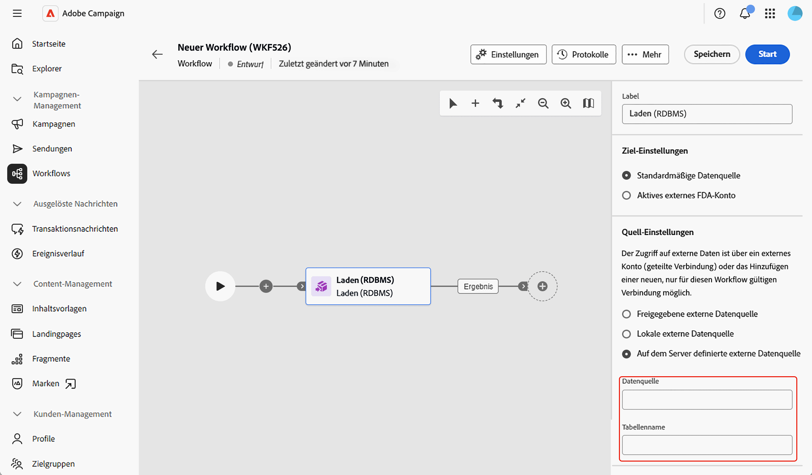

## Gesammelte Informationen {#information-collected}

Sobald die Tabelle festgelegt ist, können Sie im Abschnitt **[!UICONTROL Gesammelte Informationen]** festlegen, welche Spalten aus der externen Tabelle erfasst werden:

1. Aktivieren Sie die Option **[!UICONTROL Alle Quelldaten beibehalten]** (Standard), wenn Sie jede Spalte der ausgewählten Tabelle erfassen möchten.
1. Klicken Sie auf **[!UICONTROL Zu extrahierende Spalte hinzufügen]**, um stattdessen oder zusätzlich bestimmte Spalten zu erfassen.

   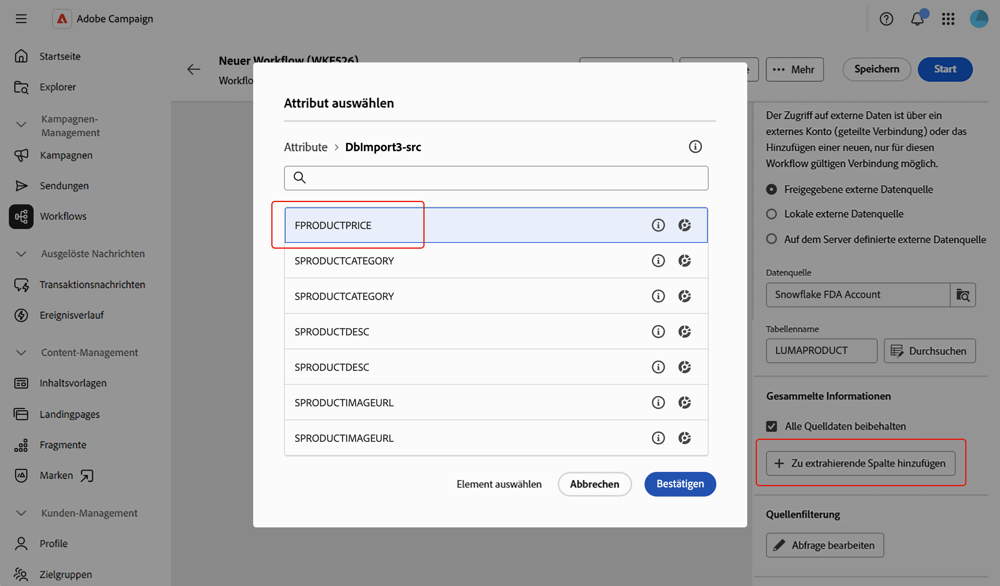

<!--
In the **[!UICONTROL Select attribute]** dialog, scoped to the schema of the selected table, pick an attribute and confirm. [Learn how to select attributes and add them to favorites](../../get-started/attributes.md)
-->

1. Wählen Sie ein Attribut aus und bestätigen Sie. Das Attribut wird als Zeile mit dem Feld **[!UICONTROL Spalte]** und einem bearbeitbaren Feld **[!UICONTROL Label]** hinzugefügt. Verwenden Sie das Symbol „Löschen“, um es zu entfernen.

   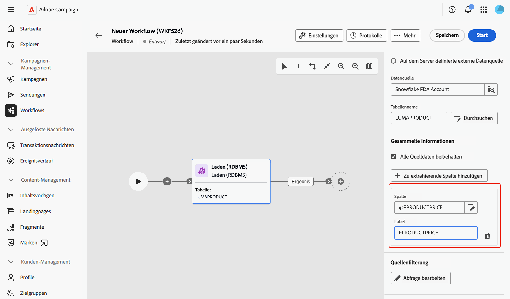

<!--
## Link to another table (optional) {#link}

NOT CONFIRMED — restore and verify before publishing.

Source: transcript of the ACC Web UI - Handsoff 12-06 demo (Herve Phulpin, ~20:49-21:04 mark). At the time of that demo, this part of the activity was explicitly described as unfinished: "the next part is not yet available", "this part is missing", "we are not able to add a link condition". No screenshot of a completed, working flow for this section has been captured since. Two related sub-bugs were still open against NEO-95826 at last check: NEO-97147 ("DBMS activity transition results not shown") and NEO-97148 ("local external data table name is not a picker").

If you need to reconcile the loaded data with an existing table, such as the Recipients table, add a link:

1. Click **Add link**.
1. Select the table to link to. You can browse tables from the Campaign database or from the external data source.
1. Define the join condition between the loaded table and the target table:
   * Simple join: Select the attributes to match between the two tables.
   * Advanced join: Use the query modeler to build the join condition.

[Learn more about link definitions in the Enrichment activity](enrichment.md#create-links).
-->

## Quellenfilterung (optional) {#filter}

Um nur einen Teil der Daten aus der externen Tabelle zu erfassen, können Sie einen Filter definieren:

1. Klicken Sie im Abschnitt **[!UICONTROL Quellenfilterung]** auf **[!UICONTROL Abfrage bearbeiten]**.

   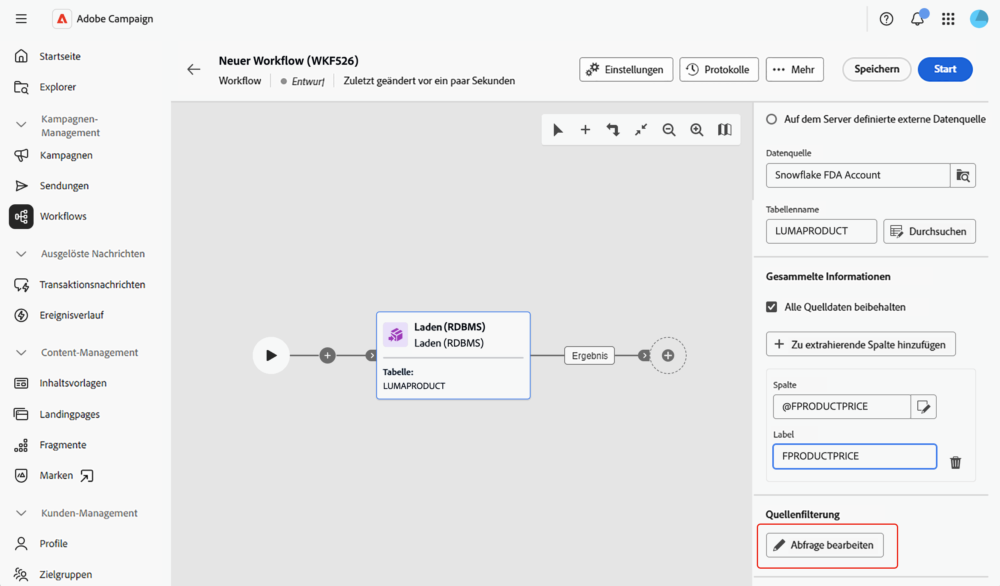

1. Der Abfrage-Modeler wird auf einem eigenen Bildschirm geöffnet, der auf das Schema der ausgewählten Tabelle zugeschnitten ist. Verwenden Sie ihn, um eine Bedingung für die Attribute der Tabelle zu erstellen. [Erfahren sie mehr über die Arbeit mit dem Abfrage-Modeler](../../query/query-modeler-overview.md)

   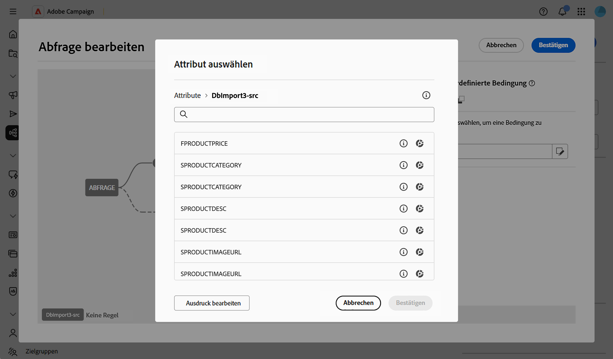

<!--
>[!NOTE]
>
>Some advanced options available for this activity in the client console, such as computing the table name from the inbound transition, are not yet exposed in the Campaign Web User Interface.
-->