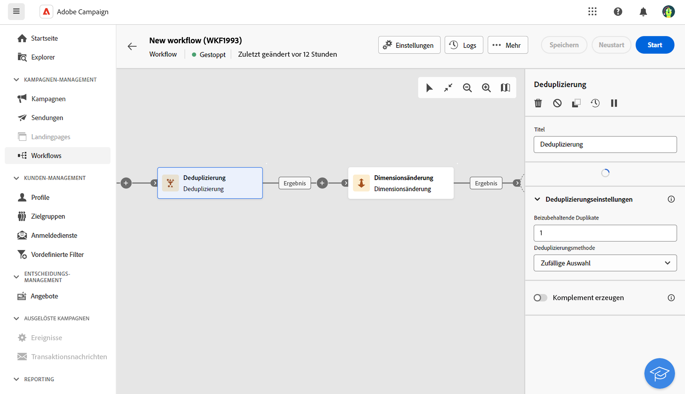

# Deduplizierung {#deduplication}

<!--
>[!CONTEXTUALHELP]
>id="acw_orchestration_deduplication_fields"
>title="Fork activity"
>abstract="The Deduplication activity allows you to..."
-->

>[!CONTEXTUALHELP]
>id="acw_orchestration_deduplication"
>title="Aktivität &quot;Deduplizierung&quot;"
>abstract="Die **Deduplizierung** ermöglicht die Löschung von Dubletten in den Ergebnissen der eingehenden Aktivitäten. Sie wird hauptsächlich im Anschluss an Zielgruppenbestimmungsaktivitäten und vor Aktivitäten verwendet, die die Verwendung von Zieldaten ermöglichen."

>[!CONTEXTUALHELP]
>id="acw_orchestration_deduplication_complement"
>title="Komplement erzeugen"
>abstract="Sie können eine zusätzliche ausgehende Transition mit der verbleibenden Population generieren, die als Duplikat ausgeschlossen wurde. Schalten Sie dazu die Option **Komplement erzeugen** ein"

>[!CONTEXTUALHELP]
>id="acw_orchestration_deduplication_settings"
>title="Deduplizierungseinstellungen"
>abstract="Um Duplikate in den eingehenden Daten zu löschen, definieren Sie die Deduplizierungsmethode in den unten stehenden Feldern. Standardmäßig wird nur ein Datensatz beibehalten. Sie sollten auch die Deduplizierungsmethode anhand eines Ausdrucks oder Attributs auswählen. Standardmäßig wird der Datensatz, der nicht aus den Duplikaten bestehen soll, zufällig ausgewählt."

Die **Deduplizierung** -Aktivität **Targeting** -Aktivität. Mithilfe dieser Aktivität lassen sich Dubletten in Ergebnissen aus eingehenden Aktivitäten löschen. Die **Deduplizierung** -Aktivitäten werden im Allgemeinen im Anschluss an Zielgruppenbestimmungsaktivitäten und vor Aktivitäten verwendet, die die Verwendung von Zieldaten ermöglichen.

## Konfiguration

Führen Sie die folgenden Schritte aus, um die **Deduplizierung** Aktivität:

1. Hinzufügen einer **Deduplizierung** -Aktivität zu Ihrem Workflow hinzu.

   

1. Im **Felder zur Identifizierung von Duplikaten** klicken Sie auf die **Attribut hinzufügen** -Schaltfläche, um die Felder anzugeben, für die die Identifizierung der Dubletten aufgrund identischer Werte möglich ist: E-Mail-Adresse, Vorname, Nachname etc. In der Reihenfolge der Felder können Sie angeben, welche Felder zuerst verarbeitet werden sollen.

1. Wählen Sie die Anzahl der eindeutigen **Beizubehaltende Duplikate**. Der Standardwert dieses Felds ist 1. Mittels des Werts 0 lassen sich alle Dubletten beibehalten.

<!--
    For example, if records A and B are considered duplicates of record Y, and a record C is considered as a duplicate of record Z:

    * If the value of the field is 1: only the Y and Z records are kept.
    * If the value of the field is 0: all the records are kept.
    * If the value of the field is 2: records C and Z are kept and two records from A, B, and Y are kept, by chance or depending on the deduplication method selected thereafter.

-->

1. Wählen Sie die **Deduplizierungsmethode** zur Verwendung:

   * **Zufällige Auswahl**: wählt nach dem Zufallsprinzip den beizubehaltenden Datensatz aus den Duplikaten aus.
   * **Von einem Ausdruck ausgehend**: hiermit lassen sich Datensätze beibehalten, für die der angegebene Ausdruck den kleinsten oder größten Wert aufweist. ++ Ausdruck + Sortierung
   * **Gemäß einer Werteliste**: ermöglicht die Bestimmung einer Reihenfolge nach Priorität von Werten für ein oder mehrere Felder. Um die Werte zu definieren, klicken Sie auf **Attribut** , um ein Feld auszuwählen oder einen Ausdruck zu erstellen, und fügen Sie dann die Werte zur entsprechenden Tabelle hinzu. Verwenden Sie die Schaltfläche Hinzufügen oberhalb der Werteliste, um ein neues Feld zu definieren. ++ Sortierung

1. Überprüfen Sie die **Komplement erzeugen** , wenn Sie die verbleibende Population ausnutzen möchten. Das Komplement besteht aus allen Duplikaten. Der Aktivität wird daraufhin eine zusätzliche Transition hinzugefügt.

## Beispiel

