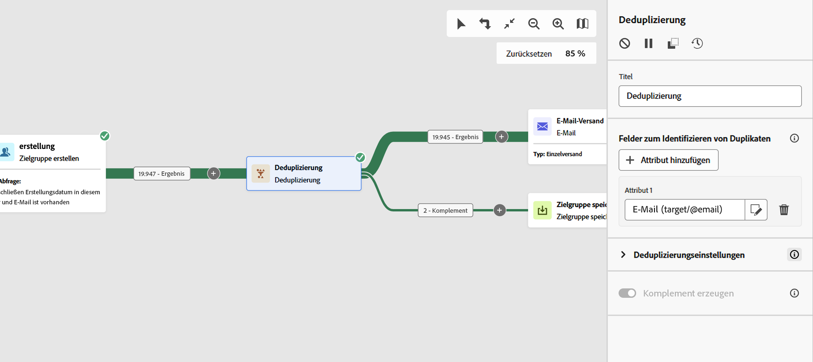

# Deduplizierung {#deduplication}

>[!CONTEXTUALHELP]
>id="acw_orchestration_deduplication_fields"
>title="Felder zum Identifizieren von Dubletten"
>abstract="Klicken Sie im Abschnitt **Felder zur Identifizierung von Duplikaten** auf die Schaltfläche **Attribut hinzufügen**, um die Felder anzugeben, für die identische Werte die Identifizierung von Duplikaten ermöglichen, z. B. E-Mail-Adresse, Vorname und Nachname. Die Reihenfolge der Felder gibt die Felder an, die zuerst verarbeitet werden sollen."

>[!CONTEXTUALHELP]
>id="acw_orchestration_deduplication"
>title="Aktivität „Deduplizierung“"
>abstract="Die **Deduplizierung** löscht Dubletten in den Ergebnissen eingehender Aktivitäten. Sie wird hauptsächlich nach Zielgruppenbestimmungsaktivitäten und vor Aktivitäten verwendet, die zielgerichtete Daten verwenden."

>[!CONTEXTUALHELP]
>id="acw_orchestration_deduplication_complement"
>title="Erzeugen eines Komplements"
>abstract="Es kann eine zusätzliche ausgehende Transition erzeugt werden, wobei die verbleibende Population als Duplikat ausgeschlossen wird. Schalten Sie dazu die Option **Komplement erzeugen** ein."

>[!CONTEXTUALHELP]
>id="acw_orchestration_deduplication_settings"
>title="Deduplizierungseinstellungen"
>abstract="Um Dubletten in den eingehenden Daten zu löschen, definieren Sie die Deduplizierungsmethode in den folgenden Feldern. Standardmäßig wird nur ein Eintrag beibehalten. Wählen Sie den Deduplizierungsmodus basierend auf einem Ausdruck oder einem Attribut aus. Standardmäßig wird der Eintrag, der von den Dubletten ausgenommen sein soll, zufällig ausgewählt."

Die **Deduplizierungsaktivität** ist eine **Zielgruppenbestimmungsaktivität**. Diese Aktivität löscht Dubletten in den Ergebnissen eingehender Aktivitäten, z. B. doppelte Profile in der Empfängerliste. Die Aktivität **Deduplizierung** wird in der Regel nach Zielgruppenbestimmungsaktivitäten und vor Aktivitäten verwendet, die zielgerichtete Daten verwenden.

## Konfigurieren der Deduplizierungsaktivität {#deduplication-configuration}

Gehen Sie folgendermaßen vor, um die **Deduplizierungsaktivität** zu konfigurieren:

1. Fügen Sie eine **Deduplizierungsaktivität** zu Ihrem Workflow hinzu.

1. Klicken Sie im Abschnitt **Felder zur Identifizierung von Duplikaten** auf die Schaltfläche **Attribut hinzufügen**, um die Felder anzugeben, für die identische Werte die Identifizierung von Duplikaten ermöglichen, z. B. E-Mail-Adresse, Vorname und Nachname. Die Reihenfolge der Felder gibt die Felder an, die zuerst verarbeitet werden sollen. [Erfahren Sie, wie Sie Attribute auswählen und zu Favoriten hinzufügen](../../get-started/attributes.md).

1. Wählen Sie im Abschnitt **Deduplizierungseinstellungen** die Anzahl der eindeutigen **beizubehaltenden Dubletten** aus. Der Standardwert dieses Felds ist 1. Beim Wert 0 werden alle Duplikate beibehalten.

   Wenn beispielsweise Datensatz A und B als Duplikate des Datensatzes Y und Datensatz C als Duplikat des Datensatzes Z betrachtet werden:

   * Wenn der Wert des Felds 1 ist: nur die Datensätze Y und Z werden beibehalten.
   * Wenn der Wert des Felds 0 ist: alle Datensätze werden beibehalten.
   * Wenn der Wert des Felds 2 ist: werden die Datensätze C und Z und die beiden Datensätze A, B und Y entweder durch Zufall oder in Abhängigkeit von der ausgewählten Deduplizierungsmethode beibehalten.

1. Wählen Sie die **Deduplizierungsmethode** aus, die verwendet werden soll:

   * **Zufallsauswahl**: Wählt den Datensatz nach dem Zufallsprinzip aus, um die Duplikate herauszuhalten.
   * **Ausdruck verwenden**: Behält die Datensätze bei, bei denen der Wert des eingegebenen Ausdrucks der kleinste oder größte ist.
   * **Nicht leere Werte**: Behält die Datensätze bei, für die der Ausdruck nicht leer ist.
   * **Nach einer Werteliste**: Definiert eine Wertpriorität für ein oder mehrere Felder. Um die Werte zu definieren, klicken Sie auf **Attribut**, um ein Feld auszuwählen oder einen Ausdruck zu erstellen, und fügen Sie dann die Werte in die entsprechende Tabelle ein. Verwenden Sie die Schaltfläche **Hinzufügen** oberhalb der Werteliste, um ein neues Feld zu definieren.

1. Aktivieren Sie die Option **Komplement erzeugen**, um die verbleibende Population auszuschöpfen. Das Komplement besteht aus allen Dubletten. Der Aktivität wird dann eine zusätzliche Transition hinzugefügt.

## Beispiel {#deduplication-example}

Verwenden Sie im folgenden Beispiel eine Deduplizierungsaktivität, um vor dem Versand Dubletten aus der Zielgruppe auszuschließen. Die identifizierten duplizierten Profile werden einer dedizierten Zielgruppe hinzugefügt, die bei Bedarf wiederverwendet werden kann. Wählen Sie die **E-Mail-Adresse** zur Identifizierung der Dubletten. Behalten Sie einen Eintrag bei und wählen Sie die Deduplizierungsmethode **Zufällig** aus.

