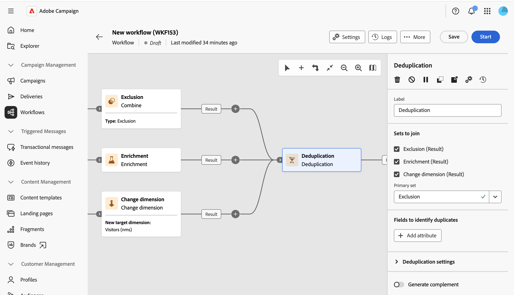
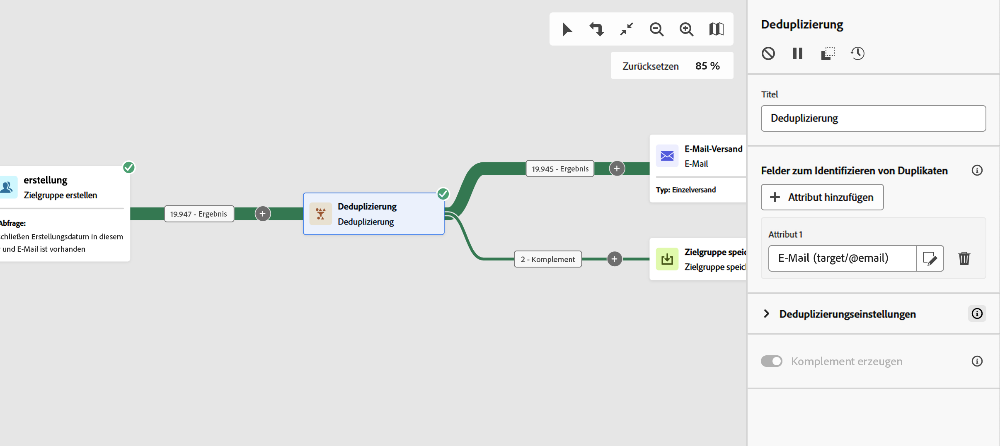

# Deduplizierung {#deduplication}

>[!CONTEXTUALHELP]
>id="acw_orchestration_deduplication_fields"
>title="Felder zum Identifizieren von Duplikaten"
>abstract="Klicken Sie im Abschnitt **Felder zum Identifizieren von Duplikaten** auf die Schaltfläche **Attribut hinzufügen**, um die Felder anzugeben, für die die Identifizierung von Duplikaten aufgrund identischer Werte möglich ist, wie z. B. E-Mail-Adresse, Vorname und Nachname. Die Reihenfolge der Felder gibt an, welche Felder zuerst verarbeitet werden sollen."

>[!CONTEXTUALHELP]
>id="acw_orchestration_deduplication"
>title="Aktivität &quot;Deduplizierung&quot;"
>abstract="Die Aktivität **Deduplizierung** löscht Duplikate in den Ergebnissen eingehender Aktivitäten. Sie wird hauptsächlich nach Zielgruppenbestimmungsaktivitäten und vor Aktivitäten verwendet, die Zielgruppendaten verwenden. Wenn mehr als eine eingehende Transition verfügbar ist, verwenden Sie den Abschnitt **Zusammenzuführende Mengen**, um auszuwählen, welche Transitionen mit der Aktivität verbunden werden sollen."

>[!CONTEXTUALHELP]
>id="acw_orchestration_deduplication_sets"
>title="Zusammenzuführende Mengen"
>abstract="Markieren Sie die vorherigen Aktivitäten, die als eingehende Transitionen der Aktivität **Deduplizierung** verbunden werden sollen.Die ausgewählten Aktivitäten werden dann mit der Aktivität **Deduplizierung** verbunden.Dieser Abschnitt wird nur angezeigt, wenn mehr als eine eingehende Transition für die Verbindung mit der Aktivität verfügbar ist."

>[!CONTEXTUALHELP]
>id="acw_orchestration_deduplication_complement"
>title="Erzeugen eines Komplements"
>abstract="Sie können eine zusätzliche ausgehende Transition mit der verbleibenden Population generieren, die als Duplikat ausgeschlossen wurde. Schalten Sie dazu die Option **Komplement erzeugen** ein."

>[!CONTEXTUALHELP]
>id="acw_orchestration_deduplication_settings"
>title="Deduplizierungseinstellungen"
>abstract="Um Duplikate in den eingehenden Daten zu löschen, definieren Sie die Deduplizierungsmethode in den folgenden Feldern. Standardmäßig wird nur ein Eintrag beibehalten. Wählen Sie die Deduplizierungsmethode anhand eines Ausdrucks oder Attributs aus. Standardmäßig wird der Eintrag, der von den Duplikaten ausgenommen sein soll, zufällig ausgewählt."

Die **Deduplizierungsaktivität** ist eine **Zielgruppenbestimmungsaktivität**. Diese Aktivität löscht Duplikate in den Ergebnissen eingehender Aktivitäten, z. B. doppelte Profile in der Empfängerliste. Die Aktivität **Deduplizierung** wird im Allgemeinen im Anschluss an Zielgruppenbestimmungsaktivitäten und vor Aktivitäten verwendet, die Zielgruppendatum verwenden.

Die Aktivität unterstützt mehrere eingehende Transitionen.Wenn mehr als eine eingehende Transition verfügbar ist, verwenden Sie den Abschnitt **Zusammenzuführende Mengen** in den Eigenschaften der Aktivität, um auszuwählen, welche Transitionen mit der Aktivität verbunden werden sollen. Die ausgewählten Transitionen werden dann mit der Aktivität **Deduplizierung** auf der Workflow-Arbeitsfläche verknüpft.

## Konfigurieren der Deduplizierungsaktivität {#deduplication-configuration}

Gehen Sie folgendermaßen vor, um die **Deduplizierungsaktivität** zu konfigurieren:

1. Fügen Sie eine **Deduplizierungsaktivität** zu Ihrem Workflow hinzu.

1. Markieren Sie im Abschnitt **Zusammenzuführende Mengen** die vorherigen Aktivitäten, die Sie als eingehende Transitionen der Aktivität **Deduplizierung** verbinden möchten. Die ausgewählten Aktivitäten werden dann mit der Aktivität **Deduplizierung** auf der Workflow-Arbeitsfläche verknüpft. Verwenden Sie das Feld **Hauptmenge**, um eingehende Referenztransition zu definieren. Einträge aus den anderen Mengen werden mit der Hauptmenge abgeglichen, um Duplikate zu identifizieren.

   >[!NOTE]
   >
   >Dieser Abschnitt wird nur angezeigt, wenn mehr als eine eingehende Transition verfügbar ist.

1. Klicken Sie im Abschnitt **Felder zum Identifizieren von Duplikaten** auf die Schaltfläche **Attribut hinzufügen**, um die Felder anzugeben, für die die Identifizierung von Duplikaten aufgrund identischer Werte möglich ist, wie z. B. E-Mail-Adresse, Vorname und Nachname. Die Reihenfolge der Felder gibt an, welche Felder zuerst verarbeitet werden sollen. [Erfahren Sie, wie Sie Attribute auswählen und zu den Favoriten hinzufügen](../../get-started/attributes.md).

1. Wählen Sie im Abschnitt **Deduplizierungseinstellungen** die Anzahl der eindeutigen **beizubehaltenden Duplikate** aus. Der Standardwert dieses Felds ist 1. Beim Wert 0 werden alle Duplikate beibehalten.

   Nehmen wir z. B. den Fall, dass die Einträge A und B wie Duplikate des Datensatzes Y und ein Datensatz C wie ein Duplikat des Datensatzes Z angesehen werden:

   * Wenn der Wert des Felds 1 ist: nur die Datensätze Y und Z werden beibehalten.
   * Wenn der Wert des Felds 0 ist: alle Datensätze werden beibehalten.
   * Wenn der Wert des Felds 2 ist: Die Einträge C und Z werden beibehalten und von den Einträgen A, B und Y werden zwei entweder nach dem Zufallsprinzip oder in Abhängigkeit von der ausgewählten Deduplizierungsmethode beibehalten.

1. Wählen Sie die **Deduplizierungsmethode** aus, die verwendet werden soll:

   * **Zufällige Auswahl**: Wählt nach dem Zufallsprinzip unter den Duplikaten den Eintrag aus, der beibehalten werden soll.
   * **Von einem Ausdruck ausgehend**: Behält Einträge bei, für die der angegebene Ausdruck den kleinsten oder größten Wert aufweist.
   * **Wert nicht leer**: Behält Einträge bei, für die der Ausdruck nicht leer ist.
   * **Gemäß einer Werteliste**: Definiert eine Priorität nach Wert für ein oder mehrere Felder. Klicken Sie zur Bestimmung dieser Werte auf **Attribute**, um ein Feld auszuwählen, oder erstellen Sie einen Ausdruck und fügen Sie dann die Werte der entsprechenden Tabelle hinzu. Verwenden Sie die Schaltfläche **Hinzufügen** oberhalb der Werteliste, um ein neues Feld zu definieren.

1. Kreuzen Sie die Option **Komplement erzeugen** an, um die verbleibende Population zu verwenden. Das Komplement besteht aus allen Duplikaten. Der Aktivität wird daraufhin eine zusätzliche Transition hinzugefügt.

## Beispiel {#deduplication-example}

Verwenden Sie im folgenden Beispiel eine Deduplizierungsaktivität, um vor dem Versand Duplikate aus der Zielgruppe auszuschließen. Die identifizierten duplizierten Profile werden einer dedizierten Zielgruppe hinzugefügt, die bei Bedarf wiederverwendet werden kann. Wählen Sie die **E-Mail-Adresse** zur Identifizierung der Duplikate. Behalten Sie einen Eintrag bei und wählen Sie die Deduplizierungsmethode **Zufällig** aus.

