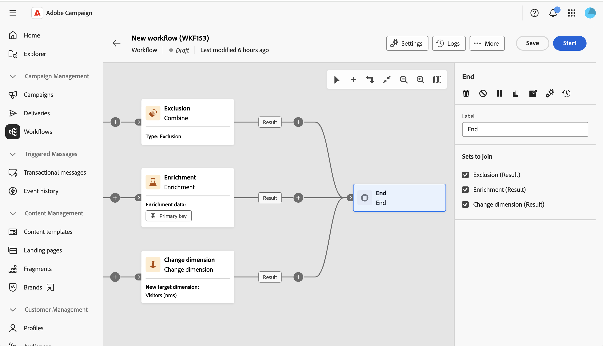

# Ende {#end}

>[!CONTEXTUALHELP]
>id="acw_orchestration_end"
>title="Endaktivität"
>abstract="Mit der Aktivität **Ende** können Sie das Ende eines Workflows grafisch markieren. Wenn mehr als eine eingehende Transition verfügbar ist, wählen Sie im Abschnitt **Zusammenzufügende Sätze** aus, welche Transitionen mit der Aktivität verbunden werden sollen."

>[!CONTEXTUALHELP]
>id="acw_orchestration_end_sets"
>title="Zusammenzuführende Mengen"
>abstract="Markieren Sie die vorherigen Aktivitäten, die als eingehende Transitionen der Aktivität **Ende“ verbunden** sollen. Die ausgewählten Aktivitäten werden dann mit dem **Ende** verbunden. Dieser Abschnitt wird nur angezeigt, wenn mehr als eine eingehende Transition zur Verbindung mit der Aktivität verfügbar ist."

>[!CONTEXTUALHELP]
>id="acw_orchestration_signal"
>title="Externes Signal"
>abstract="Platzhalter für den Abschnitt „Externes Signal“ in den Parametern der Endaktivität. Nur für orchestrierte Kampagnen verfügbar. NICHT LÖSCHEN"

Die Aktivität **Ende** ist eine Aktivität **Fluss-Steuerung** . Damit können Sie das Ende eines Workflows grafisch markieren. Diese Aktivität ist optional.

Die Aktivität unterstützt mehrere eingehende Transitionen, wenn mehr als eine eingehende Transition verfügbar ist.

Aktivieren **im Abschnitt „Zusammenzufügende Sätze** die vorherigen Aktivitäten, die als eingehende Transitionen der Aktivität **Ende“** werden sollen. Die ausgewählten Aktivitäten werden dann mit dem **Ende)** Workflow-Arbeitsfläche verknüpft.

