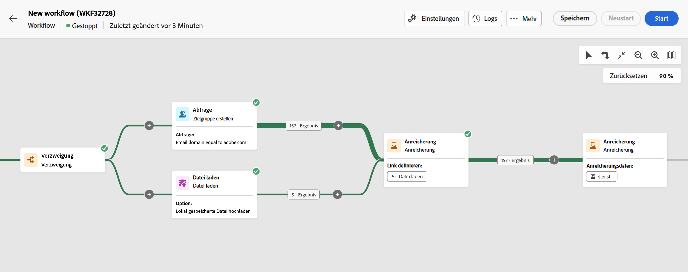

# Anreicherung {#enrichment}

>[!CONTEXTUALHELP]
>id="acw_orchestration_enrichment"
>title="Aktivität „Anreicherung“"
>abstract="Die Aktivität **Anreicherung** ermöglicht es Ihnen, die Zielgruppendaten um zusätzliche Informationen aus der Datenbank zu erweitern. Sie wird in einem Workflow häufig nach den Segmentierungsaktivitäten verwendet."

>[!CONTEXTUALHELP]
>id="acw_orchestration_enrichment_data"
>title="Aktivität „Anreicherung“"
>abstract="Nachdem Anreicherungsdaten zum Workflow hinzugefügt wurden, können sie in den Aktivitäten verwendet werden, die nach der Aktivität „Anreicherung“ hinzugefügt wurden, um Kundinnen und Kunden basierend auf ihren Verhaltensweisen, Voreinstellungen und Anforderungen in verschiedene Gruppen zu unterteilen oder um personalisierte Marketing-Nachrichten und -Kampagnen zu erstellen, die Ihre Zielgruppe mit größerer Wahrscheinlichkeit ansprechen."

>[!CONTEXTUALHELP]
>id="acw_orchestration_enrichment_simplejoin"
>title="Erstellen Sie eine Verknüpfung zwischen den Daten der Arbeitstabelle und der Adobe Campaign-Datenbank. Wenn Sie beispielsweise Daten aus einer Datei laden, die die Kundennummer, das Land und die E-Mail-Adresse der Empfänger enthält, müssen Sie eine Relation zur Ländertabelle erstellen, um diese Informationen in ihren Profilen zu aktualisieren."
>abstract="Definition der Relation"

>[!CONTEXTUALHELP]
>id="acw_orchestration_enrichment_reconciliation"
>title="Abstimmung der Anreicherung"
>abstract="Abstimmung der Anreicherung"

>[!CONTEXTUALHELP]
>id="acw_targetdata_personalization_enrichmentdata"
>title="Anreicherungsdaten"
>abstract="Wählen Sie die zur Anreicherung Ihres Workflows zu verwendenden Daten aus. Sie können zwei Arten von Anreicherungsdaten auswählen: ein einzelnes Anreicherungsattribut aus der Zieldimension oder eine Sammlungsrelation, bei der es sich um eine Verknüpfung mit einer 1:n-Kardinalität zwischen Tabellen handelt."

Die Aktivität der **Anreicherung** ist eine **Zielgruppenbestimmungs-Aktivität**. Sie ermöglicht Ihnen, die Zielgruppendaten um zusätzliche Informationen aus der Datenbank zu erweitern. Sie wird in einem Workflow häufig nach den Segmentierungsaktivitäten verwendet.

Anreicherungsdaten können verschiedene Ursprünge haben:

* **Aus derselben Arbeitstabelle** wie die Zielgruppe in Ihrem Workflow:

  *Bestimmung einer Kundenzielgruppe und Hinzufügen des Felds „Geburtsdatum“ zur aktuellen Arbeitstabelle*

* **Aus einer anderen Arbeitstabelle**:

  *Zielgruppenbestimmung einer Kundengruppe und Hinzufügen der Felder „Betrag“ und „Produkttyp“ aus der „Kauf“-Tabelle*.

Nachdem die Anreicherungsdaten zum Workflow hinzugefügt wurden, können sie in den Aktivitäten verwendet werden, die im Anschluss an die Aktivität **Anreicherung** hinzugefügt wurden, um Kundinnen und Kunden basierend auf ihren Verhaltensweisen, Vorlieben und Bedürfnissen in verschiedene Gruppen zu unterteilen oder um personalisierte Marketing-Nachrichten und -Kampagnen zu erstellen, die Ihre Zielgruppe mit größerer Wahrscheinlichkeit ansprechen.

Sie können beispielsweise der Workflow-Arbeitstabelle Informationen zu Käufen von Kundinnen und Kunden hinzufügen und diese Daten verwenden, um E-Mails mit ihrem neuesten Kauf oder dem für diese Käufe ausgegebenen Betrag zu personalisieren.

## Aktivität Anreicherung hinzufügen {#enrichment-configuration}

Führen Sie die folgenden Schritte aus, um die Aktivität **Anreicherung** zu konfigurieren:

1. Fügen Sie Aktivitäten wie **Zielgruppe erstellen** und **Kombinieren** hinzu.
1. Fügen Sie eine Aktivität vom Typ **Anreicherung** hinzu.
1. Wenn in Ihrem Workflow mehrere Transitionen konfiguriert wurden, können Sie die **[!UICONTROL Primärer Satz]** -Feld, um festzulegen, welche Transition als Hauptmenge für die Anreicherung mit Daten verwendet werden soll.

## Anreicherungsdaten hinzufügen {#enrichment-add}

1. Klicken Sie auf **Anreicherungsdaten hinzufügen** und wählen Sie das Attribut zur Datenanreicherung aus.

   Sie können zwei Arten von Anreicherungsdaten auswählen: ein einzelnes Anreicherungsattribut aus der Zieldimension oder eine Kollektionsrelation. Die einzelnen Typen werden in den folgenden Beispielen beschrieben:
   * [Einzelnes Anreicherungsattribut](#single-attribute)
   * [Link zur Sammlung](#collection-link)

   >[!NOTE]
   >
   >Über die **Schaltfläche „Ausdruck bearbeiten“** im Attributauswahl-Bildschirm können Sie erweiterte Ausdrücke zur Attributauswahl erstellen. [Erfahren Sie mehr über die Arbeit mit dem Ausdruckseditor](../../query/expression-editor.md)

   

## Relationen zwischen Tabellen erstellen {#create-links}

>[!CONTEXTUALHELP]
>id="acw_homepage_welcome_rn3"
>title="Relationen zwischen Tabellen"
>abstract="Jetzt können Sie in der Workflow-Aktivität Anreicherung eine Verknüpfung zwischen den Arbeitstabellendaten und der Adobe Campaign-Datenbank erstellen."
>additional-url="https://experienceleague.adobe.com/docs/campaign-web/v8/release-notes/release-notes.html?lang=de" text="Siehe Versionshinweise"

Die **[!UICONTROL Linkdefinition]** erstellt eine Relation zwischen den Daten der Arbeitstabelle und der Adobe Campaign-Datenbank. Wenn Sie beispielsweise Daten aus einer Datei laden, die die Kundennummer, das Land und die E-Mail-Adresse der Empfänger enthält, müssen Sie eine Relation zur Ländertabelle erstellen, um diese Informationen in ihren Profilen zu aktualisieren.

Es stehen verschiedene Arten von Links zur Verfügung:

* **[!UICONTROL Einfache Relation zwischen 1 Kardinalität]**: Jeder Datensatz aus der Hauptmenge kann einem Datensatz und nur einem Datensatz aus den verknüpften Daten zugeordnet werden.
* **[!UICONTROL Einfache Relation mit Kardinalität 0 oder 1]**: Jeder Datensatz aus der Hauptmenge kann mit 0 oder 1 Datensatz aus den verknüpften Daten, jedoch nicht mehr als einem Datensatz verknüpft werden.
* **[!UICONTROL Kollektionsrelation mit Kardinalität N]**: Jeder Datensatz aus der Hauptmenge kann mit 0, 1 oder mehr (N) Datensätzen aus den verknüpften Daten verknüpft werden.

Gehen Sie wie folgt vor, um einen Link zu erstellen:

1. Im **[!UICONTROL Linkdefinition]** klicken Sie auf die **[!UICONTROL Link hinzufügen]** Schaltfläche.

   

1. Im **Relationstyp** wählen Sie aus der Dropdown-Liste den Typ des Links aus, den Sie erstellen möchten.

1. Bestimmen Sie das Ziel, mit dem Sie die Hauptmenge verknüpfen möchten:

   * Um eine vorhandene Tabelle in der Datenbank zu verknüpfen, wählen Sie **[!UICONTROL Datenbankschema]** und wählen Sie die gewünschte Tabelle aus der **[!UICONTROL Zielschema]** -Feld.
   * Um eine Relation mit Daten aus der eingehenden Transition herzustellen, wählen Sie **Temporäres Schema** und wählen Sie die Transition aus, deren Daten Sie verwenden möchten.

1. Definieren Sie die Abstimmkriterien, um die Daten der Hauptmenge mit dem verknüpften Schema abzustimmen. Es stehen zwei Typen von Joins zur Verfügung:

   * **Einfacher Join**: Wählen Sie ein bestimmtes Attribut aus, um die Daten aus den beiden Schemas abzugleichen. Klicks **Join hinzufügen** und wählen Sie die **Quelle** und **Ziel** -Attribute, die als Abstimmkriterien verwendet werden.
   * **Erweiterter Join**: Erstellen Sie einen Join mit erweiterten Bedingungen. Klicks **Join hinzufügen** und klicken Sie auf **Bedingung erstellen** Schaltfläche zum Öffnen des Abfragemodells.

Ein Workflow-Beispiel mit Links ist im Abschnitt [Beispiele](#link-example) Abschnitt.

## Beispiele {#example}

### Einzelnes Anreicherungsattribut {#single-attribute}

Hier fügen wir nur ein einziges Anreicherungsattribut hinzu, z. B. das Geburtsdatum. Führen Sie folgende Schritte aus:

1. Klicken Sie in das Feld **Attribut**.
1. Wählen Sie ein einfaches Feld aus der Zielgruppendimension aus, in unserem Beispiel das Geburtsdatum.
1. Klicken Sie auf **Bestätigen**.

### Sammlungsrelation {#collection-link}

In diesem komplexeren Anwendungsfall wählen wir eine Sammlungsrelation aus, die eine Verknüpfung mit einer Kardinalität von 1:n zwischen Tabellen darstellt. Rufen wir die drei neuesten Käufe ab, die weniger als 100 € betragen. Dazu müssen Sie Folgendes definieren:

* ein Anreicherungsattribut: das Feld **Gesamtbetrag**
* die Anzahl der abzurufenden Zeilen: 3
* einen Filter: Elemente herausfiltern, die über 100 € liegen
* eine Sortierung: absteigende Sortierung nach dem Feld **Bestelldatum**.

#### Fügen Sie das Attribut hinzu. {#add-attribute}

Hier wählen Sie die Sammlungsrelation aus, um sie als Anreicherungsdaten zu verwenden.

1. Klicken Sie in das Feld **Attribut**.
1. Klicken Sie auf **Erweiterte Attribute anzeigen**.
1. Wählen Sie das Feld **Gesamtbetrag** aus der Tabelle **Käufe**.

#### Definieren Sie die Sammlungseinstellungen.{#collection-settings}

Definieren Sie dann, wie die Daten erfasst werden und wie viele Einträge abgerufen werden sollen.

1. Wählen Sie **Daten erfassen** in der Dropdown-Liste **Auswählen, wie die Daten erfasst werden**.
1. Geben Sie „3“ in das Feld **Abzurufende Zeilen (zu erstellende Spalten)** ein.

Wenn Sie beispielsweise die durchschnittliche Anzahl der Käufe für eine Person abrufen möchten, wählen Sie stattdessen **Aggregierte Daten** und wählen Sie **Durchschnitt** in der Dropdown-Liste **Aggregatfunktion**.

#### Definieren von Filtern{#collection-filters}

Hier definieren wir den Maximalwert für das Anreicherungsattribut. Wir filtern Elemente mit einem Preis von mehr als 100 USD heraus. [Erfahren Sie mehr über die Arbeit mit dem Abfrage-Modeler](../../query/query-modeler-overview.md)

1. Klicken Sie auf **Filter bearbeiten**.
1. Fügen Sie die beiden folgenden Filter hinzu: **Gesamtbetrag** vorhanden UND **Gesamtbetrag** ist kleiner als 100. Der erste filtert NULL-Werte, da sie als größter Wert erscheinen würden.
1. Klicken Sie auf **Bestätigen**.

#### Definieren der Sortierung{#collection-sorting}

Jetzt müssen wir eine Sortierung anwenden, um die drei **letzten** Käufe abzurufen.

1. Aktivieren Sie die Option **Sortierung aktivieren**.
1. Klicken Sie in das Feld **Attribut**.
1. Wählen Sie das Feld **Bestelldatum**.
1. Klicken Sie auf **Bestätigen**.
1. Wählen Sie **Absteigend** aus der Dropdown-Liste **Sortieren**.

### Anreicherung mit verknüpften Daten {#link-example}

Das folgende Beispiel zeigt einen Workflow, der konfiguriert wurde, um eine Verknüpfung zwischen zwei Transitionen zu erstellen. Die erste Transition dient der Bestimmung von Zielgruppendaten mithilfe einer Abfrage -Aktivität, während die zweite Transition Kaufdaten enthält, die in einer Datei gespeichert sind, die über die Aktivität Datei laden geladen wurde.

* Die erste **Anreicherung** Aktivität verknüpft unsere Hauptmenge (Daten aus **Abfrage** -Aktivität) mit dem Schema aus der **Datei laden** -Aktivität. Dadurch können wir jedes Profil, das in der Abfrage angesprochen wird, mit den entsprechenden Kaufdaten abgleichen.
* Eine Sekunde **Anreicherung** -Aktivität hinzugefügt, um die Daten aus der Workflow-Tabelle mit den Kaufdaten aus der **Datei laden** -Aktivität. Auf diese Weise können wir diese Daten in weiteren Aktivitäten verwenden, um beispielsweise die an die Kunden gesendeten Nachrichten mit Informationen zum Kauf zu personalisieren.

  

<!--

Add other fields
use it in delivery

cardinality between the tables (1-N)
1. select attribute to use as enrichment data

    display advanced fields option
    i button

    note: attributes from the target dimension

1. Select how the data is collected
1. number of records to retrieve if want to retrieve a collection of multiple records
1. Apply filters and build rule

    select an existing filter
    save the filter for reuse
    view results of the filter visually or in code view

1. sort records using an attribute

leverage enrichment data in campaign

where we can use the enrichment data: personalize email, other use cases?

## Example

-->
