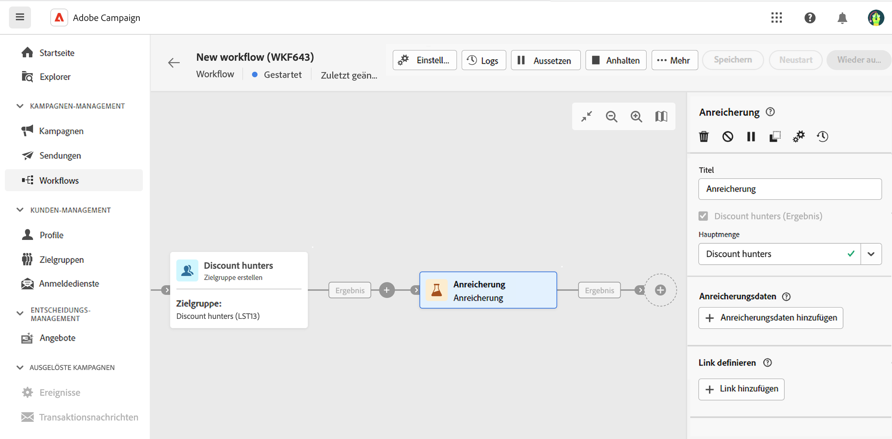
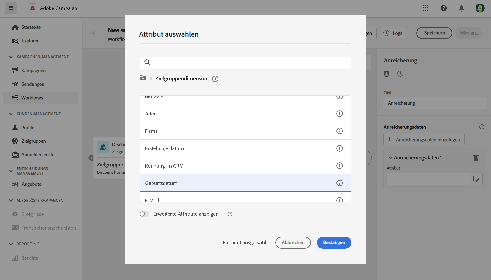
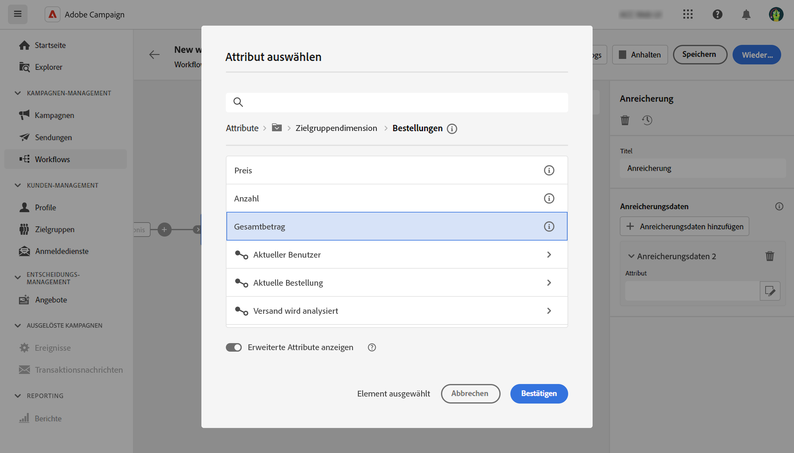
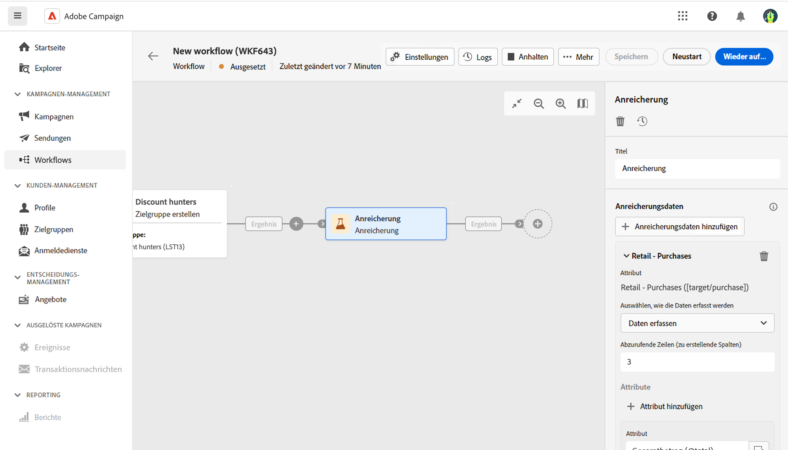
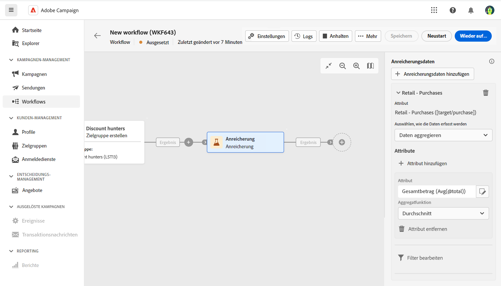
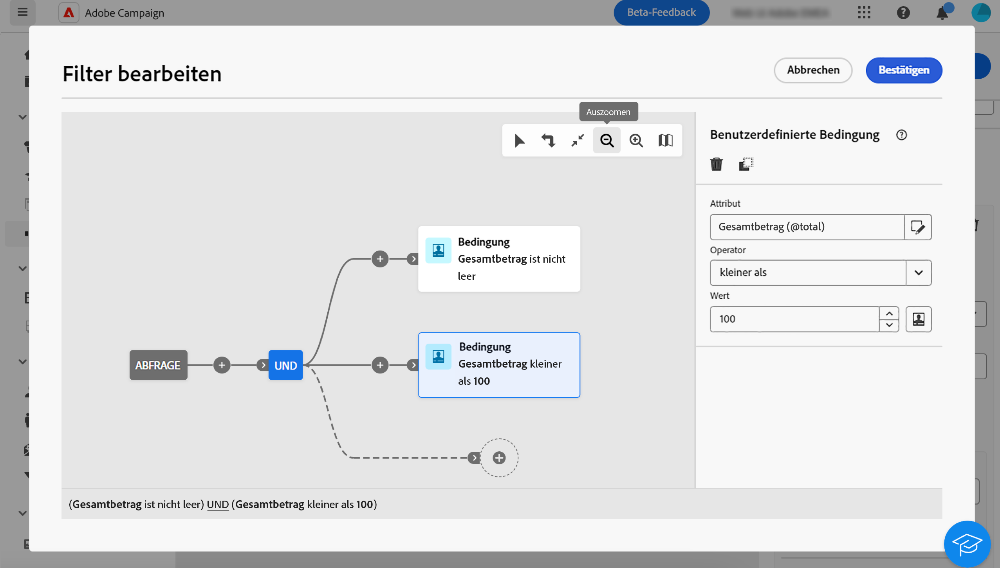
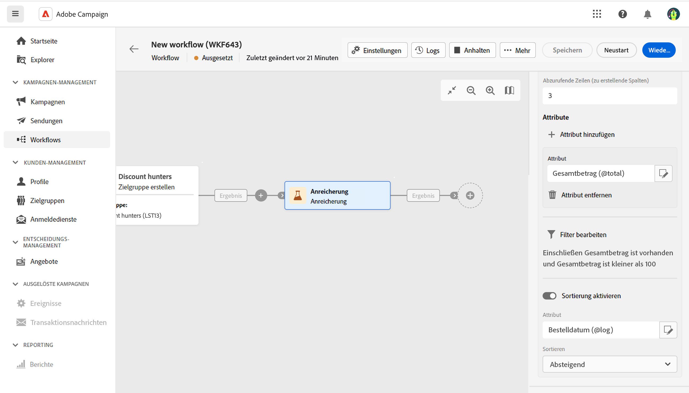

# Anreicherung  {#enrichment}

>[!CONTEXTUALHELP]
>id="acw_orchestration_enrichment_data"
>title="Aktivität „Anreicherung“"
>abstract="Die Aktivität „Anreicherung“ ermöglicht es Ihnen, die Zielgruppendaten um zusätzliche Informationen aus der Datenbank zu erweitern. Sie wird in einem Workflow häufig nach den Zielgruppenbestimmungs-Aktivitäten verwendet. Nachdem Anreicherungsdaten zum Workflow hinzugefügt wurden, können sie in den Aktivitäten verwendet werden, die nach der Aktivität „Anreicherung“ hinzugefügt wurden, um Kundinnen und Kunden basierend auf ihren Verhaltensweisen, Voreinstellungen und Anforderungen in verschiedene Gruppen zu unterteilen oder um personalisierte Marketing-Nachrichten und -Kampagnen zu erstellen, die Ihre Zielgruppe mit größerer Wahrscheinlichkeit ansprechen."

Die Aktivität der **Anreicherung** ist eine **Zielgruppenbestimmungs-Aktivität**. Sie ermöglicht Ihnen, die Zielgruppendaten um zusätzliche Informationen aus der Datenbank zu erweitern. Sie wird in einem Workflow häufig nach den Segmentierungsaktivitäten verwendet.

Anreicherungsdaten können verschiedene Ursprünge haben:

* **Aus derselben Arbeitstabelle** wie die Zielgruppe in Ihrem Workflow:

  *Zielgruppenbestimmung einer Kundengruppe und Hinzufügen des Felds „Geburtsdatum“ zur aktuellen Arbeitstabelle*

* **Aus einer anderen Arbeitstabelle**:

  *Zielgruppenbestimmung einer Kundengruppe und Hinzufügen der Felder „Betrag“ und „Produkttyp“ aus der „Kauf“-Tabelle*.

Nachdem die Anreicherungsdaten zum Workflow hinzugefügt wurden, können sie in den Aktivitäten verwendet werden, die im Anschluss an die Aktivität **Anreicherung** hinzugefügt wurden, um Kundinnen und Kunden basierend auf ihren Verhaltensweisen, Vorlieben und Bedürfnissen in verschiedene Gruppen zu unterteilen oder um personalisierte Marketing-Nachrichten und -Kampagnen zu erstellen, die Ihre Zielgruppe mit größerer Wahrscheinlichkeit ansprechen.

Sie können beispielsweise der Workflow-Arbeitstabelle Informationen zu Käufen von Kundinnen und Kunden hinzufügen und diese Daten verwenden, um E-Mails mit ihrem neuesten Kauf oder dem für diese Käufe ausgegebenen Betrag zu personalisieren.

## Allgemeine Konfiguration {#general}

Führen Sie die folgenden Schritte aus, um die Aktivität **Anreicherung** zu konfigurieren:

1. Fügen Sie Aktivitäten wie **Zielgruppe erstellen** und **Kombinieren** hinzu.
1. Fügen Sie eine Aktivität vom Typ **Anreicherung** hinzu.
1. Klicken Sie auf **Anreicherungsdaten hinzufügen**.

Sie können zwei Arten von Anreicherungsdaten auswählen: ein [einzelnes Anreicherungsattribut](#single-attribute) aus der Zielgruppendimension oder eine [Sammlungsrelation](#collection-link).

## Einzelnes Anreicherungsattribut {#single-attribute}

Hier fügen wir nur ein einziges Anreicherungsattribut hinzu, z. B. das Geburtsdatum. Führen Sie folgende Schritte aus:

1. Klicken Sie in das Feld **Attribut**.
1. Wählen Sie ein einfaches Feld aus der Zielgruppendimension aus, in unserem Beispiel das Geburtsdatum.
1. Klicken Sie auf **Bestätigen**.

## Sammlungsrelation {#collection-link}

In diesem komplexeren Anwendungsfall wählen wir eine Sammlungsrelation aus, die eine Verknüpfung mit einer Kardinalität von 1:n zwischen Tabellen darstellt. Rufen wir die drei neuesten Käufe ab, die weniger als 100 € betragen. Dazu müssen Sie Folgendes definieren:

* ein Anreicherungsattribut: das Feld **Gesamtbetrag**
* die Anzahl der abzurufenden Zeilen: 3
* einen Filter: Elemente herausfiltern, die über 100 € liegen
* eine Sortierung: absteigende Sortierung nach dem Feld **Bestelldatum**.

### Fügen Sie das Attribut hinzu.

Hier wählen Sie die Sammlungsrelation aus, um sie als Anreicherungsdaten zu verwenden.

1. Klicken Sie in das Feld **Attribut**.
1. Klicken Sie auf **Erweiterte Attribute anzeigen**.
1. Wählen Sie das Feld **Gesamtbetrag** aus der Tabelle **Käufe**.

### Definieren Sie die Sammlungseinstellungen.

Definieren Sie dann, wie die Daten erfasst werden und wie viele Einträge abgerufen werden sollen.

1. Wählen Sie **Daten erfassen** in der Dropdown-Liste **Auswählen, wie die Daten erfasst werden**.
1. Geben Sie „3“ in das Feld **Abzurufende Zeilen (zu erstellende Spalten)** ein.

Wenn Sie beispielsweise die durchschnittliche Anzahl der Käufe für eine Person abrufen möchten, wählen Sie stattdessen **Aggregierte Daten** und wählen Sie **Durchschnitt** in der Dropdown-Liste **Aggregatfunktion**.

### Definieren von Filtern

Hier definieren wir den Maximalwert für das Anreicherungsattribut. Wir filtern Elemente heraus, die mehr als 100 € betragen.

1. Klicken Sie auf **Filter bearbeiten**.
1. Fügen Sie die beiden folgenden Filter hinzu: **Gesamtbetrag** vorhanden UND **Gesamtbetrag** ist kleiner als 100. Der erste filtert NULL-Werte, da sie als größter Wert erscheinen würden.
1. Klicken Sie auf **Bestätigen**.

### Definieren der Sortierung

Jetzt müssen wir eine Sortierung anwenden, um die drei **letzten** Käufe abzurufen.

1. Aktivieren Sie die Option **Sortierung aktivieren**.
1. Klicken Sie in das Feld **Attribut**.
1. Wählen Sie das Feld **Bestelldatum**.
1. Klicken Sie auf **Bestätigen**.
1. Wählen Sie **Absteigend** aus der Dropdown-Liste **Sortieren**.

<!--

Add other fields
use it in delivery

cardinality between the tables (1-N)
1. select attribute to use as enrichment data

    display advanced fields option
    i button

    note: attributes from the target dimension

1. Select how the data is collected
1. number of records to retrieve if want to retrieve a collection of multiple records
1. Apply filters and build rule

    select an existing filter
    save the filter for reuse
    view results of the filter visually or in code view

1. sort records using an attribute

leverage enrichment data in campaign

where we can use the enrichment data: personalize email, other use cases?

## Example

-->