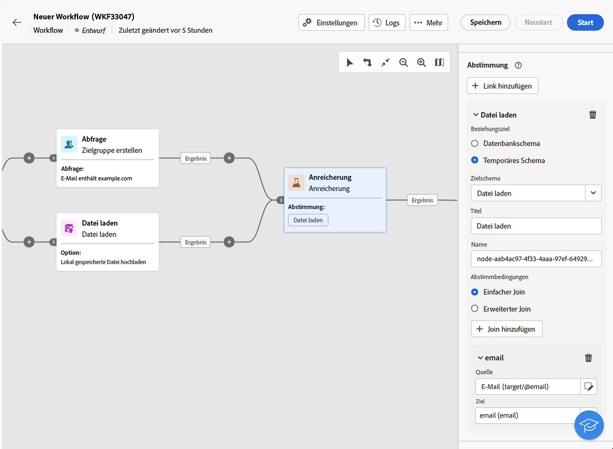
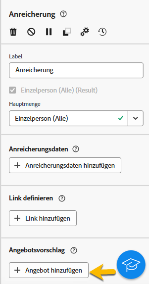
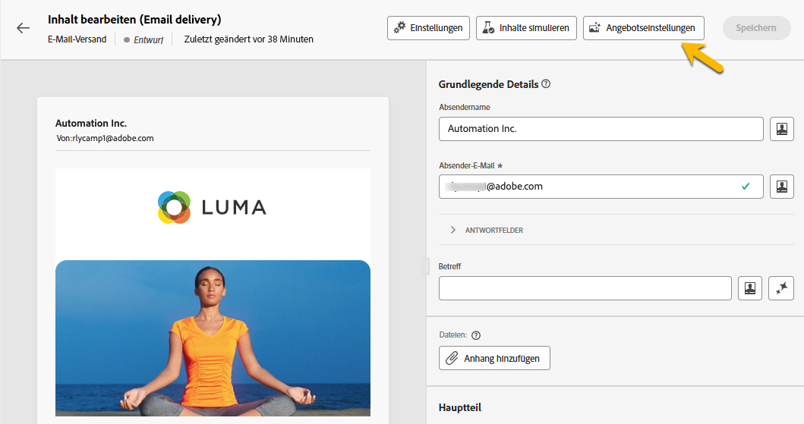
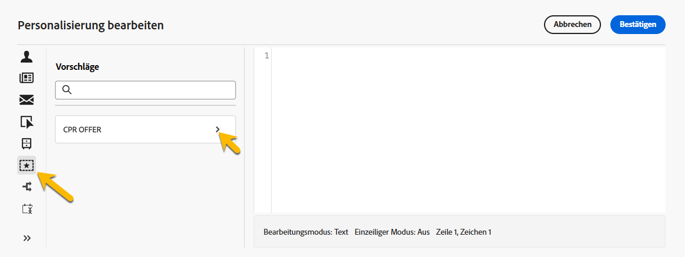
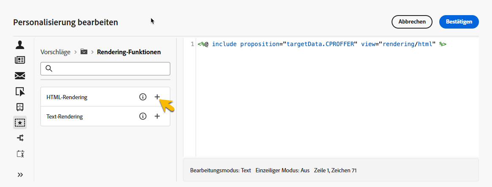
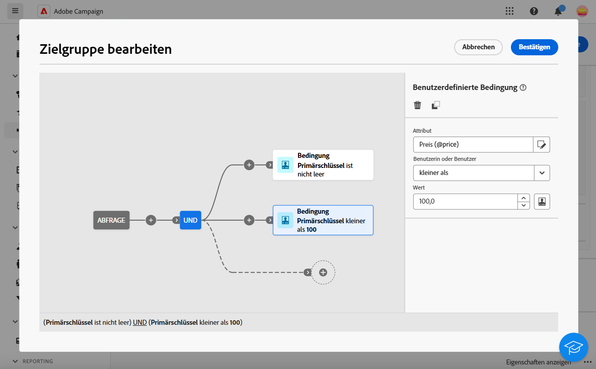

# Anreicherung {#enrichment}

>[!CONTEXTUALHELP]
>id="acw_orchestration_enrichment"
>title="Aktivität „Anreicherung“"
>abstract="Die Aktivität **Anreicherung** ermöglicht es Ihnen, die Zielgruppendaten um zusätzliche Informationen aus der Datenbank zu erweitern. Sie wird in einem Workflow häufig nach den Segmentierungsaktivitäten verwendet."

Die Aktivität der **Anreicherung** ist eine **Zielgruppenbestimmungs-Aktivität**. Sie ermöglicht Ihnen, die Zielgruppendaten um zusätzliche Informationen aus der Datenbank zu erweitern. Sie wird in einem Workflow häufig nach den Segmentierungsaktivitäten verwendet.

Anreicherungsdaten können verschiedene Ursprünge haben:

* **Aus derselben Arbeitstabelle** wie die Zielgruppe in Ihrem Workflow:

  *Bestimmung einer Kundenzielgruppe und Hinzufügen des Felds „Geburtsdatum“ zur aktuellen Arbeitstabelle*

* **Aus einer anderen Arbeitstabelle**:

  *Zielgruppenbestimmung einer Kundengruppe und Hinzufügen der Felder „Betrag“ und „Produkttyp“ aus der „Kauf“-Tabelle*.

Nachdem die Anreicherungsdaten zum Workflow hinzugefügt wurden, können sie in den Aktivitäten verwendet werden, die im Anschluss an die Aktivität **Anreicherung** hinzugefügt wurden, um Kundinnen und Kunden basierend auf ihren Verhaltensweisen, Vorlieben und Bedürfnissen in verschiedene Gruppen zu unterteilen oder um personalisierte Marketing-Nachrichten und -Kampagnen zu erstellen, die Ihre Zielgruppe mit größerer Wahrscheinlichkeit ansprechen.

Sie können beispielsweise der Workflow-Arbeitstabelle Informationen zu Käufen von Kundinnen und Kunden hinzufügen und diese Daten verwenden, um E-Mails mit ihrem neuesten Kauf oder dem für diese Käufe ausgegebenen Betrag zu personalisieren.

## Hinzufügen einer Anreicherungsaktivität {#enrichment-configuration}

Führen Sie die folgenden Schritte aus, um die Aktivität **Anreicherung** zu konfigurieren:

1. Fügen Sie Aktivitäten wie **Zielgruppe erstellen** und **Kombinieren** hinzu.
1. Fügen Sie eine Aktivität vom Typ **Anreicherung** hinzu.
1. Wenn in Ihrem Workflow mehrere Transitionen konfiguriert wurden, können Sie das Feld **[!UICONTROL Hauptmenge]** verwenden, um festzulegen, welche Transition als Hauptmenge für die Anreicherung mit Daten verwendet werden soll.

## Hinzufügen von Anreicherungsdaten {#enrichment-add}

>[!CONTEXTUALHELP]
>id="acw_targetdata_personalization_enrichmentdata"
>title="Anreicherungsdaten"
>abstract="Wählen Sie die zur Anreicherung Ihres Workflows zu verwendenden Daten aus. Sie können zwei Arten von Anreicherungsdaten auswählen: ein einzelnes Anreicherungsattribut aus der Zieldimension oder eine Sammlungsrelation, bei der es sich um eine Verknüpfung mit einer 1:n-Kardinalität zwischen Tabellen handelt."

>[!CONTEXTUALHELP]
>id="acw_orchestration_enrichment_data"
>title="Aktivität „Anreicherung“"
>abstract="Nachdem Anreicherungsdaten zum Workflow hinzugefügt wurden, können sie in den Aktivitäten verwendet werden, die nach der Aktivität „Anreicherung“ hinzugefügt wurden, um Kundinnen und Kunden basierend auf ihren Verhaltensweisen, Voreinstellungen und Anforderungen in verschiedene Gruppen zu unterteilen oder um personalisierte Marketing-Nachrichten und -Kampagnen zu erstellen, die Ihre Zielgruppe mit größerer Wahrscheinlichkeit ansprechen."

1. Klicken Sie auf **Anreicherungsdaten hinzufügen** und wählen Sie das Attribut zur Datenanreicherung aus.

   Sie können zwei Arten von Anreicherungsdaten auswählen: ein einzelnes Anreicherungsattribut aus der Zielgruppendimension oder eine Sammlungsrelation. Jeder dieser Typen wird in den Beispielen unten detailliert beschrieben:
   * [Einzelnes Anreicherungsattribut](#single-attribute)
   * [Sammlungsrelation](#collection-link)

   >[!NOTE]
   >
   >Über die **Schaltfläche „Ausdruck bearbeiten“** im Attributauswahl-Bildschirm können Sie erweiterte Ausdrücke zur Attributauswahl erstellen. [Erfahren Sie mehr über die Arbeit mit dem Ausdruckseditor](../../query/expression-editor.md)

   

## Erstellen von Relationen zwischen Tabellen {#create-links}

>[!CONTEXTUALHELP]
>id="acw_orchestration_enrichment_simplejoin"
>title="Definition der Relation"
>abstract="Erstellen Sie eine Verknüpfung zwischen den Daten der Arbeitstabelle und der Adobe Campaign-Datenbank. Wenn Sie beispielsweise Daten aus einer Datei laden, die die Kundennummer, das Land und die E-Mail-Adresse der Empfängerinnen und Empfänger enthält, ist die Erzeugung einer Relation zur Ländertabelle erforderlich, um die entsprechende Information im Empfängerprofil zu aktualisieren."

Der Abschnitt **[!UICONTROL Relationsdefinition]** dient der Erzeugung einer Relation zwischen den Daten der Arbeitstabelle und der Adobe Campaign-Datenbank. Wenn Sie beispielsweise Daten aus einer Datei laden, die die Kundennummer, das Land und die E-Mail-Adresse der Empfängerinnen und Empfänger enthält, ist die Erzeugung einer Relation zur Ländertabelle erforderlich, um die entsprechende Information im Empfängerprofil zu aktualisieren.

Es stehen verschiedene Relationstypen zur Verfügung:

* **[!UICONTROL Einfache Relation mit Kardinalität 1]**: Jeder Eintrag aus der Hauptmenge kann genau einem Eintrag aus den verknüpften Daten zugeordnet werden.
* **[!UICONTROL Einfache Relation mit Kardinalität 0 oder 1]**: Jeder Eintrag der Hauptmenge kann 0 oder maximal 1 Eintrag der verknüpften Menge zugeordnet werden.
* **[!UICONTROL Sammlungsrelation mit Kardinalität N]**: Jeder Eintrag aus der Hauptmenge kann 0, 1 oder mehr (N) Einträgen der verknüpften Daten zugeordnet werden.

Gehen Sie wie folgt vor, um eine Relation zu erzeugen:

1. Klicken Sie im Abschnitt **[!UICONTROL Relationsdefinition]** auf die Schaltfläche **[!UICONTROL Relation hinzufügen]** .

   

1. Wählen Sie in der Dropdown-Liste **Relationstyp** den Relationstyp aus, den Sie erzeugen möchten.

1. Bestimmen Sie die Zielgruppe, die Sie mit der Hauptmenge verknüpfen möchten:

   * Um eine vorhandene Tabelle in der Datenbank zu verknüpfen, wählen Sie **[!UICONTROL Datenbankschema]** aus und wählen Sie dann aus dem Feld **[!UICONTROL Zielschema]** die gewünschte Tabelle aus.
   * Um eine Relation mit Daten aus der eingehenden Transition herzustellen, wählen Sie **Temporäres Schema** und dann die Transition aus, deren Daten Sie verwenden möchten.

1. Definieren Sie die Abstimmkriterien, um die Daten der Hauptmenge mit dem verknüpften Schema abzustimmen. Es gibt zwei Arten von Joins:

   * **Einfacher Join**: Wählen Sie ein bestimmtes Attribut aus, um die Daten aus den beiden Schemata abzugleichen. Klicken Sie auf **Join hinzufügen** und wählen Sie die Attribute **Quelle** und **Ziel** aus, die als Abstimmkriterien verwendet werden.
   * **Erweiterter Join**: Erstellen Sie einen Join mit erweiterten Bedingungen. Klicken Sie auf **Join hinzufügen** und klicken Sie auf die Schaltfläche **Bedingung erstellen**, um den Abfrage-Modeler zu öffnen.

Ein Workflow-Beispiel mit Relationen ist im Abschnitt [Beispiele](#link-example) verfügbar.

## Datenabstimmung {#reconciliation}

>[!CONTEXTUALHELP]
>id="acw_orchestration_enrichment_reconciliation"
>title="Abstimmung"
>abstract="Die **Abstimmungsaktivität** kann verwendet werden, um Daten aus dem Campaign-Datenbankschema mit Daten aus einem anderen Schema oder mit Daten aus einem temporären Schema abzustimmen, z. B. mit Daten, die mithilfe der Aktivität „Datei laden“ hochgeladen wurden. Diese Art von Verknüpfung definiert einen Link zu einem eindeutigen Eintrag. Adobe Campaign erstellt einen Link zu einer Zieltabelle, indem ein Fremdschlüssel eingefügt wird, der eine Referenz zum eindeutigen Eintrag enthält."

Die **Abstimmungsaktivität** kann verwendet werden, um Daten aus dem Campaign-Datenbankschema mit Daten aus einem anderen Schema oder mit Daten aus einem temporären Schema abzustimmen, z. B. mit Daten, die mithilfe der Aktivität „Datei laden“ hochgeladen wurden. Diese Art von Verknüpfung definiert einen Link zu einem eindeutigen Eintrag. Adobe Campaign erstellt einen Link zu einer Zieltabelle, indem ein Fremdschlüssel eingefügt wird, der eine Referenz zum eindeutigen Eintrag enthält.

Mit dieser Option können Sie zum Beispiel das Land eines Profils, das in einer hochgeladenen Datei angegeben ist, mit einem der Länder abstimmen, die in der dedizierten Tabelle der Campaign-Datenbank verfügbar sind.

Führen Sie die Schritte zum Konfigurieren einer **Anreicherungsaktivität** mit einem Abstimm-Link durch:

1. Klicken Sie im Abschnitt **Abstimmung** auf die Schaltfläche **Link hinzufügen**.
1. Identifizieren Sie die Daten, mit denen Sie einen Abstimm-Link erstellen möchten.

   * Um einen Abstimm-Link mit Daten aus der Campaign-Datenbank zu erstellen, wählen Sie **Datenbankschema** und dann das Schema aus, in dem die Zielgruppe gespeichert ist.
   * Um einen Abstimm-Link mit den Daten der eingehenden Transition zu erstellen, wählen Sie **Temporäres Schema** und dann die Workflow-Transition aus, in der die Zieldaten gespeichert sind.

1. Die Felder **Titel** und **Name** werden basierend auf dem ausgewählten Zielschema automatisch ausgefüllt. Ihre Werte können an dieser Stelle geändert werden.

1. Legen Sie im Abschnitt **Abstimmbedingungen** fest, wie Daten aus den Quell- und Zieltabellen abgestimmt werden sollen:

   * **Einfacher Join**: Stimmen Sie ein bestimmtes Feld aus der Quelltabelle mit einem anderen Feld in der Zieltabelle ab. Klicken Sie dazu auf die Schaltfläche **Join hinzufügen** und geben Sie die Felder **Quelle** und **Ziel** an, die für die Abstimmung verwendet werden sollen.

     >[!NOTE]
     >
     >Sie können eine oder mehrere Bedingungen für **Einfacher Join** verwenden. In diesem Fall müssen alle Bedingungen überprüft werden, damit die Daten miteinander verknüpft werden können.

   * **Erweiterter Join**: Konfigurieren Sie die Abstimmbedingungen mithilfe des Abfrage-Modelers.  Klicken Sie dazu auf die Schaltfläche **Bedingung erstellen** und definieren Sie dann Ihre Abstimmbedingungen, indem Sie Ihre eigene Regel mithilfe von UND- und ODER-Operationen erstellen.

Das folgende Beispiel zeigt einen Workflow zum Erstellen eines Links zwischen der Empfängertabelle der Adobe Campaign-Datenbank und einer temporären Tabelle, die durch die Aktivität **Datei laden** generiert wurde. In diesem Beispiel stimmt die Anreicherungsaktivität beide Tabellen unter Verwendung der E-Mail-Adresse als Abstimmbedingung miteinander ab.

## Angebote hinzufügen {#add-offers}

>[!CONTEXTUALHELP]
>id="acw_orchestration_enrichment_offer_proposition"
>title="Angebotsvorschlag"
>abstract="Die Anreicherungsaktivität ermöglicht das Hinzufügen von Angeboten für jedes Profil."

Die Aktivität **[!UICONTROL Anreicherung]** ermöglicht das Hinzufügen von Angeboten für jedes Profil.

Gehen Sie dazu wie folgt vor, um die Aktivität **[!UICONTROL Anreicherung]** mit einem Angebot zu konfigurieren:

1. Klicken Sie in der Aktivität **[!UICONTROL Anreicherung]** im Bereich **[!UICONTROL Angebotsvorschlag]** auf die Schaltfläche **[!UICONTROL Angebot hinzufügen]** .

   

1. Sie haben zwei Möglichkeiten zur Angebotsauswahl:

   * **[!UICONTROL Suchen Sie nach dem besten Angebot in Kategorie]** : Aktivieren Sie diese Option und geben Sie die Angebotsplatzierung, Kategorie oder Themen, Kontaktdatum, Anzahl der beizubehaltenden Angebote an. Das Angebotsmodul berechnet anhand dieser Parameter das bzw. die besten Angebote, die hinzugefügt werden sollen. Es wird empfohlen, anstelle von beidem das Feld Kategorie oder Thema auszufüllen.

     

   * **[!UICONTROL Vordefiniertes Angebot]**: Beim Aktivieren dieser Option können Sie ohne Abfrage des Angebotsmoduls direkt das einzufügende Angebot konfigurieren (Platzierung, Kontaktdatum).

     

1. Klicken Sie nach Auswahl Ihres Angebots auf die Schaltfläche **[!UICONTROL Bestätigen]** .

Jetzt können Sie das Angebot in der Versandaktivität verwenden.

### Verwenden der Angebote der Aktivität Anreicherung

Gehen Sie innerhalb eines Workflows wie folgt vor, wenn Sie die Angebote aus einer Anreicherungsaktivität in Ihrem Versand verwenden möchten:

1. Öffnen Sie die Versandaktivität und gehen Sie zur Inhaltsbearbeitung. Klicken Sie auf die Schaltfläche **[!UICONTROL Angebotseinstellungen]** und wählen Sie in der Dropdownliste die Ihrem Angebot entsprechende **[!UICONTROL Platzierung für Angebote]** aus.
Wenn Sie nur Angebote aus der Anreicherungsaktivität anzeigen möchten, setzen Sie die Anzahl der **[!UICONTROL Vorschläge]** auf 0 und speichern Sie die Änderungen.

   

1. Wenn Sie im E-Mail-Designer eine Personalisierung mit Angeboten hinzufügen, klicken Sie auf das Symbol **[!UICONTROL Vorschläge]**. Dadurch werden die Angebote angezeigt, die Sie aus der Aktivität **[!UICONTROL Anreicherung]** erhalten. Öffnen Sie das Angebot, das Sie auswählen möchten, indem Sie darauf klicken.

   

   Wechseln Sie zu **[!UICONTROL Rendering-Funktionen]** und wählen Sie je nach Bedarf **[!UICONTROL HTML-Rendering]** oder **[!UICONTROL Text-Rendering]** aus.

   

>[!NOTE]
>
>Wenn Sie sich für mehr als ein Angebot in der Aktivität **[!UICONTROL Anreicherung]** unter der Option **[!UICONTROL Anzahl beizubehaltender Angebote]** entscheiden, werden alle Angebote angezeigt, wenn Sie auf das Symbol **[!UICONTROL Vorschläge]** klicken.

## Beispiele {#example}

### Einzelnes Anreicherungsattribut {#single-attribute}

Hier fügen wir nur ein einziges Anreicherungsattribut hinzu, z. B. das Geburtsdatum. Führen Sie folgende Schritte aus:

1. Klicken Sie in das Feld **Attribut**.
1. Wählen Sie ein einfaches Feld aus der Zielgruppendimension aus, in unserem Beispiel das Geburtsdatum.
1. Klicken Sie auf **Bestätigen**.

### Sammlungsrelation {#collection-link}

In diesem komplexeren Anwendungsfall wählen wir eine Sammlungsrelation aus, die eine Verknüpfung mit einer Kardinalität von 1:n zwischen Tabellen darstellt. Rufen wir die drei neuesten Käufe ab, die weniger als 100 € betragen. Dazu müssen Sie Folgendes definieren:

* ein Anreicherungsattribut: das Feld **Preis**
* die Anzahl der abzurufenden Zeilen: 3
* einen Filter: Elemente herausfiltern, die über 100 € liegen
* eine Sortierung: absteigende Sortierung für das Feld **Bestelldatum**.

#### Fügen Sie das Attribut hinzu. {#add-attribute}

Hier wählen Sie die Sammlungsrelation aus, um sie als Anreicherungsdaten zu verwenden.

1. Klicken Sie in das Feld **Attribut**.
1. Klicken Sie auf **Erweiterte Attribute anzeigen**.
1. Wählen Sie das Feld **Preis** aus der Tabelle **Einkäufe** aus.

<!--  -->

#### Definieren Sie die Sammlungseinstellungen.{#collection-settings}

Definieren Sie dann, wie die Daten erfasst werden und wie viele Einträge abgerufen werden sollen.

1. Wählen Sie **Daten erfassen** in der Dropdown-Liste **Auswählen, wie die Daten erfasst werden**.
1. Geben Sie „3“ in das Feld **Abzurufende Zeilen (zu erstellende Spalten)** ein.

Wenn Sie beispielsweise die durchschnittliche Anzahl der Käufe für eine Person abrufen möchten, wählen Sie stattdessen **Aggregierte Daten** und wählen Sie **Durchschnitt** in der Dropdown-Liste **Aggregatfunktion**.

Verwenden Sie die Felder **Beschriftung** und **Alias** Ihres Attributs, um es verständlicher zu machen, wie unten dargestellt.

#### Definieren von Filtern{#collection-filters}

Hier definieren wir den Maximalwert für das Anreicherungsattribut. Wir filtern Elemente mit einem Preis von mehr als 100 USD heraus. [Erfahren Sie mehr über die Arbeit mit dem Abfrage-Modeler](../../query/query-modeler-overview.md)

1. Klicken Sie auf **Filter erstellen**.
1. Fügen Sie die beiden folgenden Filter hinzu: **Preis** existiert UND **Preis** ist kleiner als 100. Der erste filtert NULL-Werte, da sie als größter Wert erscheinen würden.
1. Klicken Sie auf **Bestätigen**.

#### Definieren der Sortierung{#collection-sorting}

Jetzt müssen wir eine Sortierung anwenden, um die drei **letzten** Käufe abzurufen.

1. Aktivieren Sie die Option **Sortierung aktivieren**.
1. Klicken Sie in das Feld **Attribut**.
1. Wählen Sie das Feld **Bestelldatum**.
1. Klicken Sie auf **Bestätigen**.
1. Wählen Sie **Absteigend** aus der Dropdown-Liste **Sortieren**.

### Anreicherung mit in Relation stehenden Daten {#link-example}

Das folgende Beispiel zeigt einen Workflow, der konfiguriert wurde, um eine Relation zwischen zwei Transitionen zu erstellen. Die ersten Transitionen enthalten eine Aktivität zur **Abfrage** von Profildaten einer Zielgruppe, während die zweite Transition Kaufdaten enthält, die in einer Datei gespeichert sind, welche über die Aktivität „Datei laden“ geladen wurde.

* Die erste **Anreicherungsaktivität** verknüpft den primären Satz (Daten aus der **Abfrageaktivität**) mit dem Schema aus der Aktivität **Datei laden**. Dadurch können wir jedes Profil, das zur Zielgruppe der Abfrage gehört, mit den entsprechenden Kaufdaten abgleichen.

  

* Eine zweite **Anreicherungsaktivität** wird hinzugefügt, um die Daten aus der Workflow-Tabelle mit den Kaufdaten aus der Aktivität **Datei laden** anzureichern. Auf diese Weise können wir diese Daten in weiteren Aktivitäten verwenden, um beispielsweise die an die Kundinnen und Kunden gesendeten Nachrichten mit Informationen zum Kauf zu personalisieren.

  

