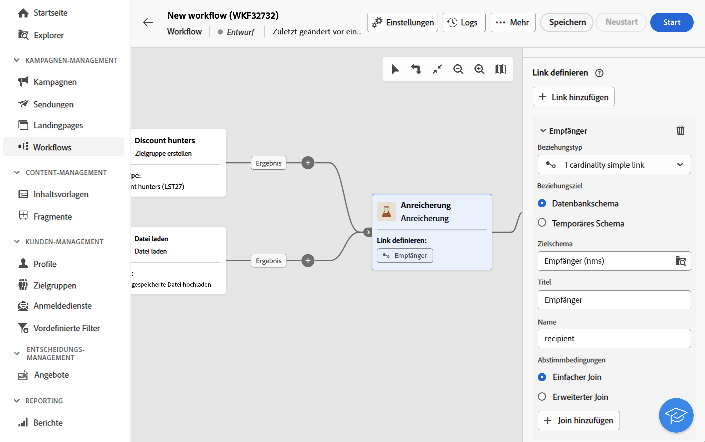

# Anreicherung {#enrichment}

>[!CONTEXTUALHELP]
>id="acw_orchestration_enrichment"
>title="Aktivität „Anreicherung“"
>abstract="Die Aktivität **Anreicherung** ermöglicht es Ihnen, die Zielgruppendaten um zusätzliche Informationen aus der Datenbank zu erweitern. Sie wird in einem Workflow häufig nach den Segmentierungsaktivitäten verwendet."

>[!CONTEXTUALHELP]
>id="acw_orchestration_enrichment_data"
>title="Aktivität „Anreicherung“"
>abstract="Nachdem Anreicherungsdaten zum Workflow hinzugefügt wurden, können sie in den Aktivitäten verwendet werden, die nach der Aktivität „Anreicherung“ hinzugefügt wurden, um Kundinnen und Kunden basierend auf ihren Verhaltensweisen, Voreinstellungen und Anforderungen in verschiedene Gruppen zu unterteilen oder um personalisierte Marketing-Nachrichten und -Kampagnen zu erstellen, die Ihre Zielgruppe mit größerer Wahrscheinlichkeit ansprechen."

>[!CONTEXTUALHELP]
>id="acw_orchestration_enrichment_simplejoin"
>title="Definition der Relation"
>abstract="Erstellen Sie eine Verknüpfung zwischen den Daten der Arbeitstabelle und der Adobe Campaign-Datenbank. Wenn Sie beispielsweise Daten aus einer Datei laden, die die Kundennummer, das Land und die E-Mail-Adresse der Empfängerinnen und Empfänger enthält, ist die Erzeugung einer Relation zur Ländertabelle erforderlich, um die entsprechende Information im Empfängerprofil zu aktualisieren."

>[!CONTEXTUALHELP]
>id="acw_orchestration_enrichment_reconciliation"
>title="Abstimmung der Anreicherung"
>abstract="Abstimmung der Anreicherung"

>[!CONTEXTUALHELP]
>id="acw_targetdata_personalization_enrichmentdata"
>title="Anreicherungsdaten"
>abstract="Wählen Sie die zur Anreicherung Ihres Workflows zu verwendenden Daten aus. Sie können zwei Arten von Anreicherungsdaten auswählen: ein einzelnes Anreicherungsattribut aus der Zieldimension oder eine Sammlungsrelation, bei der es sich um eine Verknüpfung mit einer 1:n-Kardinalität zwischen Tabellen handelt."

Die Aktivität der **Anreicherung** ist eine **Zielgruppenbestimmungs-Aktivität**. Sie ermöglicht Ihnen, die Zielgruppendaten um zusätzliche Informationen aus der Datenbank zu erweitern. Sie wird in einem Workflow häufig nach den Segmentierungsaktivitäten verwendet.

Anreicherungsdaten können verschiedene Ursprünge haben:

* **Aus derselben Arbeitstabelle** wie die Zielgruppe in Ihrem Workflow:

  *Bestimmung einer Kundenzielgruppe und Hinzufügen des Felds „Geburtsdatum“ zur aktuellen Arbeitstabelle*

* **Aus einer anderen Arbeitstabelle**:

  *Zielgruppenbestimmung einer Kundengruppe und Hinzufügen der Felder „Betrag“ und „Produkttyp“ aus der „Kauf“-Tabelle*.

Nachdem die Anreicherungsdaten zum Workflow hinzugefügt wurden, können sie in den Aktivitäten verwendet werden, die im Anschluss an die Aktivität **Anreicherung** hinzugefügt wurden, um Kundinnen und Kunden basierend auf ihren Verhaltensweisen, Vorlieben und Bedürfnissen in verschiedene Gruppen zu unterteilen oder um personalisierte Marketing-Nachrichten und -Kampagnen zu erstellen, die Ihre Zielgruppe mit größerer Wahrscheinlichkeit ansprechen.

Sie können beispielsweise der Workflow-Arbeitstabelle Informationen zu Käufen von Kundinnen und Kunden hinzufügen und diese Daten verwenden, um E-Mails mit ihrem neuesten Kauf oder dem für diese Käufe ausgegebenen Betrag zu personalisieren.

## Hinzufügen einer Anreicherungsaktivität {#enrichment-configuration}

Führen Sie die folgenden Schritte aus, um die Aktivität **Anreicherung** zu konfigurieren:

1. Fügen Sie Aktivitäten wie **Zielgruppe erstellen** und **Kombinieren** hinzu.
1. Fügen Sie eine Aktivität vom Typ **Anreicherung** hinzu.
1. Wenn in Ihrem Workflow mehrere Transitionen konfiguriert wurden, können Sie das Feld **[!UICONTROL Hauptmenge]** verwenden, um festzulegen, welche Transition als Hauptmenge für die Anreicherung mit Daten verwendet werden soll.

## Hinzufügen von Anreicherungsdaten {#enrichment-add}

1. Klicken Sie auf **Anreicherungsdaten hinzufügen** und wählen Sie das Attribut zur Datenanreicherung aus.

   Sie können zwei Arten von Anreicherungsdaten auswählen: ein einzelnes Anreicherungsattribut aus der Zielgruppendimension oder eine Sammlungsrelation. Jeder dieser Typen wird in den Beispielen unten detailliert beschrieben:
   * [Einzelnes Anreicherungsattribut](#single-attribute)
   * [Sammlungsrelation](#collection-link)

   >[!NOTE]
   >
   >Über die **Schaltfläche „Ausdruck bearbeiten“** im Attributauswahl-Bildschirm können Sie erweiterte Ausdrücke zur Attributauswahl erstellen. [Erfahren Sie mehr über die Arbeit mit dem Ausdruckseditor](../../query/expression-editor.md)

   

## Erstellen von Relationen zwischen Tabellen {#create-links}

>[!CONTEXTUALHELP]
>id="acw_homepage_welcome_rn3"
>title="Relationen zwischen Tabellen"
>abstract="Jetzt können Sie in der Workflow-Anreicherungsaktivität eine Relation zwischen den Daten der Arbeitstabelle und der Adobe Campaign-Datenbank erstellen."
>additional-url="https://experienceleague.adobe.com/docs/campaign-web/v8/release-notes/release-notes.html?lang=de" text="Siehe Versionshinweise"

Der Abschnitt **[!UICONTROL Relationsdefinition]** dient der Erzeugung einer Relation zwischen den Daten der Arbeitstabelle und der Adobe Campaign-Datenbank. Wenn Sie beispielsweise Daten aus einer Datei laden, die die Kundennummer, das Land und die E-Mail-Adresse der Empfängerinnen und Empfänger enthält, ist die Erzeugung einer Relation zur Ländertabelle erforderlich, um die entsprechende Information im Empfängerprofil zu aktualisieren.

Es stehen verschiedene Relationstypen zur Verfügung:

* **[!UICONTROL Einfache Relation mit Kardinalität 1]**: Jeder Eintrag aus der Hauptmenge kann genau einem Eintrag aus den verknüpften Daten zugeordnet werden.
* **[!UICONTROL Einfache Relation mit Kardinalität 0 oder 1]**: Jeder Eintrag der Hauptmenge kann 0 oder maximal 1 Eintrag der verknüpften Menge zugeordnet werden.
* **[!UICONTROL Sammlungsrelation mit Kardinalität N]**: Jeder Eintrag aus der Hauptmenge kann 0, 1 oder mehr (N) Einträgen der verknüpften Daten zugeordnet werden.

Gehen Sie wie folgt vor, um eine Relation zu erzeugen:

1. Klicken Sie im Abschnitt **[!UICONTROL Relationsdefinition]** auf die Schaltfläche **[!UICONTROL Relation hinzufügen]** .

   

1. Wählen Sie in der Dropdown-Liste **Relationstyp** den Relationstyp aus, den Sie erzeugen möchten.

1. Bestimmen Sie die Zielgruppe, die Sie mit der Hauptmenge verknüpfen möchten:

   * Um eine vorhandene Tabelle in der Datenbank zu verknüpfen, wählen Sie **[!UICONTROL Datenbankschema]** aus und wählen Sie dann aus dem Feld **[!UICONTROL Zielschema]** die gewünschte Tabelle aus.
   * Um eine Relation mit Daten aus der eingehenden Transition herzustellen, wählen Sie **Temporäres Schema** und dann die Transition aus, deren Daten Sie verwenden möchten.

1. Definieren Sie die Abstimmkriterien, um die Daten der Hauptmenge mit dem verknüpften Schema abzustimmen. Es gibt zwei Arten von Joins:

   * **Einfacher Join**: Wählen Sie ein bestimmtes Attribut aus, um die Daten aus den beiden Schemata abzugleichen. Klicken Sie auf **Join hinzufügen** und wählen Sie die Attribute **Quelle** und **Ziel** aus, die als Abstimmkriterien verwendet werden.
   * **Erweiterter Join**: Erstellen Sie einen Join mit erweiterten Bedingungen. Klicken Sie auf **Join hinzufügen** und klicken Sie auf die Schaltfläche **Bedingung erstellen**, um den Abfrage-Modeler zu öffnen.

Ein Workflow-Beispiel mit Relationen ist im Abschnitt [Beispiele](#link-example) verfügbar.

## Beispiele {#example}

### Einzelnes Anreicherungsattribut {#single-attribute}

Hier fügen wir nur ein einziges Anreicherungsattribut hinzu, z. B. das Geburtsdatum. Führen Sie folgende Schritte aus:

1. Klicken Sie in das Feld **Attribut**.
1. Wählen Sie ein einfaches Feld aus der Zielgruppendimension aus, in unserem Beispiel das Geburtsdatum.
1. Klicken Sie auf **Bestätigen**.

### Sammlungsrelation {#collection-link}

In diesem komplexeren Anwendungsfall wählen wir eine Sammlungsrelation aus, die eine Verknüpfung mit einer Kardinalität von 1:n zwischen Tabellen darstellt. Rufen wir die drei neuesten Käufe ab, die weniger als 100 € betragen. Dazu müssen Sie Folgendes definieren:

* ein Anreicherungsattribut: das Feld **Gesamtbetrag**
* die Anzahl der abzurufenden Zeilen: 3
* einen Filter: Elemente herausfiltern, die über 100 € liegen
* eine Sortierung: absteigende Sortierung nach dem Feld **Bestelldatum**.

#### Fügen Sie das Attribut hinzu. {#add-attribute}

Hier wählen Sie die Sammlungsrelation aus, um sie als Anreicherungsdaten zu verwenden.

1. Klicken Sie in das Feld **Attribut**.
1. Klicken Sie auf **Erweiterte Attribute anzeigen**.
1. Wählen Sie das Feld **Gesamtbetrag** aus der Tabelle **Käufe**.

#### Definieren Sie die Sammlungseinstellungen.{#collection-settings}

Definieren Sie dann, wie die Daten erfasst werden und wie viele Einträge abgerufen werden sollen.

1. Wählen Sie **Daten erfassen** in der Dropdown-Liste **Auswählen, wie die Daten erfasst werden**.
1. Geben Sie „3“ in das Feld **Abzurufende Zeilen (zu erstellende Spalten)** ein.

Wenn Sie beispielsweise die durchschnittliche Anzahl der Käufe für eine Person abrufen möchten, wählen Sie stattdessen **Aggregierte Daten** und wählen Sie **Durchschnitt** in der Dropdown-Liste **Aggregatfunktion**.

#### Definieren von Filtern{#collection-filters}

Hier definieren wir den Maximalwert für das Anreicherungsattribut. Wir filtern Elemente mit einem Preis von mehr als 100 USD heraus. [Erfahren Sie mehr über die Arbeit mit dem Abfrage-Modeler](../../query/query-modeler-overview.md)

1. Klicken Sie auf **Filter bearbeiten**.
1. Fügen Sie die beiden folgenden Filter hinzu: **Gesamtbetrag** vorhanden UND **Gesamtbetrag** ist kleiner als 100. Der erste filtert NULL-Werte, da sie als größter Wert erscheinen würden.
1. Klicken Sie auf **Bestätigen**.

#### Definieren der Sortierung{#collection-sorting}

Jetzt müssen wir eine Sortierung anwenden, um die drei **letzten** Käufe abzurufen.

1. Aktivieren Sie die Option **Sortierung aktivieren**.
1. Klicken Sie in das Feld **Attribut**.
1. Wählen Sie das Feld **Bestelldatum**.
1. Klicken Sie auf **Bestätigen**.
1. Wählen Sie **Absteigend** aus der Dropdown-Liste **Sortieren**.

### Anreicherung mit in Relation stehenden Daten {#link-example}

Das folgende Beispiel zeigt einen Workflow, der konfiguriert wurde, um eine Relation zwischen zwei Transitionen zu erstellen. Die ersten Transitionen enthalten eine Aktivität zur Abfrage von Profildaten einer Zielgruppe, während die zweite Transition Kaufdaten enthält, die in einer Datei gespeichert sind, welche über die Aktivität „Datei laden“ geladen wurde.

* Die erste **Anreicherungsaktivität** verknüpft unsere Hauptmenge (Daten aus der **Abfrageaktivität**) mit dem Schema aus der Aktivität **Datei laden**. Dadurch können wir jedes Profil, das zur Zielgruppe der Abfrage gehört, mit den entsprechenden Kaufdaten abgleichen.
* Eine zweite **Anreicherungsaktivität** wird hinzugefügt, um die Daten aus der Workflow-Tabelle mit den Kaufdaten aus der Aktivität **Datei laden** anzureichern. Auf diese Weise können wir diese Daten in weiteren Aktivitäten verwenden, um beispielsweise die an die Kundinnen und Kunden gesendeten Nachrichten mit Informationen zum Kauf zu personalisieren.

  

<!--

Add other fields
use it in delivery

cardinality between the tables (1-N)
1. select attribute to use as enrichment data

    display advanced fields option
    i button

    note: attributes from the target dimension

1. Select how the data is collected
1. number of records to retrieve if want to retrieve a collection of multiple records
1. Apply filters and build rule

    select an existing filter
    save the filter for reuse
    view results of the filter visually or in code view

1. sort records using an attribute

leverage enrichment data in campaign

where we can use the enrichment data: personalize email, other use cases?

## Example

-->
