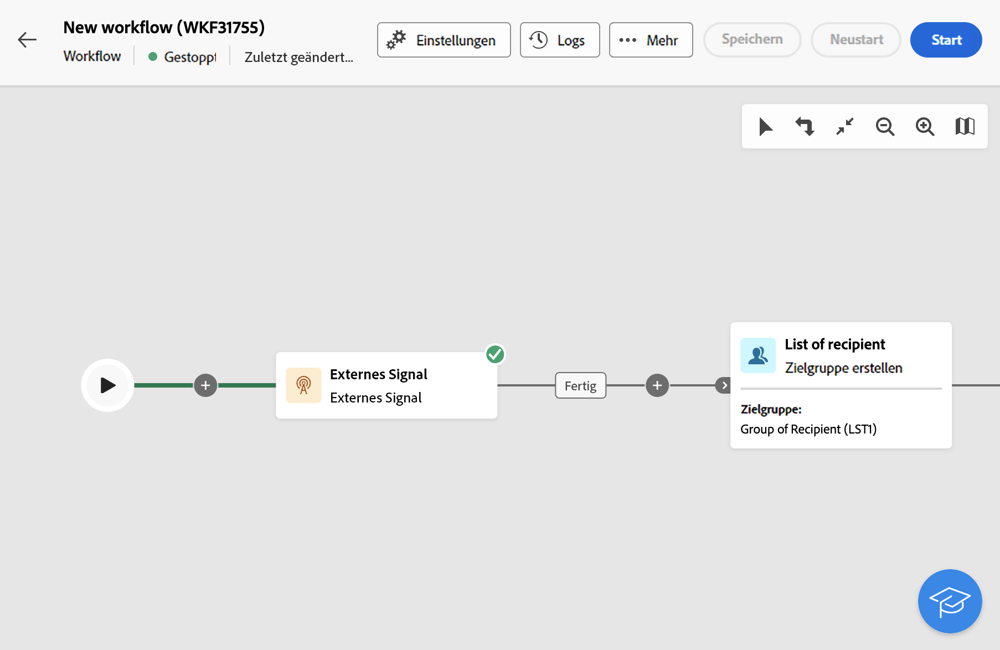
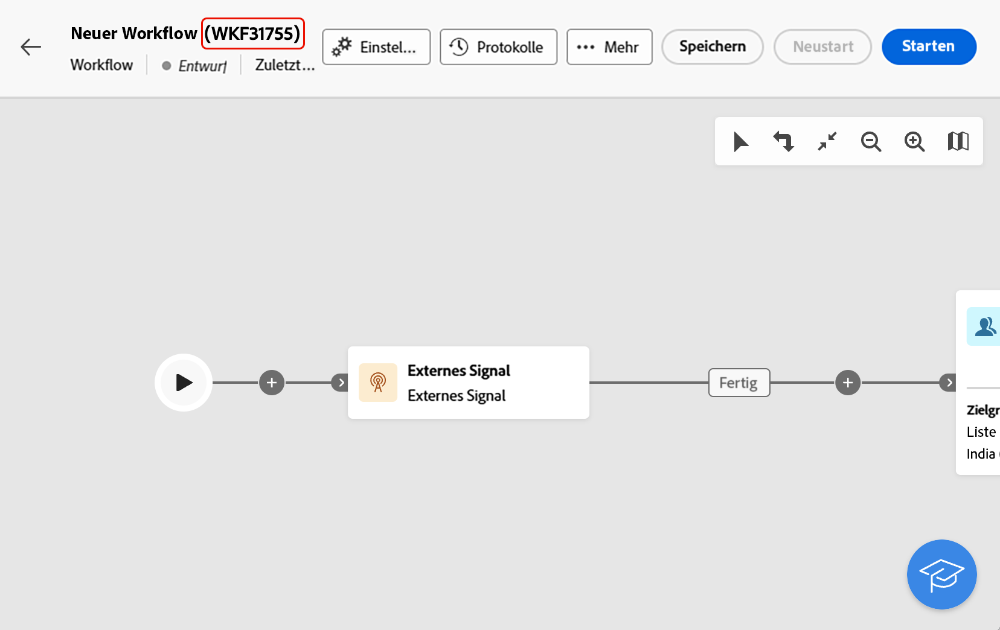
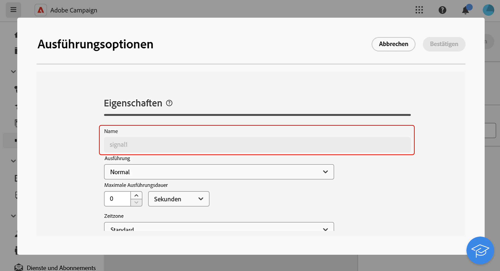
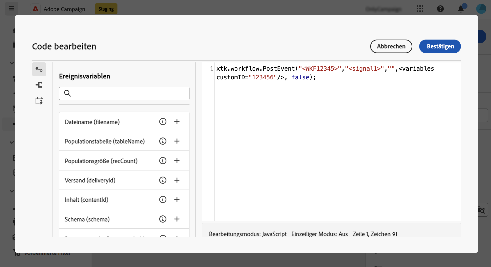

# Externes Signal {#external-signal}

<!--External Signal End-->

>[!CONTEXTUALHELP]
>id="acw_orchestration_externalsignal"
>title="Externes Signal"
>abstract="Mit der Aktivität **Externes Signal** können Sie die Ausführung eines Workflows über einen anderen Workflow oder einen API-Aufruf auslösen."

>[!CONTEXTUALHELP]
>id="acw_orchestration_externalsignal_parameters"
>title="Parameter von externen Signalen"
>abstract="Parameter von externen Signalen"

>[!CONTEXTUALHELP]
>id="acw_orchestration_end_trigger"
>title="Trigger für Ende"
>abstract="Trigger für Ende"

Die Aktivität **Externes Signal** ist eine Aktivität zur **Flusskontrolle**. Damit können Sie die Ausführung eines Workflows über einen anderen Workflow oder durch einen API-Aufruf auslösen.

>[!NOTE]
>
>Diese Seite enthält die wichtigsten Schritte zum Konfigurieren der Aktivität **[!UICONTROL Externes Signal]** in der Web-Benutzeroberfläche von Campaign und erklärt, wie diese über einen anderen Workflow oder durch einen API-Aufruf ausgelöst wird. Detaillierte Informationen zum Auslösen eines Workflows und den Best Practices dabei sowie zur Arbeit mit Campaign-APIs finden Sie in der [Dokumentation zu Campaign v8 (Client-Konsole)](https://experienceleague.adobe.com/de/docs/campaign/automation/workflows/advanced-management/javascript-in-workflows#trigger-example)

Führen Sie die folgenden Schritte aus, um die Aktivität **Externes Signal** zu konfigurieren und deren Ausführung auszulösen:

1. Fügen Sie die Aktivität **Externes Signal** in Ihren Workflow ein.

1. Schließen Sie die Konfiguration Ihres Workflows ab und starten Sie dessen Ausführung. Die Aktivität **[!UICONTROL Externes Signal]** wird als „Ausstehend“ angezeigt und wartet darauf, ausgelöst zu werden.

   

1. Rufen Sie die folgenden Informationen ab:

   * Den **internen Namen des Workflows**, der neben dem Titel angezeigt wird.

     +++Beispiel anzeigen

     

+++

   * Den **Namen der Aktivität „Externes Signal“**, der in den **[!UICONTROL Ausführungsoptionen]** des Workflows angezeigt wird.

     +++Beispiel anzeigen

     

+++

1. Zum Auslösen des Workflows müssen Sie die JavaScript-Funktion `PostEvent` auslösen. Mit dieser Funktion können Sie Variablen mit den Werten Ihrer Wahl übergeben und im ausgelösten Workflow nutzen.

   Die `PostEvent`-Funktion kann entweder über einen anderen Workflow oder durch einen API-Aufruf ausgeführt werden.

   * Um die Aktivität **[!UICONTROL Externes Signal]** über einen Workflow auszuführen, führen Sie die PostEvent-Funktion über den Bereich **[!UICONTROL Initialisierungsscript]** aus, auf den Sie über die **[!UICONTROL Ausführungsoptionen]** der Aktivität zugreifen können. Führen Sie für die **[!UICONTROL JavaScript-Code]**-Aktivität die Funktion aus dem Skript der Aktivität aus.

     Die Syntax sieht folgendermaßen aus:

     ```
     xtk.workflow.PostEvent("<workflow-internal-name>","<signal-activity-name>","",<variables <variable-name>="<value>"/>, false);
     ```

   +++Beispiel anzeigen

   In diesem Beispiel lösen wir die externe Signalaktivität „Signal1“ aus, die dem Workflow hinzugefügt wurde, dessen interner Name „WKF12345“ lautet. Wir übergeben außerdem eine Variable mit dem Namen „customID“ und dem Wert „123456“.

   

+++

   * Um die Aktivität **[!UICONTROL Externes Signal]** über einen API-Aufruf auszuführen, befolgen Sie die in der Dokumentation zu Campaign-APIs beschriebenen Schritte. [Informationen dazu, wie Sie die statische `PostEvent`-Methode verwenden](https://experienceleague.adobe.com/developer/campaign-api/api/sm-workflow-PostEvent.html?lang=de)
