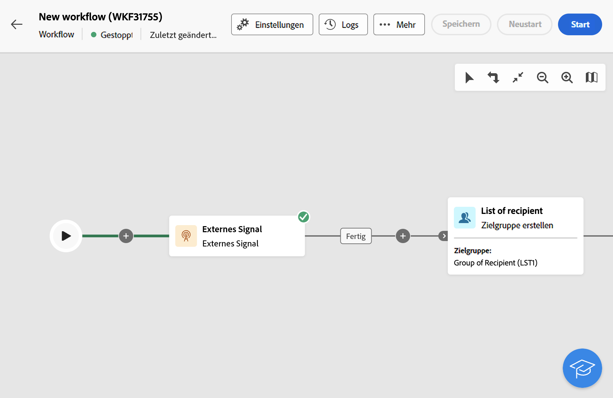
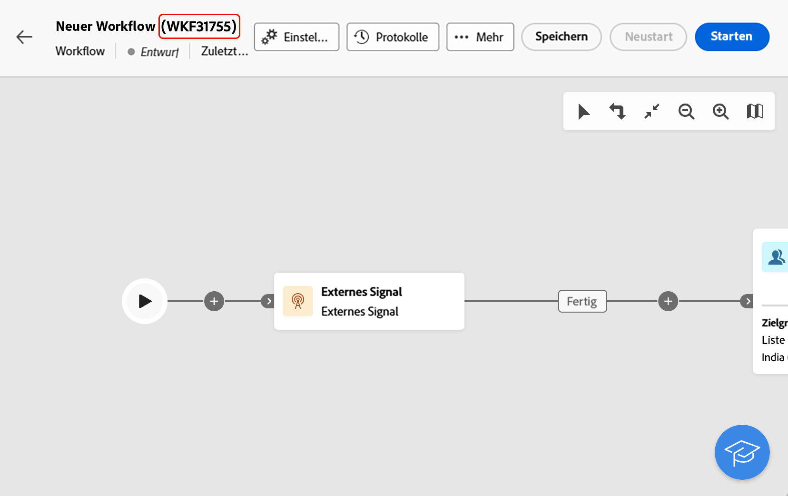
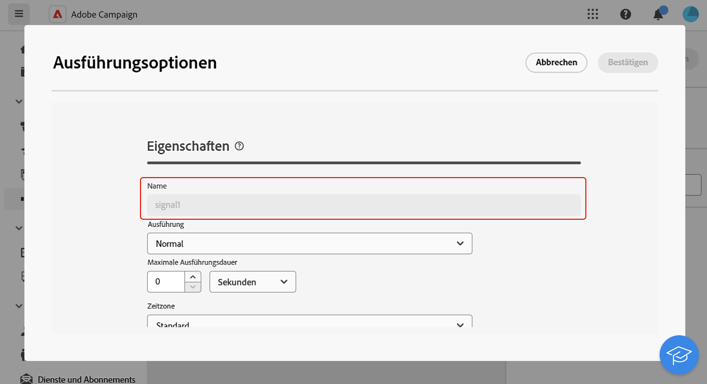
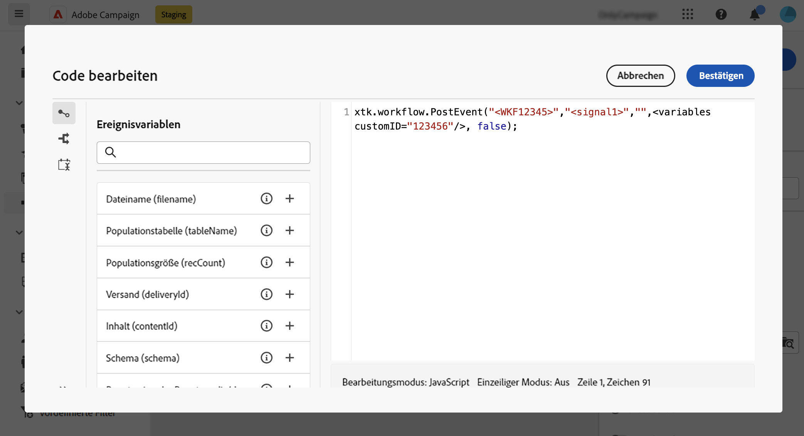

<?xml version="1.0" encoding="UTF-8"?>
<xliff xmlns="urn:oasis:names:tc:xliff:document:1.2" xmlns:okp="okapi-framework:xliff-extensions" xmlns:its="http://www.w3.org/2005/11/its" xmlns:itsxlf="http://www.w3.org/ns/its-xliff/" version="1.2" its:version="2.0">
<file original="help/v8/workflows/activities/external-signal.md.mdsc" source-language="en-US" target-language="en-XX" datatype="x-text/markdown">
<body>
<trans-unit id="tu13" xml:space="preserve">
<source xml:lang="en-US">https://experienceleague.adobe.com/en/docs/campaign/automation/workflows/advanced-management/javascript-in-workflows#trigger-example</source>
<target xml:lang="en-XX">https://experienceleague.adobe.com/de/docs/campaign/automation/workflows/advanced-management/javascript-in-workflows#trigger-example</target>
</trans-unit>
<trans-unit id="tu33" xml:space="preserve">
<source xml:lang="en-US">https://experienceleague.adobe.com/en/tools/campaign-api</source>
<target xml:lang="en-XX">https://experienceleague.adobe.com/de/tools/campaign-api</target>
</trans-unit>
<trans-unit id="tu1" restype="x-YAML_METADATA_HEADER_VALUE" xml:space="preserve">
<source xml:lang="en-US">Use the External signal activity</source>
<target xml:lang="en-XX">Verwenden der Aktivität „Externes Signal“</target>
</trans-unit>
<trans-unit id="tu2" restype="x-YAML_METADATA_HEADER_VALUE" xml:space="preserve">
<source xml:lang="en-US">Learn how to use the External signal workflow activity</source>
<target xml:lang="en-XX">Informationen dazu, wie Sie die Workflow-Aktivität „Externes Signal“ verwenden</target>
</trans-unit>
<trans-unit id="tu3" xml:space="preserve">
<source xml:lang="en-US">External signal</source>
<target xml:lang="en-XX">Externes Signal</target>
</trans-unit>
<trans-unit id="tu4" xml:space="preserve">
<source xml:lang="en-US">External Signal</source>
<target xml:lang="en-XX">Externes Signal</target>
</trans-unit>
<trans-unit id="tu5" xml:space="preserve">
<source xml:lang="en-US">The <ph id="1" ctype="x-STRONG_EMPHASIS">**</ph>External signal<ph id="2" ctype="x-STRONG_EMPHASIS">**</ph> activity lets you trigger the execution of a workflow from another workflow or an API call.</source>
<target xml:lang="en-XX">Mit der Aktivität <ph id="1" ctype="x-STRONG_EMPHASIS">**</ph>Externes Signal<ph id="2" ctype="x-STRONG_EMPHASIS">**</ph> können Sie die Ausführung eines Workflows über einen anderen Workflow oder einen API-Aufruf auslösen.</target>
</trans-unit>
<trans-unit id="tu6" xml:space="preserve">
<source xml:lang="en-US">External Signal Parameters</source>
<target xml:lang="en-XX">Parameter von externen Signalen</target>
</trans-unit>
<trans-unit id="tu7" xml:space="preserve">
<source xml:lang="en-US">External Signal Parameters</source>
<target xml:lang="en-XX">Parameter von externen Signalen</target>
</trans-unit>
<trans-unit id="tu8" xml:space="preserve">
<source xml:lang="en-US">End triggers</source>
<target xml:lang="en-XX">Trigger für Ende</target>
</trans-unit>
<trans-unit id="tu9" xml:space="preserve">
<source xml:lang="en-US">End triggers</source>
<target xml:lang="en-XX">Trigger für Ende</target>
</trans-unit>
<trans-unit id="tu10" xml:space="preserve">
<source xml:lang="en-US">The <ph id="1" ctype="x-STRONG_EMPHASIS">**</ph>External signal<ph id="2" ctype="x-STRONG_EMPHASIS">**</ph> activity is a <ph id="3" ctype="x-STRONG_EMPHASIS">**</ph>Flow control<ph id="4" ctype="x-STRONG_EMPHASIS">**</ph> activity. It lets you trigger the execution of a workflow from another workflow or an API call.</source>
<target xml:lang="en-XX">Die Aktivität <ph id="1" ctype="x-STRONG_EMPHASIS">**</ph>Externes Signal<ph id="2" ctype="x-STRONG_EMPHASIS">**</ph> ist eine Aktivität zur <ph id="3" ctype="x-STRONG_EMPHASIS">**</ph>Flusskontrolle<ph id="4" ctype="x-STRONG_EMPHASIS">**</ph>. Damit können Sie die Ausführung eines Workflows über einen anderen Workflow oder durch einen API-Aufruf auslösen.</target>
</trans-unit>
<trans-unit id="tu11" xml:space="preserve">
<source xml:lang="en-US"><ph id="1" ctype="x-regxph" equiv-text="&lbrack;!NOTE">[!NOTE]</ph></source>
<target xml:lang="en-XX"><ph id="1" ctype="x-regxph" equiv-text="&lbrack;!NOTE">[!NOTE]</ph></target>
</trans-unit>
<trans-unit id="tu12" xml:space="preserve">
<source xml:lang="en-US">This page explains the main steps to configure an <ph id="1" ctype="x-STRONG_EMPHASIS">**[!UICONTROL </ph>External Signal<ph id="3" ctype="x-LINK_REF">]**</ph> activity in Campaign Web User Interface and trigger it from another workflow or an API call. Detailed information on how to trigger a workflow, best practices, and how to work with Campaign APIs is available in the <ph id="5" ctype="x-LINK">&lbrack;</ph>Campaign v8 (client console) documentation<ph id="6" ctype="x-LINK">[#$tu13]</ph>.</source>
<target xml:lang="en-XX">Diese Seite erläutert die wichtigsten Schritte zum Konfigurieren der Aktivität <ph id="1" ctype="x-STRONG_EMPHASIS">**[!UICONTROL </ph>Externes Signal<ph id="3" ctype="x-LINK_REF">]**</ph> in der Campaign Web-Benutzeroberfläche und wie diese über einen anderen Workflow oder durch einen API-Aufruf ausgelöst wird. Detaillierte Informationen zum Auslösen eines Workflows und den Best Practices dabei sowie zur Arbeit mit Campaign-APIs finden Sie in der <ph id="5" ctype="x-LINK">&lbrack;</ph>Dokumentation zu Campaign v8 (Client-Konsole)<ph id="6" ctype="x-LINK">[#$tu13]</ph>.</target>
</trans-unit>
<trans-unit id="tu14" xml:space="preserve">
<source xml:lang="en-US">Follow these steps to configure the <ph id="1" ctype="x-STRONG_EMPHASIS">**</ph>External signal<ph id="2" ctype="x-STRONG_EMPHASIS">**</ph> activity and trigger its execution:</source>
<target xml:lang="en-XX">Führen Sie die folgenden Schritte aus, um die Aktivität <ph id="1" ctype="x-STRONG_EMPHASIS">**</ph>Externes Signal<ph id="2" ctype="x-STRONG_EMPHASIS">**</ph> zu konfigurieren und deren Ausführung auszulösen:</target>
</trans-unit>
<trans-unit id="tu15" xml:space="preserve">
<source xml:lang="en-US">Add an <ph id="1" ctype="x-STRONG_EMPHASIS">**</ph>External signal<ph id="2" ctype="x-STRONG_EMPHASIS">**</ph> activity into your workflow.</source>
<target xml:lang="en-XX">Fügen Sie die Aktivität <ph id="1" ctype="x-STRONG_EMPHASIS">**</ph>Externes Signal<ph id="2" ctype="x-STRONG_EMPHASIS">**</ph> in Ihren Workflow ein.</target>
</trans-unit>
<trans-unit id="tu16" xml:space="preserve">
<source xml:lang="en-US">Complete the configuration of your workflow, and start its execution. The <ph id="1" ctype="x-STRONG_EMPHASIS">**[!UICONTROL </ph>External Signal<ph id="3" ctype="x-LINK_REF">]**</ph> activity displays as "Pending," waiting to be triggered.</source>
<target xml:lang="en-XX">Schließen Sie die Konfiguration Ihres Workflows ab und starten Sie dessen Ausführung. Die Aktivität <ph id="1" ctype="x-STRONG_EMPHASIS">**[!UICONTROL </ph>Externes Signal<ph id="3" ctype="x-LINK_REF">]**</ph> wird als „Ausstehend“ angezeigt und wartet darauf, ausgelöst zu werden.</target>
</trans-unit>
<trans-unit id="tu17" xml:space="preserve">
<source xml:lang="en-US"><ph id="1" ctype="x-IMAGE"></ph></source>
<target xml:lang="en-XX"><ph id="1" ctype="x-IMAGE"></ph></target>
</trans-unit>
<trans-unit id="tu18" xml:space="preserve">
<source xml:lang="en-US">Retrieve the following information:</source>
<target xml:lang="en-XX">Rufen Sie die folgenden Angaben ab:</target>
</trans-unit>
<trans-unit id="tu19" xml:space="preserve">
<source xml:lang="en-US">The <ph id="1" ctype="x-STRONG_EMPHASIS">**</ph>workflow's internal name<ph id="2" ctype="x-STRONG_EMPHASIS">**</ph>, which displays next to its label.</source>
<target xml:lang="en-XX">Den <ph id="1" ctype="x-STRONG_EMPHASIS">**</ph>internen Namen des Workflows<ph id="2" ctype="x-STRONG_EMPHASIS">**</ph>, der neben dem Titel angezeigt wird.</target>
</trans-unit>
<trans-unit id="tu20" xml:space="preserve">
<source xml:lang="en-US">View example</source>
<target xml:lang="en-XX">Beispiel anzeigen</target>
</trans-unit>
<trans-unit id="tu21" xml:space="preserve">
<source xml:lang="en-US"><ph id="1" ctype="x-IMAGE"></ph></source>
<target xml:lang="en-XX"><ph id="1" ctype="x-IMAGE"></ph></target>
</trans-unit>
<trans-unit id="tu22" xml:space="preserve">
<source xml:lang="en-US">The <ph id="1" ctype="x-STRONG_EMPHASIS">**</ph>External signal activity's name<ph id="2" ctype="x-STRONG_EMPHASIS">**</ph>, which displays in the workflow's <ph id="3" ctype="x-STRONG_EMPHASIS">**[!UICONTROL </ph>Execution options<ph id="5" ctype="x-LINK_REF">]**</ph>.</source>
<target xml:lang="en-XX">Den <ph id="1" ctype="x-STRONG_EMPHASIS">**</ph>Namen der Aktivität „Externes Signal“<ph id="2" ctype="x-STRONG_EMPHASIS">**</ph>, der in den <ph id="3" ctype="x-STRONG_EMPHASIS">**[!UICONTROL </ph>Ausführungsoptionen<ph id="5" ctype="x-LINK_REF">]**</ph> des Workflows angezeigt wird.</target>
</trans-unit>
<trans-unit id="tu23" xml:space="preserve">
<source xml:lang="en-US">View example</source>
<target xml:lang="en-XX">Beispiel anzeigen</target>
</trans-unit>
<trans-unit id="tu24" xml:space="preserve">
<source xml:lang="en-US"><ph id="1" ctype="x-IMAGE"></ph></source>
<target xml:lang="en-XX"><ph id="1" ctype="x-IMAGE"></ph></target>
</trans-unit>
<trans-unit id="tu25" xml:space="preserve">
<source xml:lang="en-US">To trigger the workflow, execute the <ph id="1" ctype="x-CODE">`PostEvent`</ph> JavaScript function. This function lets you pass variables with the values of your choice and use them in the triggered workflow.</source>
<target xml:lang="en-XX">Führen Sie zum Auslösen des Workflows die JavaScript-Funktion <ph id="1" ctype="x-CODE">`PostEvent`</ph> aus. Mit dieser Funktion können Sie Variablen mit den Werten Ihrer Wahl übergeben und im ausgelösten Workflow nutzen.</target>
</trans-unit>
<trans-unit id="tu26" xml:space="preserve">
<source xml:lang="en-US">The <ph id="1" ctype="x-CODE">`PostEvent`</ph> function can be executed either from another workflow or from an API call.</source>
<target xml:lang="en-XX">Die <ph id="1" ctype="x-CODE">`PostEvent`</ph>-Funktion kann entweder über einen anderen Workflow oder durch einen API-Aufruf ausgeführt werden.</target>
</trans-unit>
<trans-unit id="tu27" xml:space="preserve">
<source xml:lang="en-US">To trigger an <ph id="1" ctype="x-STRONG_EMPHASIS">**[!UICONTROL </ph>External signal<ph id="3" ctype="x-LINK_REF">]**</ph> activity from a workflow, execute the PostEvent function from the <ph id="5" ctype="x-STRONG_EMPHASIS">**[!UICONTROL </ph>Initialization script<ph id="7" ctype="x-LINK_REF">]**</ph> pane, accessible from the activity's <ph id="9" ctype="x-STRONG_EMPHASIS">**[!UICONTROL </ph>Execution options<ph id="11" ctype="x-LINK_REF">]**</ph>. For the <ph id="13" ctype="x-STRONG_EMPHASIS">**[!UICONTROL </ph>JavaScript code<ph id="15" ctype="x-LINK_REF">]**</ph> activity, execute the function from the activity's script.</source>
<target xml:lang="en-XX">Um die Aktivität <ph id="1" ctype="x-STRONG_EMPHASIS">**[!UICONTROL </ph>Externes Signal<ph id="3" ctype="x-LINK_REF">]**</ph> über einen Workflow auszuführen, führen Sie die PostEvent-Funktion über den Bereich <ph id="5" ctype="x-STRONG_EMPHASIS">**[!UICONTROL </ph>Initialisierungsscript<ph id="7" ctype="x-LINK_REF">]**</ph> aus, auf den Sie über die <ph id="9" ctype="x-STRONG_EMPHASIS">**[!UICONTROL </ph>Ausführungsoptionen<ph id="11" ctype="x-LINK_REF">]**</ph> der Aktivität zugreifen können. Führen Sie für die <ph id="13" ctype="x-STRONG_EMPHASIS">**[!UICONTROL </ph>JavaScript-Code<ph id="15" ctype="x-LINK_REF">]**</ph>-Aktivität die Funktion aus dem Skript der Aktivität aus.</target>
</trans-unit>
<trans-unit id="tu28" xml:space="preserve">
<source xml:lang="en-US">The syntax is as follows:</source>
<target xml:lang="en-XX">Die Syntax sieht folgendermaßen aus:</target>
</trans-unit>
<trans-unit id="tu29" xml:space="preserve">
<source xml:lang="en-US">View example</source>
<target xml:lang="en-XX">Beispiel anzeigen</target>
</trans-unit>
<trans-unit id="tu30" xml:space="preserve">
<source xml:lang="en-US">In this example, the "signal1" External signal activity is triggered. It has been added to the workflow whose internal name is "WKF12345." A variable named "customID" is passed with the value "123456."</source>
<target xml:lang="en-XX">In diesem Beispiel wird die externe Signalaktivität „Signal1“ ausgelöst. Sie wurde dem Workflow hinzugefügt, dessen interner Name „WKF12345“ lautet. Es wird eine Variable mit dem Namen „customID“ und dem Wert „123456“ übergeben.</target>
</trans-unit>
<trans-unit id="tu31" xml:space="preserve">
<source xml:lang="en-US"><ph id="1" ctype="x-IMAGE"></ph></source>
<target xml:lang="en-XX"><ph id="1" ctype="x-IMAGE"></ph></target>
</trans-unit>
<trans-unit id="tu32" xml:space="preserve">
<source xml:lang="en-US">To trigger an <ph id="1" ctype="x-STRONG_EMPHASIS">**[!UICONTROL </ph>External signal<ph id="3" ctype="x-LINK_REF">]**</ph> activity from an API call, follow the steps detailed in the Campaign API documentation. <ph id="5" ctype="x-LINK">&lbrack;</ph>Learn how to use the static <ph id="6" ctype="x-CODE">`PostEvent`</ph> method<ph id="7" ctype="x-LINK">[#$tu33]</ph>.</source>
<target xml:lang="en-XX">Um die Aktivität <ph id="1" ctype="x-STRONG_EMPHASIS">**[!UICONTROL </ph>Externes Signal<ph id="3" ctype="x-LINK_REF">]**</ph> über einen API-Aufruf auszuführen, befolgen Sie die in der Dokumentation zu Campaign-APIs beschriebenen Schritte. <ph id="5" ctype="x-LINK">&lbrack;</ph>Erfahren Sie, wie Sie die statische <ph id="6" ctype="x-CODE">`PostEvent`</ph>-Methode verwenden<ph id="7" ctype="x-LINK">[#$tu33]</ph>.</target>
</trans-unit>
</body>
</file>
</xliff>