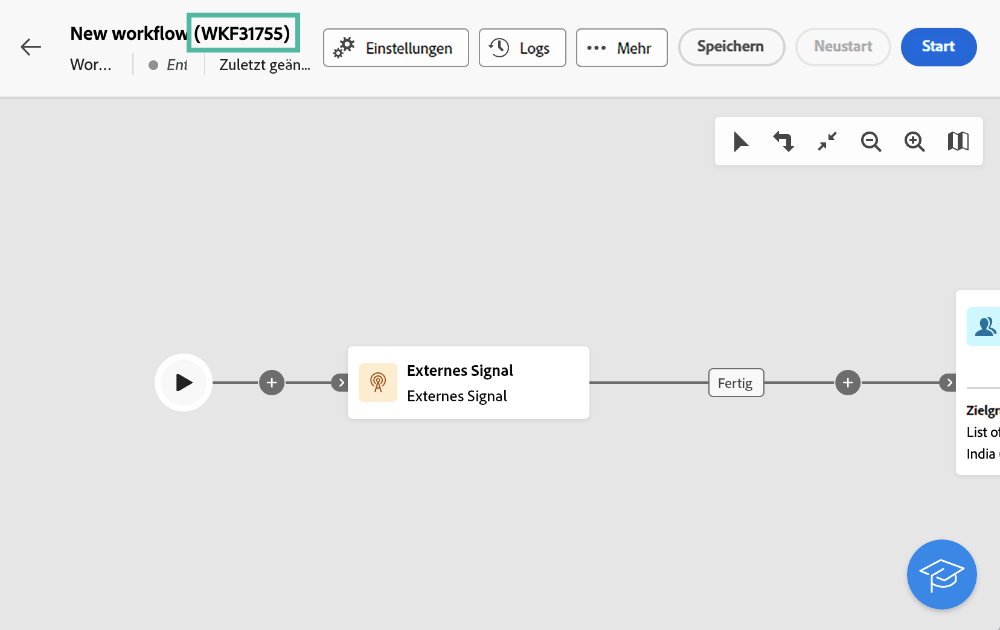
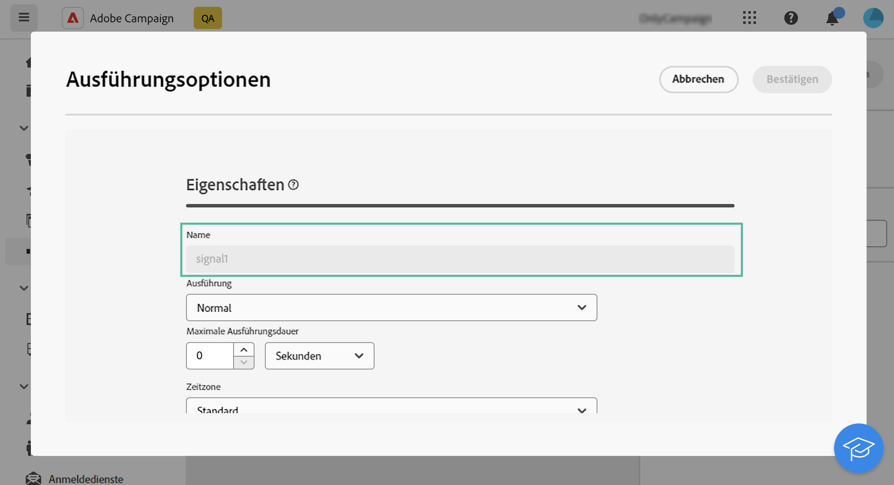

# Externes Signal {#external-signal}

<!--External Signal End-->

>[!CONTEXTUALHELP]
>id="acw_orchestration_externalsignal"
>title="Externes Signal"
>abstract="Die **Externes Signal** ermöglicht den Trigger der Ausführung eines Workflows über einen anderen Workflow oder einen API-Aufruf."

>[!CONTEXTUALHELP]
>id="acw_orchestration_externalsignal_parameters"
>title="Parameter von externen Signalen"
>abstract="Parameter von externen Signalen"

>[!CONTEXTUALHELP]
>id="acw_orchestration_end_trigger"
>title="Trigger für Ende"
>abstract="Trigger für Ende"

Die **Externes Signal** -Aktivität **Flusssteuerung** -Aktivität. Damit können Sie die Ausführung eines Workflows über einen anderen Workflow oder einen API-Aufruf Trigger.

>[!NOTE]
>
>Auf dieser Seite werden die wichtigsten Schritte zum Konfigurieren eines **[!UICONTROL Externes Signal]** -Aktivität in der Web-Benutzeroberfläche von Campaign und deren Trigger von einem anderen Workflow oder API-Aufruf aus. Detaillierte Informationen zum Trigger eines Workflows und zu Best Practices sowie zur Arbeit mit Campaign-APIs finden Sie im Abschnitt [Dokumentation zu Campaign v8 (Clientkonsole)](https://experienceleague.adobe.com/en/docs/campaign/automation/workflows/advanced-management/javascript-in-workflows#trigger-example)

Führen Sie die folgenden Schritte aus, um die **Externes Signal** Aktivität und Trigger der Ausführung:

1. Hinzufügen einer **Externes Signal** in Ihren Workflow ein.

1. Schließen Sie die Konfiguration Ihres Workflows ab und starten Sie die Ausführung. Die **[!UICONTROL Externes Signal]** -Aktivität wird als &quot;Ausstehend&quot;angezeigt und wartet darauf, ausgelöst zu werden.

   

1. Rufen Sie die folgenden Informationen ab:

   * Die **Interner Name des Workflows**, der neben der Beschriftung angezeigt wird.

     +++Anzeigen-Beispiel

     

+++

   * Die **Name der Aktivität &quot;Externes Signal&quot;**, der im Workflow-Fenster **[!UICONTROL Ausführungsoptionen]**.

     +++Anzeigen-Beispiel

     

+++

1. Um den Workflow Trigger, müssen Sie die `PostEvent` JavaScript-Funktion. Mit dieser Funktion können Sie Variablen mit den Werten Ihrer Wahl übergeben und im ausgelösten Workflow nutzen.

   Die `PostEvent` -Funktion kann entweder über einen anderen Workflow oder einen API-Aufruf ausgeführt werden.

   * Trigger eines **[!UICONTROL Externes Signal]** -Aktivität aus einem Workflow ausführen, führen Sie die PostEvent -Funktion aus der **[!UICONTROL Initialisierungsscript]** -Bereich, auf den über die **[!UICONTROL Ausführungsoptionen]**. Für **[!UICONTROL JavaScript-Code]** -Aktivität, führen Sie die -Funktion aus dem Skript der Aktivität aus.

     Die Syntax sieht folgendermaßen aus:

     ```
     xtk.workflow.PostEvent("<workflow-internal-name>","<signal-activity-name>","",<variables <variable-name>="<value>"/>, false);
     ```

   +++Anzeigen-Beispiel

   In diesem Beispiel lösen wir die Aktivität &quot;Signal1&quot; Externes Signal aus, die dem Workflow hinzugefügt wurde, dessen interner Name &quot;WKF12345&quot; lautet. Wir übergeben außerdem eine Variable mit dem Namen &quot;customID&quot;mit dem Wert &quot;123456&quot;.

   

+++

   * Trigger eines **[!UICONTROL Externes Signal]** -Aktivität über einen API-Aufruf ausführen, führen Sie die in der Campaign-API-Dokumentation beschriebenen Schritte aus. [Erfahren Sie, wie Sie den statischen `PostEvent` method](https://experienceleague.adobe.com/developer/campaign-api/api/sm-workflow-PostEvent.html?lang=de)
