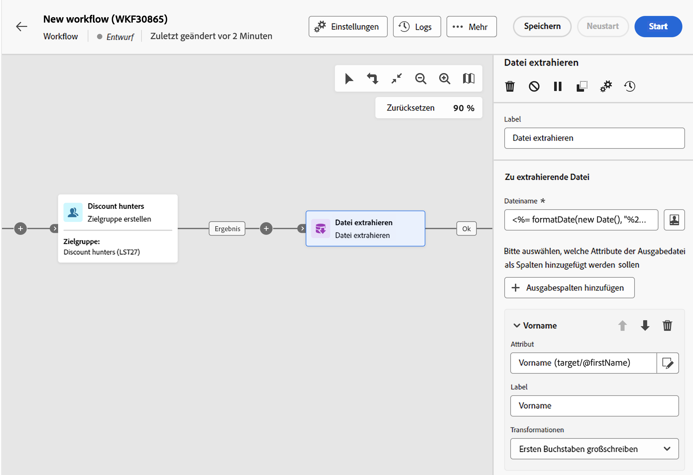
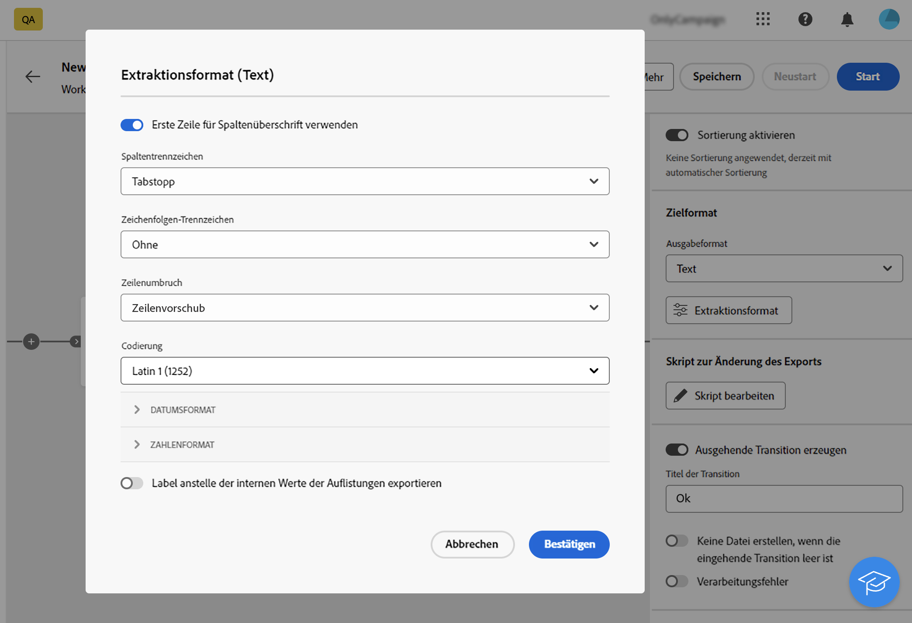
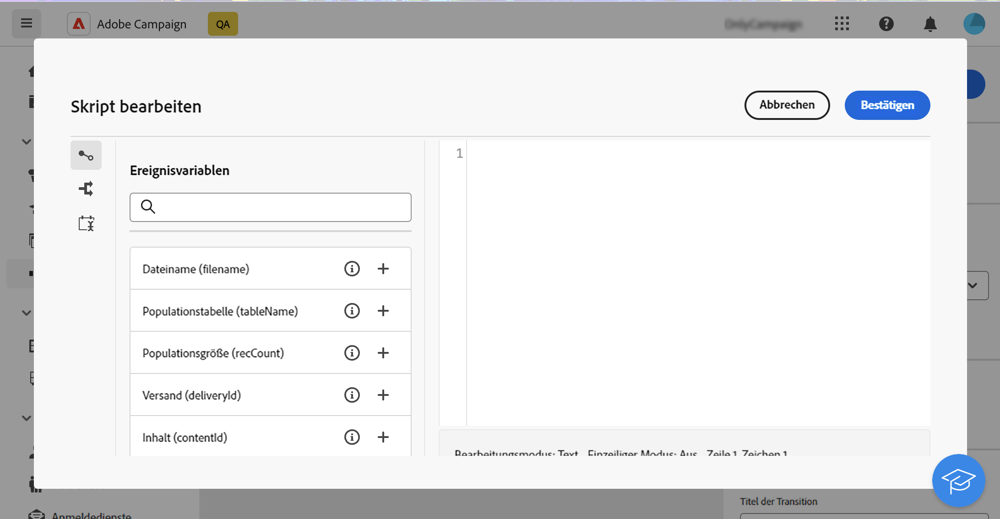
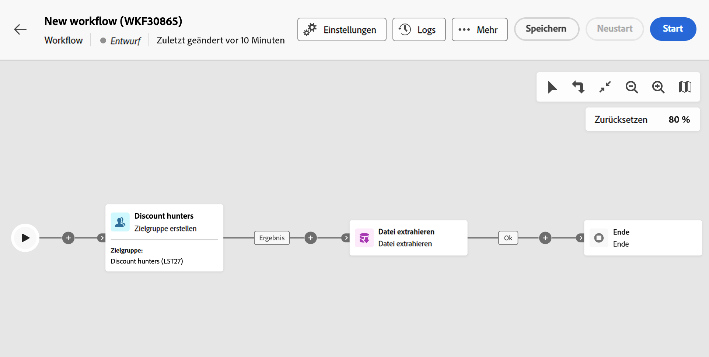
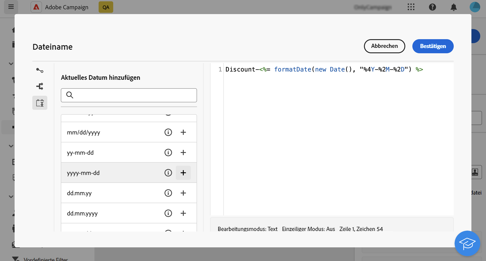
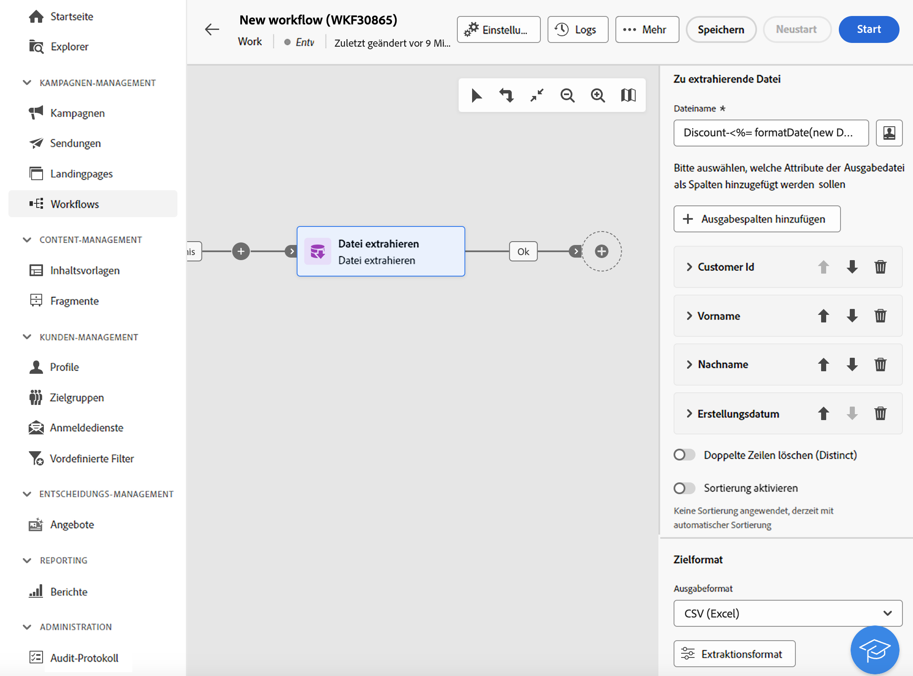

# Dateiextraktion {#extract-file}

>[!CONTEXTUALHELP]
>id="acw_orchestration_extractfile"
>title="Dateiextraktion"
>abstract="Die **Dateiextraktion** ermöglicht den Export von Daten aus Adobe Campaign in Form einer externen Datei. Die Daten können dann mithilfe der Aktivität Dateiübertragung an einen Server-Speicherort wie SFTP, Cloud-Speicher oder Ihren Kampagnenserver exportiert werden."

Die **Dateiextraktion** -Aktivität **Data Management** -Aktivität. Exportieren Sie mithilfe dieser Aktivität Daten aus Adobe Campaign in Form einer externen Datei. Die Daten können dann mithilfe der Aktivität Dateiübertragung an einen Server-Speicherort wie SFTP, Cloud-Speicher oder Ihren Kampagnenserver exportiert werden.

So konfigurieren Sie die **Dateiextraktion** -Aktivität, fügen Sie eine **Dateiextraktion** -Aktivität in Ihren Workflow ein und führen Sie dann die folgenden Schritte aus.

## Zu extrahierende Datei konfigurieren {#extract-configuration}

>[!CONTEXTUALHELP]
>id="acw_orchestration_extractfile_file"
>title="Zu extrahierende Datei"
>abstract="Wählen Sie die zu extrahierende Datei aus."

Die **[!UICONTROL Zu extrahierende Datei]** können Sie die Dateieigenschaften und die einzuschließenden Daten konfigurieren.

1. Im **[!UICONTROL Dateiname]** Geben Sie den gewünschten Namen für die zu extrahierende Datei ein.

   Sie können den Namen der Datei mit Ereignisvariablen, Bedingungen und Datums-/Uhrzeitfunktionen personalisieren. Klicken Sie dazu auf das Symbol **[!UICONTROL Personalisierungsdialog öffnen]**, um den Ausdruckseditor zu öffnen. [Erfahren Sie, wie Sie mit Ereignisvariablen und dem Ausdruckseditor arbeiten.](../event-variables.md)

1. Geben Sie die Spalten an, die in der extrahierten Datei enthalten sein sollen. Gehen Sie dazu wie folgt vor:

   1. Klicken Sie auf **[!UICONTROL Ausgabespalte hinzufügen]**.
   1. Wählen Sie das Attribut aus, das in der Spalte angezeigt werden soll, und bestätigen Sie dann die Auswahl. Die verfügbaren Attribute hängen von der Zielgruppendimension des Workflows ab.
   1. Nachdem die Spalte hinzugefügt wurde, können Sie ihre **[!UICONTROL Titel]** und ändern Sie die zugehörigen **[!UICONTROL Attribut]**.
   1. Wenn Sie eine Umwandlung auf die Spaltenwerte anwenden möchten, wählen Sie sie aus der Dropdown-Liste aus. Sie können beispielsweise alle Werte in der ausgewählten Spalte in Großbuchstaben umwandeln.

1. Wiederholen Sie diese Schritte, um der Extraktionsdatei so viele Spalten wie nötig hinzuzufügen. Um die Position einer Spalte zu ändern, verwenden Sie die Pfeile nach oben und unten.

1. Um alle doppelten Zeilen aus der extrahierten Datei zu entfernen, aktivieren Sie die **[!UICONTROL Entfernen doppelter Zeilen (Auflistung)]** -Option.

1. Um die extrahierte Datei anhand eines Attributs zu sortieren, aktivieren Sie die **[!UICONTROL Sortierung aktivieren]** und wählen Sie dann das Attribut aus, nach dem die Datei sortiert werden soll, sowie die gewünschte Sortiermethode (aufsteigend oder absteigend). Sie können jedes Attribut aus der aktuellen Zielgruppendimension sortieren, unabhängig davon, ob es zu den Spalten der Datei hinzugefügt wurde oder nicht.

## Konfigurieren des extrahierten Dateiformats {#file}

>[!CONTEXTUALHELP]
>id="acw_orchestration_extractfile_destinationformat"
>title="Zielformat"
>abstract="Wählen Sie das Format aus."

Die **[!UICONTROL Ziel]** Im Formatabschnitt können Sie konfigurieren, wie die extrahierte Datei formatiert wird.

1. Wählen Sie die **[!UICONTROL Ausgabeformat]** für die extrahierte Datei: **Text**, **Text mit festen Spalten**, **CSV (Excel)** oder **XML**.

1. Klicken Sie auf **[!UICONTROL Extraktionsformat]** -Schaltfläche, um auf bestimmte Optionen im Zusammenhang mit dem ausgewählten Format zuzugreifen. Erweitern Sie den Abschnitt, um weitere Informationen zu erhalten.

+++ Verfügbare Optionen für das Extraktionsformat

   * **[!UICONTROL Erste Zeile enthält die Spaltentitel]** (Text/CSV(Excel)-Format): Schalten Sie diese Option ein, um die erste Spalte als Kopfzeile zu verwenden.
   * **[!UICONTROL Spaltentrennzeichen]** (Textformat): Geben Sie das Zeichen an, das in der Ausgabedatei als Spaltentrennzeichen verwendet werden soll.
   * **[!UICONTROL Zeichenfolgentrennzeichen]** (Textformat): Geben Sie an, wie Zeichenfolgen in der Ausgabedatei getrennt werden sollen.
   * **[!UICONTROL Zeilenende]** (Textformat): Geben Sie an, wie das Zeilenende in der Ausgabedatei getrennt werden soll.
   * **[!UICONTROL Kodierung]**: Wählen Sie die Kodierung der Ausgabedatei aus.
   * **[!UICONTROL Datumsformat und Trennzeichen]**: Geben Sie an, wie Datumsangaben in der Ausgabedatei formatiert werden sollen.
   * **[!UICONTROL Zahlenformat]**: Geben Sie an, wie Zahlen in der Ausgabedatei formatiert werden sollen.
   * **[!UICONTROL Titel anstelle der internen Werte der Auflistungen exportieren]**: Schalten Sie diese Option ein, wenn Sie Auflistungswerte exportieren und Spaltentitel abrufen möchten, die leichter verständlich sind als interne IDs.

+++

   

## Nachbearbeitungsschritt hinzufügen {#script}

>[!CONTEXTUALHELP]
>id="acw_orchestration_extractfile_postprocessing"
>title="Nachbearbeitung"
>abstract="Definieren eines Anschlussvorgangsschritts"

Die **[!UICONTROL Exportieren von Änderungsskripten]** ermöglicht es Ihnen, eine Verarbeitungsphase anzuwenden, die während der Datenextraktion ausgeführt wird, z. B. das ZIP-komprimieren oder die Verschlüsselung. Klicken Sie dazu auf die Schaltfläche **[!UICONTROL Skript bearbeiten]** Schaltfläche.

Der Ausdruckseditor wird geöffnet. Hier können Sie den Befehl eingeben, der auf die Datei angewendet werden soll. Der linke Seitenbereich enthält vordefinierte Syntaxen, die Sie zum Erstellen Ihres Skripts verwenden können. [Erfahren Sie, wie Sie mit Ereignisvariablen und dem Ausdruckseditor arbeiten.](../event-variables.md)

## Zusätzliche Optionen {#additiona-options}

>[!CONTEXTUALHELP]
>id="acw_orchestration_extractfile_outbound"
>title="Ausgehende Transition"
>abstract="Schalten Sie die Option **Ausgehende Transition erzeugen** ein, um eine ausgehende Transition nach der aktuellen Aktivität hinzuzufügen."

>[!CONTEXTUALHELP]
>id="acw_orchestration_extractfile_error"
>title="Fehler verarbeiten"
>abstract="Die Option **Fehler verarbeiten** einschalten, um eine fehlerhafte ausgehende Transition hinzuzufügen."

Sobald die Extraktion der Ausgabedatei konfiguriert wurde, stehen zusätzliche Optionen im Zusammenhang mit Transitionen und der Fehlerverwaltung zur Verfügung:

* **[!UICONTROL Ausgehende Transition erzeugen]**: Schalten Sie diese Option ein, um eine ausgehende Transition hinzuzufügen und deren Titel zu konfigurieren.
* **[!UICONTROL keine Datei erzeugen, wenn die eingehende Transition leer ist]**: Schalten Sie diese Option ein, um die Dateiextraktion zu überspringen, wenn die eingehende Transition keine Daten enthält.
* **[!UICONTROL Prozessfehler]**: Schalten Sie diese Option ein, um eine ausgehende Transition hinzuzufügen, wenn bei der Dateiextraktion ein Fehler auftritt.

## Beispiel {#example}

Im folgenden Beispiel verwenden wir eine **Audience erstellen** -Aktivität und **Dateiextraktion** -Aktivität, um alle Zielgruppenprofile in eine CSV-Datei zu extrahieren.

* Die **[!UICONTROL Dateiname]** -Feld so konfiguriert ist, dass es das Datum der Extraktion enthält.

  

* Es werden Spalten hinzugefügt, die den Vor- und Nachnamen der Profile, ihre Kunden-IDs und das Erstellungsdatum in der Datenbank anzeigen.

  
