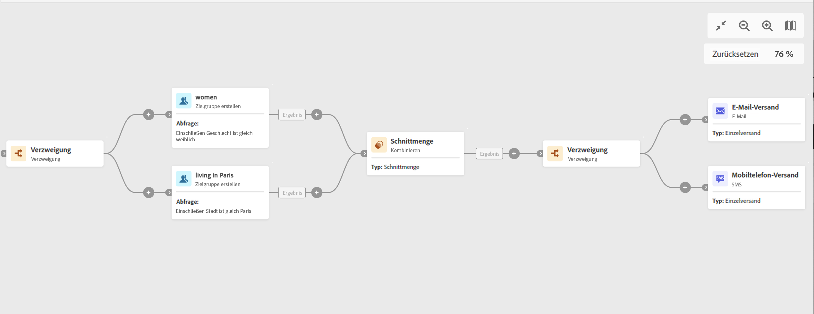

# Verzweigung {#fork}

>[!CONTEXTUALHELP]
>id="acw_orchestration_fork_transitions"
>title="Verzweigung  Aktivität"
>abstract="Die Aktivität „Verzweigung“ ermöglicht es Ihnen, ausgehende Transitionen zu erstellen, um mehrere Aktivitäten gleichzeitig zu starten."

## Konfiguration

Führen Sie die folgenden Schritte aus, um die Aktivität **Verzweigung** zu konfigurieren:

1. Fügen Sie Ihrem Workflow eine Aktivität **Verzweigung** hinzu.
1. Klicken Sie auf **Transition hinzufügen**, um eine neue ausgehende Transition hinzuzufügen. Standardmäßig sind zwei Transitionen definiert.
1. Fügen Sie jeder Ihrer Transitionen einen Titel hinzu.

## Beispiel

Im folgenden Beispiel verwenden wir zwei Aktivitäten vom Typ **Verzweigung**:

* Eine vor den beiden Abfragen, damit sie gleichzeitig ausgeführt werden.
* Eine nach dem Schnittpunkt, um eine E-Mail und eine SMS gleichzeitig an die Zielpopulation zu senden.

