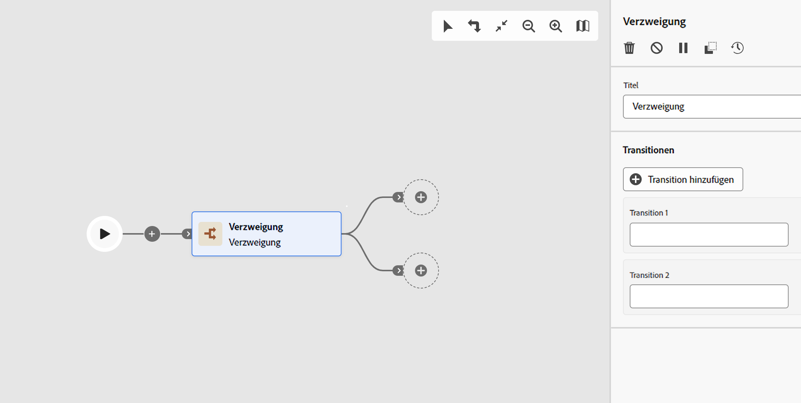

# Verzweigung  {#fork}

>[!CONTEXTUALHELP]
>id="acw_orchestration_fork"
>title="Aktivität „Verzweigung“"
>abstract="Eine **Verzweigung** erzeugt ausgehende Transitionen, um mehrere Workflow-Aktivitäten parallel zu starten."

>[!CONTEXTUALHELP]
>id="acw_orchestration_fork_transitions"
>title="Transitionen von Verzweigungsaktivitäten"
>abstract="Standardmäßig werden zwei Transitionen mit einer **Verzweigungsaktivität** erstellt. Klicken Sie auf die Schaltfläche **Transition hinzufügen**, um eine zusätzliche ausgehende Transition zu definieren, und geben Sie deren Titel ein."

Die Aktivität **Verzweigung** ist eine Aktivität zur **Flusssteuerung**. Sie ermöglicht Ihnen, ausgehende Transitionen zum gleichzeitigen Start mehrerer Aktivitäten zu erstellen.

## Konfigurieren der Verzweigungsaktivität {#fork-configuration}

Führen Sie die folgenden Schritte aus, um die Aktivität **Verzweigung** zu konfigurieren:

1. Fügen Sie Ihrem Workflow eine Aktivität **Verzweigung** hinzu.
1. Klicken Sie auf **Transition hinzufügen**, um eine neue ausgehende Transition hinzuzufügen. Standardmäßig sind zwei Transitionen definiert.
1. Fügen Sie jeder Transition ein Label hinzu.

## Beispiel {#fork-example}

Im folgenden Beispiel werden zwei Aktivitäten vom Typ **Verzweigung** verwendet:

* eine vor den beiden Abfragen, um sie gleichzeitig auszuführen
* eine nach der Schnittmenge, um eine E-Mail und eine SMS gleichzeitig an die Zielpopulation zu senden

