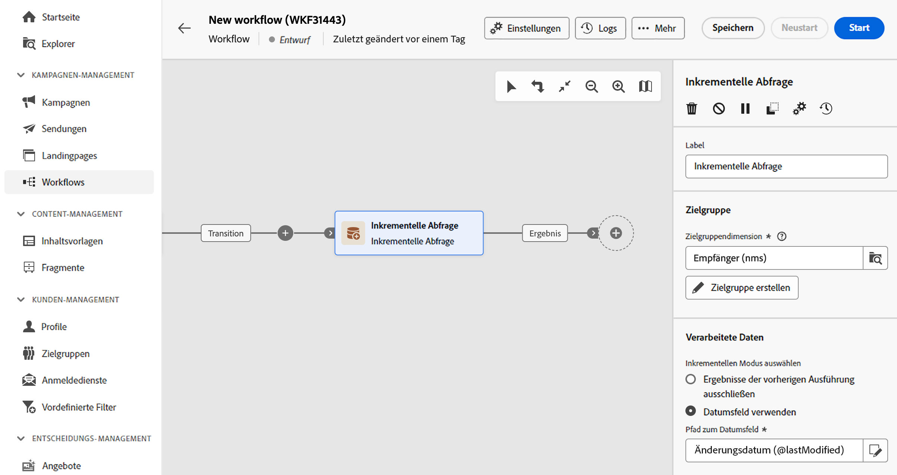
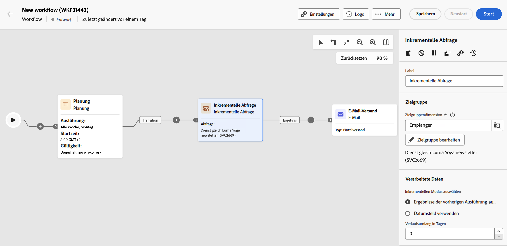

# Inkrementelle Abfrage {#incremental-query}

>[!CONTEXTUALHELP]
>id="acw_homepage_welcome_rn5"
>title="Aktivität „Inkrementelle Abfrage“"
>abstract="Verwenden Sie die neue Aktivität „Inkrementelle Abfrage“, um die Datenbank nach einem Plan abzufragen. Bei jeder neuen Ausführung dieser Aktivität werden die Ergebnisse der vorangehenden Ausführungen ausgeschlossen. Dadurch lassen sich ausschließlich neue Elemente abrufen."
>additional-url="https://experienceleague.adobe.com/docs/campaign-web/v8/release-notes/release-notes.html?lang=de" text="Siehe Versionshinweise"

>[!CONTEXTUALHELP]
>id="acw_orchestration_incrementalquery"
>title="Inkrementelle Abfrage"
>abstract="Die Aktivität **Inkrementelle Abfrage** ist eine Aktivität zur **Zielgruppenbestimmung**, die die Abfrage der Datenbank mithilfe des Abfrage-Modelers ermöglicht. Bei jeder neuen Ausführung dieser Aktivität werden die Ergebnisse der vorangehenden Ausführungen ausgeschlossen. Dadurch lassen sich ausschließlich neue Elemente abrufen."

>[!CONTEXTUALHELP]
>id="acw_orchestration_incrementalquery_history"
>title="Inkrementeller Abfrageverlauf"
>abstract="Inkrementeller Abfrageverlauf"

>[!CONTEXTUALHELP]
>id="acw_orchestration_incrementalquery_processeddata"
>title="Inkrementelle Abfrage – Verarbeitete Daten"
>abstract="Inkrementelle Abfrage – Verarbeitete Daten"

Die Aktivität **Inkrementelle Abfrage** ist eine Aktivität zur **Zielgruppenbestimmung**, mit der Sie die Datenbank nach einem Plan abfragen können. Bei jeder neuen Ausführung dieser Aktivität werden die Ergebnisse der vorangehenden Ausführungen ausgeschlossen. Dadurch lassen sich ausschließlich neue Elemente abrufen.

>[!NOTE]
>
>Während die Client-Konsole von Campaign die Aktivität **[!UICONTROL Inkrementelle Abfrage]** mit einer integrierten Planung versieht, behandelt die Web-Benutzeroberfläche von Campaign diese Funktion getrennt. Um die Ausführungen inkrementeller Abfragen zu planen, müssen Sie vor der Aktivität **[!UICONTROL Inkrementelle Abfrage]** die Aktivität **[!UICONTROL Planung]** im Workflow hinzufügen. [Informationen dazu, wie Sie die Aktivität „Planung“ konfigurieren](scheduler.md)

**[!UICONTROL Inkrementelle Abfragen]** kommen in verschiedenen Kontexten zum Einsatz:

* Segmentierung von Einzelpersonen, um beispielsweise Zielgruppen für eine Nachricht zu definieren.
* Export von Daten.  Beispielsweise können Sie die Aktivität verwenden, um regelmäßig neue Protokolle in Dateien zu exportieren. Diese Funktion kann verwendet werden, wenn Sie Ihre Protokolldaten in externen Berichterstellungs- oder Business Intelligence Tools verwenden möchten.

Die bereits bei früheren Ausführungen ausgewählte Population wird im Workflow gespeichert. Das bedeutet, dass zwei Workflows, die aus derselben Vorlage gestartet werden, nicht dasselbe Protokoll verwenden. Zwei Aufgaben, die auf derselben inkrementellen Abfrage im selben Workflow basieren, verwenden jedoch dasselbe Protokoll.

Wenn das Ergebnis einer inkrementellen Abfrage bei einer ihrer Ausführungen gleich 0 ist, wird der Workflow bis zur nächsten geplanten Ausführung der Abfrage ausgesetzt. Die auf die inkrementelle Abfrage folgenden Transitionen und Aktivitäten werden daher nicht vor der folgenden Ausführung verarbeitet.

## Konfigurieren der Aktivität „Inkrementelle Abfrage“ {#incremental-query-configuration}

Führen Sie die folgenden Schritte aus, um die Aktivität **Inkrementelle Abfrage** zu konfigurieren:

1. Fügen Sie die Aktivität **Inkrementelle Abfrage** in Ihren Workflow ein.

1. Wählen Sie im Abschnitt **[!UICONTROL Zielgruppe]** die **Zielgruppendimension** und klicken Sie dann auf **[!UICONTROL Weiter]**.

   Die Zielgruppendimension ermöglicht die Bestimmung der vom Vorgang betroffenen Population: Empfängerinnen und Empfänger, Vertragsbegünstigte, Benutzerinnen und Benutzer, Abonnentinnen und Abonnenten usw. Standardmäßig wird die Zielgruppe aus den Empfängerinnen und Empfängern ausgewählt. [Erfahren Sie mehr über Zielgruppendimensionen](../../audience/about-recipients.md#targeting-dimensions)

1. Verwenden Sie den Abfrage-Modeler, um Ihre Abfrage zu definieren, genauso wie Sie eine Zielgruppe beim Entwerfen einer neuen E-Mail erstellen. [Erfahren sie mehr über die Arbeit mit dem Abfrage-Modeler](../../query/query-modeler-overview.md)

1. Wählen Sie im Abschnitt **[!UICONTROL Verarbeitete Daten]** den zu verwendenden inkrementellen Modus aus:

   * **[!UICONTROL Ergebnisse der vorherigen Ausführung ausschließen]**: Bei jeder neuen Ausführung dieser Aktivität werden die Ergebnisse der vorangehenden Ausführungen ausgeschlossen.

     Die bereits in früheren Ausführungen ausgewählten Einträge können ab dem Tag, an dem sie ausgewählt wurden, bis zu einer Höchstzahl von Tagen protokolliert werden. Verwenden Sie dazu das Feld **[!UICONTROL Verlauf in Tagen]**. Wenn dieser Wert null ist, werden die Empfangenden nie aus dem Protokoll gelöscht.

   * **[!UICONTROL Datumsfeld verwenden]**: Mit dieser Option können Sie Ergebnisse früherer Ausführungen basierend auf einem bestimmten Datumsfeld ausschließen. Wählen Sie dazu das gewünschte Datumsfeld aus der Liste der Attribute aus, die für die ausgewählte Zielgruppendimension verfügbar sind. Bei den nächsten Ausführungen des Workflows werden nur Daten abgerufen, die nach dem Datum der letzten Ausführung geändert oder erstellt wurden.

     Nach der ersten Ausführung des Workflows wird das Feld **[!UICONTROL Letztes Ausführungsdatum]** verfügbar. Es gibt das Datum an, das für die nächste Ausführung verwendet wird, und wird bei jeder Ausführung des Workflows automatisch aktualisiert. Sie können bei Bedarf diesen Wert auch überschreiben, indem Sie einen neuen eingeben.

   >[!NOTE]
   >
   >Der Modus **[!UICONTROL Datumsfeld verwenden]** ermöglicht je nach ausgewähltem Datumsfeld größere Flexibilität. Wenn beispielsweise das angegebene Feld ein Änderungsdatum ist, können Sie im Datumsfeldmodus Daten abrufen, die kürzlich aktualisiert wurden. Dagegen werden im anderen Modus Einträge ausgeschlossen, die schon in einer früheren Ausführung abgerufen worden waren, selbst wenn diese Daten seit der letzten Ausführung des Workflows geändert wurden.

## Beispiel {#incremental-query-example}

Im folgenden Beispiel wird die Konfiguration eines Workflows illustriert, der der wöchentlichen Filterung der Profile der Adobe-Campaign-Datenbank dient, die den Dienst „Yoga-Newsletter“ abonniert haben, um diesen eine Willkommens-E-Mail zu senden.

Der Workflow ist wie folgt gestaltet:

* Eine **[!UICONTROL Planung]**, damit der Workflow jeden Montag um 6 Uhr ausgeführt wird.
* Eine **[!UICONTROL Inkrementelle Abfrage]**, die bei der ersten Ausführung zunächst den Abruf aller aktuellen Abonnenten, dann bei den folgenden Ausführungen nur den Abruf der im Laufe der Woche dazugekommenen, neuen Abonnenten ermöglicht.
* Eine Aktivität **[!UICONTROL E-Mail-Versand]**.
