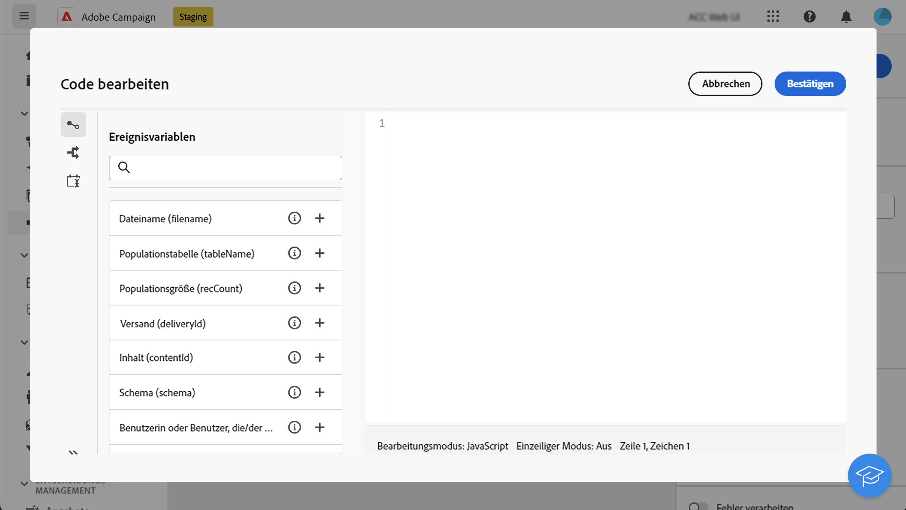
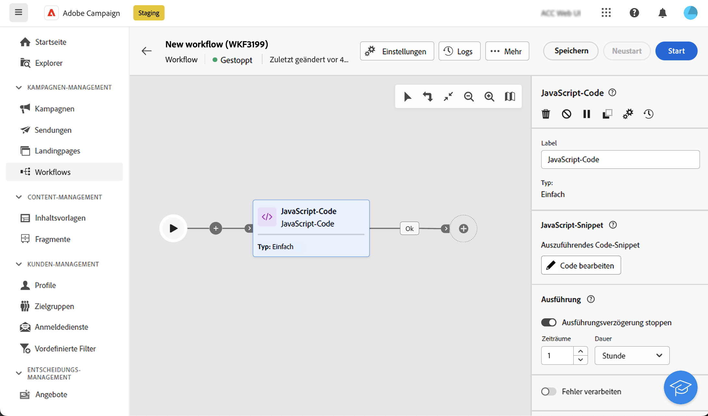
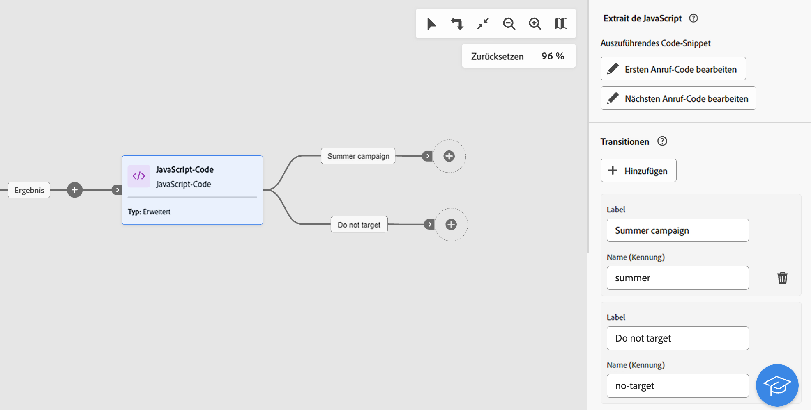
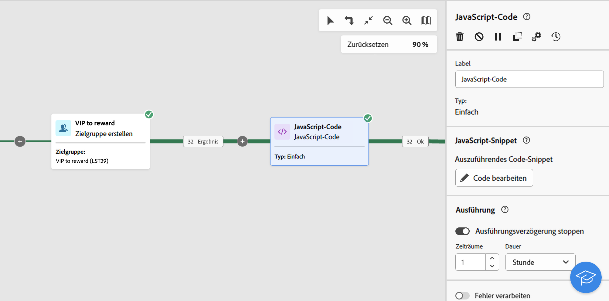
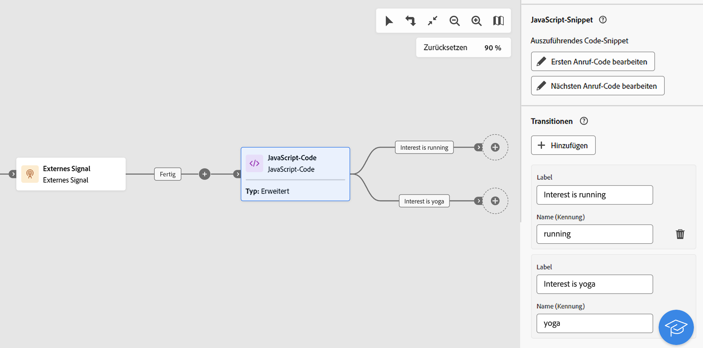

# JavaScript-Code {#javascript-code}

>[!CONTEXTUALHELP]
>id="acw_orchestration_javascript"
>title="JavaScript-Code"
>abstract="Die Aktivität **JavaScript-Code** ermöglicht es Ihnen, ein JavaScript-Skript im Kontext eines Workflows auszuführen. Auf diese Weise können Sie Aktionen durchführen oder Informationen aus der Datenbank erfassen. Verwenden Sie **einfache** JavaScript-Code-Aktivitäten, um bei der Workflow-Ausführung ein Code-Snippet auszuführen. Mithilfe **erweiterter** JavaScript-Code-Aktivitäten können Sie komplexere Vorgänge durchführen, indem Sie zwei verschiedene Code-Snippets nacheinander ausführen. Beim ersten Start des Workflows wird der erste Aufruf ausgeführt. Jedes Mal, wenn der Workflow erneut ausgeführt wird, wird der im zweiten Aufruf definierte Code ausgeführt."

>[!CONTEXTUALHELP]
>id="acw_orchestration_javascript_snippet"
>title="JavaScript-Snippet"
>abstract="Definieren Sie das Skript, das beim Ausführen der Aktivität ausgeführt werden soll. Wenn Sie eine **erweiterte** JavaScript-Aktivität konfigurieren, müssen Sie zwei Code-Snippets bearbeiten: den ersten Aufruf-Code, der bei der ersten Workflow-Ausführung ausgeführt wird, und den nächsten Aufruf-Code, der bei den folgenden Workflow-Aufrufvorgängen ausgeführt wird."

>[!CONTEXTUALHELP]
>id="acw_orchestration_javascript_execution"
>title="JavaScript-Ausführung"
>abstract="Konfigurieren Sie die Ausführungsverzögerung so, dass die Aktivität nach einer bestimmten Ausführungsdauer beendet wird. Standardmäßig darf die Ausführungsphase nicht länger als eine Stunde dauern. Nach dieser Verzögerung wird der Vorgang mit einer Fehlermeldung abgebrochen und die Ausführung der Aktivität schlägt fehl. Um diese Begrenzung zu ignorieren, setzen Sie den Wert auf 0."

>[!CONTEXTUALHELP]
>id="acw_orchestration_javascript_transition"
>title="JavaScript-Transition"
>abstract="Wenn Sie mehrere ausgehende Transitionen hinzufügen möchten, klicken Sie auf die Schaltfläche **[!UICONTROL Transitionen hinzufügen]**. Dadurch kann beispielsweise eine bestimmte Transition basierend auf einer in der JavaScript-Code-Aktivität definierten Bedingung ausgelöst werden. Diese Option ist nur für **erweiterte** JavaScript-Code-Aktivitäten verfügbar."

Die **JavaScript-Code**-Aktivität ist eine **Daten-Management**-Aktivität. Verwenden Sie diese Aktivität, um ein JavaScript-Skript im Kontext eines Workflows auszuführen. Auf diese Weise können Sie Informationen aus der Datenbank erfassen oder andere komplexe Vorgänge durchführen.

## Konfigurieren der JavaScript-Code-Aktivität {#javascript-code-configuration}

Führen Sie die folgenden Schritte aus, um die Aktivität **JavaScript-Code** zu konfigurieren:

1. Fügen Sie eine Aktivität **JavaScript-Code** zu Ihrem Workflow hinzu.

1. Legen Sie fest, welche Art von Aktivität erstellt werden soll:

   * **Einfach**: Mit dieser Option wird ein Code-Snippet ausgeführt.
   * **Erweitert**: Mit dieser Option können Sie erweiterte Vorgänge ausführen, indem Sie zwei verschiedene Code-Snippets ausführen. [Informationen dazu, wie Sie eine erweiterte JavaScript-Aktivität konfigurieren.](#advanced)

   >[!NOTE]
   >
   >Bei der Campaign Web-Benutzeroberfläche haben wir zwei Aktivitäten zu einer zusammengefasst, indem wir die **einfachen** und **erweiterten** JavaScript-Code-Funktionen zusammengeführt haben. Diese Zusammenführung wirkt sich in keiner Weise auf die Funktionalität der Aktivität aus.

1. Klicken Sie dann auf die Schaltfläche **[!UICONTROL Code bearbeiten]**, um den Ausdruckseditor zu öffnen. Der linke Bereich enthält vordefinierte Syntaxen, die Sie zur Erstellung Ihres Codes verwenden können, einschließlich Ereignisvariablen. [Informationen dazu, wie Sie mit Ereignisvariablen und dem Ausdruckseditor arbeiten.](../event-variables.md)

   

1. Konfigurieren Sie im Abschnitt **[!UICONTROL Ausführung]** die Verzögerung so, dass die Aktivität nach einer bestimmten Ausführungsdauer beendet wird. Standardmäßig darf die Ausführungsphase nicht länger als eine Stunde dauern. Nach dieser Verzögerung wird der Vorgang mit einer Fehlermeldung abgebrochen und die Ausführung der Aktivität schlägt fehl. Um diese Begrenzung zu ignorieren, setzen Sie den Wert auf 0.

   

1. Aktivieren Sie die Option **[!UICONTROL Fehler verarbeiten]**, um während der Skriptausführung auftretende Fehler in einer zusätzlichen ausgehenden Transition zu belassen.

## Erweiterte JavaScript-Code-Aktivitäten {#advanced}

Mit erweiterten JavaScript-Aktivitäten können Sie komplexe Vorgänge ausführen. Sie haben folgende Möglichkeiten:

* Ausführen von zwei verschiedenen Code-Snippets. Das erste Code-Snippet wird ausgeführt, wenn der Workflow zum ersten Mal gestartet wird. Jedes Mal, wenn der Workflow erneut ausgeführt wird, wird das im zweiten Aufruf definierte Code-Snippet ausgeführt.
* Fügen Sie mehrere ausgehende Transitionen hinzu, mit denen Sie mithilfe eines Skripts dynamisch interagieren können.

Gehen Sie wie folgt vor, um eine erweiterte JavaScript-Code-Aktivität zu konfigurieren:

1. Wählen Sie **Erweitert** aus und konfigurieren Sie dann die auszuführenden Code-Snippets:

   * Klicken Sie auf die Option **[!UICONTROL Ersten Aufruf-Code bearbeiten]**, um das Skript zu definieren, das beim ersten Aufruf ausgeführt werden soll.
   * Klicken Sie auf die Option **[!UICONTROL Nächsten Aufruf-Code bearbeiten]**, um das Skript zu definieren, das bei den nächsten Aufrufvorgängen des Workflows ausgeführt werden soll (optional).

1. Um eine oder mehrere ausgehende Transitionen hinzuzufügen, klicken Sie auf die Schaltfläche **[!UICONTROL Transitionen hinzufügen]** und geben Sie für jede Transition einen Titel und einen internen Namen an.

   In diesem Beispiel haben wir zwei Transitionen konfiguriert, die vom Skript im Code-Snippet basierend auf bestimmten Bedingungen aktiviert werden.

   

1. Schließen Sie die Konfiguration der Aktivität ab und starten Sie den Workflow.

## Beispiel {#javascript-code-example}

### Initialisieren von Variablen basierend auf der Eingangspopulation {#example1}

Dieses Beispiel zeigt, wie eine Variable basierend auf der Anzahl der Profile initialisiert wird, auf die in einem Workflow abgezielt wird.



Die Zielgruppe im vorliegenden Beispiel sind VIP-Profile aus unserer Datenbank. Wir möchten die Variable „channel“ mit einem Wert erstellen, der von der Anzahl der Profile abhängt, auf die die Aktivität „Zielgruppe erstellen“ abzielt:

* Werden mehr als 1000 Profile angesprochen, initialisieren Sie die Variable mit dem Wert „email“.
* Initialisieren Sie die Variable anderenfalls mit dem Wert „sms“.

Gehen Sie dazu wie folgt vor:

1. Fügen Sie eine **JavaScript-Code**-Aktivität vom Typ **Einfach** nach der Aktivität **Zielgruppe erstellen** hinzu.

1. Klicken Sie auf **Code bearbeiten** und konfigurieren Sie das Code-Snippet wie folgt:

   ```
   if (vars.recCount > 1000)
       vars.channel ="email"
   else
       vars.channel = "sms"
   ```

1. Starten Sie den Workflow. Die Variable „channel“ wird je nach Anzahl der Profile, auf die die Aktivität **Zielgruppe erstellen** abzielt, mit dem Wert „email“ oder „sms“ erstellt.

### Auslösen von Transitionen basierend auf dem Wert einer Variablen {#example2}

Dieses Beispiel zeigt, wie eine Transition basierend auf dem Wert einer Variablen ausgelöst wird.



Hier beginnt der Workflow mit einer Aktivität **Externes Signal**, in die eine Variable (`interest`) von einem anderen Workflow übergeben wird. Der Wert der Variablen ist je nach den im ersten Workflow durchgeführten Filtervorgängen entweder „running“ oder „yoga“.

Wir möchten verschiedene Transitionen im Workflow basierend auf dem Wert der Variablen auslösen.

Gehen Sie dazu wie folgt vor:

1. Fügen Sie eine Aktivität **JavaScript-Code** nach der Aktivität „Externes Signal“ mit dem Typ **Erweitert** hinzu.

1. Fügen Sie zwei Transitionen hinzu: eine für jeden möglichen Variablenwert („running“, „yoga“).

1. Klicken Sie auf die Option zum **Bearbeiten des ersten Aufruf-Codes** und konfigurieren Sie das Code-Snippet wie folgt:

   ```
   if (vars.interest=="running")
       task.postEvent(task.transitionByName("running"));
   else
       task.postEvent(task.transitionByName("yoga"));
   ```

1. Schließen Sie die Konfiguration jeder Transition entsprechend Ihren Anforderungen ab und starten Sie dann den Workflow. Es wird eine der beiden ausgehenden Transitionen je nach Wert der Variable `interest` aktiviert, die über die Aktivität **Externes Signal** übergeben wurde.
