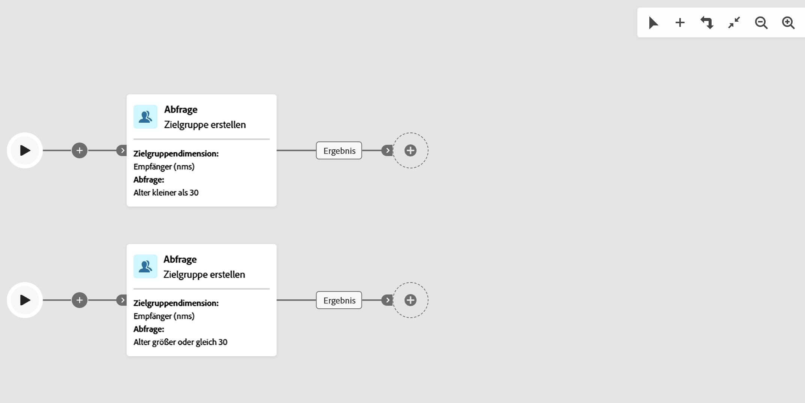
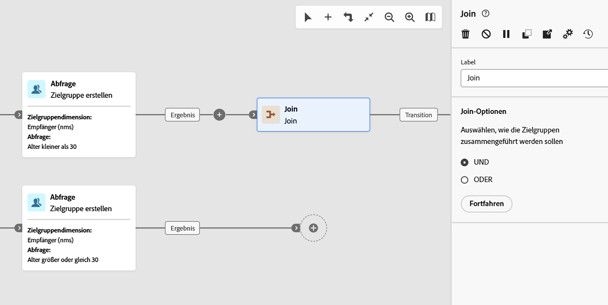
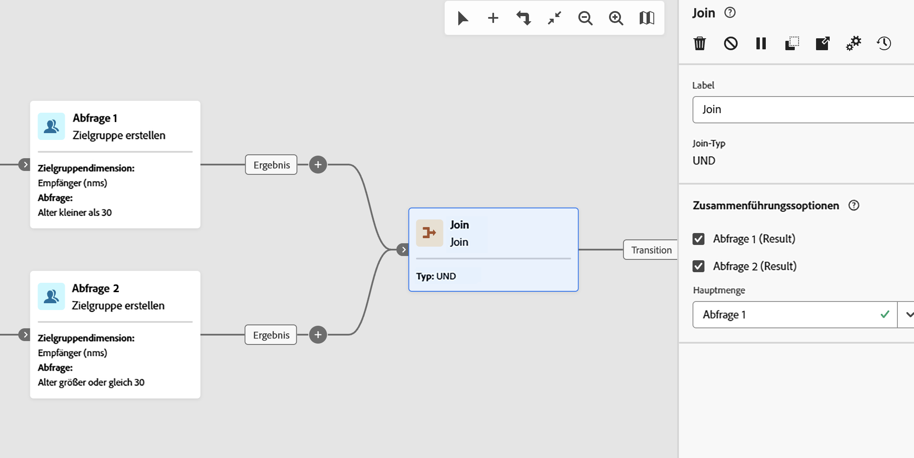
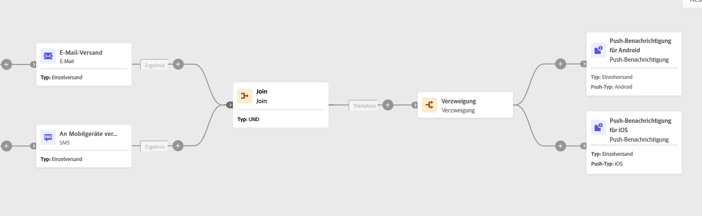

# Join {#join}

>[!CONTEXTUALHELP]
>id="acw_homepage_welcome_rn5"
>title="Mehrere Workflow-Verzweigungen und Join-Aktivität"
>abstract="Mehrere Verzweigungen werden jetzt unterstützt. Anstatt eine Verzweigung zu verwenden, können Sie auf der Symbolleiste auf Verzweigung hinzufügen klicken. Die Und-Verknüpfung wurde ebenfalls verbessert. Es handelt sich jetzt um eine generische Aktivität vom Typ Join , mit der Sie zwischen den Join-Optionen AND und OR wählen können."
>additional-url="https://experienceleague.adobe.com/docs/campaign-web/v8/release-notes/release-notes.html?lang=de" text="Siehe Versionshinweise"

>[!CONTEXTUALHELP]
>id="acw_orchestration_and-join"
>title="Aktivität &quot;UND-Verknüpfung&quot;"
>abstract="Die Aktivität **Und-Verknüpfung** ermöglicht es, die Ausführung verschiedener Workflow-Verzweigungen zu synchronisieren. Sie wird ausgelöst, sobald alle vorangehenden Aktivitäten beendet sind. Auf diese Weise wird sichergestellt, dass bestimmte Aktivitäten abgeschlossen sind, bevor Sie mit der Ausführung des Workflows fortfahren."

>[!CONTEXTUALHELP]
>id="acw_orchestration_join"
>title="Aktivität „Zusammenführen“"
>abstract="Die **Zusammenführen** ermöglicht das Zusammenführen mehrerer eingehender Transitionen. Wählen Sie aus, ob der Vorgang fortgesetzt werden soll, wenn alle eingehenden Transitionen abgeschlossen sind (AND) oder wenn eine eingehende Transition abgeschlossen ist (OR)."

Die Aktivität **Zusammenführen** ist eine Aktivität **Fluss-Steuerung**. Es synchronisiert mehrere Ausführungszweige eines Workflows.
Sie können auswählen, wie eingehende Transitionen ausgewertet werden sollen:

* **AND**: Wird nur fortgesetzt, nachdem alle ausgewählten eingehenden Transitionen aktiviert wurden.
* **OR**: Wird fortgesetzt, sobald eine ausgewählte eingehende Transition aktiviert wird.

Wenn **AND** ausgewählt ist, wird die ausgehende Transition erst dann durch diese Aktivität Trigger, wenn alle eingehenden Transitionen aktiviert wurden. Das heißt, sie wird aktiviert, sobald alle vorangehenden Aktivitäten beendet sind. Auf diese Weise wird sichergestellt, dass bestimmte Aktivitäten abgeschlossen sind, bevor Sie mit der Ausführung des Workflows fortfahren.

Wenn **OR** ausgewählt ist, wird die Ausführung fortgesetzt, sobald eine der ausgewählten eingehenden Transitionen aktiviert wird. Es wartet nicht auf jede Verzweigung.

## Konfigurieren der Aktivität „Zusammenführen“ {#join-configuration}

>[!CONTEXTUALHELP]
>id="acw_orchestration_and-join_merging"
>title="Zusammenführungssoptionen"
>abstract="Wählen Sie die Aktivitäten aus, die Sie verknüpfen möchten. Wählen Sie in der Dropdown-Liste **Hauptmenge** die Population der eingehenden Transition aus, die Sie beibehalten möchten."

Führen Sie die folgenden Schritte aus, um die Aktivität **Zusammenführen** zu konfigurieren:

1. Fügen Sie mehrere Aktivitäten hinzu, z. B. Kanalaktivitäten, um mindestens zwei verschiedene Ausführungszweige zu bilden. Sie können einen **Verzweigung** verwenden oder eine separate Verzweigung mit der Symbolleistenschaltfläche **Verzweigung hinzufügen** (+) hinzufügen. Siehe [Aktivitäten &#x200B;](../orchestrate-activities.md#toolbar).

   

1. Fügen Sie **Aktivität „Zusammenführen** zu einem der Zweige hinzu.

   

1. Wählen Sie in den Join-Optionen **UND** oder **ODER** und klicken Sie auf **Weiter**.
1. Aktivieren Sie im Abschnitt **Zusammenführungsoptionen** alle vorherigen Aktivitäten, denen Sie beitreten möchten.
1. Wählen Sie in der Dropdown-Liste **Hauptmenge** die Population der eingehenden Transition aus, die beibehalten werden soll. Die ausgehende Transition darf nur eine der Populationen der eingehenden Transition enthalten.

   >[!NOTE]
   >
   >Das Primäre Feld **&#x200B;**&#x200B;ist nur für die Join **Option „AND** verfügbar.

   

## Beispiel {#join-example}

Das folgende Beispiel zeigt zwei Workflow-Verzweigungen mit einem E-Mail- und SMS-Versand. Die **Zusammenführen**-Aktivität, die auf **UND** festgelegt ist, führt zu Triggern, wenn beide eingehenden Transitionen aktiviert sind. Push-Benachrichtigungen werden erst gesendet, nachdem beide Sendungen abgeschlossen sind. Wenn Sie die Join-Option auf **ODER** setzen, werden die Push-Benachrichtigungen gesendet, sobald die erste eingehende Versandaktivität abgeschlossen ist.

{zoomable="yes"}