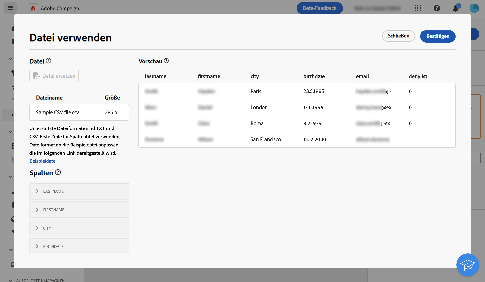

# Datei laden  {#load-file}

>[!CONTEXTUALHELP]
>id="acw_orchestration_loadfile"
>title="Aktivität „Datei laden“"
>abstract="Die Aktivität **Datei laden** ist eine **Daten-Management**-Aktivität Mit dieser Aktivität können Sie mit Daten arbeiten, die in einer externen Datei gespeichert sind."

>[!CONTEXTUALHELP]
>id="acw_orchestration_loadfile_samplefile"
>title="Beispieldatei"
>abstract="Beispieldatei"

>[!CONTEXTUALHELP]
>id="acw_orchestration_loadfile_nameofthefile"
>title="Name der Datei"
>abstract="Name der Datei"

>[!CONTEXTUALHELP]
>id="acw_orchestration_loadfile_targetdb"
>title="Zieldatenbank"
>abstract="Zieldatenbank"

>[!CONTEXTUALHELP]
>id="acw_orchestration_loadfile_rejectmgt"
>title="Zurückweisungsverwaltung für die Aktivität „Datei laden“"
>abstract="Zurückweisungsverwaltung für die Aktivität „Datei laden“"

>[!CONTEXTUALHELP]
>id="acw_orchestration_loadfile_outboundtransition"
>title="Ausgehende Transition von der Zurückweisungsverwaltung"
>abstract="Ausgehende Transition von der Zurückweisungsverwaltung"

>[!CONTEXTUALHELP]
>id="acw_orchestration_loadfile_outboundtransition_reject"
>title="Ausgehende Transition für Zurückweisungen der Zurückweisungsverwaltung"
>abstract="Ausgehende Transition für Zurückweisungen der Zurückweisungsverwaltung"

>[!CONTEXTUALHELP]
>id="acw_orchestration_loadfile_formatting"
>title="Formatierung der Aktivität „Datei laden“"
>abstract="Formatierung der Aktivität „Datei laden“"

>[!CONTEXTUALHELP]
>id="acw_orchestration_loadfile_targetfile"
>title="Zieldatei für die Aktivität „Datei laden“"
>abstract="Zieldatei für die Aktivität „Datei laden“"

>[!CONTEXTUALHELP]
>id="acw_orchestration_loadfile_valueremapping"
>title="Erneute Wertzuweisung für die Aktivität „Datei laden“"
>abstract="Erneute Wertzuweisung für die Aktivität „Datei laden“"

>[!CONTEXTUALHELP]
>id="acw_orchestration_loadfile_command"
>title="Befehl „Datei laden“"
>abstract="Das Zulassen beliebiger Befehle für die Vorverarbeitung ist ein Sicherheitsproblem. Deaktivieren Sie die Sicherheitsoption „XtkSecurity_Disable_Preproc“, um die Verwendung einer vordefinierten Liste von Befehlen zu erzwingen."

>[!CONTEXTUALHELP]
>id="acw_orchestration_loadfile_delete"
>title="Löschen von Dateien nach dem Importieren"
>abstract="Schalten Sie die Option **Datei nach dem Import löschen** ein, um die Originaldatei nach dem Import vom Server zu löschen."

Die Aktivität **Datei laden** ist eine **Daten-Management**-Aktivität. Mit dieser Aktivität können Sie mit Profilen und Daten arbeiten, die in einer externen Datei gespeichert sind. Profile und Daten werden nicht zur Datenbank hinzugefügt, aber alle Felder in der Eingabedatei sind verfügbar zur [Personalisierung](../../personalization/gs-personalization.md) oder um Profile oder andere Tabellen zu aktualisieren.

>[!NOTE]
>Unterstützte Dateiformate sind: Text (TXT) und kommagetrennte Werte (CSV).

Diese Aktivität kann mit einer [Abstimmungs](reconciliation.md)-Aktivität verwendet werden, um nicht identifizierte Daten mit vorhandenen Ressourcen zu verknüpfen. Zum Beispiel kann die Aktivität **Datei laden** vor dem Import nicht standardmäßiger Daten in die Datenbank vor einer **Abstimmungs**-Aktivität platziert werden.

## Konfigurieren der Aktivität „Datei laden“ {#load-configuration}

Gehen Sie wie folgt vor, um die Aktivität **Datei laden** zu konfigurieren:

1. Verschieben Sie eine Aktivität **Datei laden** per Drag-and-Drop in Ihren Workflow. Klicken Sie auf **Aus Datei auswählen**.

1. Wählen Sie die zu verwendende lokale Datei aus. Das Format muss dieser [Beispieldatei](../../audience/file-audience.md#sample-file) entsprechen.

1. Im mittleren Abschnitt des Bildschirms können Sie eine Vorschau der Datenzuordnung anzeigen, um sie zu überprüfen.

   

1. Verwenden Sie den Abschnitt **Spalten** im linken Bereich, um den Datentyp und die Breite für jede Spalte anzupassen.

1. Spezifizieren Sie im Abschnitt **Formatierung**, der sich unter der Spaltenkonfiguration befindet, wie die externe Datei formatiert wird, um sicherzustellen, dass die Daten korrekt importiert werden.

1. Klicken Sie auf **Bestätigen**, wenn die Einstellungen korrekt sind.

## Beispiel{#load-example}

Ein Beispiel für das Laden einer externen Datei mithilfe der Aktivität **Abstimmung**, ist in [diesem Abschnitt](reconciliation.md#reconciliation-example) verfügbar.
