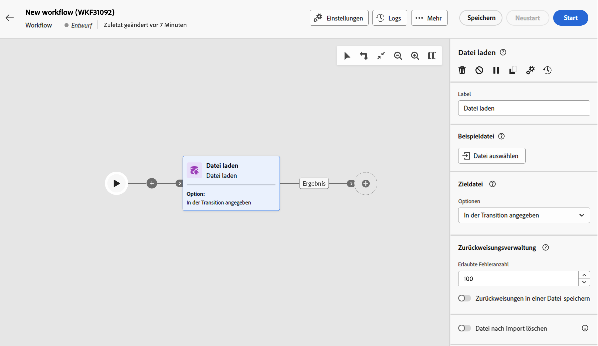
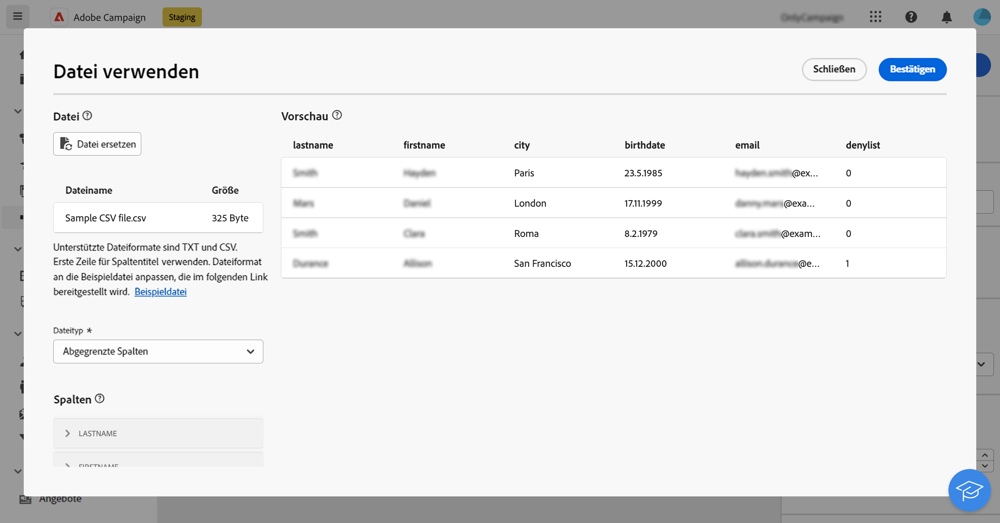
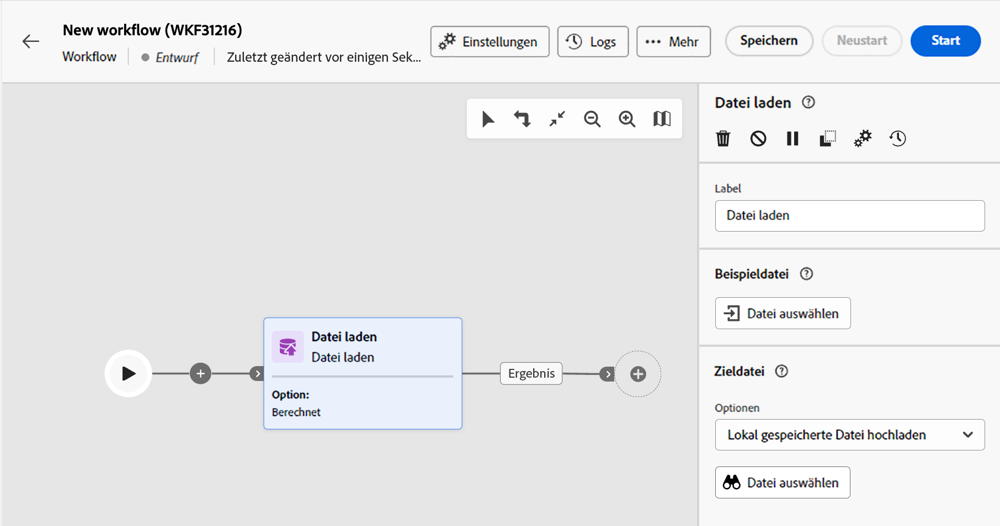
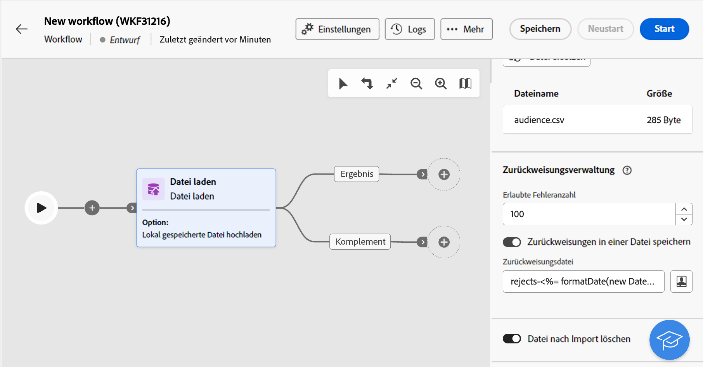

# Datei laden  {#load-file}

>[!CONTEXTUALHELP]
>id="acw_orchestration_loadfile"
>title="Aktivität „Datei laden“"
>abstract="Die Aktivität **Datei laden** ist eine **Daten-Management**-Aktivität. Durch diese Aktivität kann mit Daten gearbeitet werden, die in einer externen Datei gespeichert sind.  Es werden keine Profile und Daten zur Datenbank hinzugefügt, aber alle Felder in der Eingabedatei sind verfügbar zur Personalisierung oder um Profile oder andere Tabellen zu aktualisieren."

>[!CONTEXTUALHELP]
>id="acw_orchestration_loadfile_outboundtransition"
>title="Ausgehende Transition von der Zurückweisungsverwaltung"
>abstract="Ausgehende Transition von der Zurückweisungsverwaltung"

>[!CONTEXTUALHELP]
>id="acw_orchestration_loadfile_outboundtransition_reject"
>title="Ausgehende Transition für Zurückweisungen der Zurückweisungsverwaltung"
>abstract="Ausgehende Transition für Zurückweisungen der Zurückweisungsverwaltung"

Die Aktivität **Datei laden** ist eine **Daten-Management**-Aktivität. Mit dieser Aktivität können Sie mit Profilen und Daten arbeiten, die in einer externen Datei gespeichert sind. Profile und Daten werden nicht zur Datenbank hinzugefügt, aber alle Felder in der Eingabedatei sind verfügbar zur [Personalisierung](../../personalization/gs-personalization.md) oder um Profile oder andere Tabellen zu aktualisieren.

>[!NOTE]
>Unterstützte Dateiformate sind: Text (TXT) und kommagetrennte Werte (CSV). Mit der Web-Benutzeroberflächen-Konsole können Sie Dateien mit einer maximalen Größe von 50 MB laden. In der Client-Konsole ist das Laden von Daten auf 150 MB beschränkt. [Weitere Informationen](https://experienceleague.adobe.com/docs/campaign-web/v8/wf/design-workflows/load-file.html?lang=de){target="_blank"}

Diese Aktivität kann mit einer [Abstimmungs](reconciliation.md)-Aktivität verwendet werden, um nicht identifizierte Daten mit vorhandenen Ressourcen zu verknüpfen. Zum Beispiel kann die Aktivität **Datei laden** vor dem Import nicht standardmäßiger Daten in die Datenbank vor einer **Abstimmungs**-Aktivität platziert werden.

## Konfigurieren der Aktivität „Datei laden“ {#load-configuration}

Die Konfiguration der Aktivität **Datei laden** erfolgt in zwei Schritten. Definieren Sie zunächst die erwartete Dateistruktur, indem Sie eine Beispieldatei hochladen. Geben Sie anschließend den Ursprung der Datei an, deren Daten importiert werden sollen. Führen Sie zur Konfiguration der Aktivität die folgenden Schritte aus:

### Konfigurieren der Beispieldatei {#sample}

>[!CONTEXTUALHELP]
>id="acw_orchestration_loadfile_samplefile"
>title="Beispieldatei"
>abstract="Wählen Sie die Struktur aus, die die Datei aufweisen soll, indem Sie eine Beispieldatei hochladen."

>[!CONTEXTUALHELP]
>id="acw_orchestration_loadfile_formatting"
>title="Formatieren für die Aktivität „Datei laden“"
>abstract="Spezifizieren Sie im Abschnitt **Formatierung**, wie die Datei formatiert ist, um sicherzustellen, dass die Daten korrekt importiert werden."

>[!CONTEXTUALHELP]
>id="acw_orchestration_loadfile_valueremapping"
>title="Erneute Wertzuweisung für die Aktivität „Datei laden“"
>abstract="Verwenden Sie diese Option, um bestimmte Werte aus den geladenen Dateien neuen Werten zuzuordnen. Wenn die Spalte beispielsweise die Werte „true“/„false“ enthält, können Sie eine Zuordnung hinzufügen, um diese Werte automatisch durch „0“/„1“-Zeichen zu ersetzen."

Führen Sie diese Schritte aus, um die Beispieldatei zu konfigurieren, mit der die erwartete Dateistruktur definiert wird:

1. Fügen Sie eine Aktivität **Datei laden** zu Ihrem Workflow hinzu.

1. Wählen Sie die zu verwendende Beispieldatei aus, um die erwartete Dateistruktur zu definieren. Klicken Sie dazu im Abschnitt **[!UICONTROL Beispieldatei]** auf die Schaltfläche **Datei auswählen** und wählen Sie die zu verwendende lokale Datei aus.

   >[!NOTE]
   >
   >Die Daten der Beispieldatei werden für die Konfiguration der Aktivität verwendet, aber nicht importiert. Verwenden Sie eine Beispieldatei mit wenigen Daten. Das Dateiformat muss [dieser Beispieldatei](../../audience/file-audience.md#sample-file) entsprechen.

1. Es wird eine Vorschau der Beispieldatei mit maximal 30 Zeilen angezeigt.

1. Geben **[!UICONTROL in der Dropdown]** Liste Dateityp an, ob Spalten mit Trennzeichen oder Spalten mit fester Breite verwendet werden sollen.

   

1. Für die Dateitypen mit getrennten Spalten verwenden Sie den Abschnitt **Spalten**, um die Eigenschaften der einzelnen Spalten zu konfigurieren.

   +++Verfügbare Optionen für Dateispalten

   * **[!UICONTROL Titel]**: Titel, der für die Spalte angezeigt wird.
   * **[!UICONTROL Datentyp]**: Die Art von Daten, die in der Spalte enthalten sind.
   * **[!UICONTROL Breite]** (Datentyp Zeichenfolge): Maximale Anzahl an Zeichen, die in der Spalte angezeigt werden sollen.
   * **[!UICONTROL Datentransformation]** (Datentyp Zeichenfolge): Wenden Sie die Transformation auf die in der Spalte enthaltenen Werte an.
   * **[!UICONTROL Umgang mit Leerzeichen]** (Datentyp Zeichenfolge): Geben Sie an, wie die in der Spalte enthaltenen Leerzeichen behandelt werden sollen.
   * **[!UICONTROL Trennzeichen]** (Datentypen für Datum, Uhrzeit, Ganzzahl und Zahl): Geben Sie die Zeichen an, die als Trennzeichen verwendet werden sollen.
   * **[!UICONTROL NULL erlauben]**: Geben Sie an, wie leere Werte in der Spalte behandelt werden sollen. Bei der Option „Adobe Campaign-Standardeinstellung“ wird ein Fehler ausgegeben, wenn ein leerer Wert vorhanden ist.
   * **[!UICONTROL Fehlerverarbeitung]** (Datentyp „Zeichenfolge„): Geben Sie das Verhalten im Falle von Fehlern in einer der Zeilen an.
   * **[!UICONTROL Neukodifizierung der Werte]**: Mit dieser Option können Sie bestimmte Werte neuen zuordnen. Wenn die Spalte beispielsweise Werte vom Typ „True“/„False“ enthält, können Sie eine Zuordnung hinzufügen, um diese Werte automatisch durch „0“/„1“ zu ersetzen.

   +++

1. Geben Sie im Abschnitt **Formatierung** an, wie die Datei formatiert ist, um sicherzustellen, dass die Daten korrekt importiert werden.

### Definieren der hochzuladenden Zieldatei {#target}

>[!CONTEXTUALHELP]
>id="acw_orchestration_loadfile_targetfile"
>title="Zieldatei für die Aktivität „Datei laden“"
>abstract="Legen Sie im Abschnitt **[!UICONTROL Zieldatei]** fest, wie die auf den Server hochzuladende Datei abgerufen werden soll."

>[!CONTEXTUALHELP]
>id="acw_orchestration_loadfile_nameofthefile"
>title="Name der Datei"
>abstract="Geben Sie den Namen der Datei an, die auf den Server hochgeladen werden soll. Klicken Sie auf das Symbol **[!UICONTROL Personalisierungsdialog öffnen]**, um den Dateinamen mit dem Ausdruckseditor, einschließlich Ereignisvariablen, zu ermitteln."

>[!CONTEXTUALHELP]
>id="acw_orchestration_loadfile_targetdb"
>title="Zieldatenbank"
>abstract="Wenn Sie auf eine Aktivität **[!UICONTROL Datei laden]** zugreifen, die bereits in der Client-Konsole eingerichtet wurde, ist ein zusätzlicher Abschnitt **[!UICONTROL Zieldatenbank]** verfügbar, falls Sie die Aktivität zum Hochladen der Datei in eine externe Datenbank konfiguriert haben."

>[!CONTEXTUALHELP]
>id="acw_orchestration_loadfile_command"
>title="Befehl „Datei laden“"
>abstract="Das Zulassen eines beliebigen Befehls für die Vorab-Bearbeitung stellt ein Sicherheitsrisiko dar. Deaktivieren Sie die Sicherheitsoption XtkSecurity_Disable_Preproc , um die Verwendung einer vordefinierten Liste von Befehlen zu erzwingen."

>[!CAUTION]
>
>Bevor Sie die Zieldatei laden, stellen Sie sicher, dass sie wie die Beispieldatei formatiert ist. Abweichungen vom Dateiformat, der Spaltenstruktur oder der Spaltenanzahl können bei der Workflow-Ausführung zu Fehlern führen.

Gehen Sie wie folgt vor, um die hochzuladende Zieldatei zu definieren:

1. Legen Sie im Abschnitt **[!UICONTROL Zieldatei]** fest, welche Aktion beim Abrufen der auf den Server hochzuladenden Datei ausgeführt werden soll.

   * **[!UICONTROL Lokal gespeicherte Datei hochladen]**: Wählen Sie die von Ihrem Computer hochzuladende Datei aus.

   * **[!UICONTROL Wird durch die Transition angegeben]**: Laden Sie die in der eingehenden Transition angegebene Datei hoch, die aus einer vorherigen Aktivität wie **[!UICONTROL Dateiübertragung]** stammt.

   * **[!UICONTROL Datei vorab bearbeiten]**: Laden Sie die in der vorherigen Transition angegebene Datei hoch und wenden Sie einen Vorab-Bearbeitungsbefehl an, z. B. **[!UICONTROL Dekomprimierung]** oder **[!UICONTROL Entschlüsselung]**.

   * **[!UICONTROL Berechnet]**: Laden Sie die Datei hoch, deren Name im Feld **[!UICONTROL Dateiname]** angegeben ist. Klicken Sie auf das Symbol **[!UICONTROL Personalisierungsdialog öffnen]**, um den Dateinamen mit dem Ausdruckseditor, einschließlich Ereignisvariablen, zu ermitteln.

   

   >[!NOTE]
   >
   >Wenn Sie auf eine Aktivität **[!UICONTROL Datei laden]** zugreifen, die bereits in der Client-Konsole eingerichtet wurde, wird ein zusätzlicher Abschnitt **[!UICONTROL Zieldatenbank]** angezeigt, wenn Sie die Aktivität zum Hochladen der Datei in eine externe Datenbank konfiguriert haben. Sie können damit angeben, ob die Datei auf den Campaign-Server oder in die externe Datenbank hochgeladen werden soll.

### Weitere Optionen {#options}

>[!CONTEXTUALHELP]
>id="acw_orchestration_loadfile_rejectmgt"
>title="Zurückweisungsverwaltung für die Aktivität „Datei laden“"
>abstract="Legen Sie im Abschnitt **Zurückweisungsverwaltung** fest, wie sich die Aktivität bei einem Fehler verhalten soll. Sie können die maximal zulässige Anzahl von Fehlern festlegen und die Option zum **[!UICONTROL Beibehalten von Zurückweisungen in einer Datei]** aktivieren, um eine Datei auf dem Server mit den während des Imports aufgetretenen Fehlern herunterzuladen."

>[!CONTEXTUALHELP]
>id="acw_orchestration_loadfile_delete"
>title="Datei nach Import löschen"
>abstract="Schalten Sie die Option **Datei nach dem Import löschen** ein, um die Originaldatei nach dem Import vom Server zu löschen."

1. Legen Sie im Abschnitt **Zurückweisungsverwaltung** fest, wie sich die Aktivität bei einem Fehler verhalten soll:

   * Geben Sie im Feld **[!UICONTROL Erlaubte Fehleranzahl]** die maximale Anzahl der Fehler an, die bei der Verarbeitung der zu ladenden Datei zulässig sind. Wenn der Wert beispielsweise auf „20“ festgelegt ist, schlägt die Workflow-Ausführung fehl, wenn beim Laden der Datei mehr als 20 Fehler auftreten.

   * Um die beim Laden der Datei aufgetretenen Fehler beizubehalten, aktivieren Sie die Option **[!UICONTROL Zurückweisungen in einer Datei speichern]** und geben Sie den gewünschten Namen für die Datei im Feld **[!UICONTROL Zurückweisungsdatei]** an.

     Nach der Aktivierung dieser Option wird nach der Aktivität eine zusätzliche ausgehende Transition mit dem Namen „Komplement“ hinzugefügt. Jeder Fehler, der beim Import auftritt, wird in der angegebenen Datei auf dem Server gespeichert.

1. Um die hochgeladene Datei nach der Workflow-Ausführung vom Server zu löschen, müssen Sie die Option **[!UICONTROL Datei nach Import löschen]** aktivieren.

   

1. Klicken Sie auf **Bestätigen**, wenn die Einstellungen korrekt sind.

## Beispiel {#load-example}

Ein Beispiel für das Laden einer externen Datei mithilfe der Aktivität **Abstimmung**, ist in [diesem Abschnitt](reconciliation.md#reconciliation-example) verfügbar.
