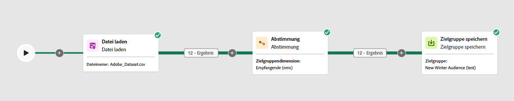

# Abstimmung {#reconciliation}

>[!CONTEXTUALHELP]
>id="acw_orchestration_reconciliation"
>title="Aktivität „Abstimmung“"
>abstract="Die **Abstimmung** -Aktivität **Targeting** -Aktivität, mit der Sie die Relation zwischen den Daten der Adobe Campaign-Datenbank und den Daten einer Arbeitstabelle definieren können. Beispiel: die **Abstimmung** -Aktivität platziert werden, nachdem eine **Datei laden** -Aktivität, um nicht standardmäßige Daten in die Datenbank zu importieren. In diesem Fall wird die **Abstimmung** ermöglicht die Definition der Relation zwischen den Daten der Adobe Campaign-Datenbank und den Daten der externen Tabelle."

>[!CONTEXTUALHELP]
>id="acw_orchestration_reconciliation_field"
>title="Abstimmung – Feld auswählen"
>abstract="Abstimmung – Feld auswählen"

>[!CONTEXTUALHELP]
>id="acw_orchestration_reconciliation_condition"
>title="Abstimmung – Bedingung erstellen"
>abstract="Abstimmung – Bedingung erstellen"

>[!CONTEXTUALHELP]
>id="acw_orchestration_reconciliation_complement"
>title="Abstimmung – Komplement erzeugen"
>abstract="Abstimmung – Komplement erzeugen"

Die **Abstimmung** -Aktivität **Targeting** -Aktivität, mit der Sie die Relation zwischen den Daten in der Adobe Campaign-Datenbank und den Daten in einer Arbeitstabelle definieren können, z. B. aus einer externen Datei geladene Daten.

Beispiel: die **Abstimmung** -Aktivität platziert werden, nachdem eine **Audience laden** -Aktivität, um nicht standardmäßige Daten in die Datenbank zu importieren. In diesem Fall wird die **Abstimmung** ermöglicht die Definition der Relation zwischen den Daten der Adobe Campaign-Datenbank und den Daten der Arbeitstabelle.

## Best Practices {#reconciliation-best-practices}

Während **Anreicherung** Mithilfe der Aktivität können Sie zusätzliche Daten definieren, die in Ihrem Workflow verarbeitet werden sollen (Sie können eine **Anreicherung** -Aktivität, um Daten aus mehreren Sätzen zu kombinieren oder Links zu einer temporären Ressource zu erstellen), wird die **Abstimmung** ermöglicht die Verknüpfung nicht identifizierter Daten mit vorhandenen Ressourcen.

>[!NOTE]
>Der Abstimmvorgang bedeutet, dass die Daten der verknüpften Dimensionen bereits in der Datenbank gespeichert sind.  Wenn Sie beispielsweise eine Verkaufsaktivitäten enthaltende Datei importieren möchten, in der verzeichnet ist, welches Produkt wann von welchem Kunden gekauft wurde, müssen sowohl das Produkt als auch der Kunde bereits in der Datenbank angelegt sein. Identifizierung der Daten:

## Konfigurieren der Aktivität Abstimmung {#reconciliation-configuration}

>[!CONTEXTUALHELP]
>id="acw_orchestration_reconciliation_targeting"
>title="Targeting dimension"
>abstract="Wählen Sie die neue Zielgruppendimension aus. Eine Dimension ermöglicht die Bestimmung der Zielpopulation: Empfänger, App-Abonnenten, Benutzer, Abonnenten usw. Standardmäßig ist die aktuelle Zielgruppendimension ausgewählt."

>[!CONTEXTUALHELP]
>id="acw_orchestration_reconciliation_rules"
>title="Abstimmungsregeln"
>abstract="Wählen Sie die für die Deduplizierung zu verwendenden Abstimmfelder aus. Es können mehrere Abstimmkriterien definiert werden."

>[!CONTEXTUALHELP]
>id="acw_orchestration_reconciliation_targeting_selection"
>title="Auswählen der Zielgruppendimension"
>abstract="Wählen Sie die Zielgruppendimension für Ihre eingehenden Daten aus, mit der abgestimmt werden soll."
>additional-url="https://experienceleague.adobe.com/docs/campaign-web/v8/audiences/gs-audiences-recipients.html#targeting-dimensions" text="Zielgruppendimensionen"

>[!CONTEXTUALHELP]
>id="acw_orchestration_keep_unreconciled_data"
>title="Nicht abgestimmte Daten beibehalten"
>abstract="Standardmäßig werden nicht abgestimmte Daten in der ausgehenden Transition beibehalten und stehen in der Arbeitstabelle zur späteren Verwendung zur Verfügung. Um nicht abgestimmte Daten zu entfernen, deaktivieren Sie die **Nicht abgestimmte Daten beibehalten** -Option."

>[!CONTEXTUALHELP]
>id="acw_orchestration_reconciliation_attribute"
>title="Abstimmattribut"
>abstract="Wählen Sie das Attribut aus, das zur Abstimmung der Daten verwendet werden soll, und klicken Sie auf Bestätigen."

Führen Sie die folgenden Schritte aus, um die **Abstimmung** Aktivität:

1. Ziehen und Ablegen eines **Abstimmung** in Ihren Workflow ein. Diese Aktivität sollte im Anschluss an eine Transition mit einer Population hinzugefügt werden, deren Zielgruppendimension nicht direkt aus Adobe Campaign stammt.

1. Wählen Sie die neue Zielgruppendimension aus. Eine Dimension ermöglicht die Bestimmung der Zielpopulation: Empfänger, App-Abonnenten, Benutzer, Abonnenten usw. [Weitere Informationen zu Zielgruppendimensionen](../../audience/about-recipients.md#targeting-dimensions).

1. Wählen Sie die für die Abstimmung zu verwendenden Felder aus. Es können mehrere Abstimmkriterien definiert werden.

   1. Um Attribute zur Abstimmung von Daten zu verwenden, wählen Sie die **Einfache Attribute** -Option. Die **Quelle** enthält die in der eingehenden Transition zur Verfügung stehenden Felder, die abgestimmt werden sollen. Die **Ziel** den Feldern der ausgewählten Zielgruppendimension entspricht. Daten werden abgestimmt, wenn Quelle und Ziel gleich sind. Wählen Sie beispielsweise die **Email** -Felder, um Profile anhand ihrer E-Mail-Adresse zu deduplizieren.

      Um weitere Abstimmkriterien hinzuzufügen, klicken Sie auf die Schaltfläche **Regel hinzufügen** Schaltfläche. Bei mehreren Abstimmkriterien müssen ALLE erfüllt sein, damit die Relation hergestellt werden kann.

      

   1. Um andere Attribute zur Abstimmung von Daten zu verwenden, wählen Sie die **Erweiterte Abstimmungsbedingungen** -Option. Anschließend können Sie mithilfe des Abfragemodells eine eigene Abstimmbedingung erstellen. Erfahren Sie, wie Sie das Abfragemodell in [diesem Abschnitt](../../query/query-modeler-overview.md).

1. Sie können Daten zur Abstimmung filtern, indem Sie **Filter erstellen** Schaltfläche. Auf diese Weise können Sie eine benutzerdefinierte Bedingung mithilfe der [Abfragemodellierung](../../query/query-modeler-overview.md).

Standardmäßig werden nicht abgestimmte Daten in der ausgehenden Transition beibehalten und stehen in der Arbeitstabelle für die zukünftige Verwendung zur Verfügung. Um nicht abgestimmte Daten zu entfernen, deaktivieren Sie die **Nicht abgestimmte Daten beibehalten** -Option.

## Beispiel {#reconciliation-example}

Das folgende Beispiel zeigt einen Workflow zur Erstellung einer Profil-Audience, die direkt von einer importierten Datei mit neuen Kunden ausgeht. Er setzt sich aus folgenden Aktivitäten zusammen:

Der Workflow setzt sich folgendermaßen zusammen:




Er wird mit den folgenden Aktivitäten erstellt:

* Eine [Datei laden](load-file.md)-Aktivität lädt eine Datei mit Profildaten hoch, die aus einem externen Tool extrahiert wurden.

  Beispiel:

  ```
  lastname;firstname;email;birthdate;
  JACKMAN;Megan;megan.jackman@testmail.com;07/08/1975;
  PHILLIPS;Edward;phillips@testmail.com;09/03/1986;
  WEAVER;Justin;justin_w@testmail.com;11/15/1990;
  MARTIN;Babe;babeth_martin@testmail.net;11/25/1964;
  REESE;Richard;rreese@testmail.com;02/08/1987;
  ```

* A **Abstimmung** -Aktivität, die die eingehenden Daten als Profile identifiziert, indem die **email** und **Geburtsdatum** -Felder als Abstimmkriterien.

  

* A [Audience-Speicherung](save-audience.md) -Aktivität, um eine neue Zielgruppe auf der Grundlage dieser Aktualisierungen zu erstellen. Sie können auch die **Audience-Speicherung** Aktivität durch **Ende** Aktivität , wenn keine bestimmte Zielgruppe erstellt oder aktualisiert werden muss. Empfängerprofile werden in jedem Fall aktualisiert, wenn Sie den Workflow ausführen.


## Kompatibilität {#reconciliation-compat}

Die **Abstimmung** -Aktivität nicht in der Client-Konsole vorhanden ist. Alle **Anreicherungen** Aktivitäten, die in der Clientkonsole mit aktivierten Abstimmungsoptionen erstellt wurden, werden als **Abstimmung** Aktivitäten in der Web-Benutzeroberfläche von Campaign.
