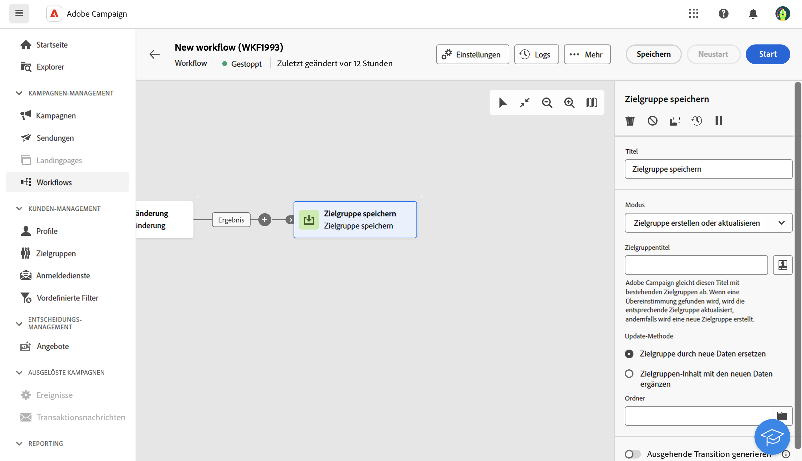

# Zielgruppe speichern {#save-audience}

<!--
>[!CONTEXTUALHELP]
>id="acw_orchestration_saveaudience_activity"
>title="Save an audience"
>abstract="Use this activity to save the workflow audience."
-->

Die Aktivität **Zielgruppe speichern** ist eine Aktivität zur **Zielgruppenbestimmung**. Mit dieser Aktivität können Sie eine vorhandene Zielgruppe aktualisieren oder eine neue Zielgruppe aus der Population erstellen, die im Vorfeld durch andere Workflow-Aktivitäten ermittelt wurde. Die Zielgruppen werden zur bereits bestehenden Zielgruppenliste in Adobe Campaign hinzugefügt und sind über das Menü **Zielgruppen** zugänglich.

Die Aktivität wird im Wesentlichen verwendet, um Populationsgruppen beizubehalten, die im selben Workflow ermittelt wurden, indem sie in wiederverwendbare Zielgruppen umgewandelt werden. Verbinden Sie sie mit anderen Zielgruppenbestimmungsaktivitäten, wie etwa den Aktivitäten **Zielgruppe aufbauen** oder **Kombinieren**.

## Konfigurieren der Aktivität „Zielgruppe speichern“{#save-audience-configuration}

Führen Sie die folgenden Schritte aus, um die Aktivität **Zielgruppe aufbauen** zu konfigurieren:

1. Fügen Sie die Aktivität **Zielgruppe speichern** zum Workflow hinzu.

1. Wählen Sie im Dropdown-Menü **Modus** die Aktion aus, die Sie ausführen möchten:

   * **Erstellen oder Aktualisieren einer vorhandenen Zielgruppe**: Definieren Sie eine **Zielgruppenbezeichnung**. Wenn die Zielgruppe bereits existiert, wird sie aktualisiert, andernfalls wird eine neue Zielgruppe erstellt.

   * **Vorhandene Zielgruppe aktualisieren**: Wählen Sie die **Zielgruppe**, die Sie aktualisieren möchten, in der Liste der vorhandenen Zielgruppen aus.

1. Wählen Sie den **Aktualisierungsmodus** aus, der für vorhandene Zielgruppen gelten soll:

   * **Zielgruppeninhalt durch neue Daten ersetzen**: Der gesamte Inhalt der Zielgruppe wird ersetzt. Die zuvor enthaltenen Daten gehen dabei verloren. Nur die in der eingehenden Transition der Aktivität „Zielgruppe speichern“ übermittelten Daten werden beibehalten. Bei dieser Option werden Zielgruppendimension und -typ der aktualisierten Zielgruppe gelöscht.

   * **Zielgruppeninhalt mit den neuen Daten ergänzen**: Der alte Zielgruppeninhalt wird beibehalten und die Daten der eingehenden Transition der Aktivität „Zielgruppe speichern“ wird hinzugefügt.

1. Markieren Sie die Option **Ausgehende Transition erzeugen**, wenn Sie eine Transition nach der Aktivität **Zielgruppe speichern** hinzufügen möchten.

Der Inhalt der gespeicherten Zielgruppe ist anschließend in der Detailansicht der Zielgruppe verfügbar, auf die Sie im Menü **Zielgruppen** zugreifen können. Die in dieser Ansicht verfügbaren Spalten entsprechen den Spalten in der eingehenden Transition der Aktivität **Zielgruppe speichern** des Workflows.

## Beispiel{#save-audience-example}

Im folgenden Beispiel wird eine einfache Zielgruppenaktualisierung von der Zielgruppenbestimmung aus gezeigt. Eine Planung wird hinzugefügt, um den Workflow einmal monatlich auszuführen. Eine Abfrage ruft alle Profile ab, die für die verschiedenen verfügbaren Anwendungsdienste angemeldet sind. Die Aktivität **Zielgruppe speichern** aktualisiert in diesem Fall die angegebene Zielgruppe, indem die Profile, die seit der letzten Ausführung des Workflows den Informationsdienst abbestellt haben, gelöscht und die neu abonnierten Profile hinzugefügt werden.
