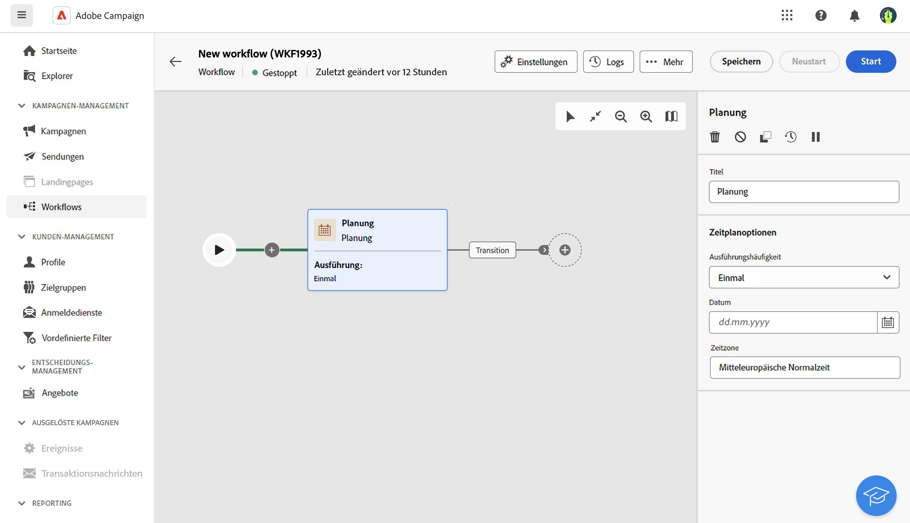
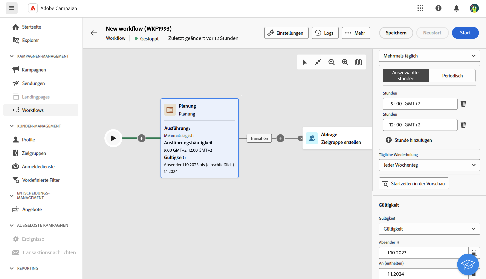

# Planung {#scheduler}

>[!CONTEXTUALHELP]
>id="acw_orchestration_scheduler"
>title="Planungsaktivität"
>abstract="Mit der Aktivität **Planung** können Sie planen, wann der Workflow gestartet werden soll. Diese Aktivität sollte als geplanter Start betrachtet werden. Sie kann nur als erste Aktivität des Workflows verwendet werden."

Die Aktivität **Planung** ist eine Aktivität zur **Flusssteuerung**. Damit können Sie planen, wann der Workflow gestartet werden soll. Diese Aktivität sollte als geplanter Start betrachtet werden. Sie kann nur als erste Aktivität des Workflows verwendet werden.

## Best Practices {#scheduler-best-practices}

* Es wird empfohlen, Workflows nicht öfter als alle 15 Minuten auszuführen, da die Gesamtleistung des Systems beeinträchtigt werden kann und Blöcke in der Datenbank entstehen können.
* Um einen einmaligen Versand in Ihrem Workflow zu senden, können Sie eine Aktivität „Planung“ hinzufügen und für sie festlegen, dass sie **einmal** ausgeführt wird. Definieren Sie **Zeitplan** in den Versandeinstellungen.
* Um einen wiederkehrenden Versand in Ihrem Workflow durchzuführen, müssen Sie die Aktivität **Planung** verwenden und die Ausführungshäufigkeit festlegen. Die Aktivität „Wiederkehrender Versand“ ermöglicht keine Festlegung eines Zeitplans.

## Konfigurieren der Aktivität „Planung“ {#scheduler-configuration}

>[!CONTEXTUALHELP]
>id="acw_orchestration_schedule_validity"
>title="Gültigkeit der Planung"
>abstract="Sie können einen Gültigkeitszeitraum für die Planung definieren. Er kann dauerhaft sein (Standard) oder bis zu einem bestimmten Datum gültig sein."

>[!CONTEXTUALHELP]
>id="acw_orchestration_schedule_options"
>title="Planungsoptionen"
>abstract="Definieren Sie die Häufigkeit der Planung. Er kann zu einem bestimmten Zeitpunkt, einmal oder mehrmals pro Tag, Woche oder Monat, ausgeführt werden."

Gehen Sie folgendermaßen vor, um die Aktivität **Planung** zu konfigurieren:

1. Fügen Sie eine **Planungsaktivität** zu Ihrem Workflow hinzu.

1. Konfigurieren Sie die **Ausführungshäufigkeit**:

   * **Einmal**: Der Workflow wird nur einmal ausgeführt.
   * **Täglich**: Der Workflow wird jeden Tag einmal zu einem bestimmten Zeitpunkt ausgeführt.
   * **Mehrmals pro Tag**: Der Workflow wird wiederholt zu bestimmten Zeiten am Tag ausgeführt. Richten Sie Ausführungen zu bestimmten Zeiten oder in regelmäßigen Abständen ein.
   * **Wöchentlich**: Der Workflow wird wiederholt zu bestimmten Zeiten in der Woche ausgeführt.
   * **Monatlich**: Der Workflow wird wiederholt zu bestimmten Zeiten im Monat ausgeführt. Wählen Sie die Monate aus, in denen der Workflow ausgeführt werden soll. Sie können für die Ausführung von Workflows auch bestimmte Wochentage des Monats auswählen, z. B. am zweiten Dienstag des Monats.

1. Definieren Sie die Ausführungsdetails. Je nach gewählter Frequenz sind verschiedene Parameter (Uhrzeit, Ausführungsintervall, bestimmte Tage un ähnliche Optionen) zu konfigurieren.

1. Klicken Sie auf **Vorschau der Startzeiten anzeigen**, um den Zeitplan der nächsten zehn Ausführungen Ihres Workflows zu überprüfen.

1. Definieren Sie den Gültigkeitszeitraum der Planung:

   * **Permanent (läuft nie ab)**: Der Workflow wird entsprechend der angegebenen Häufigkeit ausgeführt, ohne Begrenzungen, was den Zeitrahmen oder die Anzahl von Iterationen betrifft.
   * **Gültigkeitszeitraum**: Der Workflow wird in der angegebenen Häufigkeit bis zu einem bestimmten Datum ausgeführt. Geben Sie Start- und Enddatum ein. 

>[!NOTE]
>Wenn Sie den Workflow sofort starten möchten, klicken Sie auf die Schaltfläche **Ausstehende Aufgabe ausführen** in der oberen Symbolleiste der Planung. Diese Schaltfläche ist nur verfügbar, wenn der Workflow gestartet wurde.

## Beispiel {#scheduler-example}

Im folgenden Beispiel wird die Aktivität so konfiguriert, dass der Workflow mehrmals am Tag um 9 Uhr und 12 Uhr ausgeführt wird, und zwar jeden Wochentag vom 1. Oktober 2023 bis zum 1. Januar 2024.

