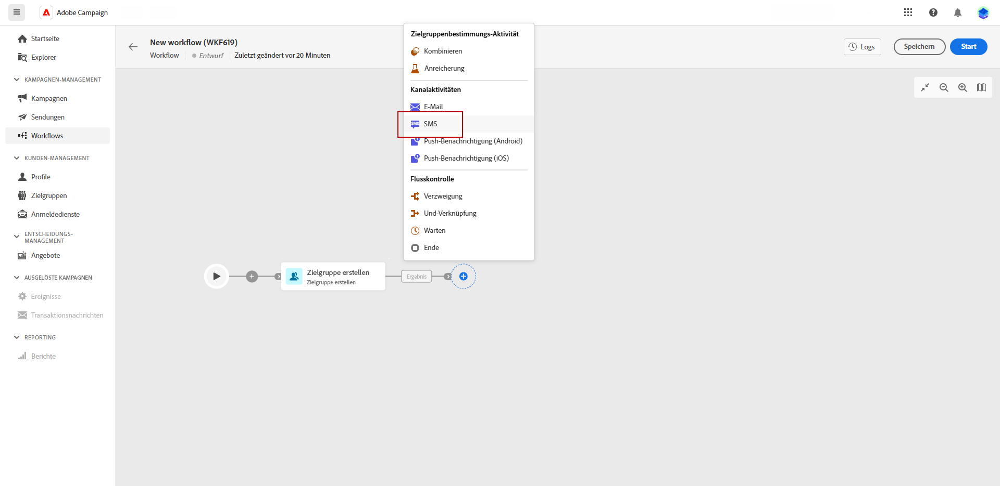

# SMS {#sms}

Die **SMS**-Aktivität bietet die Möglichkeit, innerhalb eines Workflows SMS-Nachrichten zu senden. Sie ermöglicht die Automatisierung des SMS-Versands an eine bestimmte Zielgruppe, die innerhalb desselben Workflows bestimmt wird.

Um die Empfängerinnen und Empfänger der SMS zu definieren, können Sie diese im Workflow vor der SMS-Versandaktivität mithilfe der Aktivität „Zielgruppe aufbauen“ einrichten. Weitere Informationen.

1. Fügen Sie nach dem Erstellen und Konfigurieren eines neuen Workflows die Aktivität „Zielgruppe aufbauen“ hinzu, um eine vorhandene Zielgruppe auszuwählen, oder verwenden Sie den Regel-Builder, um Ihre eigene Abfrage zu definieren.

1. Fügen Sie eine SMS-Kanal-Aktivität in Ihren Workflow ein.

   
<!--
1. Select the Type of delivery:

    * Single delivery: Choose this option if you want the SMS to be sent only once. You have the flexibility to choose whether or not to include an outbound transition from this activity.

    * Recurring delivery: Choose this option if you want the SMS to be sent multiple times based on a defined frequency. The frequency can be configured using a Scheduler activity, allowing you to schedule the SMS to be sent at regular intervals.
-->

1. Wählen Sie Ihre Aktivität aus. Wählen Sie im Versandmenü die Vorlagen aus, die Sie für diesen Versand verwenden möchten. Weitere Informationen zu Vorlagen

1. Wählen Sie „Versand erstellen“ aus, um Ihren SMS-Versand zu konfigurieren. Weitere Informationen zum SMS-Versand finden Sie auf dieser Seite.

1. Sobald der Versand fertig ist, navigieren Sie zu Ihrem Workflow und klicken Sie auf „Starten“, um den Workflow zu starten.

1. Standardmäßig wird durch die Initiierung eines Versand-Workflows die Vorbereitungsphase der Nachricht ausgelöst, ohne dass die Nachricht sofort versendet wird.

   Klicken Sie im erweiterten Menü Ihrer SMS-Aktivität auf „Überprüfen und senden“, um das Senden zu bestätigen.

1. Klicken Sie im Dashboard Ihres SMS-Versands auf „Senden“.
