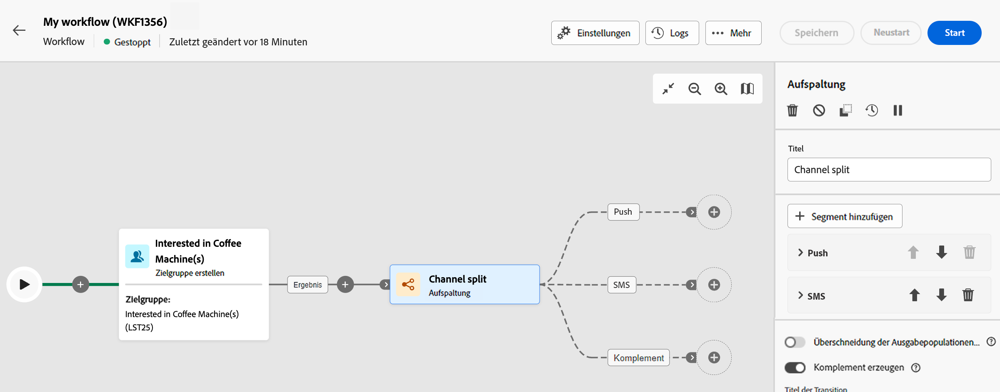

# Aufspaltung {#split}

>[!CONTEXTUALHELP]
>id="acw_orchestration_split"
>title="Aktivität „Aufspaltung“"
>abstract="Mit der Aktivität **Aufspaltung** können eingehende Populationen basierend auf unterschiedlichen Auswahlkriterien in mehrere Teilmengen segmentiert werden, z. B. Filterregeln oder Populationsgröße."

Die Aktivität **Aufspaltung** ist eine Aktivität zur **Zielgruppenbestimmung**, mit der Sie eingehende Populationen basierend auf unterschiedlichen Auswahlkriterien in mehrere Teilmengen segmentieren können, z. B. Filterregeln oder Populationsgröße.

## Konfigurieren der Aufspaltungsaktivität {#split-configuration}

>[!CONTEXTUALHELP]
>id="acw_orchestration_split_segments"
>title="Segmente für die Aktivität „Aufspaltung“"
>abstract="Es können beliebig viele Teilmengen hinzugefügt werden, um die eingehende Population zu segmentieren.  Bei Ausführung der Aktivität **Aufspaltung** wird die Population sukzessive in unterschiedliche Teilmengen segmentiert, und zwar in der Reihenfolge, in der diese zur Aktivität hinzugefügt werden. Vergewissern Sie sich vor dem Start Ihres Workflows, dass Sie die Teilmengen mithilfe der Pfeilschaltflächen in der für Sie passenden Reihenfolge angeordnet haben."

>[!CONTEXTUALHELP]
>id="acw_orchestration_split_filter"
>title="Filter „Aufspaltungsaktivität“"
>abstract="Auf **[!UICONTROL Filter erstellen]** klicken und die gewünschte Filterregel mithilfe des Abfrage-Modelers konfigurieren, um eine Filterbedingung auf die Teilmenge anzuwenden. Es können beispielsweise Profile aus der eingehenden Population eingeschlossen werden, deren E-Mail-Adresse in der Datenbank vorhanden ist."
>additional-url="https://experienceleague.adobe.com/de/docs/campaign-web/v8/query-database/query-modeler-overview" text="Arbeiten mit dem Abfrage-Modeler"

>[!CONTEXTUALHELP]
>id="acw_orchestration_split_limit"
>title="Begrenzung der Aufspaltungsaktivität"
>abstract="Um die Anzahl der von der Teilmenge ausgewählten Profile zu begrenzen, muss **[!UICONTROL Grenzwert aktivieren]** aktiviert und die Anzahl oder der Prozentsatz der einzuschließenden Population angegeben werden."

>[!CONTEXTUALHELP]
>id="acw_orchestration_split_sorting"
>title="Sortierung der Aufspaltungsaktivität"
>abstract="Beim Festlegen einer Populationsbegrenzung für eine Teilmenge können die ausgewählten Profile anhand eines bestimmten Profilattributs in auf- oder absteigender Reihenfolge sortiert werden. Dazu die Option **Sortierung aktivieren** einschalten. Teilmengen können z. B. so eingeschränkt werden, dass nur die 50 Top-Profile mit dem höchsten Einkaufsbetrag einbezogen werden."

>[!CONTEXTUALHELP]
>id="acw_orchestration_split_complement"
>title="Aufspaltung – Komplement erzeugen"
>abstract="Nachdem Sie alle Teilmengen konfiguriert haben, kann die verbleibende Population ausgewählt werden, die keiner der Teilmengen entspricht, und in eine zusätzliche ausgehende Transition eingeschlossen werden. Schalten Sie dazu die Option **Komplement erzeugen** ein."

>[!CONTEXTUALHELP]
>id="acw_orchestration_split_generatesubsets"
>title="Alle Teilmengen in derselben Tabelle erzeugen"
>abstract="Diese Option aktivieren, um alle Teilmengen in einer Ausgabetransition zusammenzufassen."

>[!CONTEXTUALHELP]
>id="acw_orchestration_split_emptytransition"
>title="Leere Transition überspringen"
>abstract="Die Option **[!UICONTROL Leere Transition überspringen]** aktivieren, um die ausgehende Transition für diese Teilmenge zu deaktivieren, wenn die Eingangspopulation leer ist."

>[!CONTEXTUALHELP]
>id="acw_orchestration_split_enable_overlapping"
>title="Überlappen von Ausgabepopulationen ermöglichen"
>abstract=" Die Option **[!UICONTROL Überschneidung der Ausgabepopulationen zulassen]** ermöglicht den Umgang mit Populationen, die in mehreren Teilmengen enthalten sind. Wenn diese Option deaktiviert ist, stellt die Aufspaltung sicher, dass ein Profil nur in einer Ergebnismenge enthalten ist, auch wenn es den Kriterien anderer Teilmengen entspricht. Das Profil ist in der ersten Teilmenge enthalten, dessen Kriterien es entspricht. Wenn die Option aktiviert ist, sind die Profile in allen Teilmengen enthalten, deren Filterkriterien sie erfüllen. Es wird für Adobe Campaign jedoch empfohlen, keine Überschneidungen zuzulassen."

Folgen Sie diesen Schritten, um die Aktivität **Aufspaltung** zu konfigurieren:

1. Fügen Sie eine Aktivität **Aufspaltung** zum Workflow hinzu.

1. Der Konfigurationsbereich für die Aktivität wird mit einer standardmäßigen Teilmenge geöffnet. Klicken Sie auf die Schaltfläche **Segment hinzufügen**, um so viele Teilmengen wie gewünscht zum Segmentieren der eingehenden Population hinzuzufügen.

   

   >[!IMPORTANT]
   >
   >Bei Ausführung der Aktivität **Aufspaltung** wird die Population sukzessive in unterschiedliche Teilmengen segmentiert, und zwar in der Reihenfolge, in der diese zur Aktivität hinzugefügt werden. Wenn beispielsweise die erste Teilmenge 70 % der Anfangspopulation abruft, werden die Auswahlkriterien der nächsten hinzugefügten Teilmenge nur auf die restlichen 30 % angewendet usw.
   >
   >Vergewissern Sie sich vor dem Start Ihres Workflows, dass Sie die Teilmengen in der für Sie passenden Reihenfolge angeordnet haben. Verwenden Sie dazu die Pfeilschaltflächen, um die Position einer Teilmenge zu ändern.

1. Sobald die Teilmengen hinzugefügt wurden, zeigt die Aktivität für jede Teilmenge eine ausgehende Transition. Es wird dringend empfohlen, die Titel jeder Teilmenge zu ändern, um sie in der Workflow-Arbeitsfläche leicht zu identifizieren.

1. Konfigurieren Sie, wie jede Teilmenge die eingehende Population filtern soll. Gehen Sie dazu wie folgt vor:

   1. Öffnen Sie die Teilmenge, um ihre Eigenschaften anzuzeigen.

   1. Auf **[!UICONTROL Filter erstellen]** klicken und die gewünschte Filterregel mithilfe des Abfrage-Modelers konfigurieren, um eine Filterbedingung auf die Teilmenge anzuwenden. Es können beispielsweise Profile aus der eingehenden Population eingeschlossen werden, deren E-Mail-Adresse in der Datenbank vorhanden ist.  [Erfahren Sie mehr über die Arbeit mit dem Abfrage-Modeler](../../query/query-modeler-overview.md)

   1. Um die Anzahl der von der Teilmenge ausgewählten Profile zu begrenzen, muss **[!UICONTROL Grenzwert aktivieren]** aktiviert und die Anzahl oder der Prozentsatz der einzuschließenden Population angegeben werden.

   1. Um eine Transition zu deaktivieren, wenn die Eingangspopulation leer ist, aktivieren Sie die Option **[!UICONTROL Leere Transition überspringen]**. Wenn kein Profil mit der Teilmenge übereinstimmt, geht der Workflow nicht zur nächsten Aktivität über.

      

      >[!NOTE]
      >
      >Beim Festlegen einer Populationsbegrenzung für eine Teilmenge können die ausgewählten Profile anhand eines bestimmten Profilattributs in auf- oder absteigender Reihenfolge sortiert werden. Dazu die Option **[!UICONTROL Sortierung aktivieren]** einschalten. Teilmengen können z. B. so eingeschränkt werden, dass nur die 50 Top-Profile mit dem höchsten Einkaufsbetrag einbezogen werden.

1. Nachdem Sie alle Teilmengen konfiguriert haben, kann die verbleibende Population ausgewählt werden, die keiner der Teilmengen entspricht, und in eine zusätzliche ausgehende Transition eingeschlossen werden. Schalten Sie dazu die Option **[!UICONTROL Komplement erzeugen]** ein.

   

   >[!NOTE]
   >
   >Die Option **[!UICONTROL Alle Teilmengen in derselben Tabelle generieren]** ermöglicht die Gruppierung aller Teilmengen in einer ausgehenden Transition.

1. Die Option **[!UICONTROL Überlappung der Ausgabepopulationen zulassen]** ermöglicht den Umgang mit Profilen, die in mehreren Teilmengen enthalten sind:

   * Wenn diese Option deaktiviert ist, stellt die Aufspaltung sicher, dass ein Profil nur in einer Ergebnismenge enthalten ist, auch wenn es den Kriterien anderer Teilmengen entspricht. Das Profil ist in der ersten Teilmenge enthalten, dessen Kriterien es entspricht.
   * Wenn die Option aktiviert ist, sind die Profile in allen Teilmengen enthalten, deren Filterkriterien sie erfüllen. Es wird für Adobe Campaign jedoch empfohlen, keine Überschneidungen zuzulassen.

Der Aktivität ist jetzt konfiguriert. Bei der Ausführung des Workflows wird die Population in die verschiedenen Teilmengen segmentiert, und zwar in der Reihenfolge, in der diese der Aktivität hinzugefügt wurden.

## Beispiel{#split-example}

Im folgenden Beispiel wird die Aktivität **[!UICONTROL Aufspaltung]** verwendet, um eine Zielgruppe basierend auf dem Kommunikationskanal, den wir verwenden möchten, in verschiedene Teilmengen zu unterteilen:

* **Teilmenge 1 „Push“**: Diese Teilmenge umfasst alle Profile, die unsere Mobile App installiert haben.
* **Teilmenge 2 „SMS“**: Benutzende von Mobiltelefonen: Für die verbleibende Population, die nicht in Teilmenge 1 fiel, wendet Teilmenge 2 eine Filterregel an, um Profile mit Mobiltelefonen in der Datenbank auszuwählen.
* **Komplement-Transition**: Diese Transition erfasst alle verbleibenden Profile, die weder Teilmenge 1 noch Teilmenge 2 entsprachen. Insbesondere enthält sie Profile, die weder die Mobile App installiert haben noch über ein Mobiltelefon verfügen, z. B. Benutzende, die die Mobile App nicht installiert haben oder keine registrierte Mobiltelefonnummer haben.

