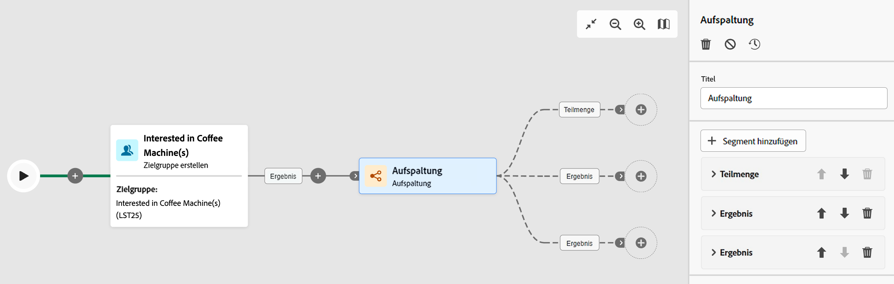

# Aufspaltung {#split}

Die **Aufspaltung** -Aktivität **Targeting** -Aktivität, mit der Sie eingehende Populationen basierend auf unterschiedlichen Auswahlkriterien in mehrere Teilmengen segmentieren können, z. B. Filterregeln oder Populationsgröße.

## Konfiguration {#general}

Führen Sie die folgenden Schritte aus, um die **Aufspaltung** Aktivität:

1. Hinzufügen einer **Aufspaltung** -Aktivität zu Ihrem Workflow hinzu.

1. Der Konfigurationsbereich für die Aktivität wird mit einer Standarduntergruppe geöffnet. Klicken Sie auf **Segment hinzufügen** -Schaltfläche, um beliebig viele Teilmengen zur Segmentierung der eingehenden Population hinzuzufügen.

   

   >[!IMPORTANT]
   >
   >Bei Ausführung der Aufspaltung wird die Population in der Reihenfolge segmentiert, in der sie zur Aktivität hinzugefügt wird. Wenn beispielsweise die erste Teilmenge 70 % der Ursprungspopulation abruft, wendet die nächste hinzugefügte Teilmenge ihre Auswahlkriterien nur auf die restlichen 30 % an usw.
   >
   > Stellen Sie vor der Konfiguration Ihrer Teilmengen sicher, dass Sie sie in der richtigen Reihenfolge hinzugefügt haben, da ihre Position nicht geändert werden kann.

1. Nachdem Teilmengen hinzugefügt wurden, zeigt die Aktivität so viele ausgehende Transitionen an, wie es Teilmengen gibt. Es wird dringend empfohlen, die Beschriftung jeder Teilmenge zu ändern, um sie in der Arbeitsfläche des Workflows leicht zu identifizieren.

1. Konfigurieren Sie, wie jede Teilmenge die eingehende Population filtern soll. Gehen Sie dazu wie folgt vor:

   1. Öffnen Sie die Teilmenge, um ihre Eigenschaften anzuzeigen.

   1. Um eine Filterbedingung auf die Teilmenge anzuwenden, klicken Sie auf **[!UICONTROL Filter erstellen]** und konfigurieren Sie die gewünschte Filterregel. Schließen Sie beispielsweise Profile aus der eingehenden Population ein, deren E-Mail-Adresse in der Datenbank vorhanden ist.

   1. Um die Anzahl der von der Teilmenge ausgewählten Profile zu begrenzen, aktivieren Sie die **[!UICONTROL Begrenzung aktivieren]** und geben Sie die Anzahl oder den Prozentsatz der einzuschließenden Population an.

      >[!NOTE]
      >
      >Beim Festlegen einer Populationsbegrenzung für eine Teilmenge können Sie die ausgewählten Profile anhand eines bestimmten Profilattributs in auf- oder absteigender Reihenfolge sortieren. Schalten Sie dazu die **[!UICONTROL Sortierung aktivieren]** -Option. Sie können beispielsweise eine Teilmenge so einschränken, dass nur die 50 wichtigsten Profile mit dem höchsten Einkaufsbetrag einbezogen werden.

   

1. Nachdem Sie alle Teilmengen konfiguriert haben, können Sie die verbleibende Population auswählen, die keiner der Teilmengen entspricht, und sie in eine zusätzliche ausgehende Transition einschließen. Schalten Sie dazu die **[!UICONTROL Komplement erzeugen]** -Option.

   

Die Aktivität ist jetzt konfiguriert. Bei der Ausführung des Workflows wird die Population in die verschiedenen Teilmengen segmentiert, und zwar in der Reihenfolge, in der sie der Aktivität hinzugefügt wurde.

## Beispiel

Im folgenden Beispiel wird die **[!UICONTROL Aufspaltung]** -Aktivität wird verwendet, um eine Zielgruppe basierend auf dem Kommunikationskanal, den wir verwenden möchten, in verschiedene Teilmengen zu unterteilen:

* **Untergruppe 1 &quot;Push&quot;**: Diese Teilmenge umfasst alle Profile, die unsere Mobile App installiert haben.
* **Untergruppe 2 &quot;sms&quot;**: Mobiltelefon-Benutzer: Für die verbleibende Population, die nicht in Untergruppe 1 fiel, wendet Untergruppe 2 eine Filterregel an, um Profile mit Mobiltelefonen in der Datenbank auszuwählen.
* **Komplement-Transition**: Diese Transition erfasst alle verbleibenden Profile, die nicht mit Untergruppe 1 oder Untergruppe 2 übereinstimmten. Insbesondere enthält es Profile, die weder die Mobile App installiert noch über ein Mobiltelefon verfügen, z. B. Benutzer, die die Mobile App nicht installiert haben oder keine registrierte Mobiltelefonnummer haben.

