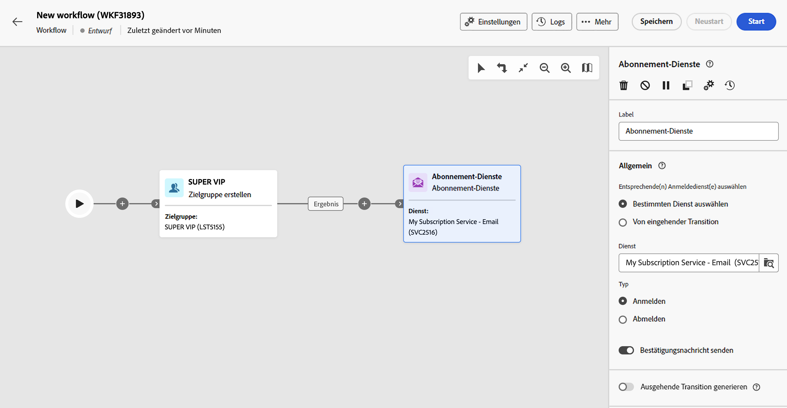

# Anmeldedienste {#subscription-services}

>[!CONTEXTUALHELP]
>id="acw_orchestration_subscription"
>title="Aktivität „Anmeldedienste“"
>abstract="Die Aktivität „Anmeldedienste“ ermöglicht es, mehrere Profile gleichzeitig und in einer einzigen Aktion für einen Dienst an- bzw. von einem Dienst abzumelden."

>[!CONTEXTUALHELP]
>id="acw_orchestration_subscription_general"
>title="Allgemeine Anmeldedienst-Parameter"
>abstract="Wählen Sie den gewünschten Dienst und die auszuführende Aktion (An- oder Abmeldung) aus. Aktivieren Sie die Option **Bestätigungsnachricht senden**, um die Population von ihrer An- bzw. Abmeldung bei dem ausgewählten Dienst in Kenntnis zu setzen."

>[!CONTEXTUALHELP]
>id="acw_orchestration_subscription_outboundtransition"
>title="Ausgehende Transition erzeugen"
>abstract="Die Option **Ausgehende Transition erzeugen einschalten**, um eine Transition nach der Aktivität hinzuzufügen."

>[!CONTEXTUALHELP]
>id="acw_orchestration_subscription_additionalinfo"
>title="Zusätzliche Informationen"
>abstract="Zusätzliche Informationen"

Die Aktivität **Anmeldedienste** ist eine **Daten-Management**-Aktivität. Darüber können Sie eine Anmeldung zu einem Informationsdienst für die in der Transition angegebene Population erstellen oder löschen.

## Konfigurieren der Aktivität „Anmeldedienste“ {#subscription-services-configuration}

Führen Sie die folgenden Schritte aus, um die Aktivität **Anmeldedienste** zu konfigurieren:

1. Fügen Sie eine Aktivität **Anmeldedienste** zu Ihrem Workflow hinzu. Sie können diese Aktivität beispielsweise im Anschluss an eine Zielgruppenbestimmung von Profilen oder den Import einer Datei mit identifizierten Daten verwenden.

1. Wählen Sie mit einer der folgenden Optionen den Dienst aus, für den Sie An- bzw. Abmeldungen vornehmen möchten:

   * **[!UICONTROL Bestimmten Dienst auswählen]**: Wählen Sie einen Dienst über das Feld **[!UICONTROL Dienst]** manuell aus.

   * **[!UICONTROL Von eingehender Transition]**: Verwenden Sie den in der eingehenden Transition angegebenen Dienst. Beispielsweise können Sie eine Datei importieren, in der der zu verwaltende Dienst für jede Zeile spezifiziert wird. Der Dienst, für den der Vorgang ausgeführt werden soll, wird dann für jedes Profil dynamisch ausgewählt.

   

1. Wählen Sie den auszuführenden Vorgang aus: **Anmelden** oder **Abmelden**.

   Wenn der Dienst in der eingehenden Transition definiert ist, können Sie festlegen, wie dieser Vorgang abgerufen werden soll:

   * **Bestimmten Aktionstyp auswählen**: Wählen Sie den durchzuführenden Vorgang (**Anmelden** oder **Abmelden**) manuell aus.

   * **Aktionstyp aus einem Pfad der eingehenden Transition auswählen**: Wählen Sie die Spalte der eingehenden Daten aus, in der für jeden Eintrag der auszuführende Vorgang angegeben ist. Beispielsweise können Sie eine Datei importieren, in der der Vorgang festgelegt ist, der für jede Zeile in einer Spalte „Vorgang“ durchzuführen ist. 

     Hier können nur die Felder „Boolean“ oder „Integer“ ausgewählt werden. Stellen Sie sicher, dass die Daten, die den auszuführenden Vorgang enthalten, diesem Format entsprechen. Wenn Sie beispielsweise Daten aus einer Aktivität „Datei laden“ laden, überprüfen Sie, ob Sie das Format der Spalte, die den Vorgang enthält, in der Aktivität **[!UICONTROL Datei laden]** korrekt festgelegt haben. Ein Beispiel finden Sie in [diesem Abschnitt](#uc2).

     >[!CAUTION]
     >
     >Wenn Sie diese Option auswählen, wird bei der Aktivität **Abonnements** standardmäßig davon ausgegangen, über eine Link-Definition für die Tabelle **Dienste (nms)** zu verfügen, die im Workflow eingerichtet wurde. Dazu müssen Sie sicherstellen, dass Sie höher im Workflow einen Abstimm-Link in einer **Anreicherungsaktivität** konfiguriert haben. Ein Beispiel für die Verwendung dieser Option ist [hier](#uc2) verfügbar.

   

1. Um Empfängerinnen und Empfänger von ihrer An- bzw. Abmeldung bei dem ausgewählten Dienst in Kenntnis zu setzen, aktivieren Sie die Option **[!UICONTROL Bestätigungsnachricht senden]**. Der Inhalt dieser Nachricht wird in einer Versandvorlage für den Informationsdienst definiert.

1. Wenn Sie Daten aus einer eingehenden Transition verwenden, wird ein Abschnitt **[!UICONTROL Zusätzliche Informationen]** angezeigt, in dem Sie die Daten und den Ursprung der Anmeldung für jeden Eintrag angeben können. Sie können diesen Abschnitt leer lassen. In diesem Fall wird aber kein Datum oder kein Ursprung bei der Ausführung des Workflows festgelegt.

   * Wenn die eingehenden Daten eine Spalte enthalten, die das Anmeldedatum des Profils für den Dienst angibt, können Sie diese im Feld **[!UICONTROL Datum]** auswählen.

   * Definieren Sie im Feld **[!UICONTROL Ursprungspfad]** den Ursprung der Anmeldung. Sie können dazu den Wert eines der Felder der eingehenden Daten oder eine beliebige Konstante verwenden, indem Sie die Option **[!UICONTROL Konstante als Ursprung festlegen]** aktivieren. 

   

1. Um eine ausgehende Transition nach der Aktivität hinzuzufügen, aktivieren Sie die Option **[!UICONTROL Ausgehende Transition erzeugen]**.

## Beispiele {#example}

### Anmelden einer Zielgruppe für einen bestimmten Dienst {#uc1}

Der folgende Workflow zeigt, wie Sie eine Zielgruppe für einen vorhandenen Dienst anmelden.



* Die Aktivität **[!UICONTROL Zielgruppe erstellen]** richtet sich an eine bestehende Zielgruppe.

* Mit der Aktivität **[!UICONTROL Anmeldedienste]** können Sie den Dienst auswählen, bei dem die Profile angemeldet sein müssen.

### Aktualisieren von mehreren Abonnementstatus über eine Datei {#uc2}

Der nachfolgende Workflow zeigt, wie Sie eine Datei mit Profilen importieren und die zugehörigen Abonnements für mehrere in der Datei angegebene Dienste aktualisieren.


* Mit der Aktivität **[!UICONTROL Datei laden]** wird eine CSV-Datei mit Daten geladen und die Struktur der importierten Spalten definiert. In den Spalten „Dienst“ und „Vorgang“ werden der zu aktualisierende Dienst und der auszuführende Vorgang (An- oder Abmeldung) angegeben.

  ```
  Lastname,firstname,city,birthdate,email,service,operation
  Smith,Hayden,Paris,23/05/1985,hayden.smith@example.com,yoga,sub
  Mars,Daniel,London,17/11/1999,danny.mars@example.com,running,sub
  Smith,Clara,Roma,08/02/1979,clara.smith@example.com,running,unsub
  Durance,Allison,San Francisco,15/12/2000,allison.durance@example.com,yoga,sub
  Durance,Alison,San Francisco,15/12/2000,allison.durance@example.com,running,unsub
  ```

  Der Vorgang wird in der Datei als &quot;sub&quot; oder &quot;unsub&quot; spezifiziert. Vom System wird ein **boolescher** Wert oder eine **Integer** erwartet, der/die angibt, welcher Vorgang ausgeführt werden soll: Mit &quot;0&quot; wird eine Abmeldung vorgenommen und mit &quot;1&quot; eine Anmeldung. So erfüllen Sie diese Anforderung:
   * Der **Datentyp** für die Spalte „Vorgang“ ist auf „integer“ festgelegt.
   * Es muss eine **Neukodifizierung der Werte** ausgeführt werden, um die Werte „sub“ und „unsub“ mit den Werten „1“ und „0“ abzugleichen.

  

  Wenn in Ihrer Datei der Vorgang bereits mit „0“ und „1“ spezifiziert ist, müssen Sie diese Werte nicht erneut kodifizieren. Achten Sie nur darauf, dass die Spalte als **Boolesch** oder **Integer** in den Spalten der Probendatei verarbeitet wird.

* Mit der Aktivität **[!UICONTROL Abstimmung]** werden die Daten der Datei als der Profildimension der Adobe Campaign-Datenbank zugehörig identifiziert. Das Feld **E-Mail** der Datei wird dem Feld **E-Mail** der Profil-Ressource zugeordnet.

  

* Die Aktivität **[!UICONTROL Anreicherung]** erstellt einen Abstimm-Link zur Tabelle „Dienste (nms)“ sowie einen einfachen Join zwischen der Spalte „Dienst“ der hochgeladenen Datei und dem Feld „Interner Name“ der Dienste in der Datenbank.

  

* **[!UICONTROL Abonnements]** identifiziert die zu aktualisierenden Dienste, die von der Transition kommen.

  Der **[!UICONTROL Kampagnentyp]** wird über das **operation**-Feld der Datei identifiziert. Hier können nur die Felder „Boolean“ oder „Integer“ ausgewählt werden. Wenn die Spalte Ihrer Datei, die den auszuführenden Vorgang enthält, nicht in der Liste erscheint, vergewissern Sie sich, dass Sie Ihr Spaltenformat in der Aktivität **[!UICONTROL Datei laden]** richtig eingerichtet haben, wie zuvor in diesem Beispiel erläutert.

  
