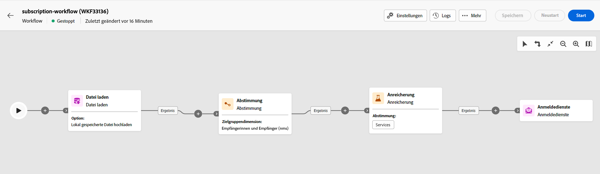
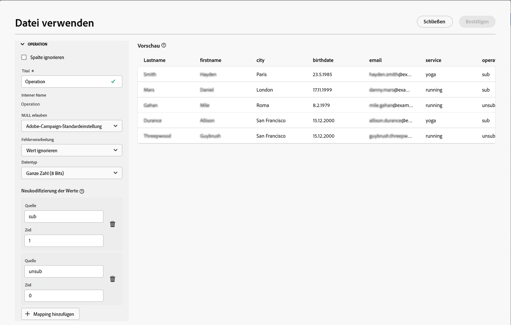

# Anmeldedienste {#subscriptipon-services}

>[!CONTEXTUALHELP]
>id="acw_orchestration_subscription"
>title="Aktivität „Anmeldedienste“"
>abstract="Die Aktivität „Anmeldedienste“ ermöglicht es, mehrere Profile gleichzeitig und in einer einzigen Aktion für einen Dienst an- bzw. von einem Dienst abzumelden."

>[!CONTEXTUALHELP]
>id="acw_orchestration_subscription_general"
>title="Allgemeine Anmeldedienst-Parameter"
>abstract="Wählen Sie den gewünschten Dienst und die auszuführende Aktion (An- oder Abmeldung) aus. Aktivieren Sie die Option **Bestätigungsnachricht senden**, um die Population von ihrer An- bzw. Abmeldung bei dem ausgewählten Dienst in Kenntnis zu setzen."

>[!CONTEXTUALHELP]
>id="acw_orchestration_subscription_outboundtransition"
>title="Ausgehende Transition erzeugen"
>abstract="Schalten Sie die Option **Ausgehende Transition erzeugen** ein, um eine Transition nach der Aktivität hinzuzufügen."

>[!CONTEXTUALHELP]
>id="acw_orchestration_subscription_additionalinfo"
>title="Zusätzliche Informationen"
>abstract="Zusätzliche Informationen"

Die Aktivität **Anmeldedienste** ist eine **Daten-Management**-Aktivität. Darüber können Sie eine Anmeldung zu einem Informationsdienst für die in der Transition angegebene Population erstellen oder löschen.

## Konfigurieren der Aktivität „Anmeldedienste“ {#subscription-services-configuration}

Führen Sie die folgenden Schritte aus, um die Aktivität **Anmeldedienste** zu konfigurieren:

1. Fügen Sie eine Aktivität **Anmeldedienste** zu Ihrem Workflow hinzu. Sie können diese Aktivität beispielsweise im Anschluss an eine Zielgruppenbestimmung von Profilen oder den Import einer Datei mit identifizierten Daten verwenden.

1. Wählen Sie mit einer der folgenden Optionen den Dienst aus, für den Sie An- bzw. Abmeldungen vornehmen möchten:

   * **[!UICONTROL Bestimmten Dienst auswählen]**: Wählen Sie einen Dienst über das Feld **[!UICONTROL Dienst]** manuell aus.

   * **[!UICONTROL Von eingehender Transition]**: Verwenden Sie den in der eingehenden Transition angegebenen Dienst. Beispielsweise können Sie eine Datei importieren, in der der zu verwaltende Dienst für jede Zeile spezifiziert wird. Der Dienst, für den der Vorgang ausgeführt werden soll, wird dann für jedes Profil dynamisch ausgewählt.

   

1. Wählen Sie den auszuführenden Vorgang aus: **Anmelden** oder **Abmelden**.

   Wenn der Dienst in der eingehenden Transition definiert ist, können Sie festlegen, wie dieser Vorgang abgerufen werden soll:

   * **Bestimmten Aktionstyp auswählen**: Wählen Sie den durchzuführenden Vorgang (**Anmelden** oder **Abmelden**) manuell aus.

   * **Aktionstyp aus einem Pfad der eingehenden Transition auswählen**: Wählen Sie die Spalte der eingehenden Daten aus, in der für jeden Eintrag der auszuführende Vorgang angegeben ist. Beispielsweise können Sie eine Datei importieren, in der der Vorgang festgelegt ist, der für jede Zeile in einer Spalte „Vorgang“ durchzuführen ist. 

     >[!NOTE]
     >
     >Hier können nur die Felder „Boolean“ oder „Integer“ ausgewählt werden. Stellen Sie sicher, dass die Daten, die den auszuführenden Vorgang enthalten, diesem Format entsprechen. Wenn Sie beispielsweise Daten aus einer Aktivität „Datei laden“ laden, überprüfen Sie, ob Sie das Format der Spalte, die den Vorgang enthält, in der Aktivität **[!UICONTROL Datei laden]** korrekt festgelegt haben. Ein Beispiel finden Sie in [diesem Abschnitt](#uc2).

   

1. Um Empfängerinnen und Empfänger von ihrer An- bzw. Abmeldung bei dem ausgewählten Dienst in Kenntnis zu setzen, aktivieren Sie die Option **[!UICONTROL Bestätigungsnachricht senden]**. Der Inhalt dieser Nachricht wird in einer Versandvorlage für den Informationsdienst definiert.

1. Wenn Sie Daten aus einer eingehenden Transition verwenden, wird ein Abschnitt **[!UICONTROL Zusätzliche Informationen]** angezeigt, in dem Sie die Daten und den Ursprung der Anmeldung für jeden Eintrag angeben können. Sie können diesen Abschnitt leer lassen. In diesem Fall wird aber kein Datum oder kein Ursprung bei der Ausführung des Workflows festgelegt.

   * Wenn die eingehenden Daten eine Spalte enthalten, die das Anmeldedatum des Profils für den Dienst angibt, können Sie diese im Feld **[!UICONTROL Datum]** auswählen.

   * Definieren Sie im Feld **[!UICONTROL Ursprungspfad]** den Ursprung der Anmeldung. Sie können dazu den Wert eines der Felder der eingehenden Daten oder eine beliebige Konstante verwenden, indem Sie die Option **[!UICONTROL Konstante als Ursprung festlegen]** aktivieren. 

   

1. Um eine ausgehende Transition nach der Aktivität hinzuzufügen, aktivieren Sie die Option **[!UICONTROL Ausgehende Transition erzeugen]**.

## Beispiele {#example}

### Anmelden einer Zielgruppe für einen bestimmten Dienst {#uc1}

Der folgende Workflow zeigt, wie Sie eine Zielgruppe für einen vorhandenen Dienst anmelden.


* Die Aktivität **[!UICONTROL Zielgruppe erstellen]** richtet sich an eine bestehende Zielgruppe.

* Mit der Aktivität **[!UICONTROL Anmeldedienste]** können Sie den Dienst auswählen, bei dem die Profile angemeldet sein müssen.

<!--
### Updating multiple subscription statuses from a file {#uc2}

The workflow below shows how to import a file containing profiles and update their subscription to several services specified in the file.



* A **[!UICONTROL Load file]** activity loads a CSV file containing the data and defines the structure of the imported columns. The "service" and "operation" columns specify the service to update and the operation to perform (subscription or unsubscription).

  ```
  Lastname,firstname,city,birthdate,email,service,operation
  Smith,Hayden,Paris,23/05/1985,hayden.smith@example.com,yoga,sub
  Mars,Daniel,London,17/11/1999,danny.mars@example.com,running,sub
  Smith,Clara,Roma,08/02/1979,clara.smith@example.com,running,unsub
  Durance,Allison,San Francisco,15/12/2000,allison.durance@example.com,yoga,sub
  Durance,Alison,San Francisco,15/12/2000,allison.durance@example.com,running,unsub
  ```

  As you may have noticed, the operation is specified in the file as "sub" or "unsub". The system expects a **Boolean** or **Integer** value to recognize the operation to perform: "0" to unsubscribe and "1" to subscribe. To match this requirement, a remapping of values must be performed in the detail of the "operation" column in the sample file configuration screen.

  

  If your file already uses "0" and "1" to identify the operation, you don't need to remap those values. Only make sure that the column is processed as a **Boolean** or **Integer** in the sample file columns.

* A **[!UICONTROL Reconciliation]** activity identifies the data from the file as belonging to the profile dimension of the Adobe Campaign database. The **email** field of the file is matched to the **email** field of the profile resource.

  

* An **[!UICONTROL Enrichment]** activity creates a link to the "Services (nms)" table and creates a simple join between the "service" column of the uploaded file, and the services "internal name" field in the database.

    

* A **[!UICONTROL Deduplication]** based on the **email** field identifies duplicates. It is important to eliminate duplicates since the subscription to a service will fail for all data in case of duplicates.

  
  
* A **[!UICONTROL Subscription Services]** identifies the services to update as coming from the transition, through the link created in the **[!UICONTROL Reconciliation]** activity.

  The **[!UICONTROL Operation type]** is identified as coming from the **operation** field of the file. Only Boolean or Integer fields can be selected here. If the column of your file that contains the operation to perform does not appear in the list, make sure that you have correctly set your column format in the **[!UICONTROL Load file]** activity, as explained earlier in this example.

  -->
