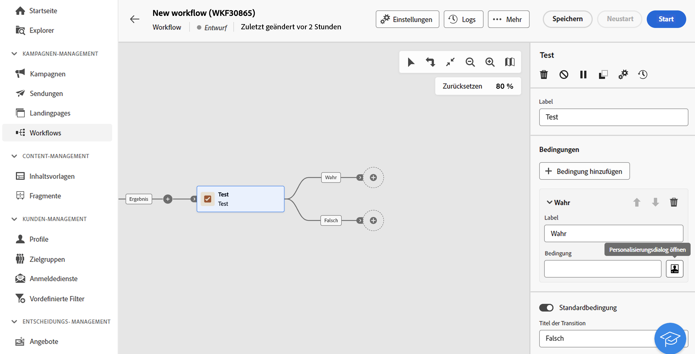
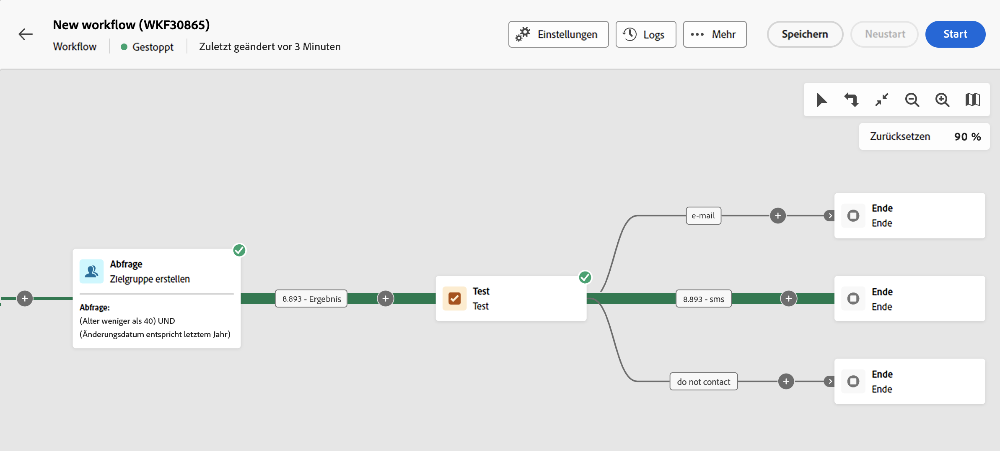
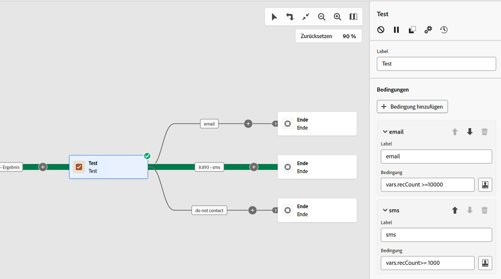

# Test {#test}

>[!CONTEXTUALHELP]
>id="acw_orchestration_test"
>title="Testaktivität"
>abstract="Die Aktivität **Test** ist eine Aktivität zur **Flusskontrolle**. Sie ermöglicht die Aktivierung von Transitionen auf der Basis der angegebenen Bedingungen."

>[!CONTEXTUALHELP]
>id="acw_orchestration_test_conditions"
>title="Bedingungen"
>abstract="Die Aktivität **Test** kann mehrere ausgehende Transitionen aufweisen. Während der Ausführung des Workflows wird jede Bedingung nacheinander getestet, bis eine der Bedingungen erfüllt ist. Wenn keine der Bedingungen erfüllt ist, wird der Workflow entlang des Pfads der **[!UICONTROL Standardbedingung]** fortgesetzt. Wenn keine Standardbedingung aktiviert ist, wird der Workflow an dieser Stelle beendet."

Die Aktivität **Test** ist eine Aktivität zur **Flusskontrolle**. Sie ermöglicht die Aktivierung von Transitionen auf der Basis der angegebenen Bedingungen.

## Konfigurieren der Aktivität „Test“ {#test-configuration}

Führen Sie diese Schritte aus, um die Aktivität **Test** zu konfigurieren:

1. Fügen Sie eine **Test**-Aktivität zu Ihrem Workflow hinzu.

1. Standardmäßig stellt die Aktivität **[!UICONTROL Test]** einen einfachen booleschen Test dar. Wenn die in der Transition „True“ definierte Bedingung erfüllt ist, wird diese Transition aktiviert. Andernfalls wird die standardmäßige Transition „False“ aktiviert.

1. Um die einer Transition zugeordnete Bedingung zu konfigurieren, klicken Sie auf das Symbol **[!UICONTROL Personalisierungsdialog öffnen]**. Definieren Sie mithilfe des Ausdruckseditors die Regeln, die zum Aktivieren dieser Transition erforderlich sind. Sie können auch Ereignisvariablen, Bedingungen und Datums-/Uhrzeitfunktionen nutzen. [Informationen dazu, wie Sie mit Ereignisvariablen und dem Ausdruckseditor arbeiten](../event-variables.md)

   Darüber hinaus können Sie das Feld **[!UICONTROL Titel]** ändern, um den Namen der Transition auf der Arbeitsfläche des Workflows zu personalisieren.

   

1. Sie können mehrere Ausgabe-Transitionen zu einer **[!UICONTROL Test]**-Aktivität hinzufügen. Klicken Sie dazu auf die Schaltfläche **[!UICONTROL Bedingung hinzufügen]** und konfigurieren Sie den Titel und die zugehörige Bedingung für jede Transition.

1. Während der Ausführung des Workflows wird jede Bedingung nacheinander getestet, bis eine der Bedingungen erfüllt ist. Wenn keine der Bedingungen erfüllt ist, wird der Workflow entlang des Pfads der **[!UICONTROL Standardbedingung]** fortgesetzt. Wenn keine Standardbedingung aktiviert ist, wird der Workflow an dieser Stelle beendet.

## Beispiel {#example}

In diesem Beispiel werden verschiedene Transitionen basierend auf der Anzahl an Profilen aktiviert, die von der Aktivität **[!UICONTROL Zielgruppe erstellen]** ausgewählt werden:
* Bei mehr als 10.000 ausgewählten Profilen wird eine E-Mail-Nachricht gesendet.
* Für 1.000 bis 10.000 Profile wird eine SMS gesendet.
* Wenn weniger als 1.000 Profile ausgewählt werden, werden sie an die Transition „Nicht kontaktieren“ weitergeleitet.

Dazu wurde die Ereignisvariable `vars.recCount` in den Bedingungen „E-Mail“ und „SMS“ verwendet, um die Anzahl der ausgewählten Profile zu zählen und die entsprechende Transition zu aktivieren.

