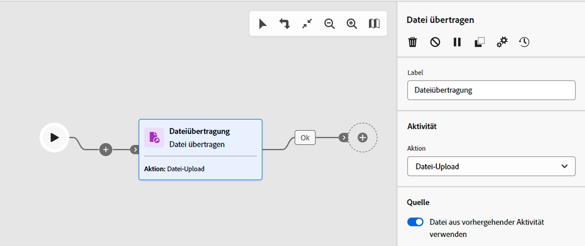
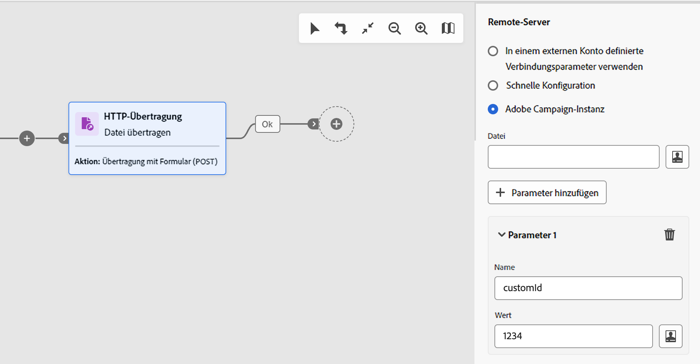
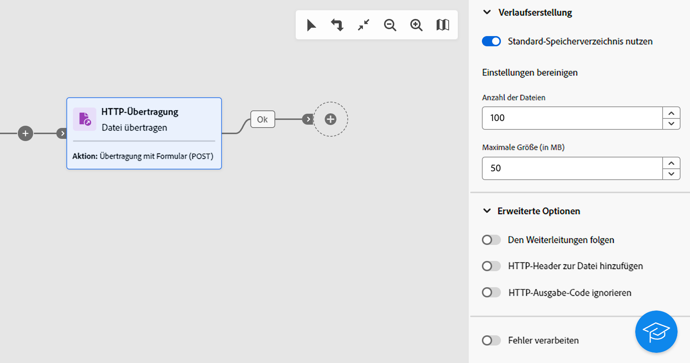

# Dateiübertragung {#transfer-file}

>[!CONTEXTUALHELP]
>id="acw_orchestration_transferfile"
>title="Dateiübertragung"
>abstract="**Dateiübertragung**: Mit dieser Aktivität können Sie Dateien senden oder empfangen, das Vorhandensein von Dateien prüfen oder Dateien auf einem Server auflisten. Das verwendete Protokoll kann entweder ein Server-zu-Server-Protokoll oder ein HTTP-Protokoll sein."

>[!CONTEXTUALHELP]
>id="acw_orchestration_transferfile_options"
>title="Dateiübertragungsoptionen"
>abstract="Dateiübertragungsoptionen"

>[!CONTEXTUALHELP]
>id="acw_orchestration_transferfile_activity"
>title="Dateiübertragungsaktivität"
>abstract="Dateiübertragungsaktivität"

>[!CONTEXTUALHELP]
>id="acw_orchestration_transferfile_remoteserver"
>title="Remote-Server für die Dateiübertragung"
>abstract="Geben Sie den Server für die Verbindung an."

>[!CONTEXTUALHELP]
>id="acw_orchestration_transferfile_source"
>title="Dateiübertragungsquelle"
>abstract="Geben Sie den gewünschten Dateinamen ein."

>[!CONTEXTUALHELP]
>id="acw_orchestration_transferfile_advancedoptions_delete_file"
>title="Quelldateien nach der Übertragung löschen"
>abstract="Löschen Sie die Quelldateien nach einer erfolgreichen Übertragung."

>[!CONTEXTUALHELP]
>id="acw_orchestration_transferfile_advancedoptions_display_logs"
>title="Sitzungsprotokolle anzeigen"
>abstract="Informationen zum Übertragungsvorgang werden in den Workflow-Protokollen angezeigt."

>[!CONTEXTUALHELP]
>id="acw_orchestration_transferfile_advancedoptions_list_files"
>title="Alle Dateien auflisten"
>abstract="Mit dieser Option werden alle Dateien indiziert, die auf dem Server in der Ereignisvariable **vars.filenames** vorhanden sind."

>[!CONTEXTUALHELP]
>id="acw_orchestration_transferfile_historization"
>title="Dateiverlaufserstellung"
>abstract="Dateiverlaufserstellung"

>[!CONTEXTUALHELP]
>id="acw_orchestration_transferfile_process_missing_file"
>title="Fehlen von Dateien verarbeiten"
>abstract="Mit dieser Option können Sie eine ausgehende Transition **Keine Datei** nach der Aktivität aktivieren."

>[!CONTEXTUALHELP]
>id="acw_orchestration_transferfile_process_errors"
>title="Fehler verarbeiten"
>abstract="Mit dieser Option können Sie eine ausgehende Transition **Fehler** nach der Aktivität aktivieren."

Die Aktivität **Dateiübertragung** ist eine **Daten-Management-Aktivität**. Mit dieser Aktivität können Sie Dateien senden oder empfangen, das Vorhandensein von Dateien prüfen oder Dateien auf einem Server auflisten. Das verwendete Protokoll kann entweder ein Server-zu-Server-Protokoll oder ein HTTP-Protokoll sein.

>[!NOTE]
>
>Bei der Campaign Web-Benutzeroberfläche haben wir zwei Aktivitäten zu einer zusammengefasst, indem wir die Funktionen **Dateiübertragung** und **Web-Download** zusammengeführt haben. Diese Zusammenführung wirkt sich in keiner Weise auf die Funktionalität der Aktivität aus.

Führen Sie die nachfolgend aufgeführten Schritte aus, um die Aktivität **Dateiübertragung** zu konfigurieren.

## Auswählen von Übertragungsprotokoll und Vorgang {#protocol}

1. Fügen Sie die Aktivität **Dateiübertragung** in Ihren Workflow ein und geben Sie dann den Übertragungstyp an, der je nach dem zu verwendenden Protokoll durchgeführt werden soll:

   * Wählen Sie für das HTTP-Protokoll **[!UICONTROL Web-Download]** aus. Auf diese Weise können Sie einen GET- oder POST-Download ausführen, um eine Datei auf eine explizite URL, ein externes Konto oder eine Adobe Campaign-Instanz herunterzuladen.
   * Wählen Sie für andere Server-zu-Server-Protokolle und zugehörige Aktionen **[!UICONTROL Dateiübertragung]** aus.

1. Wählen Sie die mit der Aktivität auszuführende Aktion aus. Die verfügbaren Aktionen hängen vom gewählten Übertragungstyp ab. Erweitern Sie die folgenden Abschnitte, um weitere Informationen zu erhalten.

   +++Mit Aktivitäten des Typs **Dateiübertragung** verfügbare Aktionen

   * **[!UICONTROL Datei-Download]**: Mit dieser Aktivität laden Sie eine Datei vom Server herunter.
   * **[!UICONTROL Datei-Upload]**: Mit dieser Aktivität laden Sie eine Datei auf den Server hoch.
   * **[!UICONTROL Existenztest einer Datei]**: Mit dieser Aktivität überprüfen Sie, ob eine bestimmte Datei auf dem Server vorhanden ist. Erzeugt im Anschluss an die Aktivität zwei ausgehende Transitionen: „Datei vorhanden“ und „Datei nicht vorhanden“.
   * **[!UICONTROL Dateiauflistung]**: Mit dieser Aktivität listen Sie alle auf dem Server verfügbaren Dateien auf.

+++

   +++Mit Aktivitäten des Typs **Web-Download** verfügbare Aktionen

   * **[!UICONTROL Einfache Übertragung (GET)]**: Mit dieser Aktivität rufen Sie eine Datei ab.
   * **[!UICONTROL Übertragung mit Formularübermittlung (POST)]**: Mit dieser Aktivität laden Sie eine Datei und zusätzliche Parameter hoch.

+++

   

1. Bei Aktionen zum Hochladen von Dateien verwendet die Aktivität standardmäßig die in der vorherigen Aktivität angegebene Datei. Um eine andere Datei zu verwenden, schalten Sie die Option **[!UICONTROL Datei aus vorhergehender Aktivität verwenden]** ein und klicken Sie auf die Schaltfläche **[!UICONTROL Datei hinzufügen]**.

   Geben Sie im Feld **[!UICONTROL Quelle]** den gewünschten gewünschten Dateinamen ein oder verwenden Sie den Ausdruckseditor, um den Dateinamen mithilfe von Ereignisvariablen zu berechnen. [Informationen dazu, wie Sie mit Ereignisvariablen und dem Ausdruckseditor arbeiten](../event-variables.md).  Wiederholen Sie den Vorgang, um so viele Dateien wie nötig hinzuzufügen.

## Definieren der Zielgruppe für die Übertragung {#destination}

1. Geben Sie im Abschnitt **[!UICONTROL Remote-Server]** mithilfe einer der folgenden Methoden den Server an, mit dem eine Verbindung hergestellt werden soll:

   * **[!UICONTROL Verwenden von in einem externen Konto definierten Verbindungsparametern]**: Stellen Sie mithilfe der Verbindungsparameter eines externen Kontos eine Verbindung zu einem Server her. Geben Sie im Feld **[!UICONTROL Server-Ordner]** den Pfad zur Datei (oder zum Ordner für die Dateiauflistungsaktionen) an.
   * **[!UICONTROL Schnelle Konfiguration]**: Geben Sie die URL der Datei (oder des Ordners für die Dateiauflistungsaktionen) ein.
   * **[!UICONTROL Adobe Campaign-Instanz]** (Aktivitäten des Typs „Web-Download“): Laden Sie eine Datei von einem Adobe Campaign-Instanz-Server herunter.

   

1. Bei POST-Aktionen für Web-Downloads können Sie zusätzliche Parameter mit dem Vorgang übergeben. Klicken Sie dazu auf die Schaltfläche **[!UICONTROL Parameter hinzufügen]** und geben Sie dann den Namen und den Wert der Parameter an. Sie können so viele Parameter wie nötig hinzufügen. 

1. Bei einem Datei-Upload werden die auf einen Server hochgeladenen Dateien standardmäßig automatisch gespeichert. Wenn Sie diesen Verlauf nicht beibehalten möchten, schalten Sie die Option **[!UICONTROL Verlauf der übertragenen Dateien speichern]** aus.

## Verlaufsparameter {#historization}

Jedes Mal, wenn die Aktivität **[!UICONTROL Dateiübertragung]** ausgeführt wird, werden die hoch- oder heruntergeladenen Dateien in einem bestimmten Ordner gespeichert. Für jede Aktivität „Dateiübertragung“ in einem Workflow wird ein Ordner erstellt. Die Dateien werden standardmäßig im Standardspeicherverzeichnis des Adobe Campaign-Installationsordners (`/vars`) gespeichert, bevor sie verarbeitet werden. Schalten Sie für die Verwendung eines bestimmten Ordners die Option **[!UICONTROL Standardspeicherverzeichnis verwenden]** aus und geben Sie den Pfad des Verzeichnisses ein.

Es ist wichtig, die Größe dieses Ordners begrenzen zu können, um physischen Platz auf dem Server zu sparen.  Hierzu können Sie eine Höchstzahl an Dateien oder die Gesamtgröße des Ordners für die Aktivität definieren. Standardmäßig sind 100 Dateien und 50 MB zugelassen.

Jedes Mal, wenn die Aktivität ausgeführt wird, wird der Ordner folgendermaßen überprüft:

* Nur Dateien, die mehr als 24 Stunden vor der Durchführung der Aktivität erstellt wurden, werden berücksichtigt.
* Wenn die Anzahl der berücksichtigten Dateien größer ist als der Wert des Felds **[!UICONTROL Anzahl an Dateien]**, werden die ältesten Dateien gelöscht, bis die zulässige maximale Dateianzahl erreicht ist.
* Wenn die Gesamtzahl der berücksichtigten Dateien größer ist als der Wert des Parameters **[!UICONTROL Maximale Größe (in MB)]**, werden die ältesten Dateien gelöscht, bis die zulässige maximale Größe (in MB) erreicht ist.

>[!CAUTION]
>
>Wenn die Aktivität nicht ausgeführt wird, wird der Ordner weder überprüft noch geleert. Seien Sie deshalb achtsam beim Transfer großer Dateien.

## Erweiterte Optionen und Optionen zur Fehlerverwaltung {#advanced}

1. Unter **[!UICONTROL Erweiterte Optionen]** stehen je nach Typ der Aktivität, die Sie konfigurieren, zusätzliche Optionen zur Verfügung. Erweitern Sie die folgenden Abschnitte, um weitere Informationen zu erhalten.

   +++Zusätzliche Optionen für Aktivitäten des Typs **[!UICONTROL Dateiübertragung]**

   * **[!UICONTROL Quelldateien nach der Übertragung löschen]**: Mit dieser Aktivität löschen Sie die Quelldateien nach einer erfolgreichen Übertragung.
   * **[!UICONTROL Sitzungslogs anzeigen]**: Wenn diese Option aktiviert ist, werden Informationen zum Übertragungsvorgang in den Workflow-Protokollen angezeigt, nachdem der Workflow ausgeführt wurde.
   * **[!UICONTROL Alle Dateien auflisten]** (Dateiauflistungsaktionen): Diese Option indiziert alle Dateien, die auf dem Server in der Ereignisvariablen `vars.filenames` vorhanden sind, in der die Dateinamen durch die `n`-Zeichen getrennt sind. [Informationen dazu, wie Sie mit Ereignisvariablen arbeiten](../event-variables.md)

+++

   +++Zusätzliche Optionen für Aktivitäten des Typs **[!UICONTROL Web-Download]**

   * **[!UICONTROL Den Weiterleitungen folgen]**: Mithilfe der Dateiweiterleitung können Sie Überschreibungen verwenden, um die Dateneingabe oder -ausgabe an ein Gerät eines anderen Typs zu leiten.
   * **[!UICONTROL HTTP-Header zur Datei hinzufügen]**: In einigen Fällen ist es vorteilhaft, einer Datei zusätzliche HTTP-Header hinzuzufügen. In den meisten Fällen werden diese Header verwendet, um zusätzliche Informationen zur Fehlerbehebung zu liefern, oder für [Cross-Origin Resource Sharing (CORS)](https://developer.mozilla.org/docs/Web/HTTP/CORS) oder um bestimmte Caching-Anweisungen festzulegen.
   * **[!UICONTROL HTTP-Ausgabecode ignorieren]**: HTTP-Ausgabe-Codes, auch HTTP-Status-Codes genannt, geben das Ergebnis einer HTTP-Anfrage an.

1. Mit der Option **[!UICONTROL Fehler verarbeiten]** können Sie eine ausgehende Transition vom Typ „Fehler“ nach der Aktivität aktivieren, falls bei der Übertragung ein Fehler auftritt.

   Bei Aktivitäten des Typs **Dateiübertragung** können Sie außerdem mit der Option **[!UICONTROL Fehlende Datei verarbeiten]** eine ausgehende Transition des Typs „Keine Datei“ im Anschluss an die Aktivität aktivieren, wenn die Datei im angegebenen Pfad nicht verfügbar ist.
