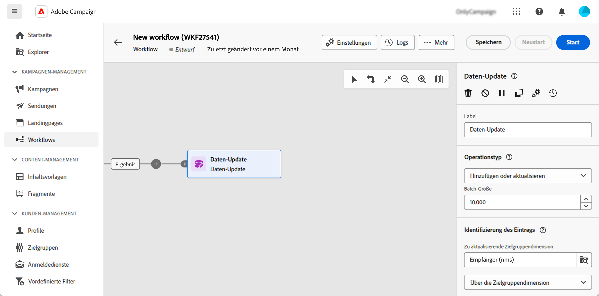

# Daten-Update {#update-data}

Die Aktivität **Daten-Update** ist eine **Daten-Management**-Aktivität. Sie ermöglicht eine gebündelte Aktualisierung der Datenbankfelder. Die Art der Datenbankaktualisierung kann über verschiedene Optionen angepasst werden.

<!--
The **Operation type** field lets you choose the process to be carried out on the data in the database. Select the first option to add data or update it if it has already been added. You can also only add data, only update data, or delete data. Select the **Update and merge collections** to select a primary record to link duplicates to, and delete those duplicates safely.

Specify how to identify the records in the database: if data relate to an existing targeting dimension, select the **Using the targeting dimension** option and select the targeting dimension and fields to update. Otherwise, specify one or more custom links to identify the data in the database, or directly use reconciliation keys.

Select the fields to update and reconciliation settings. You can use the **Auto-mapping** option to automatically identify the fields to be updated.

The **Advanced options** section lets you specify additional settings to manage data and duplicates.

Toggle the **Generate an outbound transition** option to add an outbound transition that will be activated at the end of the execution of the **Update data** activity. The update generally marks the end of a targeting workflow, and therefore the option is not activated by default.

Toggle the **Generate an outbound transition for rejects** option to add an outbound transition containing records that have not been correctly processed after the update (for example, if there is a duplicate). The update generally marks the end of a targeting workflow, and therefore the option is not activated by default.
-->

## Konfigurieren der Aktivität „Daten-Update“ {#update-data-configuration}

Um die Aktivität **Daten-Update** zu konfigurieren, fügen Sie die Aktivität zunächst Ihrem Workflow hinzu und legen Sie ein Label fest.

### Aktionstyp

Geben Sie im Feld **Aktionstyp** an, auf welche Weise die Daten aktualisiert werden sollen:

* **Einfügen oder aktualisieren**: Fügt neue Daten ein oder aktualisiert in der Datenbank existierende Einträge.
* **Einfügen**: Fügt lediglich neue Daten ein. Existierende Einträge werden nicht aktualisiert. Wenn Abstimmkriterien definiert wurden, werden nur nicht abgestimmte Einträge hinzugefügt.
* **Aktualisieren**: Aktualisiert nur die Daten der Einträge, die bereits in der Datenbank vorhanden sind.
* **Löschen**: Löscht in der Datenbank existierende Daten.

Im Feld **Aktualisierungsgröße** wird bestimmt, wie viele Elemente der eingehenden Transition aktualisiert werden. Bei Angabe von 500 beispielsweise werden die ersten 500 verarbeiteten Einträge aktualisiert.

### Identifizierung von Einträgen

In diesem Abschnitt können Sie angeben, auf welche Weise die Einträge der Datenbank erkannt werden:

* Wenn die eingehenden Daten einer existierenden Zielgruppendimension entsprechen, wählen Sie die Option **Über die Zielgruppendimension** und dann die Zielgruppendimension im Feld **Zu aktualisierende Zielgruppendimension** aus.
* Sie können auch die Option **Verwendung von benutzerdefinierten Links** auswählen und einen oder mehrere Links angeben, was die Identifizierung der Daten in der Datenbank ermöglicht.
* Wenn eine Aktualisierung durchgeführt werden soll, wählen Sie die Option **Verwendung von Abstimmregeln** aus.

### Zu aktualisierende Felder

Fügen Sie im Abschnitt **Zu aktualisierende Felder** die Felder hinzu, auf die die Aktualisierung angewendet wird. Fügen Sie bei Bedarf Bedingungen hinzu, damit diese Aktualisierung durchgeführt wird. Verwenden Sie das Feld **Berücksichtigt wenn**, um Bedingungen zu definieren. Bedingungen werden nacheinander in der Listenreihenfolge angewendet. Die Reihenfolge kann mithilfe der Pfeile rechts der Tabelle angepasst werden. Es ist möglich, mehrmals dasselbe Zielfeld zu verwenden.

Ordnen Sie die Felder mithilfe der Schaltfläche **Automatisches Mapping** automatisch zu. Die Funktion des automatischen Verbindens erkennt Felder gleichen Namens.

Wählen Sie während eines Vorgangs vom Typ **Einfügen oder aktualisieren** den gewünschten Vorgang für jedes Feld einzeln aus. Verwenden Sie das Feld **Vorgangsfeld**, um den gewünschten Wert anzugeben.

### Erweiterte Optionen

Über den Abschnitt **Erweiterte Optionen** können Sie zusätzliche Optionen zur Aktualisierung von Daten und zum Umgang mit Duplikaten definiert werden.

<!--
* **Disable automatic key management**
* **Disable audit**
* **Empty the destination value if the source value is empty**
* **Update all columns with matching names**
* **Ignore records which concern the same target**: only the first in the list of expressions will be considered
-->

Mit diesen beiden letzten Optionen können Sie bestimmte Aktionen ausführen:

* **Ausgehende Transition erzeugen**: Erstellt eine ausgehende Transition, die am Ende der Ausführung aktiviert wird. Die Aktualisierung signalisiert in der Regel das Ende eines Workflows zur Zielgruppenbestimmung. Daher ist diese Option standardmäßig nicht aktiviert.

* **Ausgehende Transition für die Zurückweisungen erzeugen**: Erstellt eine ausgehende Transition mit Einträgen, die nach der Aktualisierung nicht korrekt verarbeitet wurden (z. B. wenn es ein Duplikat gibt). Die Aktualisierung markiert in der Regel das Ende eines Zielgruppenbestimmungs-Workflows. Die Option ist standardmäßig nicht aktiviert.