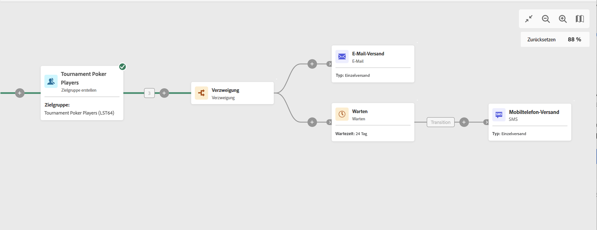

# Warten {#wait}

Die Aktivität **Warten** ist eine Aktivität zur **Flusskontrolle**. Sie wird verwendet, um einen bestimmten Zeitraum zwischen der Ausführung zweier Aktivitäten zu definieren. Beispielsweise kann man mehrere Tage nach einer E-Mail-Versandaktivität warten, dann die während dieses Zeitraums erfolgten Öffnungen und Klicks analysieren, bevor man weitere Verarbeitungsschritte (Erinnerungs-E-Mail, Zielgruppenerstellung etc.) unternimmt.

## Konfiguration    

Gehen Sie folgendermaßen vor, um die Aktivität **Warten** zu konfigurieren:

1. Fügen Sie eine Aktivität **Warten** zu Ihrem Workflow hinzu.

1. Geben Sie die **Dauer** der Wartezeit zwischen der eingehenden und der ausgehenden Transition an.

1. Wählen Sie die Zeiteinheit im Feld **Zeiträume**: Sekunden, Minuten, Stunden.

## Beispiel

Das folgende Beispiel erläutert die Aktivität **Warten** anhand eines typischen Fallbeispiels. Darin wird eine E-Mail mit einer Einladung zu einem Event verschickt. 24 Stunden nach dem Versand wird ein SMS-Versand an dieselbe Population gesendet.

