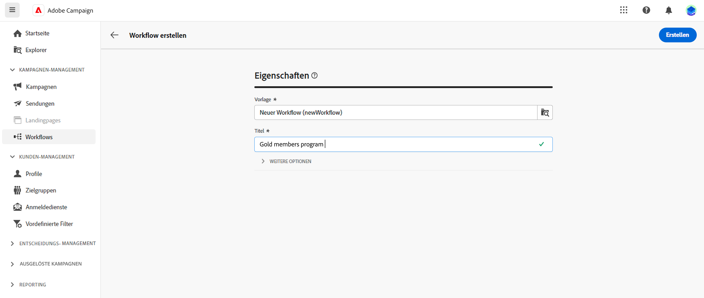
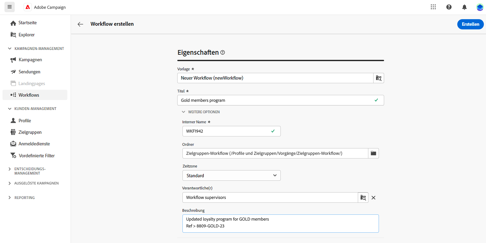
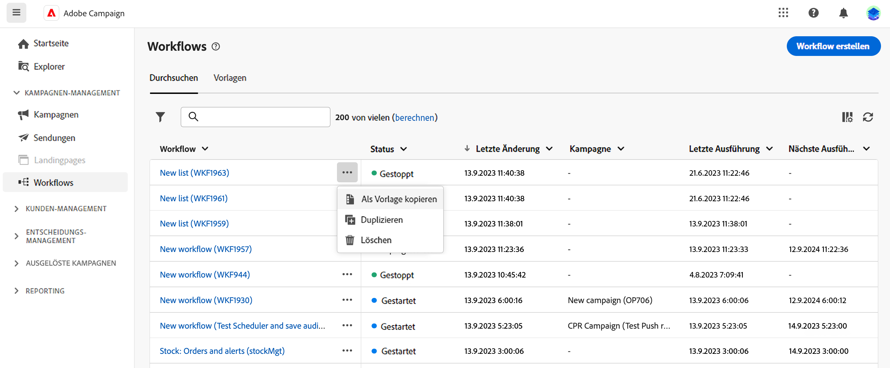
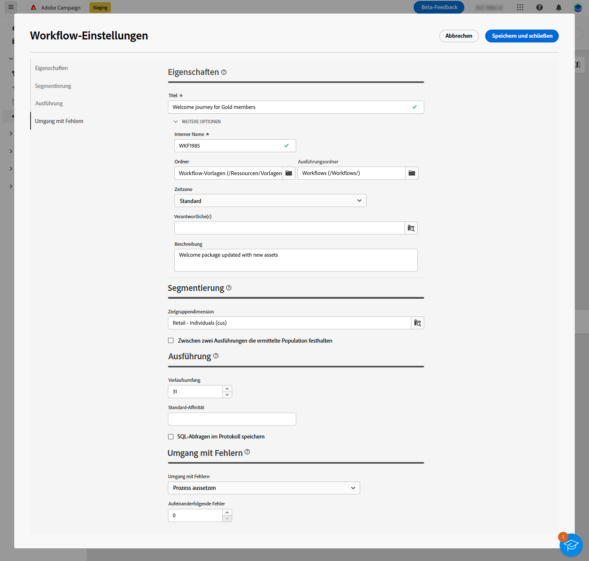
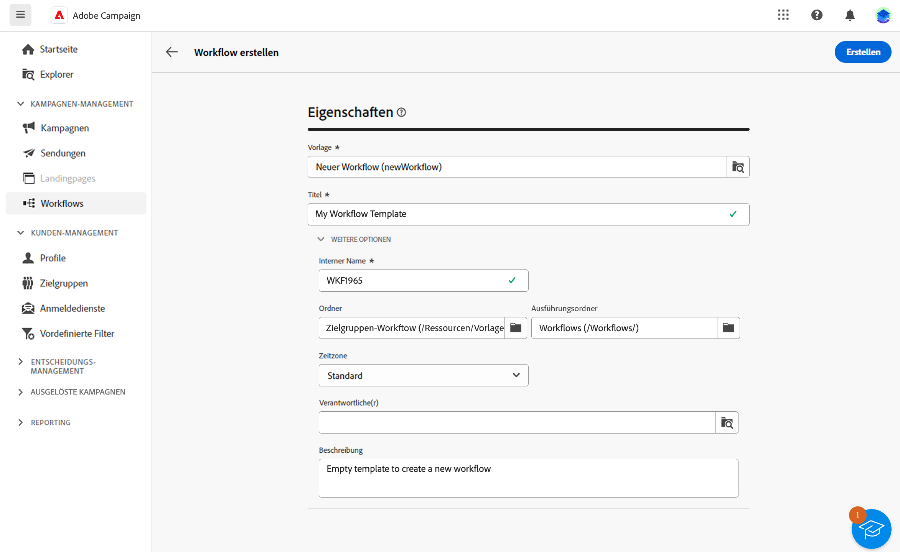
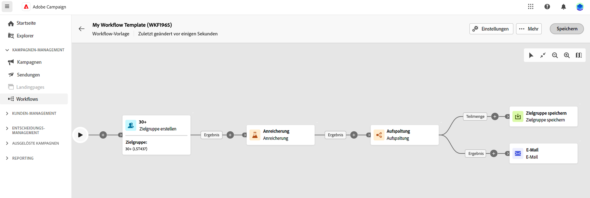

# Erstellen des Workflows {#create-first-workflow}

>[!CONTEXTUALHELP]
>id="acw_workflow_creation_properties"
>title="Workflow-Eigenschaften"
>abstract="Wählen Sie in diesem Bildschirm die Vorlage aus, die zum Erstellen des Workflows verwendet werden soll, und geben Sie einen Titel an. Erweitern Sie den Abschnitt ADDITIONAL OPTIONS , um weitere Einstellungen wie den internen Namen des Workflows, dessen Ordner, die Zeitzone und die Supervisorgruppe zu konfigurieren. Es wird dringend empfohlen, eine Gruppe von Supervisoren auszuwählen, damit Benutzer bei Auftreten eines Fehlers benachrichtigt werden."

Sie können eigenständige Workflows oder Workflows innerhalb einer Kampagne erstellen. Der erste Schritt besteht darin, eine Vorlage auszuwählen und ihre allgemeinen Eigenschaften zu definieren. Anschließend können Sie bei Bedarf weitere Einstellungen konfigurieren.

Gehen Sie dazu wie folgt vor:

1. So erstellen Sie eine **Eigenständiger Workflow**, navigieren Sie zum **Workflows** Menü.

   So erstellen Sie eine **Kampagnen-Workflow**, navigieren Sie zum **Kampagnen** und öffnen Sie die Kampagne, für die Sie einen neuen Workflow erstellen möchten.

1. Klicken Sie auf **[!UICONTROL Workflow erstellen]** in der oberen rechten Ecke des Bildschirms.

   

1. Im Workflow **Eigenschaften** wählen Sie die Vorlage aus, die zum Erstellen des Workflows verwendet werden soll (Sie können auch die integrierte Standardvorlage verwenden). Weitere Informationen zu Vorlagen finden Sie in [den folgenden Abschnitt](#work-with-workflow-templates-workflow-templates).

1. Benennen Sie den Workflow. Darüber hinaus empfehlen wir dringend, Ihrem Workflow im dedizierten Feld des **[!UICONTROL Zusätzliche Optionen]** des Bildschirms.

1. Erweitern Sie die **[!UICONTROL Zusätzliche Optionen]** um weitere Einstellungen für den Workflow zu konfigurieren. Erfahren Sie, wie Sie die Workflow-Eigenschaften in [diese Seite](workflow-settings.md#properties)

   

1. Klicken Sie auf die Schaltfläche **[!UICONTROL Workflow erstellen]** zur Bestätigung der Workflow-Erstellung.

Ihr Workflow wurde jetzt erstellt und ist in der Liste der Workflows verfügbar. Sie können jetzt auf die visuelle Arbeitsfläche zugreifen und mit dem Hinzufügen, Konfigurieren und Orchestrieren der Aufgaben beginnen, die ausgeführt werden sollen. Erfahren Sie, wie Sie Workflow-Aktivitäten in [diese Seite](orchestrate-activities.md).

## Arbeiten mit Workflow-Vorlagen {#workflow-templates}

Workflow-Vorlagen enthalten vorkonfigurierte Einstellungen und Aktivitäten, die zur Erstellung neuer Workflows wiederverwendet werden können. Bei der Erstellung eines Workflows können Sie die Vorlage Ihres Workflows aus den Workflow-Eigenschaften auswählen. Standardmäßig wird eine leere Vorlage bereitgestellt.

Sie können eine Vorlage aus einem vorhandenen Workflow erstellen oder eine neue Vorlage erstellen. Beide Methoden werden nachfolgend beschrieben.

>[!BEGINTABS]

>[!TAB Erstellen einer Vorlage aus einem vorhandenen Workflow]

Gehen Sie wie folgt vor, um eine Workflow-Vorlage aus einem vorhandenen Workflow zu erstellen:

1. Für die **Workflows** und navigieren Sie zum Workflow, um ihn als Vorlage zu speichern.
1. Klicken Sie auf die drei Punkte rechts neben dem Namen des Workflows und wählen Sie **Als Vorlage kopieren**.

   

1. Bestätigen Sie im Popup-Fenster die Vorlagenerstellung.
1. Markieren Sie in der Arbeitsfläche der Workflow-Vorlage die gewünschten Aktivitäten, fügen Sie sie hinzu und konfigurieren Sie sie.
1. Navigieren Sie zu den Einstellungen, um den Namen der Workflow-Vorlage zu ändern, und geben Sie eine Beschreibung ein.
1. Wählen Sie Ordner und Ausführungsordner der Vorlage aus. Der Ordner ist der Speicherort der Workflow-Vorlage. Der Ausführungsordner ist der Ordner, in dem auf dieser Vorlage basierende Workflows gespeichert werden.

   

   Die anderen Eigenschaften sind bei Workflows üblich. Weitere Informationen auf [dieser Seite](workflow-settings.md#properties)

1. Speichern Sie Ihre Änderungen.

Die Workflow-Vorlage ist jetzt in der Vorlagenliste verfügbar. Sie können einen auf dieser Vorlage basierenden Workflow erstellen. Dieser Workflow wird mit den in der Vorlage definierten Einstellungen und Aktivitäten vorkonfiguriert.

>[!TAB Erstellen einer Vorlage von Grund auf]

Gehen Sie wie folgt vor, um eine neue Workflow-Vorlage zu erstellen:

1. Für die **Workflows** und navigieren Sie zum **Vorlagen** Registerkarte. Die Liste der verfügbaren Workflow-Vorlagen wird angezeigt.
1. Klicken Sie auf **[!UICONTROL Vorlage erstellen]** in der oberen rechten Ecke des Bildschirms.
1. Geben Sie den Titel ein und öffnen Sie die zusätzlichen Optionen, um eine Beschreibung Ihrer Workflow-Vorlage einzugeben.
1. Wählen Sie Ordner und Ausführungsordner der Vorlage aus. Der Ordner ist der Speicherort der Workflow-Vorlage. Der Ausführungsordner ist der Ordner, in dem auf dieser Vorlage basierende Workflows gespeichert werden.

   

   Die anderen Eigenschaften sind bei Workflows üblich. Weitere Informationen auf [dieser Seite](workflow-settings.md#properties)

1. Klicken Sie auf **Erstellen** zur Bestätigung der Einstellungen.
1. Fügen Sie in der Arbeitsfläche der Workflow-Vorlage die gewünschten Aktivitäten hinzu und konfigurieren Sie sie.

   

1. Speichern Sie Ihre Änderungen.

Die Workflow-Vorlage ist jetzt in der Vorlagenliste verfügbar. Sie können einen auf dieser Vorlage basierenden Workflow erstellen. Dieser Workflow wird mit den in der Vorlage definierten Einstellungen und Aktivitäten vorkonfiguriert.

>[!ENDTABS]
