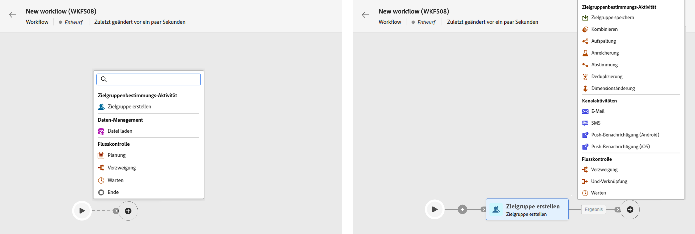

# Erstellen eines Workflows {#create}

>[!CONTEXTUALHELP]
>id="acw_workflow_creation_properties"
>title="Workflow-Eigenschaften"
>abstract="Noch nicht definiert"

## Erstellen eines Workflows {#create-workflow}

Der erste Schritt zur Erstellung Ihres Workflows im Campaign v8 Web besteht darin, ihn entweder als eigenständigen Workflow oder direkt in einer Kampagne zu erstellen und seine allgemeinen Eigenschaften zu definieren. Gehen Sie dazu wie folgt vor:

1. Entscheiden Sie zunächst, ob Sie einen eigenständigen Workflow erstellen oder ihn direkt in eine Kampagne integrieren möchten:

   * **Eigenständiger Workflow**: Navigieren Sie zum Menü Workflows und klicken Sie oben rechts auf die Schaltfläche Workflow erstellen .
   * **Kampagnen-Workflow:** Navigieren Sie zum Menü Kampagnen und öffnen Sie die Kampagne, in der Sie einen neuen Workflow erstellen möchten. Klicken Sie auf die Schaltfläche Workflow erstellen in der oberen rechten Ecke der Registerkarte Workflows .

   Das Dialogfeld Eigenschaften des Workflows wird angezeigt.

   

1. Wählen Sie die Vorlage aus, die zum Erstellen des Workflows verwendet werden soll, und geben Sie einen Titel für den Workflow an.

   Workflow-Vorlagen enthalten vorkonfigurierte Aktivitäten und allgemeine Eigenschaftskonfigurationen, die zur Erstellung neuer Workflows wiederverwendet werden können. Sie werden über die Client-Konsole erstellt. [Erfahren Sie, wie Sie mit Vorlagen arbeiten.](https://experienceleague.adobe.com/docs/campaign/automation/workflows/introduction/build-a-workflow.html#workflow-templates)

1. Erweitern Sie den Abschnitt Zusätzliche Optionen , wenn Sie bestimmte Einstellungen für den Workflow konfigurieren möchten, z. B. den Speicherordner und die Zeitzone. [Erfahren Sie, wie Sie Workflow-Eigenschaften konfigurieren](workflow-settings.md)

1. Wählen Sie die Schaltfläche Workflow erstellen aus, um die Erstellung Ihres Workflows zu bestätigen.

Mit der Erstellung Ihres Workflows können Sie jetzt mit der Orchestrierung der verschiedenen Aufgaben beginnen, die er mithilfe einer dedizierten visuellen Arbeitsfläche durchführt. [Erfahren Sie, wie Sie Workflow-Aktivitäten koordinieren](#build)

## Orchestrieren von Workflow-Aktivitäten {#build}

Einmal, dass Sie [einen Workflow erstellt hat](create-workflow.md)können Sie im Workflow-Menü oder innerhalb einer Kampagne mit der Orchestrierung der verschiedenen Aufgaben beginnen. Dazu wird eine visuelle Arbeitsfläche bereitgestellt, über die Sie ein Workflow-Diagramm erstellen können. In diesem Diagramm können Sie verschiedene Aktivitäten hinzufügen und sie in einer sequenziellen Reihenfolge verbinden.

In dieser Phase der Konfiguration wird das Diagramm mit einem Startsymbol angezeigt, das den Anfang Ihres Workflows darstellt. Um Ihre erste Aktivität hinzuzufügen, klicken Sie auf die Schaltfläche + , die mit dem Startsymbol verbunden ist.

Eine Liste der Aktivitäten, die dem Diagramm hinzugefügt werden können, wird angezeigt. Die verfügbaren Aktivitäten hängen von Ihrer Position im Workflow-Diagramm ab. Wenn Sie beispielsweise Ihre erste Aktivität hinzufügen, können Sie Ihren Workflow starten, indem Sie eine Audience auswählen, den Workflow-Pfad aufteilen oder eine Warten -Aktivität festlegen, um die Ausführung des Workflows zu verzögern. Nach der Aktivität Audience erstellen können Sie hingegen Ihre Zielgruppe mit Zielgruppenbestimmungsaktivitäten verfeinern, einen Versand mit Kanalaktivitäten an Ihre Audience senden oder den Workflow-Prozess mit Steuerungsaktivitäten organisieren.

Nachdem dem Diagramm eine Aktivität hinzugefügt wurde, wird ein rechter Bereich angezeigt, in dem Sie die neu hinzugefügte Aktivität mit bestimmten Einstellungen konfigurieren können. Detaillierte Informationen zur Konfiguration der einzelnen Aktivitäten finden Sie unter [diesem Abschnitt](workflow-activities.md).

Wiederholen Sie diesen Vorgang und fügen Sie je nach den Aufgaben, die Ihr Workflow ausführen soll, beliebig viele Aktivitäten hinzu. Beachten Sie, dass Sie zwischen zwei Aktivitäten auch eine neue Aktivität einfügen können. Klicken Sie hierzu auf die Schaltfläche + in der Transition zwischen den Aktivitäten, wählen Sie die gewünschte Aktivität aus und konfigurieren Sie sie im rechten Bereich.

Um eine Aktivität zu entfernen, wählen Sie sie auf der Arbeitsfläche aus und klicken Sie in den Aktivitätseigenschaften auf das Symbol Löschen .

>[!TIP]
>
>Sie haben die Möglichkeit, den Namen der Transitionen zwischen den einzelnen Aktivitäten zu personalisieren. Wählen Sie dazu die Transition aus und ändern Sie deren Titel im rechten Bereich.

Fügen Sie nach Abschluss des Workflows die Aktivität Ende am Ende des Diagramms hinzu. Mit dieser Aktivität können Sie das Ende eines Workflows visuell markieren und haben keine funktionalen Auswirkungen.

Nach erfolgreicher Erstellung des Workflow-Diagramms können Sie den Workflow ausführen und den Fortschritt seiner verschiedenen Aufgaben verfolgen. [Erfahren Sie, wie Sie einen Workflow starten und dessen Ausführung überwachen](start-monitor-workflows.md)
