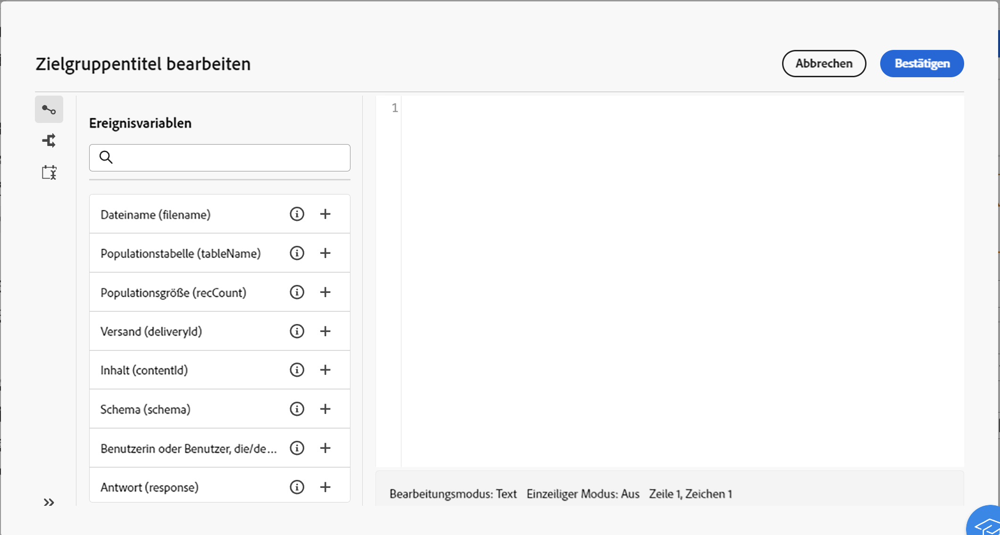

# Workflow-Ereignisvariablen {#event-variables}

Bei einigen Workflow-Aktivitäten können Sie Skripte im Ausdruckseditor bearbeiten, um bestimmte Aktionen auszuführen, z. B. das Abrufen von Daten aus früheren Aktivitäten, das Erstellen von Bedingungen oder das Berechnen von Dateinamen auf der Grundlage von Ereignisvariablen.

## Was sind Ereignisvariablen? {#scripting}

Skripte, die im Kontext eines Workflows ausgeführt werden, greifen auf eine Reihe zusätzlicher globaler **Objekte** zu, wie den Workflow selbst, der ausgeführt wird (`ìnstance`), seine verschiedenen Aufgaben (`task`), oder die Ereignisse, die eine bestimmte Aufgabe aktiviert haben (`event`).

Jedem **Objekt**-Typ ist eine Kategorie von **Variablen** zugeordnet, die im Ausdruckseditor bei der Bearbeitung von Skripten in Aktivitäten wie **[!UICONTROL JavaScript-Code]** oder **[!UICONTROL Test]** verwendet werden können.

* **Instanzvariablen** (`instance.vars.xxx`) sind mit globalen Variablen vergleichbar. Sie werden von allen Aktivitäten geteilt.
* **Task-Variablen** (`task.vars.xxx`) sind vergleichbar mit lokalen Variablen. Sie werden nur von der aktuellen Aufgabe verwendet. Diese Variablen werden von persistenten Aktivitäten verwendet, um Daten aufzubewahren, und werden manchmal genutzt, um Daten zwischen den verschiedenen Skripten derselben Aktivität auszutauschen.
* **Ereignisvariablen** (`vars.xxx`) ermöglichen den Austausch von Daten zwischen den elementaren Aufgaben eines Workflow-Prozesses. Diese Variablen werden von der Aufgabe übergeben, die die in Bearbeitung befindliche Aufgabe aktiviert hat. Sie werden dann an die folgenden Aktivitäten weitergeleitet. **Ereignisvariablen** sind die am häufigsten verwendeten Variablen und sind Instanzvariablen vorzuziehen.

>[!NOTE]
>
>Weitere Informationen zur Skripterstellung und zu den Skript-Objekten und -Variablen in Adobe Campaign finden Sie in der Dokumentation zu Campaign v8 (Client-Konsole) [in diesem Abschnitt](https://experienceleague.adobe.com/de/docs/campaign/automation/workflows/advanced-management/javascript-scripts-and-templates).
>
>Bitte beachten Sie, dass diese Ressource zwar wertvolle Erkenntnisse bietet, es jedoch zu Unstimmigkeiten kommen kann, da sie sich speziell auf die Client-Konsole und nicht auf die Campaign Web-Benutzeroberfläche bezieht.

## Nutzung von Ereignisvariablen im Ausdruckseditor {#expression-editor}

Vordefinierte Ereignisvariablen stehen im linken Bereich des Ausdruckseditors zur Verfügung. Sie können auch neue erstellen, indem Sie eine neue Variable in Ihrem Code initialisieren.

Zusätzlich zu diesen Ereignisvariablen können Sie auch das Menü **[!UICONTROL Bedingungen]** im linken Bereich nutzen, um Bedingungen zu erstellen, und das Menü **[!UICONTROL Aktuelles Datum hinzufügen]**, um Funktionen zur Datumsformatierung zu verwenden.
