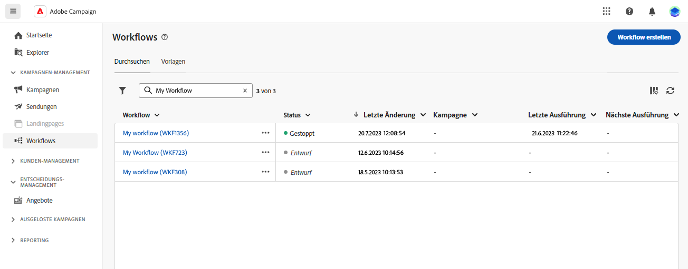
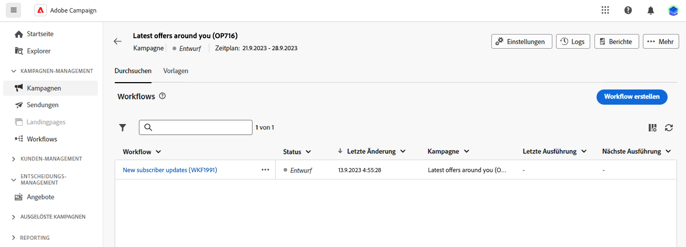

# Grundlegende Prinzipien der Workflow-Erstellung {#gs-workflow-creation}

Mit Adobe Campaign Web können Sie Workflows auf einer visuellen Arbeitsfläche erstellen, um kanalübergreifende Prozesse wie Segmentierung, Kampagnenausführung und Dateiverarbeitung zu entwerfen.

## Was befindet sich in einem Workflow? {#gs-workflow-inside}

Das Workflow-Diagramm stellt den geplanten Prozess dar. Es beschreibt die verschiedenen Aufgaben, die ausgeführt und miteinander verknüpft werden sollen.

{zoomable="yes"}

Jeder Workflow besteht aus:

* **Aktivitäten**: Eine Aktivität ist eine Aufgabe, die ausgeführt werden soll. Die Symbole auf dem Diagramm stellen die verschiedenen Aktivitäten dar. Jede Aktivität verfügt über bestimmte Eigenschaften und Eigenschaften, die für alle Aktivitäten gelten.

  In einem Workflow-Diagramm kann eine bestimmte Aktivität mehrere Aufgaben auslösen, insbesondere bei Schleifen oder wiederkehrenden Aktionen.

* **Transitionen**: Transitionen verknüpfen eine Quellaktivität mit einer Zielaktivität und definieren deren Sequenz.

* **Arbeitstabellen**: Die Arbeitstabelle enthält alle von der Transition übermittelten Informationen. Jeder Workflow verwendet mehrere Arbeitstabellen. Die Daten in diesen Tabellen können während des gesamten Lebenszyklus des Workflows verwendet werden.

## Wichtige Schritte zum Erstellen eines Workflows {#gs-workflow-steps}

Campaign bietet zwei Möglichkeiten, einen Workflow zu erstellen:

1. Workflows können über das Menü **Workflows“ als eigenständige Workflows** werden.

   {zoomable="yes"}

1. Workflows können direkt innerhalb einer Kampagne über die Registerkarte **Workflow** der Kampagne erstellt werden. Wenn der Workflow in eine Kampagne aufgenommen wird, wird er zusammen mit allen anderen Kampagnen-Workflows ausgeführt und die Berichtsmetriken werden auf Kampagnenebene gruppiert.

   {zoomable="yes"}

Die wichtigsten Schritte zum Erstellen von Workflows sehen wie folgt aus:

{zoomable="yes"}

Diese Schritte werden in den folgenden Abschnitten beschrieben:

1. [Erstellen eines Workflows und Definieren seiner Eigenschaften](create-workflow.md)
1. [Koordinieren und Konfigurieren von Aktivitäten](orchestrate-activities.md)
1. [Konfigurieren von erweiterten Workflow-Einstellungen](workflow-settings.md)
1. [Starten des Workflows und Überwachen der Ausführung](start-monitor-workflows.md)