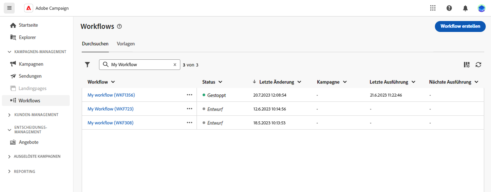

# Grundlegende Prinzipien der Workflow-Erstellung {#gs-workflow-creation}

Mit Campaign v8 Web können Sie Workflows in einer visuellen Arbeitsfläche erstellen, um kanalübergreifende Prozesse wie Segmentierung, Kampagnenausführung und Dateiverarbeitung zu entwerfen.

## Was befindet sich in einem Workflow? {#gs-workflow-inside}

Das Workflow-Diagramm zeigt, was passieren soll. Es beschreibt die verschiedenen Aufgaben, die ausgeführt und miteinander verknüpft werden sollen.

Jeder Workflow besteht aus:

* **Activities**: Eine Aktivität ist eine Aufgabe, die ausgeführt werden soll. Die verschiedenen verfügbaren Aktivitäten werden im Diagramm durch Symbole dargestellt. Jede Aktivität verfügt über bestimmte Eigenschaften sowie andere Eigenschaften, die für alle Aktivitäten gelten.

  In einem Workflow-Diagramm kann eine einzelne Aktivität verschiedene Aufgaben auslösen. Dies ist insbesondere der Fall bei Schleifen oder wiederkehrenden Aktionen.

* **Transitionen**: Transitionen verknüpfen eine Quellaktivität mit einer Zielaktivität und definieren deren Sequenz.

* **Arbeitstabellen**: Die Arbeitstabelle enthält alle von der Transition übermittelten Informationen. Jeder Workflow verwendet mehrere Arbeitstabellen. Die in diesen Tabellen übermittelten Daten können während des gesamten Lebenszyklus des Workflows verwendet werden.

## Wichtige Schritte zum Erstellen eines Workflows {#gs-workflow-steps}

Campaign bietet zwei Möglichkeiten, einen Workflow zu erstellen:

1. Workflows können als eigenständige Workflows über das Menü **Workflows** erstellt werden.

   

1. Workflows können direkt in einer Kampagne erstellt werden, und zwar über die Registerkarte **Workflow** der Kampagne. Wenn der Workflow in einer Kampagne enthalten ist, wird er mit allen anderen Kampagnen-Workflows ausgeführt, und die Berichtsmetriken werden alle auf Kampagnenebene gruppiert.

   

Die wichtigsten Schritte zum Erstellen von Workflows sehen wie folgt aus:

Ausführliche Schritte dazu finden Sie im folgenden Abschnitt:

1. [Erstellen eines Workflows und Definieren seiner Eigenschaften](create-workflow.md)
1. [Koordinieren und Konfigurieren von Aktivitäten](orchestrate-activities.md)
1. [Konfigurieren von erweiterten Workflow-Einstellungen](workflow-settings.md)
1. [Starten des Workflows und Überwachen der Ausführung](start-monitor-workflows.md)

