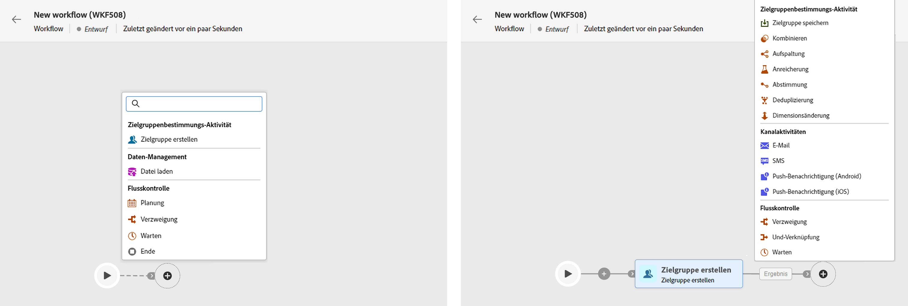
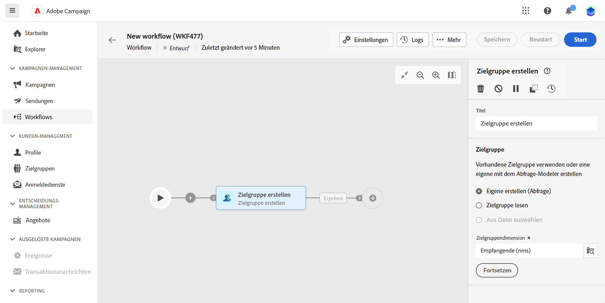
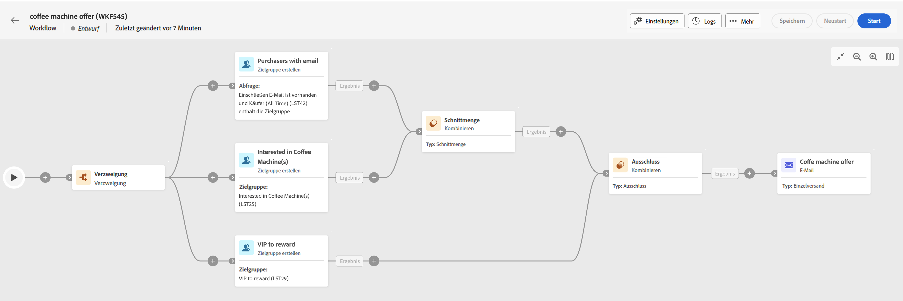

# Aktivitäten koordinieren {#orchestrate}

Einmal, dass Sie [einen Workflow erstellt hat](create-workflow.md)können Sie im Workflow-Menü oder innerhalb einer Kampagne mit der Orchestrierung der verschiedenen Aufgaben beginnen. Dazu wird eine visuelle Arbeitsfläche bereitgestellt, über die Sie ein Workflow-Diagramm erstellen können. In diesem Diagramm können Sie verschiedene Aktivitäten hinzufügen und sie in einer sequenziellen Reihenfolge verbinden.

In dieser Phase der Konfiguration wird das Diagramm mit einem Startsymbol angezeigt, das den Anfang Ihres Workflows darstellt. Um Ihre erste Aktivität hinzuzufügen, klicken Sie auf die Schaltfläche + , die mit dem Startsymbol verbunden ist.

Eine Liste der Aktivitäten, die dem Diagramm hinzugefügt werden können, wird angezeigt. Die verfügbaren Aktivitäten hängen von Ihrer Position im Workflow-Diagramm ab. Wenn Sie beispielsweise Ihre erste Aktivität hinzufügen, können Sie Ihren Workflow starten, indem Sie eine Audience auswählen, den Workflow-Pfad aufteilen oder eine Warten -Aktivität festlegen, um die Ausführung des Workflows zu verzögern. Nach der Aktivität Audience erstellen können Sie hingegen Ihre Zielgruppe mit Zielgruppenbestimmungsaktivitäten verfeinern, einen Versand mit Kanalaktivitäten an Ihre Audience senden oder den Workflow-Prozess mit Steuerungsaktivitäten organisieren.

Nachdem dem Diagramm eine Aktivität hinzugefügt wurde, wird ein rechter Bereich angezeigt, in dem Sie die neu hinzugefügte Aktivität mit bestimmten Einstellungen konfigurieren können. Detaillierte Informationen zur Konfiguration der einzelnen Aktivitäten finden Sie unter [diesem Abschnitt](activities/about-activities.md).

Wiederholen Sie diesen Vorgang und fügen Sie je nach den Aufgaben, die Ihr Workflow ausführen soll, beliebig viele Aktivitäten hinzu. Beachten Sie, dass Sie zwischen zwei Aktivitäten auch eine neue Aktivität einfügen können. Klicken Sie hierzu auf die Schaltfläche + in der Transition zwischen den Aktivitäten, wählen Sie die gewünschte Aktivität aus und konfigurieren Sie sie im rechten Bereich.

Um eine Aktivität zu entfernen, wählen Sie sie auf der Arbeitsfläche aus und klicken Sie in den Aktivitätseigenschaften auf das Symbol Löschen .

>[!TIP]
>
>Sie haben die Möglichkeit, den Namen der Transitionen zwischen den einzelnen Aktivitäten zu personalisieren. Wählen Sie dazu die Transition aus und ändern Sie deren Titel im rechten Bereich.

Im Folgenden finden Sie ein Workflow-Beispiel, das dazu dient, eine E-Mail mit einer E-Mail an alle Kunden (außer VIP Kunden) zu senden, die an Kaffeemaschinen interessiert sind.

Zu diesem Zweck wurden die folgenden Aktivitäten hinzugefügt:

* A **[!UICONTROL Verzweigung]** -Aktivität, die den Workflow in drei Pfade unterteilt (eine für jede Gruppe von Kunden),
* **[!UICONTROL Audience erstellen]** Aktivitäten, um die drei Kundengruppen anzusprechen:

   * Kunden mit einer E-Mail,
   * Kunden, die zum bereits bestehenden Publikum &quot;Interessant an Kaffeemaschinen&quot; gehören,
   * Kunden, die zur bereits bestehenden Zielgruppe &quot;VIP oder Belohnung&quot;gehören.

* A **[!UICONTROL Kombinieren]** Aktivität, die Kunden mit einer E-Mail und Personen zusammenfasst, die an Kaffeemaschinen interessiert sind;
* A **[!UICONTROL Kombinieren]** Aktivität, die VIP Kunden ausschließt,
* Ein **[!UICONTROL E-Mail-Versand]** -Aktivität, die eine E-Mail an die resultierenden Kunden sendet.

Fügen Sie nach Abschluss des Workflows en **[!UICONTROL Ende]** -Aktivität am Ende des Diagramms. Mit dieser Aktivität können Sie das Ende eines Workflows visuell markieren und haben keine funktionalen Auswirkungen.

Nach erfolgreicher Erstellung des Workflow-Diagramms können Sie den Workflow ausführen und den Fortschritt seiner verschiedenen Aufgaben verfolgen. [Erfahren Sie, wie Sie einen Workflow starten und dessen Ausführung überwachen](start-monitor-workflows.md)
