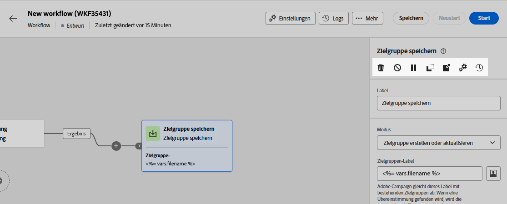

# Orchestrieren von Aktivitäten {#orchestrate}

Sobald Sie einen [Workflow](create-workflow.md) erstellt haben, sei es über das Workflow-Menü oder innerhalb einer Kampagne, können Sie mit der Orchestrierung der verschiedenen Aufgaben beginnen, die er ausführen soll. Zu diesem Zweck wird eine visuelle Arbeitsfläche bereitgestellt, über die Sie ein Workflow-Diagramm erstellen können. Innerhalb dieses Diagramms können Sie verschiedene Aktivitäten hinzufügen und sie in einer sequentiellen Reihenfolge miteinander verbinden.

## Hinzufügen von Aktivitäten {#add}

In diesem Schritt der Konfiguration wird das Diagramm mit einem Startsymbol angezeigt, das den Anfang Ihres Workflows darstellt. Um Ihre erste Aktivität hinzuzufügen, klicken Sie auf die Schaltfläche **+**, die mit dem Startsymbol verbunden ist.

Es erscheint eine Liste von Aktivitäten, die dem Diagramm hinzugefügt werden können. Die verfügbaren Aktivitäten hängen von Ihrer Position im Workflow-Diagramm ab. Wenn Sie Ihre erste Aktivität hinzufügen, können Sie Ihren Workflow starten, indem Sie beispielsweise eine Zielgruppe ansprechen, den Workflow-Pfad aufteilen oder eine **Warte-Aktivität** festlegen, um die Ausführung des Workflows zu verzögern. Andererseits können Sie nach der Aktivität **Zielgruppe erstellen** Ihre Zielgruppe mit Zielgruppenbestimmungsaktivitäten verfeinern, einen Versand an Ihre Zielgruppe mit Kanalaktivitäten durchführen oder den Workflow-Prozess mit Flusskontrollaktivitäten organisieren.

{zoomable="yes"}

Sobald eine Aktivität zum Diagramm hinzugefügt wurde, erscheint rechts ein Bereich, in dem Sie die neu hinzugefügte Aktivität mit spezifischen Einstellungen konfigurieren können. Detaillierte Informationen über die Konfiguration jeder Aktivität finden Sie in [diesem Abschnitt](activities/about-activities.md).

{zoomable="yes"}

Wiederholen Sie diesen Vorgang, um je nach den Aufgaben, die Ihr Workflow ausführen soll, beliebig viele Aktivitäten hinzuzufügen. Beachten Sie, dass Sie auch eine neue Aktivität zwischen zwei Aktivitäten einfügen können. Klicken Sie dazu auf die Schaltfläche **+** in der Transition zwischen den Aktivitäten, wählen Sie die gewünschte Aktivität aus und konfigurieren Sie sie im rechten Bereich.

Um eine Aktivität zu entfernen, wählen Sie sie auf der Arbeitsfläche aus und klicken in den Eigenschaften der Aktivität auf das Symbol **Löschen**.

>[!TIP]
>
>Sie haben die Möglichkeit, den Namen der Transitionen zwischen den einzelnen Aktivitäten zu personalisieren. Wählen Sie dazu die Transition aus und ändern Sie die Bezeichnung im rechten Bereich.

## Die Symbolleiste {#toolbar}

Die Symbolleiste oben rechts in der Arbeitsfläche bietet Optionen zum einfachen Bearbeiten der Aktivitäten und Navigieren auf der Arbeitsfläche:

* **Mehrfachauswahl-Modus**: Wählen Sie mehrere Aktivitäten aus, um sie alle gleichzeitig zu löschen oder zu kopieren/einzufügen. Weitere Informationen finden Sie [in diesem Abschnitt](#copy).
* **Drehen**: Dreht die Arbeitsfläche vertikal.
* **An Bildschirm anpassen**: Passt die Vergrößerung der Arbeitsfläche an Ihren Bildschirm an.
* **Verkleinern**/**Vergrößern**: Verkleinert bzw. vergrößert die Arbeitsfläche.
* **Karte anzeigen**: Öffnet einen Snapshot der Arbeitsfläche, in der Sie sich befinden.

{zoomable="yes"}{width="50%"}

## Verwalten von Aktivitäten {#manage}

Beim Hinzufügen von Aktivitäten sind im Eigenschaftenbereich Aktionsschaltflächen verfügbar, mit denen Sie mehrere Vorgänge ausführen können. Sie haben folgende Möglichkeiten:

* **Löschen** der Aktivität von der Arbeitsfläche aus.
* **Deaktivieren/Aktivieren** der Aktivität. Wenn der Workflow ausgeführt wird, werden deaktivierte Aktivitäten und auf demselben Pfad folgende Aktivitäten nicht ausgeführt und der Workflow wird angehalten.
* **Kopieren** der Aktivität. Weitere Informationen finden Sie in diesem [Abschnitt](#copy).
* Zugreifen auf die **Protokolle und Aufgaben** der Aktivität.
* **Anhalten/Fortsetzen** der Aktivität. Wenn der Workflow ausgeführt wird, wird er mit bei der angehaltenen Aktivität angehalten. Die entsprechende Aufgabe sowie alle auf demselben Pfad folgenden Aufgaben werden nicht ausgeführt.

{zoomable="yes"}{width="50%"}

Bei mehreren **Zielgruppenbestimmungsaktivitäten**, z. B. **Kombinieren** oder **Deduplizierung**, können Sie die verbleibende Population verarbeiten und in eine zusätzliche ausgehende Transition einschließen. Wenn Sie beispielsweise die Aktivität **Aufspaltung** verwenden, besteht das Komplement aus der Population, die keiner der zuvor definierten Teilmengen entsprochen hat. Um diese Funktion zu verwenden, aktivieren Sie die Option **Komplement erzeugen**.

## Kopieren von Aktivitäten {#copy}

Sie können Workflow-Aktivitäten kopieren und in einen beliebigen Workflow einfügen. Der Ziel-Workflow kann sich auf einer anderen Browser-Registerkarte befinden.

Zum Kopieren von Aktivitäten haben Sie zwei Möglichkeiten:

* Kopieren Sie eine Aktivität mithilfe der Aktionsschaltfläche.

  {zoomable="yes"}{width="70%"}

* Kopieren Sie mehrere Aktivitäten mithilfe der Symbolleistenschaltfläche.

  {zoomable="yes"}{width="70%"}

Um die kopierten Aktivitäten einzufügen, klicken Sie auf die Schaltfläche **+** auf einer Transition und wählen Sie „Aktivität X einfügen“ aus.

{zoomable="yes"}{width="50%"}

## Ausführungsoptionen {#execution}

Sie können die Ausführungsoptionen aller Aktivitäten verwalten.  Wählen Sie eine Aktivität aus und klicken Sie auf die Schaltfläche **Ausführungsoptionen**. Auf diese Weise können Sie den Ausführungsmodus und das Verhalten der Aktivität im Falle eines Fehlers definieren.

{zoomable="yes"}{width="70%"}

### Eigenschaften

Im Feld **Ausführung** können Sie die Aktion definieren, die beim Starten der Aufgabe ausgelöst werden soll.

Im Feld **Max. Ausführungsdauer** können Sie eine maximale Dauer festlegen, z. B. „30s“ oder „1h“. Wenn eine Aufgabe die angegebene Dauer überschreitet, wird ein Warnhinweis erzeugt. Die Workflow-Ausführung wird hiervon jedoch nicht beeinflusst.

Im Feld **Zeitzone** können Sie der Aktivität eine bestimmte Zeitzone zuweisen. Adobe Campaign ist in der Lage, verschiedene Zeitzonen innerhalb einer Instanz zu verwalten. Die entsprechenden Einstellungen werden bei der Instanzerstellung vorgenommen.

Das Feld **Affinität** bietet die Möglichkeit, die Ausführung eines Workflows oder einer Workflow-Aktivität an einen bestimmtne Computer zu binden. Hierzu müssen eine oder mehrere Affinitäten auf Workflow- oder Aktivitätsniveau definiert werden.

Im Feld **Verhalten** können Sie das Verhalten des Workflows im Fall von asynchronen Aufgaben bestimmen.

### Umgang mit Fehlern

Im Feld **Bei Fehler** lassen sich mögliche Reaktionen bei Auftreten eines Fehlers bestimmen.

### Initialisierungsskript

Mit dem **Initialisierungsskript** können Sie Variablen initialisieren oder Aktivitätseigenschaften ändern. Klicken Sie auf die Schaltfläche **Code bearbeiten** und geben Sie das auszuführende Code-Fragment ein. Das Skript wird aufgerufen, wenn die Aktivität ausgeführt wird. Weitere Informationen finden Sie im Abschnitt zu den [Ereignisvariablen](../workflows/event-variables.md).

## Beispiel {#example}

Hier ist ein Beispiel für einen Workflow, der eine E-Mail an alle Kundinnen und Kunden (außer VIP) sendet, die an Kaffeemaschinen interessiert sind.

{zoomable="yes"}{zoomable="yes"}

Um dies zu bewerkstelligen, wurden die folgenden Aktivitäten hinzugefügt:

* Eine Aktivität **[!UICONTROL Verzweigung]**, die den Workflow in drei Pfade unterteilt (einen für jede Kundengruppe),
* Aktivitäten **[!UICONTROL Zielgruppe aufbauen]**, um die drei Kundengruppen anzusprechen:

   * Kundinnen und Kunden mit einer E-Mail-Adresse,
   * Kundinnen und Kunden, die zu der bereits bestehenden Zielgruppe „Interessiert an Kaffeemaschinen“ gehören,
   * Kundinnen und Kunden, die zur bereits bestehenden Zielgruppe „VIP oder Belohnung“ gehören.

* Eine Aktivität **[!UICONTROL Kombinieren]**, die Kundinnen und Kunden mit einer E-Mail-Adresse und solche, die sich für Kaffeemaschinen interessieren, zusammenfasst,
* Eine Aktivität **[!UICONTROL Kombinieren]**, die VIP-Kundinnen und -Kunden ausschließt,
* Eine Aktivität **[!UICONTROL E-Mail-Versand]**, die eine E-Mail an die resultierenden Kundinnen und Kunden sendet.

Wenn Sie den Workflow abgeschlossen haben, fügen Sie am Ende des Diagramms die Aktivität **[!UICONTROL Ende]** hinzu. Diese Aktivität ermöglicht es Ihnen, das Ende eines Workflows visuell zu markieren, und hat keine funktionalen Auswirkungen.

Nachdem Sie das Workflow-Diagramm erfolgreich entworfen haben, können Sie den Workflow ausführen und den Fortschritt der verschiedenen Aufgaben verfolgen. [Erfahren Sie, wie Sie einen Workflow starten und dessen Ausführung überwachen](start-monitor-workflows.md)
