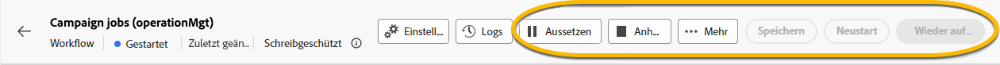

# Über schreibgeschützte Workflows {#readonly-workflows}

>[!CONTEXTUALHELP]
>id="acw_wf_read_only_canvas"
>title="Dieser Workflow ist schreibgeschützt"
>abstract="Sie können diesen Workflow aufgrund Ihrer Berechtigungen oder des Typs des Workflows nicht bearbeiten."

Einige Workflows befinden sich möglicherweise im schreibgeschützten Modus. Sie können sie mit sehen:

- Die Erwähnung **[!UICONTROL ** Schreibgeschützt **]**  in der Nähe des **[!UICONTROL Einstellungen]** button
- Die Aktionsschaltflächen sind nicht verfügbar

{zoomable="yes"}

In einem schreibgeschützten Workflow können keine Änderungen vorgenommen werden. Sie dürfen die Einstellungen der Aktivitäten nicht ändern.

{zoomable="yes"}

Sie haben nicht die Berechtigung, den Workflow auch zu löschen.

{zoomable="yes"}

## Warum schreibgeschützte Workflows

Der schreibgeschützte Modus richtet sich an Benutzer ohne Berechtigung und Zugriffsrechte zur Bearbeitung dieser Workflows. [Weitere Informationen hier](../get-started/permissions.md)

Ein Kampagnenbenutzer hat möglicherweise Einschränkungen in den Daten, auf die er in Adobe Campaign zugreifen kann. Der Administrator kann ihm die Möglichkeit geben, einige Funktionen anzuzeigen, aber nicht daran zu arbeiten.

## Typen schreibgeschützter Workflows

Je nach Workflow-Typ kann der schreibgeschützte Modus unterschiedlich sein.

### Kampagnen-Workflows

Bei einem schreibgeschützten Kampagnen-Workflow kann der Benutzer nicht auf die Überwachungsschaltfläche zugreifen.

{zoomable="yes"}

### Technische Workflows

Technische Workflows sind für Kampagnenbenutzer schreibgeschützt.
Integrierte technische Workflows sind schreibgeschützt für alle Benutzer, auch für Administratoren. Der Benutzer kann jedoch **pause** oder **stop** bei Bedarf. Dies sind die einzigen zulässigen Aktionen. [Weitere Informationen hier](https://experienceleague.adobe.com/en/docs/campaign/automation/workflows/introduction/wf-type/technical-workflows)

{zoomable="yes"}