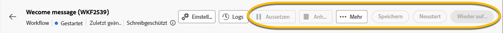

# Über schreibgeschützte Workflows {#readonly-workflows}

>[!CONTEXTUALHELP]
>id="acw_wf_read_only_canvas"
>title="Dieser Workflow ist schreibgeschützt"
>abstract="Sie können diesen Workflow aufgrund Ihrer Berechtigungen oder des Typs des Workflows nicht bearbeiten."

Einige Workflows sind schreibgeschützt. Integrierte technische Workflows sind immer schreibgeschützt, aber diese Einschränkung kann auch für andere Workflow-Typen aktiviert werden.

Campaign-Benutzende haben möglicherweise eingeschränkten Zugriff auf die Adobe Campaign-Daten. Ein Campaign-Administrator kann ihnen das Recht gewähren, einige Funktionen anzuzeigen, sie jedoch nicht zu bearbeiten oder zu ändern. Benutzerberechtigungen für -Daten sind von entscheidender Bedeutung, um Daten- und Prozesssicherheit zu gewährleisten. Weitere Informationen zur Berechtigungsverwaltung in Campaign finden [ in diesem Abschnitt ](../get-started/permissions.md)

Wenn sich ein Workflow im schreibgeschützten Modus befindet:

* Kennzeichnung **[!UICONTROL Schreibgeschützt]** in der Nähe der Schaltfläche **[!UICONTROL Einstellungen]**
* Die Schaltfläche „Aktion“ ist nicht verfügbar

{zoomable="yes"}

Benutzende können in einem schreibgeschützten Workflow nichts bearbeiten. Sie dürfen die Einstellungen der Aktivitäten nicht ändern.

{zoomable="yes"}

Benutzende können den Workflow nicht löschen.

{zoomable="yes"}

## Typen schreibgeschützter Workflows {#readonly-workflow-types}

Je nach Workflow-Typ kann der schreibgeschützte Modus unterschiedlich sein.

### Kampagnen-Workflows {#readonly-campaign-wf}

Bei einem schreibgeschützten Kampagnen-Workflow können Benutzende nicht auf die Überwachungsschaltfläche zugreifen.

{zoomable="yes"}

### Technische Workflows {#readonly-tech-wf}

Integrierte technische Workflows sind für alle Campaign-Benutzer und sogar für den Administrator schreibgeschützt. Benutzer können sie jedoch **anhalten** oder **stoppen** wenn nötig. Das sind die einzigen zulässigen Aktionen.

{zoomable="yes"}

Weitere Informationen zu technischen Workflows finden Sie in [diesem Abschnitt](https://experienceleague.adobe.com/de/docs/campaign/automation/workflows/introduction/wf-type/technical-workflows)
