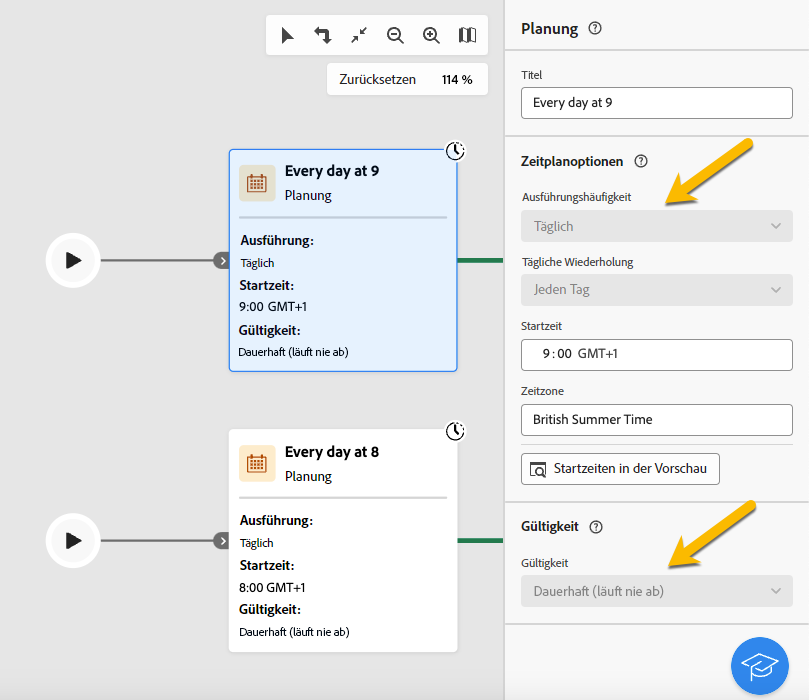

# Über schreibgeschützte Workflows {#readonly-workflows}

>[!CONTEXTUALHELP]
>id="acw_wf_read_only_canvas"
>title="This workflow is read only"
>abstract="You cannot edit this workflow due to your rights or the type of the workflow."

Campaign-Benutzende haben möglicherweise eingeschränkten Zugriff auf Adobe Campaign-Daten. Ein Campaign-Administrator kann ihnen das Recht gewähren, bestimmte Funktionen anzuzeigen, sie jedoch nicht zu bearbeiten oder zu ändern. Benutzerberechtigungen für -Daten sind unerlässlich, um Daten- und Prozesssicherheit zu gewährleisten. Weitere Informationen zur Berechtigungsverwaltung in Campaign finden [ in diesem Abschnitt ](../get-started/permissions.md).

Wenn sich ein Workflow im schreibgeschützten Modus befindet, gilt Folgendes:

* Die Meldung **[!UICONTROL Schreibgeschützt]** wird neben der Schaltfläche **[!UICONTROL Einstellungen]** angezeigt.
* Die Aktionsschaltflächen sind nicht verfügbar.

{zoomable="yes"}

In einem schreibgeschützten Workflow können Benutzende keine Änderungen vornehmen. Sie dürfen die Einstellungen der Aktivitäten nicht ändern.

{zoomable="yes"}

Benutzende können den Workflow nicht löschen.

{zoomable="yes"}

## Typen schreibgeschützter Workflows {#readonly-workflow-types}

Je nach Workflow-Typ kann der schreibgeschützte Modus variieren.

### Kampagnen-Workflows {#readonly-campaign-wf}

In einem schreibgeschützten Kampagnen-Workflow kann der/die Benutzende nicht auf die Schaltfläche Überwachung zugreifen.

{zoomable="yes"}

### Technische Workflows {#readonly-tech-wf}

Integrierte technische Workflows sind für alle Campaign-Benutzer (einschließlich Administratoren) schreibgeschützt. Benutzende können diese jedoch bei Bedarf **aussetzen** oder **stoppen**. Dies sind die einzigen zulässigen Aktionen.

{zoomable="yes"}

Weiterführende Informationen zu technischen Workflows finden Sie in [diesem Abschnitt](https://experienceleague.adobe.com/de/docs/campaign/automation/workflows/introduction/wf-type/technical-workflows).