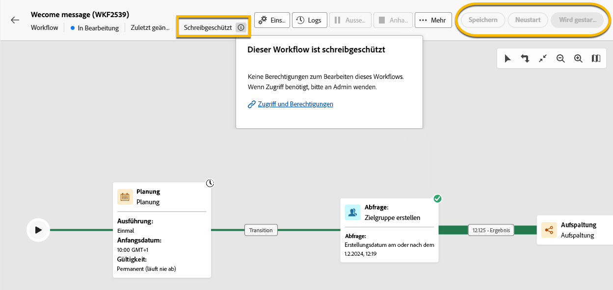

# Über schreibgeschützte Workflows {#readonly-workflows}

>[!CONTEXTUALHELP]
>id="acw_wf_read_only_canvas"
>title="Dieser Workflow ist schreibgeschützt"
>abstract="Sie können diesen Workflow aufgrund Ihrer Berechtigungen oder des Typs des Workflows nicht bearbeiten."

Einige Workflows befinden sich möglicherweise im schreibgeschützten Modus. Dies ist zu erkennen durch:

- Kennzeichnung **[!UICONTROL ** Schreibgeschützt **]** in der Nähe der Schaltfläche **[!UICONTROL Einstellungen]**
- Die Schaltfläche „Aktion“ ist nicht verfügbar

{zoomable="yes"}

In einem schreibgeschützten Workflow können keine Änderungen vorgenommen werden. Sie sind nicht berechtigt, die Einstellungen der Aktivitäten zu ändern.

{zoomable="yes"}

Sie verfügen außerdem nicht über die erforderlichen Rechte, um den Workflow zu löschen.

{zoomable="yes"}

## Warum schreibgeschützte Workflows?

Der schreibgeschützte Modus betrifft Benutzerinnen und Benutzer ohne Berechtigungen und Zugriffsrechte zur Bearbeitung dieser Workflows. [Weitere Informationen hier](../get-started/permissions.md)

Benutzende von Kampagnen sind möglicherweise in Bezug auf die Daten eingeschränkt, auf die sie in Adobe Campaign zugreifen können. Die Admins können ihnen die Möglichkeit geben, einige Funktionen anzuzeigen, aber nicht daran zu arbeiten.

## Typen schreibgeschützter Workflows

Je nach Workflow-Typ kann der schreibgeschützte Modus unterschiedlich sein.

### Kampagnen-Workflows

Bei einem schreibgeschützten Kampagnen-Workflow können Benutzende nicht auf die Überwachungsschaltfläche zugreifen.

{zoomable="yes"}

### Technische Workflows

Technische Workflows sind für Benutzende von Kampagnen schreibgeschützt.
Integrierte technische Workflows sind für alle Benutzenden schreibgeschützt, sogar für Admins. Benutzende können diese jedoch bei Bedarf **aussetzen** oder **anhalten**. Dies sind die einzigen zulässigen Aktionen. [Weitere Informationen hier](https://experienceleague.adobe.com/de/docs/campaign/automation/workflows/introduction/wf-type/technical-workflows)

{zoomable="yes"}
