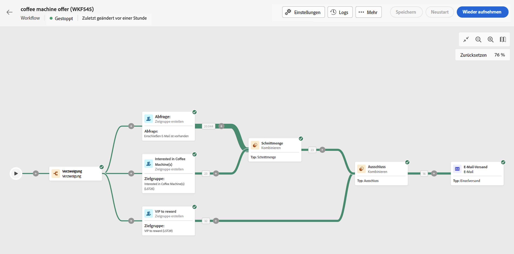
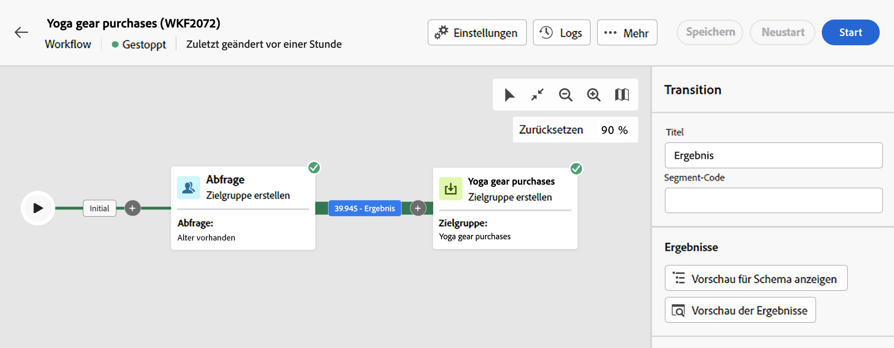
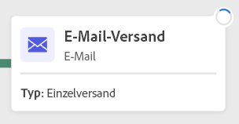
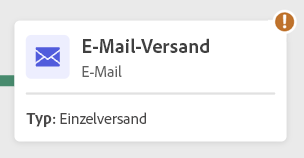
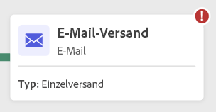
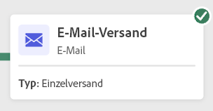
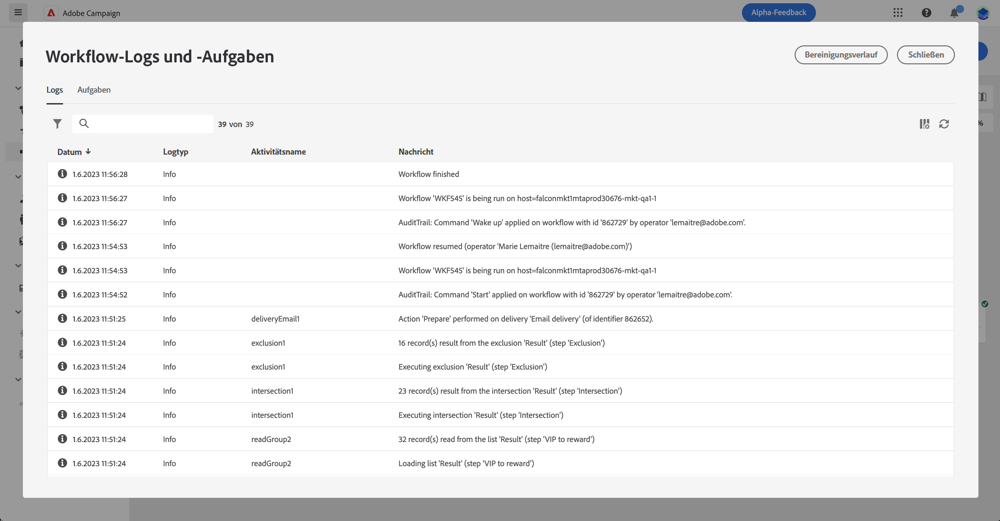

# Starten und Überwachen Ihres Workflows {#start-monitor}

Sobald Sie Ihren Workflow erstellt und die Aufgaben in der Arbeitsfläche entworfen haben, können Sie ihn starten und seine Ausführung überwachen.

## Starten des Workflows {#start}

Um den Workflow zu starten, navigieren Sie zum Menü **[!UICONTROL Workflows]** oder zur zugehörigen Kampagne und klicken Sie auf die Schaltfläche **[!UICONTROL Starten]** in der rechten oberen Ecke der Arbeitsfläche.

Nach Ausführung des Workflows wird jede Aktivität auf der Arbeitsfläche in sequenzieller Reihenfolge ausgeführt, bis das Ende des Workflows erreicht ist.

Anhand eines visuellen Flusses können Sie den Fortschritt von Zielgruppenprofilen in Echtzeit verfolgen. Auf diese Weise können Sie den Status jeder Aktivität und die Anzahl der Profile, die zwischen ihnen wechseln, schnell identifizieren.

{zoomable=&quot;yes&quot;}

## Workflow-Transitionen {#transitions}

In einem Workflow werden die von einer Aktivität zu einer anderen übertragenen Daten in temporären Arbeitstabellen gespeichert. Diese Daten können für jede Transition angezeigt werden. Wählen Sie dazu eine Transition aus, um ihre Eigenschaften auf der rechten Seite des Bildschirms zu öffnen.

* Klicken Sie auf **[!UICONTROL Vorschau für Schema]**, um das Schema der Arbeitstabelle anzuzeigen.
* Klicken Sie auf **[!UICONTROL Ergebnisvorschau]**, um die in der ausgewählten Transition übertragenen Daten zu visualisieren.

{zoomable=&quot;yes&quot;}

## Überwachen der Aktivitätsausführung {#activities}

Visuelle Indikatoren in der rechten oberen Ecke eines jeden Aktivitätsfeldes ermöglichen es, die Ausführung zu überprüfen:

| Visueller Indikator | Beschreibung |
|-----|------------|
| {zoomable=&quot;yes&quot;}{width="70%"} | Die Aktivität wird derzeit ausgeführt. |
| {zoomable=&quot;yes&quot;}{width="70%"} | Die Aktivität erfordert Ihre Aufmerksamkeit. Dies kann die Bestätigung eines Versands oder die Ergreifung einer notwendigen Maßnahme beinhalten. |
| {zoomable=&quot;yes&quot;}{width="70%"} | Bei der Aktivität ist ein Fehler aufgetreten. Um das Problem zu beheben, öffnen Sie die Workflow-Protokolle, um weitere Informationen zu erhalten. |
| {zoomable=&quot;yes&quot;}{width="70%"} | Die Aktivität wurde erfolgreich ausgeführt. |

## Überwachen der Protokolle und Aufgaben {#logs-tasks}

Die Überwachung von Workflow-Protokollen und -Aufgaben ist ein wichtiger Schritt, um Ihre Workflows zu analysieren und sicherzustellen, dass sie ordnungsgemäß ausgeführt werden. Sie können über das Symbol **[!UICONTROL Protokolle]** in der Aktionssymbolleiste und im Eigenschaftenbereich jeder Aktivität aufgerufen werden.

Das Menü **[!UICONTROL Protokolle und Aufgaben]** enthält einen Verlauf der Workflow-Ausführung, in dem alle Benutzeraktionen und aufgetretenen Fehler aufgezeichnet werden. Dieser Verlauf wird für die in den [Ausführungsoptionen](workflow-settings.md) des Workflows angegebene Dauer gespeichert. Während dieser Dauer werden alle Nachrichten gespeichert, auch nach einem Neustart des Workflows. Wenn Sie die Nachrichten einer früheren Ausführung nicht speichern möchten, klicken Sie auf die Schaltfläche **[!UICONTROL Verlauf bereinigen]**.

{zoomable=&quot;yes&quot;}

Es stehen zwei Arten von Informationen zur Verfügung:

* Die Registerkarte **[!UICONTROL Log]** enthält den Ausführungsverlauf aller Workflow-Aktivitäten. Sie zeigt in chronologischer Abfolge alle Vorgänge und Ausführungsfehler.
* Die Registerkarte **[!UICONTROL Aufgaben]** liefert Details zur Ausführungsabfolge der Aktivitäten.

In beiden Registerkarten können Sie die angezeigten Spalten und ihre Reihenfolge auswählen, Filter anwenden und das Suchfeld verwenden, um die gewünschten Informationen schnell zu finden.

## Workflow-Ausführungsbefehle {#execution-commands}

Die Aktionsleiste oben rechts enthält Befehle, mit denen Sie die Ausführung des Workflows verwalten können. Sie haben folgende Möglichkeiten:

* **[!UICONTROL Starten]**/**[!UICONTROL Fortsetzen]** der Ausführung des Workflows, der daraufhin den Status „In Bearbeitung“ annimmt. Wenn der Workflow zuvor ausgesetzt war, handelt es sich um eine Wiederaufnahme, ansonsten werden die Anfangsaktivitäten aktiviert.

* **[!UICONTROL Aussetzen]** der Ausführung des Workflows, der dann den Status „Ausgesetzt“ annimmt. Bis zur Wiederaufnahme werden keine neuen Aktivitäten aktiviert, laufende Vorgänge werden jedoch fortgeführt.

* **[!UICONTROL Anhalten]** eines Workflows, der gerade ausgeführt wird und der dann in den Status „Abgeschlossen“ wechselt. Die laufenden Vorgänge werden nach Möglichkeit unterbrochen. Sie können den Workflow nicht an der Stelle fortsetzen, an der er unterbrochen wurde.
